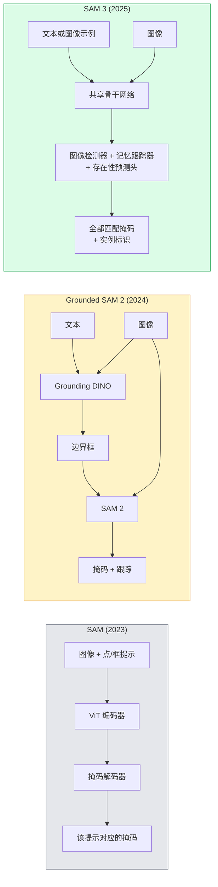

# SAM 3 与开放词表分割（SAM 3 & Open-Vocabulary Segmentation）

> 向模型提供文本提示和图像，就能得到每个匹配对象的掩码。SAM 3 将这一过程合并为一次前向传播。

**Type:** Use + Build
**Languages:** Python
**Prerequisites:** 阶段 4 第 07 课（U-Net）、阶段 4 第 08 课（Mask R-CNN）、阶段 4 第 18 课（CLIP）
**Time:** 约 60 分钟

## 学习目标（Learning Objectives）

- 区分 SAM（仅支持视觉提示）、Grounded SAM / SAM 2（检测器 + SAM）以及 SAM 3（通过可提示概念分割原生支持文本提示）
- 解释 SAM 3 架构：共享骨干网络、图像检测器、基于记忆的视频跟踪器、存在性预测头，以及检测器与跟踪器解耦设计
- 使用 Hugging Face `transformers` 的 SAM 3 集成，完成文本提示检测、分割和视频跟踪
- 根据延迟、概念复杂度和部署目标，在 SAM 3、Grounded SAM 2、YOLO-World 与 SAM-MI 之间选型

## 问题（The Problem）

2023 年的 SAM 仅支持视觉提示：点击一个点或画一个框，它就返回掩码。对于“找出照片中的所有橙子”，需要先用检测器（Grounding DINO）生成边界框，再由 SAM 逐个分割。Grounded SAM 将其组织为流水线，但仍然是两个冻结模型的级联，难免累积误差。

SAM 3（Meta，2025 年 11 月，ICLR 2026）合并了这个级联过程。它接收简短名词短语或图像示例作为提示，在一次前向传播中返回全部匹配掩码和实例标识。这就是**可提示概念分割（Promptable Concept Segmentation，PCS）**。结合 2026 年 3 月的对象多路复用（Object Multiplex）更新（SAM 3.1），它能高效跟踪视频中同一概念的多个实例。

本课讨论这一变化带来的结构转变。二维分割、检测和图文定位（Grounding）已融合到一个模型中。生产中的问题从“要串联哪些流水线”变成“哪种可提示模型能端到端处理我的用例”。

## 核心概念（The Concept）

### 三代模型（The three generations）



### 可提示概念分割（Promptable Concept Segmentation）

“概念提示”是简短名词短语（`"yellow school bus"`、`"striped red umbrella"`、`"hand holding a mug"`）或图像示例。模型为图像中每个符合概念的实例返回分割掩码，并为每个匹配项分配唯一实例标识。

它与经典视觉提示 SAM 有三点不同：

1. 不必逐实例提供提示：一个文本提示即可返回全部匹配项。
2. 开放词表（Open-vocabulary）：概念可以是任何能用自然语言描述的事物。
3. 一次返回多个实例，而非每个提示只返回一个掩码。

### 关键架构组件（Key architectural pieces）

- **共享骨干网络（Shared Backbone）**：单个视觉 Transformer（Vision Transformer，ViT）处理图像，检测头与基于记忆的跟踪器都读取其特征。
- **存在性预测头（Presence Head）**：预测图像中是否存在该概念，将“有没有”与“在哪里”解耦，减少概念缺失时的假阳性。
- **检测器与跟踪器解耦（Decoupled Detector-tracker）**：图像级检测和视频级跟踪使用独立预测头，避免彼此干扰。
- **记忆库（Memory Bank）**：跨帧保存各实例的特征，用于视频跟踪，与 SAM 2 的机制相同。

### 大规模训练（Training at scale）

SAM 3 使用 **400 万个独特概念**训练，这些概念由数据引擎结合人工智能（Artificial Intelligence，AI）与人工复核，迭代标注和修正而成。新的 **SA-CO 基准**包含 27 万个独特概念，规模是以往基准的 50 倍。SAM 3 在 SA-CO 上达到人类表现的 75–80%，在图像与视频 PCS 上的表现是现有系统的两倍。

### SAM 3.1 对象多路复用（SAM 3.1 Object Multiplex）

2026 年 3 月更新的**对象多路复用（Object Multiplex）**引入共享记忆机制，同时联合跟踪同一概念的多个实例。此前，跟踪 N 个实例需要 N 个独立记忆库。多路复用将其合并为一个共享记忆，并为各实例使用独立查询。结果是在不牺牲准确率的前提下，显著加快多目标跟踪。

### Grounded SAM 在 2026 年仍有价值的场景（Where Grounded SAM still matters in 2026）

- 需要换入特定的开放词表检测器，例如 DINO-X 或 Florence-2。
- SAM 3 许可构成障碍，其 Hugging Face 访问需要申请。
- 需要比 SAM 3 所提供的更细致的检测阈值控制。
- 对检测器组件开展研究或消融实验（Ablation）。

模块化流水线仍有用武之地。对于大多数生产工作，SAM 3 是更简单的选择。

### YOLO-World 与 SAM 3 对比（YOLO-World vs SAM 3）

- **YOLO-World**：仅提供开放词表检测，没有掩码。支持实时运行，适合需要高帧率边界框的场景。
- **SAM 3**：完整分割与跟踪，速度较慢，但输出更丰富。

生产分工：仅需快速检测的流水线（机器人导航、快速更新的仪表盘）使用 YOLO-World；需要掩码或跟踪的场景使用 SAM 3。

### SAM-MI 的效率（SAM-MI efficiency）

SAM-MI（2025–2026）针对 SAM 的解码器瓶颈，核心思路包括：

- **稀疏点提示（Sparse Point Prompting）**：用少量精心选择的点代替密集提示，将解码器调用减少 96%。
- **浅层掩码聚合（Shallow Mask Aggregation）**：将粗略掩码预测合并为更清晰的掩码。
- **解耦掩码注入（Decoupled Mask Injection）**：向解码器提供预先计算的掩码特征，避免重新运行。

结果：在开放词表基准上，相比 Grounded-SAM 提速约 1.6 倍。

### 三种模型的输出格式（Output format for the three models）

它们都返回相同的通用结构（边界框、标签、分数、掩码与标识），因此流水线下游无需根据运行的是哪种模型设置分支。

```figure
cv3-open-vocab
```

## 动手构建（Build It）

### 第 1 步：构造提示（Step 1: Prompt construction）

构建辅助函数，将用户句子转换为 SAM 3 概念提示列表。这里是“用户输入”与“模型消费内容”的衔接边界。

```python
def split_concepts(sentence):
    """
    Heuristic splitter for multi-concept prompts.
    Returns list of short noun phrases.
    """
    for sep in [",", ";", "and", "or", "&"]:
        if sep in sentence:
            parts = [p.strip() for p in sentence.replace("and ", ",").split(",")]
            return [p for p in parts if p]
    return [sentence.strip()]

print(split_concepts("cats, dogs and balloons"))
```

SAM 3 每次前向传播接收一个概念；对于多概念查询，循环或批量处理。

### 第 2 步：后处理辅助函数（Step 2: Post-processing helpers）

将 SAM 3 的原始输出转换为清晰的检测结果列表，符合阶段 4 第 16 课的流水线接口约定。

```python
from dataclasses import dataclass
from typing import List

@dataclass
class ConceptDetection:
    concept: str
    instance_id: int
    box: tuple          # (x1, y1, x2, y2)
    score: float
    mask_rle: str       # run-length encoded


def rle_encode(binary_mask):
    flat = binary_mask.flatten().astype("uint8")
    runs = []
    prev, count = flat[0], 0
    for v in flat:
        if v == prev:
            count += 1
        else:
            runs.append((int(prev), count))
            prev, count = v, 1
    runs.append((int(prev), count))
    return ";".join(f"{v}x{c}" for v, c in runs)
```

游程编码（Run-length Encoding，RLE）即使面对大量高分辨率掩码也能缩小响应载荷。同一格式适用于 SAM 2、SAM 3 和 Grounded SAM 2。

### 第 3 步：统一开放词表分割接口（Step 3: A unified open-vocab segmentation interface）

将任何后端（SAM 3、Grounded SAM 2、YOLO-World + SAM 2）封装在单一方法后面。更换后端时，下游代码无需改变。

```python
from abc import ABC, abstractmethod
import numpy as np

class OpenVocabSeg(ABC):
    @abstractmethod
    def detect(self, image: np.ndarray, concept: str) -> List[ConceptDetection]:
        ...


class StubOpenVocabSeg(OpenVocabSeg):
    """
    Deterministic stub used for pipeline testing when real models are not loaded.
    """
    def detect(self, image, concept):
        h, w = image.shape[:2]
        return [
            ConceptDetection(
                concept=concept,
                instance_id=0,
                box=(w * 0.2, h * 0.3, w * 0.5, h * 0.8),
                score=0.89,
                mask_rle="0x100;1x50;0x200",
            ),
            ConceptDetection(
                concept=concept,
                instance_id=1,
                box=(w * 0.55, h * 0.25, w * 0.85, h * 0.75),
                score=0.74,
                mask_rle="0x80;1x40;0x220",
            ),
        ]
```

实际的 `SAM3OpenVocabSeg` 子类会封装 `transformers.Sam3Model` 和 `Sam3Processor`。

### 第 4 步：Hugging Face SAM 3 用法参考（Step 4: Hugging Face SAM 3 usage (reference)）

对于真实模型，使用 `transformers` 集成：

```python
from transformers import Sam3Processor, Sam3Model
import torch

processor = Sam3Processor.from_pretrained("facebook/sam3")
model = Sam3Model.from_pretrained("facebook/sam3").eval()

inputs = processor(images=pil_image, return_tensors="pt")
inputs = processor.set_text_prompt(inputs, "yellow school bus")

with torch.no_grad():
    outputs = model(**inputs)

masks = processor.post_process_masks(
    outputs.masks, inputs.original_sizes, inputs.reshaped_input_sizes
)
boxes = outputs.boxes
scores = outputs.scores
```

一个提示，一次调用返回全部匹配项。

### 第 5 步：衡量 Grounded SAM 2 原本提供的能力（Step 5: Measure what Grounded SAM 2 gave you for free）

做一次如实反映效果的基准测试：在真实流水线中，将 Grounded SAM 2 替换为 SAM 3 会发生什么？

- 延迟：SAM 3 省去一次前向传播，因为不再需要独立检测器，但模型本身更重；总体通常持平或略有提速。
- 准确率：SAM 3 对罕见或组合概念（“红色条纹雨伞”）明显更好；对常见单词概念则相近。
- 灵活性：Grounded SAM 2 允许替换检测器（DINO-X、Florence-2、Grounding DINO 1.5），SAM 3 则是整体式模型。

结论：SAM 3 是 2026 年开放词表分割的默认选择。如果需要灵活替换检测器或不同许可条款，Grounded SAM 2 仍是合适方案。

## 实际应用（Use It）

生产部署模式：

- **实时标注（Real-time Annotation）**：SAM 3 配合 CVAT 的标签即文本提示功能。标注人员选择标签名称，SAM 3 预标注所有匹配实例，再由人工复核修正。
- **视频分析（Video Analytics）**：使用 SAM 3.1 Object Multiplex 进行多目标跟踪，将视频帧输入基于记忆的跟踪器。
- **机器人（Robotics）**：SAM 3 用于开放词表操控，例如“拿起红色杯子”，作为规划基本操作运行。
- **医学成像（Medical Imaging）**：在医学概念上微调 SAM 3，需要在 Hugging Face 申请访问。

Ultralytics 在其 Python 包中封装了 SAM 3：

```python
from ultralytics import SAM

model = SAM("sam3.pt")
results = model(image_path, prompts="yellow school bus")
```

接口与 YOLO 和 SAM 2 相同。

## 交付产物（Ship It）

本课产出：

- `outputs/prompt-open-vocab-stack-picker.md`：根据延迟、概念复杂度和许可，在 SAM 3、Grounded SAM 2、YOLO-World 与 SAM-MI 之间选型的提示词。
- `outputs/skill-concept-prompt-designer.md`：将用户表述转换为格式合适的 SAM 3 概念提示的技能，涵盖拆分、消歧和回退。

## 练习（Exercises）

1. **（简单）** 用自行选择的概念提示，在 10 张图像上运行 SAM 3。与相同图像上的 SAM 2 + Grounding DINO 1.5 比较，报告各模型漏掉的概念。
2. **（中等）** 在 SAM 3 上构建“点击纳入 / 点击排除”用户界面：文本提示返回候选实例，用户点击选择哪些计为正例。将最终概念集合输出为 JSON。
3. **（困难）** 在自定义概念集上微调 SAM 3，例如 5 类电子元件、每类 20 张标注图像。在相同测试集上与零样本（Zero-shot）SAM 3 比较，衡量掩码交并比（Intersection over Union，IoU）的提升。

## 关键术语（Key Terms）

| 术语 | 常见说法 | 实际含义 |
|------|----------------|----------------------|
| 开放词表分割（Open-vocabulary Segmentation） | “按文本分割” | 为自然语言描述的对象生成掩码，而非局限于固定标签集 |
| 可提示概念分割（Promptable Concept Segmentation，PCS） | “用概念提示进行分割” | SAM 3 的核心任务：给定名词短语或图像示例，分割所有匹配实例 |
| 概念提示（Concept Prompt） | “文本输入” | 简短名词短语或图像示例，而非完整句子 |
| 存在性预测头（Presence Head） | “这里有没有？” | 在定位前判断图像中是否存在概念的 SAM 3 模块 |
| SA-CO | “SAM 3 基准” | 包含 27 万个概念的开放词表分割基准，规模是此前开放词表基准的 50 倍 |
| 对象多路复用（Object Multiplex） | “SAM 3.1 更新” | 基于共享记忆的多目标跟踪，可快速联合跟踪多个实例 |
| Grounded SAM 2 | “模块化流水线” | 检测器与 SAM 2 级联，需要替换检测器时仍有价值 |
| SAM-MI | “高效 SAM 变体” | 通过掩码注入（Mask Injection）实现相对 Grounded-SAM 的 1.6 倍提速 |

## 延伸阅读（Further Reading）

- [SAM 3：用概念分割任意对象（arXiv 2511.16719）](https://arxiv.org/abs/2511.16719)
- [SAM 3.1 对象多路复用（Meta AI，2026 年 3 月）](https://ai.meta.com/blog/segment-anything-model-3/)
- [Hugging Face 上的 SAM 3 模型页面](https://huggingface.co/facebook/sam3)
- [Grounded SAM 2 教程（PyImageSearch）](https://pyimagesearch.com/2026/01/19/grounded-sam-2-from-open-set-detection-to-segmentation-and-tracking/)
- [Ultralytics SAM 3 文档](https://docs.ultralytics.com/models/sam-3/)
- [SAM3-I：指令感知 SAM（arXiv 2512.04585）](https://arxiv.org/abs/2512.04585)
