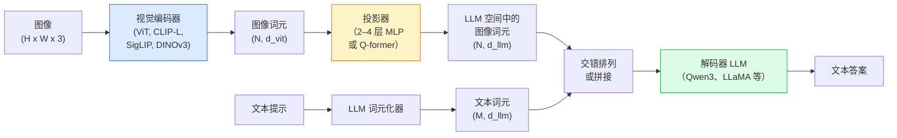

# 视觉语言模型：ViT-MLP-LLM 模式（Vision-Language Models — The ViT-MLP-LLM Pattern）

> 视觉编码器将图像转换为词元，多层感知机（Multilayer Perceptron，MLP）投影器将其映射到大语言模型（Large Language Model，LLM）的嵌入空间，语言模型完成其余工作。ViT-MLP-LLM 模式用于 2026 年所有生产级视觉语言模型（Vision-Language Model，VLM）。

**Type:** Learn + Use
**Languages:** Python
**Prerequisites:** 阶段 4 第 14 课（ViT）、阶段 4 第 18 课（CLIP）、阶段 7 第 02 课（自注意力）
**Time:** 约 75 分钟

## 学习目标（Learning Objectives）

- 描述 ViT-MLP-LLM 架构，解释三个组件各自的作用
- 从参数量、上下文长度和基准表现比较 Qwen3-VL、InternVL3.5、LLaVA-Next 与 GLM-4.6V
- 解释 DeepStack：为什么多层次 ViT 特征比仅使用最后一层更能加强图文对齐
- 使用跨模态错误率（Cross-Modal Error Rate，CMER）衡量生产中的 VLM 幻觉，并据此采取行动

## 问题（The Problem）

CLIP（阶段 4 第 18 课）为图像和文本提供共享嵌入空间，足以支持零样本分类与检索。但它无法回答“图中有多少辆红色汽车”，因为 CLIP 不生成文本，只计算相似度。

视觉语言模型（Vision-Language Models，VLM）如 Qwen3-VL、InternVL3.5、LLaVA-Next 和 GLM-4.6V，将 CLIP 家族的图像编码器接到完整语言模型上。模型看到图像和问题后生成答案。2026 年，开源 VLM 在多模态基准（MMMU、MMBench、DocVQA、ChartQA、MathVista、OSWorld）上已能媲美或超越 GPT-5 与 Gemini-2.5-Pro。

三个组件（ViT、投影器、LLM）构成标准模式。不同模型的差异在于所选 ViT、投影器、LLM、训练数据及对齐方案。理解这一模式后，替换任意组件就成为按既定步骤操作的工作。

## 核心概念（The Concept）

### ViT-MLP-LLM 架构（The ViT-MLP-LLM architecture）



1. **视觉编码器（Vision Encoder）**：预训练 ViT，例如 CLIP-L/14、SigLIP、DINOv3 或微调变体，生成图像块词元。
2. **投影器（Projector）**：小型模块，通常为 2–4 层 MLP 或 Q-former，将视觉词元映射到 LLM 的嵌入维度。大部分微调发生在这里。
3. **大语言模型（LLM）**：仅解码器语言模型，例如 Qwen3、Llama、Mistral、GLM、InternLM，按序读取视觉与文本词元，生成文本。

原则上三个组件都可训练。实际中，训练投影器时通常保持视觉编码器与 LLM 大部分冻结，以较低成本利用数十亿参数提供的信息。

### 深层特征堆叠（DeepStack）

普通投影仅使用 ViT 最后一层。DeepStack（Qwen3-VL）从 ViT 多个深度提取并堆叠特征。深层携带高级语义，浅层携带精细空间与纹理信息。将两者都输入 LLM，能弥合“图像包含什么”（语义）与“具体在哪里”（空间定位）之间的差距。

### 三个训练阶段（Three training stages）

现代 VLM 分阶段训练：

1. **对齐（Alignment）**：冻结 ViT 和 LLM，仅在图像与描述文本对上训练投影器，使其学会将视觉空间映射到语言空间。
2. **预训练（Pre-training）**：解冻全部组件，在大规模交错图文数据（超过 5 亿对）上训练，建立模型的视觉知识。
3. **指令微调（Instruction Tuning）**：在精选的图像、问题、答案三元组上微调，教授对话行为与任务格式。这一步将“具备视觉感知的语言模型”变为可用助手。

大部分低秩适配（Low-rank Adaptation，LoRA）微调使用小型标注数据集，针对第 3 阶段进行。

### 模型家族比较：2026 年初（Model family comparison (early 2026)）

| 模型 | 参数量 | 视觉编码器 | LLM | 上下文 | 优势 |
|-------|--------|----------------|-----|---------|-----------|
| Qwen3-VL-235B-A22B（混合专家（Mixture of Experts，MoE）） | 2350 亿（激活 220 亿） | 自定义 ViT + DeepStack | Qwen3 | 256K | 通用最先进水平（State of the Art，SOTA）、图形用户界面（Graphical User Interface，GUI）智能体 |
| Qwen3-VL-30B-A3B（MoE） | 300 亿（激活 30 亿） | 自定义 ViT + DeepStack | Qwen3 | 256K | 较小的 MoE 替代方案 |
| Qwen3-VL-8B（稠密） | 80 亿 | 自定义 ViT | Qwen3 | 128K | 生产默认稠密模型 |
| InternVL3.5-38B | 380 亿 | InternViT-6B | Qwen3 + GPT-OSS | 128K | MMBench / MMVet 表现强 |
| InternVL3.5-241B-A28B | 2410 亿（激活 280 亿） | InternViT-6B | Qwen3 | 128K | 可与 GPT-4o 竞争 |
| LLaVA-Next 72B | 720 亿 | SigLIP | Llama-3 | 32K | 开放、易于微调 |
| GLM-4.6V | 约 700 亿 | 自定义 | GLM | 64K | 开源、光学字符识别（Optical Character Recognition，OCR）能力强 |
| MiniCPM-V-2.6 | 80 亿 | SigLIP | MiniCPM | 32K | 适合边缘部署 |

### 视觉智能体（Visual agents）

Qwen3-VL-235B 在 OSWorld 上达到全球领先表现。该基准评估操作桌面、移动端与网页 GUI 的**视觉智能体（Visual Agents）**。模型观察截图、理解界面并输出点击、输入、滚动等动作。结合工具后，它能闭环完成常见桌面任务。这是 2026 年大多数“AI PC”演示背后的运行方式。

### 智能体能力与 RoPE 变体（Agentic capabilities + RoPE variants）

VLM 需要知道视频帧位于**哪个时间点**。Qwen3-VL 从时间旋转位置嵌入（Temporal Rotary Position Embeddings，T-RoPE）演进到**基于文本的时间对齐（Text-based Time Alignment）**，即将明确的时间戳文本词元与视频帧交错排列。模型看到“`<timestamp 00:32>` 帧、提示”，就能推理时间关系。

### 对齐问题（The alignment problem）

一个爬取数据集中，12% 的图文对包含未完全依据图像的描述。在这类数据上训练的 VLM 会悄然学会产生幻觉（Hallucination）：捏造对象、误读数字、虚构关系。这是生产中主要的失效模式。

Skywork.ai 引入**跨模态错误率（Cross-Modal Error Rate，CMER）**来跟踪这一问题：

```
CMER = 文本置信度高但图文相似度低的输出所占比例（相似度由 CLIP 家族检查器计算）
```

较高 CMER 表示模型自信地陈述图像无法支持的内容。在其部署中，监控 CMER 并将其作为生产关键绩效指标（Key Performance Indicator，KPI），使幻觉率降低约 35%。关键做法是将高 CMER 输出转交人工复核，而非仅着眼于“修好模型”。

### 使用 LoRA / QLoRA 微调（Fine-tuning with LoRA / QLoRA）

多数团队无力全量微调 700 亿参数 VLM。对注意力层与投影器使用 LoRA（秩为 16–64），或采用 4 位基础权重的量化低秩适配（Quantized Low-rank Adaptation，QLoRA），可在单张 A100 / H100 上完成。成本为 5,000–50,000 个样本、100–5,000 美元计算费用、2–10 小时训练。

### 空间推理仍然薄弱（Spatial reasoning is still weak）

当前 VLM 在空间推理基准（上下、左右、计数、距离）上得分为 50–60%。如果用例依赖“哪个对象在另一个对象上方”，必须充分验证，因为通用 VLM 表现低于人类。纯空间任务有优于 VLM 的替代方案：专用关键点或姿态估计器、深度模型，或对边界框几何做后处理的检测模型。

```figure
v4-vlm-projector
```

## 动手构建（Build It）

### 第 1 步：投影器（Step 1: The projector）

这是最常训练的部分：使用高斯误差线性单元（Gaussian Error Linear Unit，GELU）的 2–4 层 MLP。

```python
import torch
import torch.nn as nn


class Projector(nn.Module):
    def __init__(self, vit_dim=768, llm_dim=4096, hidden=4096):
        super().__init__()
        self.net = nn.Sequential(
            nn.Linear(vit_dim, hidden),
            nn.GELU(),
            nn.Linear(hidden, llm_dim),
        )

    def forward(self, x):
        return self.net(x)
```

输入为 `(N_patches, d_vit)` 词元张量，输出为 `(N_patches, d_llm)`。LLM 将每个输出行当作一个普通词元。

### 第 2 步：端到端组装 ViT-MLP-LLM（Step 2: Assemble ViT-MLP-LLM end-to-end）

下面是最简 VLM 前向传播的骨架。真实代码使用 `transformers`，这里展示概念结构。

```python
class MinimalVLM(nn.Module):
    def __init__(self, vit, projector, llm, image_token_id):
        super().__init__()
        self.vit = vit
        self.projector = projector
        self.llm = llm
        self.image_token_id = image_token_id  # placeholder token in text prompt

    def forward(self, image, input_ids, attention_mask):
        # 1. vision features
        vision_tokens = self.vit(image)                     # (B, N_patches, d_vit)
        vision_embeds = self.projector(vision_tokens)       # (B, N_patches, d_llm)

        # 2. text embeddings
        text_embeds = self.llm.get_input_embeddings()(input_ids)  # (B, M, d_llm)

        # 3. replace image placeholder tokens with vision embeds
        merged = self._merge(text_embeds, vision_embeds, input_ids)

        # 4. run LLM
        return self.llm(inputs_embeds=merged, attention_mask=attention_mask)

    def _merge(self, text_embeds, vision_embeds, input_ids):
        out = text_embeds.clone()
        expected = vision_embeds.size(1)
        for b in range(input_ids.size(0)):
            positions = (input_ids[b] == self.image_token_id).nonzero(as_tuple=True)[0]
            if len(positions) != expected:
                raise ValueError(
                    f"batch item {b} has {len(positions)} image tokens but vision_embeds has {expected} patches."
                    " Every sample in the batch must be pre-padded to the same number of image placeholder tokens.")
            out[b, positions] = vision_embeds[b]
        return out
```

文本中的 `<image>` 占位词元会被真实图像嵌入替换，这与 LLaVA、Qwen-VL 和 InternVL 的模式相同。

### 第 3 步：计算 CMER（Step 3: CMER computation）

一种轻量运行时检查。

```python
import torch.nn.functional as F


def cross_modal_error_rate(image_emb, text_emb, text_confidence, sim_threshold=0.25, conf_threshold=0.8):
    """
    image_emb, text_emb: embeddings of image and generated text (normalised internally)
    text_confidence:     mean per-token probability in [0, 1]
    Returns:             fraction of high-confidence outputs with low image-text alignment
    """
    image_emb = F.normalize(image_emb, dim=-1)
    text_emb = F.normalize(text_emb, dim=-1)
    sim = (image_emb * text_emb).sum(dim=-1)        # cosine similarity
    high_conf_low_sim = (text_confidence > conf_threshold) & (sim < sim_threshold)
    return high_conf_low_sim.float().mean().item()
```

将 CMER 作为生产 KPI，按端点、提示类型和客户分别监控。CMER 上升说明模型开始在某些输入分布上产生幻觉。

### 第 4 步：可运行的玩具 VLM 分类器（Step 4: Toy VLM classifier (runnable)）

演示投影器可以训练。输入模拟的“ViT 特征”，通过一个微型 LLM 风格词元预测类别。

```python
class ToyVLM(nn.Module):
    def __init__(self, vit_dim=32, llm_dim=64, num_classes=5):
        super().__init__()
        self.projector = Projector(vit_dim, llm_dim, hidden=64)
        self.head = nn.Linear(llm_dim, num_classes)

    def forward(self, vision_tokens):
        projected = self.projector(vision_tokens)
        pooled = projected.mean(dim=1)
        return self.head(pooled)
```

在合成的特征与类别对上，不到 200 步即可拟合，足以展示投影器模式有效。

## 实际应用（Use It）

2026 年生产团队使用 VLM 的三种方式：

- **托管 API（Hosted API）**：OpenAI Vision、Anthropic Claude Vision、Google Gemini Vision。无需基础设施，但存在供应商风险。
- **开源自托管（Open-source Self-host）**：通过 `transformers` 和 `vllm` 部署 Qwen3-VL 或 InternVL3.5。控制权完整，但前期投入较高。
- **领域微调（Domain Fine-tuning）**：加载 Qwen2.5-VL-7B 或 LLaVA-1.6-7B，在 5,000–50,000 个自定义样本上使用 LoRA，通过 `vllm` 或 `TGI` 提供服务。

```python
from transformers import AutoProcessor, AutoModelForVision2Seq
import torch
from PIL import Image

model_id = "Qwen/Qwen3-VL-8B-Instruct"
processor = AutoProcessor.from_pretrained(model_id)
model = AutoModelForVision2Seq.from_pretrained(model_id, torch_dtype=torch.bfloat16, device_map="auto")

messages = [{
    "role": "user",
    "content": [
        {"type": "image", "image": Image.open("plot.png")},
        {"type": "text", "text": "What does this chart show?"},
    ],
}]
inputs = processor.apply_chat_template(messages, add_generation_prompt=True, tokenize=True, return_dict=True, return_tensors="pt").to("cuda")
generated = model.generate(**inputs, max_new_tokens=256)
answer = processor.decode(generated[0][inputs["input_ids"].shape[1]:], skip_special_tokens=True)
```

`apply_chat_template` 隐藏了 `<image>` 占位符的词元化细节，模型在内部处理合并。

## 交付产物（Ship It）

本课产出：

- `outputs/prompt-vlm-selector.md`：根据准确率、延迟、上下文长度和预算，选择 Qwen3-VL、InternVL3.5、LLaVA-Next 或 API。
- `outputs/skill-cmer-monitor.md`：生成生产 VLM 端点的监测代码，包含跨模态错误率、各端点仪表盘和告警阈值。

## 练习（Exercises）

1. **（简单）** 在任意开放 VLM 上，对五张图像分别运行三个提示：“这是什么？”“数一数对象”“描述场景”。人工将每个答案评为正确、部分正确或存在幻觉，计算初步的类 CMER 比率。
2. **（中等）** 使用目标领域 500 张带描述的图像，以 LoRA（秩为 16）微调 Qwen2.5-VL-3B 或 LLaVA-1.6-7B。比较零样本与微调后的 MMBench 风格准确率。
3. **（困难）** 将 VLM 默认的 SigLIP/CLIP 图像编码器替换为 DINOv3。冻结 LLM 与 DINOv3，仅重训投影器，衡量计数、空间推理等密集预测任务是否改善。

## 关键术语（Key Terms）

| 术语 | 常见说法 | 实际含义 |
|------|----------------|----------------------|
| ViT-MLP-LLM | “VLM 模式” | 视觉编码器、投影器与语言模型，2026 年所有 VLM 的组成 |
| 投影器（Projector） | “桥梁” | 将视觉词元映射到 LLM 嵌入空间的 2–4 层 MLP 或 Q-former |
| DeepStack | “Qwen3-VL 特征技巧” | 堆叠多层次 ViT 特征，而非仅使用最后一层 |
| 图像词元（Image Token） | “<image> 占位符” | 文本流中的特殊词元，由投影后的视觉嵌入替换 |
| 跨模态错误率（Cross-Modal Error Rate，CMER） | “幻觉 KPI” | 当文本置信度高、图文相似度低时升高 |
| 视觉智能体（Visual Agent） | “会点击的 VLM” | 通过工具调用操作 GUI 的 VLM，涵盖 OSWorld、移动端与网页 |
| Q-former | “固定数量词元桥梁” | BLIP-2 风格投影器，生成固定数量的视觉查询词元 |
| 对齐 / 预训练 / 指令微调（Alignment / Pre-training / Instruction Tuning） | “三个阶段” | 标准 VLM 训练流水线 |

## 延伸阅读（Further Reading）

- [Qwen3-VL 技术报告（arXiv 2511.21631）](https://arxiv.org/abs/2511.21631)
- [InternVL3.5：推进开源多模态模型（arXiv 2508.18265）](https://arxiv.org/html/2508.18265v1)
- [LLaVA-Next 系列](https://llava-vl.github.io/blog/2024-05-10-llava-next-stronger-llms/)
- [BentoML：2026 年最佳开源 VLM](https://www.bentoml.com/blog/multimodal-ai-a-guide-to-open-source-vision-language-models)
- [MMMU：多学科多模态理解基准](https://mmmu-benchmark.github.io/)
- [制造业中的 VLM（Robotics Tomorrow，2026 年 3 月）](https://www.roboticstomorrow.com/story/2026/03/when-machines-learn-to-see-like-experts-the-rise-of-vision-language-models-in-manufacturing/26335/)
