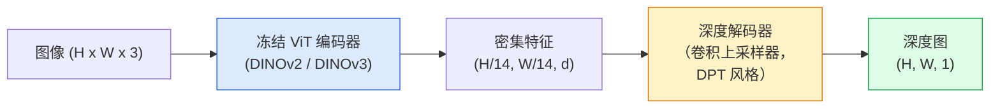

# 单目深度与几何估计（Monocular Depth & Geometry Estimation）

> 深度图是单通道图像，每个像素表示到相机的距离。过去，没有立体视觉或激光雷达（Light Detection and Ranging，LiDAR），仅凭一帧 RGB 图像预测深度曾被认为不可能。到 2026 年，冻结的 ViT 编码器加轻量预测头就能将误差控制在真值的几个百分点以内。

**Type:** Build + Use
**Languages:** Python
**Prerequisites:** 阶段 4 第 14 课（ViT）、阶段 4 第 17 课（自监督视觉）、阶段 4 第 07 课（U-Net）
**Time:** 约 60 分钟

## 学习目标（Learning Objectives）

- 区分相对深度与度量深度，指出各生产模型（MiDaS、Marigold、Depth Anything V3、ZoeDepth）解决哪一种
- 使用基于 DINOv2 骨干网络的 Depth Anything V3，无需标定即可预测任意单张图像的深度
- 解释单张图像为何能支持单目深度估计，包括透视线索、纹理梯度和学习到的先验，以及无法恢复的内容，包括绝对尺度与被遮挡几何
- 通过深度图和针孔相机内参，将二维检测提升为三维点

## 问题（The Problem）

深度是二维计算机视觉缺失的轴。给定 RGB，你知道事物出现在图像平面的什么位置，却不知道有多远。深度传感器，例如双目装置、激光雷达和飞行时间（Time of Flight，ToF）传感器，可以直接解决，但成本高、脆弱且量程有限。

单目深度估计（Monocular Depth Estimation），即从单帧 RGB 预测深度，过去输出模糊且不可靠。到 2026 年，大型预训练编码器改变了这一点：Depth Anything V3 使用冻结的 DINOv2 骨干网络，生成能泛化到室内、室外、医疗和卫星领域的深度图。Marigold 将深度重构为条件扩散问题，ZoeDepth 则回归真实的度量距离。

深度也是二维检测与三维理解之间的桥梁：将检测框的像素乘以深度，就能把二维对象提升为三维点云。这是增强现实（Augmented Reality，AR）遮挡系统、避障流水线以及“拿起杯子”机器人的核心。

## 核心概念（The Concept）

### 相对深度与度量深度（Relative vs metric depth）

- **相对深度（Relative Depth）**：有顺序但没有现实单位的 `z` 值。“像素 A 比像素 B 近，但距离比例没有锚定到米。”
- **度量深度（Metric Depth）**：以米表示到相机的绝对距离，要求模型学到图像线索与真实距离之间的统计关系。

MiDaS、Depth Anything V3 和 Marigold 生成相对深度。ZoeDepth、UniDepth 和 Metric3D 生成度量深度。度量模型对相机内参敏感，相对模型则不是。

### 编码器—解码器模式（The encoder-decoder pattern）



Depth Anything V3 冻结编码器，仅训练密集预测 Transformer（Dense Prediction Transformer，DPT）风格解码器。编码器提供丰富特征，解码器将其插值回图像分辨率并回归深度。

### 为什么单张图像也能产生深度（Why a single image produces depth at all）

二维图像包含很多与深度相关的单目线索：

- **透视（Perspective）**：三维中的平行线在二维中会聚。
- **纹理梯度（Texture Gradient）**：远处表面的纹理更小、更密。
- **遮挡顺序（Occlusion Order）**：近处对象遮挡远处对象。
- **大小恒常性（Size Constancy）**：汽车、人体等已知对象提供近似尺度。
- **大气透视（Atmospheric Perspective）**：室外远处对象显得更朦胧、更偏蓝。

在数十亿图像上训练的 ViT 会内化这些线索。有了充足数据与强骨干网络，即使没有明确三维监督，单目深度也能达到合理准确率。

### 单目深度无法做到什么（What monocular depth cannot do）

- 在没有内参或场景中已知对象的情况下恢复**绝对度量尺度（Absolute Metric Scale）**。网络能预测“杯子距离是勺子的两倍”，却不知道杯子在 1 米还是 10 米外。
- 恢复**被遮挡几何（Occluded Geometry）**：看不到椅子背面，就无法可靠推断。
- 处理**完全无纹理或反光表面（Untextured / Reflective Surfaces）**，例如镜子、玻璃、均匀墙面。网络会输出看似合理但错误的深度。

### 2026 年的 Depth Anything V3（Depth Anything V3 in 2026）

- 使用普通 DINOv2 ViT-L/14 作为冻结编码器。
- 使用 DPT 解码器。
- 在来自多种来源、带相机位姿的图像对上训练，除了光度一致性外无需明确深度监督。
- 从**任意数量的视觉输入预测空间一致的几何，无论是否已知相机位姿**。
- 在单目深度、任意视角几何、视觉渲染和相机位姿估计上达到最先进水平（State of the Art，SOTA）。

这是 2026 年需要深度时可以直接接入的模型。

### Marigold：用扩散估计深度（Marigold — diffusion for depth）

Marigold（Ke 等，CVPR 2024）将深度估计重构为条件图生图扩散，条件是 RGB，目标是深度图。它以预训练的 Stable Diffusion 2 U-Net 为骨干网络，输出深度图的对象边界格外清晰。代价是推理比前馈模型慢，需要 10–50 步去噪。

### 内参与针孔相机（Intrinsics and the pinhole camera）

将深度为 `d` 的像素 `(u, v)` 提升为相机坐标系中的三维点 `(X, Y, Z)`：

```
fx, fy, cx, cy = 相机内参
X = (u - cx) * d / fx
Y = (v - cy) * d / fy
Z = d
```

内参来自可交换图像文件格式（Exchangeable Image File Format，EXIF）元数据、标定图案或单目内参估计器，例如 Perspective Fields、UniDepth。没有内参时，也可假设 60–70° 视场角（Field of View，FOV）以及适合中等分辨率的主点位置来渲染点云，但仅适合可视化，不适合测量。

### 评估（Evaluation）

两个标准指标：

- **绝对相对误差（Absolute Relative Error，AbsRel）**：`mean(|d_pred - d_gt| / d_gt)`，越低越好，生产模型通常为 0.05–0.1。
- **delta < 1.25（阈值准确率（Threshold Accuracy））**：满足 `max(d_pred/d_gt, d_gt/d_pred) < 1.25` 的像素比例，越高越好，SOTA 超过 0.9。

对于相对深度（Depth Anything V3、MiDaS），评估采用这两个指标的尺度与偏移不变版本。

```figure
depth-sweep
```

## 动手构建（Build It）

### 第 1 步：深度指标（Step 1: Depth metrics）

```python
import torch

def abs_rel_error(pred, target, mask=None):
    if mask is not None:
        pred = pred[mask]
        target = target[mask]
    return (torch.abs(pred - target) / target.clamp(min=1e-6)).mean().item()


def delta_accuracy(pred, target, threshold=1.25, mask=None):
    if mask is not None:
        pred = pred[mask]
        target = target[mask]
    ratio = torch.maximum(pred / target.clamp(min=1e-6), target / pred.clamp(min=1e-6))
    return (ratio < threshold).float().mean().item()
```

评估前始终屏蔽无效深度像素，包括零值、非数（NaN）和饱和值。

### 第 2 步：尺度与偏移对齐（Step 2: Scale-and-shift alignment）

对于相对深度模型，计算指标前先将预测与真值对齐。对 `a * pred + b = target` 进行最小二乘拟合：

```python
def align_scale_shift(pred, target, mask=None):
    if mask is not None:
        p = pred[mask]
        t = target[mask]
    else:
        p = pred.flatten()
        t = target.flatten()
    A = torch.stack([p, torch.ones_like(p)], dim=1)
    coeffs, *_ = torch.linalg.lstsq(A, t.unsqueeze(-1))
    a, b = coeffs[:2, 0]
    return a * pred + b
```

评估 MiDaS / Depth Anything 时，先运行 `align_scale_shift`，再运行 `abs_rel_error`。

### 第 3 步：将深度提升为点云（Step 3: Lift depth to a point cloud）

```python
import numpy as np

def depth_to_point_cloud(depth, intrinsics):
    H, W = depth.shape
    fx, fy, cx, cy = intrinsics
    v, u = np.meshgrid(np.arange(H), np.arange(W), indexing="ij")
    z = depth
    x = (u - cx) * z / fx
    y = (v - cy) * z / fy
    return np.stack([x, y, z], axis=-1)


depth = np.random.uniform(0.5, 4.0, (240, 320))
intr = (320.0, 320.0, 160.0, 120.0)
pc = depth_to_point_cloud(depth, intr)
print(f"point cloud shape: {pc.shape}  (H, W, 3)")
```

一个函数即可服务各种三维提升应用。将点云导出为 `.ply`，用 MeshLab 或 CloudCompare 打开。

### 第 4 步：用合成深度场景做冒烟测试（Step 4: Smoke test with a synthetic depth scene）

```python
def synthetic_depth(size=96):
    yy, xx = np.meshgrid(np.arange(size), np.arange(size), indexing="ij")
    # Floor: linear gradient from near (top) to far (bottom)
    depth = 1.0 + (yy / size) * 4.0
    # Box in the middle: closer
    mask = (np.abs(xx - size / 2) < size / 6) & (np.abs(yy - size * 0.6) < size / 6)
    depth[mask] = 2.0
    return depth.astype(np.float32)


gt = torch.from_numpy(synthetic_depth(96))
pred = gt + 0.3 * torch.randn_like(gt)  # simulated prediction
aligned = align_scale_shift(pred, gt)
print(f"before align  absRel = {abs_rel_error(pred, gt):.3f}")
print(f"after align   absRel = {abs_rel_error(aligned, gt):.3f}")
```

### 第 5 步：Depth Anything V3 用法参考（Step 5: Depth Anything V3 usage (reference)）

```python
import torch
from transformers import pipeline
from PIL import Image

pipe = pipeline(task="depth-estimation", model="LiheYoung/depth-anything-v2-large")

image = Image.open("street.jpg").convert("RGB")
out = pipe(image)
depth_np = np.array(out["depth"])
```

只需三行。`out["depth"]` 是 PIL 灰度图，转换为 numpy 后即可计算。对于 Depth Anything V3，发布后更换模型标识即可，API 不变。

## 实际应用（Use It）

- **Depth Anything V3**（Meta AI / ByteDance，2024–2026）：相对深度默认方案，生产中速度最快的 ViT-large 骨干网络模型。
- **Marigold**（ETH，2024）：视觉质量最高，推理较慢。
- **UniDepth**（ETH，2024）：同时估计度量深度与相机内参。
- **ZoeDepth**（Intel，2023）：度量深度模型，较老但仍可靠。
- **MiDaS v3.1**：较早但稳定，是良好的比较基线。

典型集成模式：

1. 接收 RGB 帧。
2. 深度模型生成深度图。
3. 检测器生成边界框。
4. 通过深度将边界框中心提升到三维；若有点云则合并。
5. 下游应用：AR 遮挡、路径规划、对象尺寸估计、替代立体视觉。

对于实时用途，INT8 量化的 Depth Anything V2 Small 在消费级 GPU 上、518x518 分辨率下可达到约每秒 30 帧。

## 交付产物（Ship It）

本课产出：

- `outputs/prompt-depth-model-picker.md`：根据延迟、度量或相对深度需求及场景类型，选择 Depth Anything V3、Marigold、UniDepth 或 MiDaS。
- `outputs/skill-depth-to-pointcloud.md`：从深度图构建点云的技能，正确处理内参并导出为 `.ply`。

## 练习（Exercises）

1. **（简单）** 在任意 10 张桌面照片上运行 Depth Anything V2。将深度保存为灰度 PNG 并检查，找出一个深度预测看起来错误的对象，解释单目线索为何失效。
2. **（中等）** 给定 RGB 与 Depth Anything V2 的深度，提升为点云并用 `open3d` 渲染。比较室内和室外两个场景，记录哪个更可信。
3. **（困难）** 拍摄五对仅有已知对象位置变化的图像，例如瓶子向相机靠近 30 厘米。用 UniDepth 分别预测度量深度，报告预测距离变化与真实 30 厘米的差异。

## 关键术语（Key Terms）

| 术语 | 常见说法 | 实际含义 |
|------|----------------|----------------------|
| 单目深度（Monocular Depth） | “单图深度” | 从一帧 RGB 估计深度，无需立体视觉或 LiDAR |
| 相对深度（Relative Depth） | “有序深度” | 有顺序但没有现实单位的 z 值 |
| 度量深度（Metric Depth） | “绝对距离” | 以米表示的深度，需要标定或接受度量监督训练的模型 |
| 绝对相对误差（Absolute Relative Error，AbsRel） | “绝对相对误差” | |d_pred - d_gt| / d_gt 的均值，标准深度指标 |
| 阈值准确率（Delta Accuracy） | “delta < 1.25” | 预测与真值差距在 25% 以内的像素比例 |
| 针孔相机（Pinhole Camera） | “fx, fy, cx, cy” | 将 (u, v, d) 提升为 (X, Y, Z) 的相机模型 |
| 密集预测 Transformer（Dense Prediction Transformer，DPT） | “密集预测 Transformer” | 冻结 ViT 编码器之上的卷积解码器，用于深度估计 |
| DINOv2 骨干网络（DINOv2 Backbone） | “有效的原因” | 无需深度标签就能跨领域泛化的自监督特征 |

## 延伸阅读（Further Reading）

- [Depth Anything V3 论文页面](https://depth-anything.github.io/)：使用 DINOv2 编码器的 SOTA 单目深度
- [Marigold（Ke 等，CVPR 2024）](https://marigoldmonodepth.github.io/)：基于扩散的深度估计
- [UniDepth（Piccinelli 等，2024）](https://arxiv.org/abs/2403.18913)：带内参的度量深度
- [MiDaS v3.1（Intel ISL）](https://github.com/isl-org/MiDaS)：经典相对深度基线
- [DINOv3 博客文章（Meta）](https://ai.meta.com/blog/dinov3-self-supervised-vision-model/)：提升深度准确率的编码器家族
