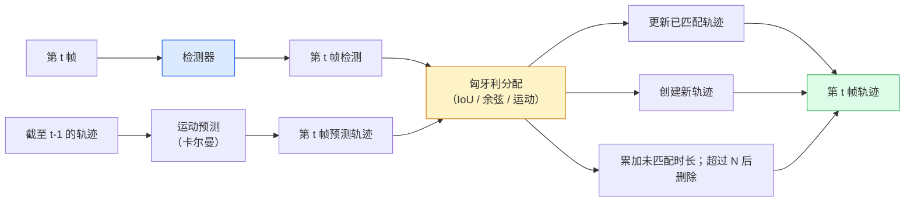

# 多目标跟踪与视频记忆（Multi-Object Tracking & Video Memory）

> 跟踪就是检测加关联。逐帧检测，再通过标识将当前帧检测与上一帧轨迹匹配。

**Type:** Build
**Languages:** Python
**Prerequisites:** 阶段 4 第 06 课（YOLO 检测）、阶段 4 第 08 课（Mask R-CNN）、阶段 4 第 24 课（SAM 3）
**Time:** 约 60 分钟

## 学习目标（Learning Objectives）

- 区分基于检测的跟踪与基于查询的跟踪，列举算法家族：SORT、DeepSORT、ByteTrack、BoT-SORT、SAM 2 记忆跟踪器、SAM 3.1 Object Multiplex
- 为经典的基于检测的跟踪，从零实现交并比（Intersection over Union，IoU）与匈牙利分配
- 解释 SAM 2 的记忆库，以及它为何比基于 IoU 的关联更善于处理遮挡
- 读懂三种跟踪指标（MOTA、IDF1、HOTA），根据用例选择重要指标

## 问题（The Problem）

检测器告诉你单帧中对象在哪里，跟踪器告诉你第 `t` 帧的哪条检测与第 `t-1` 帧的检测属于同一对象。没有跟踪，就无法统计越线对象、在遮挡中持续跟踪球，或判断“4 号车已在车道内停留 8 秒”。

跟踪对所有面向视频的产品都至关重要：体育分析、监控、自动驾驶、医学视频分析、野生动物监测、文字标志计数。它们共享核心组件：逐帧检测器、运动模型（卡尔曼滤波器或更复杂模型）、关联步骤（基于 IoU、余弦或学习特征的匈牙利算法），以及轨迹生命周期（创建、更新、终止）。

2026 年带来两种新模式：**SAM 2 基于记忆的跟踪（Memory-based Tracking）**，以特征记忆替代运动模型关联；以及 **SAM 3.1 对象多路复用（Object Multiplex）**，为同一概念的大量实例使用共享记忆。本课先介绍经典技术栈，再介绍基于记忆的方法。

## 核心概念（The Concept）

### 基于检测的跟踪（Tracking-by-detection）



2026 年你会遇到的每种跟踪器，都是这一循环的变体，区别如下：

- **SORT**（2016）：卡尔曼滤波器与 IoU 匈牙利分配。简单、快速，没有外观模型。
- **DeepSORT**（2017）：SORT 加每条轨迹基于卷积神经网络（Convolutional Neural Network，CNN）的外观特征，即重识别（Re-identification，ReID）嵌入。更善于处理交叉。
- **ByteTrack**（2021）：第二阶段关联低置信度检测；无需外观特征，却在 MOT17 上名列前茅。
- **BoT-SORT**（2022）：Byte 加相机运动补偿与 ReID。
- **StrongSORT / OC-SORT**：ByteTrack 的后继方法，改善运动与外观处理。

### 一段话理解卡尔曼滤波器（Kalman filter in one paragraph）

卡尔曼滤波器（Kalman Filter）为每条轨迹维护状态 `(x, y, w, h, dx, dy, dw, dh)` 及协方差。每帧先用匀速模型**预测（Predict）**状态，再用匹配检测**更新（Update）**。预测不确定性越高，更新时越信任检测。这能生成平滑轨迹，并在短暂遮挡（1–5 帧）期间延续轨迹。

所有经典跟踪器都在运动预测步骤使用卡尔曼滤波器。

### 匈牙利算法（The Hungarian algorithm）

给定 `M x N` 代价矩阵（轨迹数乘检测数），寻找使总代价最小的一对一分配。代价通常为 `1 - IoU(track_bbox, detection_bbox)`，或外观特征的负余弦相似度。运行时间为 O((M+N)^3)；当 M、N 不超过约 1000 时，Python 中通过 `scipy.optimize.linear_sum_assignment` 运行已足够快。

### ByteTrack 的关键思路（ByteTrack's key idea）

标准跟踪器丢弃低置信度检测（< 0.5）。ByteTrack 将其保留为**第二阶段候选（Second-stage Candidates）**：轨迹与高置信度检测匹配后，未匹配轨迹尝试以略宽松的 IoU 阈值匹配低置信度检测，从而在短暂遮挡后恢复跟踪，减少人群附近的标识切换。

### SAM 2 基于记忆的跟踪（SAM 2 memory-based tracking）

SAM 2 通过保存各实例时空特征的**记忆库（Memory Bank）**处理视频。给定一帧上的提示（点击、边界框、文本），它将实例编码到记忆中。后续帧通过记忆与新帧特征的交叉注意力，解码出同一实例在新帧中的掩码。

无需卡尔曼滤波器，也无需匈牙利分配，关联隐含在记忆注意力操作中。

优点：
- 对大幅遮挡稳健，记忆可跨多个帧携带实例身份。
- 与 SAM 3 文本提示结合时支持开放词表。
- 无需独立运动模型。

缺点：
- 跟踪大量对象时比 ByteTrack 慢。
- 记忆库会增长，限制上下文窗口。

### SAM 3.1 对象多路复用（SAM 3.1 Object Multiplex）

此前 SAM 2 / SAM 3 为每个实例保存独立记忆库，50 个对象就需要 50 个记忆库。对象多路复用（2026 年 3 月）将它们合并为单个共享记忆，并使用**逐实例查询词元（Per-instance Query Tokens）**。成本随实例数量呈次线性增长。

多路复用是 2026 年人群跟踪的新默认方案，适用于音乐会人群、仓库工人、交通路口。

### 必须了解的三个指标（Three metrics to know）

- **多目标跟踪准确率（Multi-Object Tracking Accuracy，MOTA）**：1 - (FN + FP + ID switches) / GT。按错误类型计入权重，将检测与关联失败混合成单个指标。
- **身份 F1（ID F1，IDF1）**：身份精确率与召回率的调和平均，专门关注每条真值轨迹随时间保持标识的程度。对标识切换敏感的任务，比 MOTA 更合适。
- **高阶跟踪准确率（Higher Order Tracking Accuracy，HOTA）**：分解为检测准确率（Detection Accuracy，DetA）与关联准确率（Association Accuracy，AssA），是 2020 年以来的社区标准，最为全面。

监控场景关心“谁是谁”，报告 IDF1。体育分析，例如统计传球，报告 HOTA。一般学术比较也使用 HOTA。

```figure
cv3-track-assoc
```

## 动手构建（Build It）

### 第 1 步：基于 IoU 的代价矩阵（Step 1: IoU-based cost matrix）

```python
import numpy as np


def bbox_iou(a, b):
    """
    a, b: (N, 4) arrays of [x1, y1, x2, y2].
    Returns (N_a, N_b) IoU matrix.
    """
    ax1, ay1, ax2, ay2 = a[:, 0], a[:, 1], a[:, 2], a[:, 3]
    bx1, by1, bx2, by2 = b[:, 0], b[:, 1], b[:, 2], b[:, 3]
    inter_x1 = np.maximum(ax1[:, None], bx1[None, :])
    inter_y1 = np.maximum(ay1[:, None], by1[None, :])
    inter_x2 = np.minimum(ax2[:, None], bx2[None, :])
    inter_y2 = np.minimum(ay2[:, None], by2[None, :])
    inter = np.clip(inter_x2 - inter_x1, 0, None) * np.clip(inter_y2 - inter_y1, 0, None)
    area_a = (ax2 - ax1) * (ay2 - ay1)
    area_b = (bx2 - bx1) * (by2 - by1)
    union = area_a[:, None] + area_b[None, :] - inter
    return inter / np.clip(union, 1e-8, None)
```

### 第 2 步：最简 SORT 风格跟踪器（Step 2: Minimal SORT-style tracker）

为简洁起见省略固定匀速卡尔曼模型，仅使用简单 IoU 关联；生产中卡尔曼预测不可或缺。Python 的 `sort` 包提供完整版本。

```python
from scipy.optimize import linear_sum_assignment


class Track:
    def __init__(self, tid, bbox, frame):
        self.id = tid
        self.bbox = bbox
        self.last_frame = frame
        self.hits = 1

    def update(self, bbox, frame):
        self.bbox = bbox
        self.last_frame = frame
        self.hits += 1


class SimpleTracker:
    def __init__(self, iou_threshold=0.3, max_age=5):
        self.tracks = []
        self.next_id = 1
        self.iou_threshold = iou_threshold
        self.max_age = max_age

    def step(self, detections, frame):
        if not self.tracks:
            for d in detections:
                self.tracks.append(Track(self.next_id, d, frame))
                self.next_id += 1
            return [(t.id, t.bbox) for t in self.tracks]

        track_boxes = np.array([t.bbox for t in self.tracks])
        det_boxes = np.array(detections) if len(detections) else np.empty((0, 4))

        iou = bbox_iou(track_boxes, det_boxes) if len(det_boxes) else np.zeros((len(track_boxes), 0))
        cost = 1 - iou
        cost[iou < self.iou_threshold] = 1e6

        matched_track = set()
        matched_det = set()
        if cost.size > 0:
            row, col = linear_sum_assignment(cost)
            for r, c in zip(row, col):
                if cost[r, c] < 1.0:
                    self.tracks[r].update(det_boxes[c], frame)
                    matched_track.add(r); matched_det.add(c)

        for i, d in enumerate(det_boxes):
            if i not in matched_det:
                self.tracks.append(Track(self.next_id, d, frame))
                self.next_id += 1

        self.tracks = [t for t in self.tracks if frame - t.last_frame <= self.max_age]
        return [(t.id, t.bbox) for t in self.tracks]
```

60 行代码接收逐帧检测，返回逐帧轨迹标识。真实系统还会加入卡尔曼预测、ByteTrack 第二阶段重新匹配和外观特征。

### 第 3 步：合成轨迹测试（Step 3: Synthetic trajectory test）

```python
def synthetic_frames(num_frames=20, num_objects=3, H=240, W=320, seed=0):
    rng = np.random.default_rng(seed)
    starts = rng.uniform(20, 200, size=(num_objects, 2))
    velocities = rng.uniform(-5, 5, size=(num_objects, 2))
    frames = []
    for f in range(num_frames):
        dets = []
        for i in range(num_objects):
            cx, cy = starts[i] + f * velocities[i]
            dets.append([cx - 10, cy - 10, cx + 10, cy + 10])
        frames.append(dets)
    return frames


tracker = SimpleTracker()
for f, dets in enumerate(synthetic_frames()):
    tracks = tracker.step(dets, f)
```

三个沿直线运动的对象，应在全部 20 帧中保持各自标识。

### 第 4 步：标识切换指标（Step 4: ID-switch metric）

```python
def count_id_switches(tracks_per_frame, gt_per_frame):
    """
    tracks_per_frame:  list of list of (track_id, bbox)
    gt_per_frame:      list of list of (gt_id, bbox)
    Returns number of ID switches.
    """
    prev_assignment = {}
    switches = 0
    for tracks, gts in zip(tracks_per_frame, gt_per_frame):
        if not tracks or not gts:
            continue
        t_boxes = np.array([b for _, b in tracks])
        g_boxes = np.array([b for _, b in gts])
        iou = bbox_iou(g_boxes, t_boxes)
        for g_idx, (gt_id, _) in enumerate(gts):
            j = iou[g_idx].argmax()
            if iou[g_idx, j] > 0.5:
                t_id = tracks[j][0]
                if gt_id in prev_assignment and prev_assignment[gt_id] != t_id:
                    switches += 1
                prev_assignment[gt_id] = t_id
    return switches
```

这是与 IDF1 相关的简化指标：统计真值对象被分配的预测轨迹标识变化多少次。真正的 MOTA / IDF1 / HOTA 工具位于 `py-motmetrics` 和 `TrackEval`。

## 实际应用（Use It）

2026 年生产跟踪器：

- `ultralytics`：内置 YOLOv8 + ByteTrack / BoT-SORT，使用 `results = model.track(source, tracker="bytetrack.yaml")`，是默认选择。
- `supervision`（Roboflow）：ByteTrack 封装与标注工具。
- SAM 2 / SAM 3.1：通过 `processor.track()` 进行基于记忆的跟踪。
- 自定义技术栈：检测器（YOLOv8 / RT-DETR）加 `sort-tracker` / `OC-SORT` / `StrongSORT`。

选型：

- 以每秒 30 帧以上跟踪行人、车辆、箱子：**ultralytics 中的 ByteTrack**。
- 人群中同一类别的大量实例：**SAM 3.1 Object Multiplex**。
- 遮挡严重但外观可识别：**DeepSORT / StrongSORT**，使用 ReID 特征。
- 体育或复杂交互：**BoT-SORT** 或学习式跟踪器（MOTRv3）。

## 交付产物（Ship It）

本课产出：

- `outputs/prompt-tracker-picker.md`：根据场景类型、遮挡模式和延迟预算，选择 SORT、ByteTrack、BoT-SORT、SAM 2 或 SAM 3.1。
- `outputs/skill-mot-evaluator.md`：编写完整评估框架，对照真值轨迹计算 MOTA、IDF1 和 HOTA。

## 练习（Exercises）

1. **（简单）** 分别用 3、10、30 个对象运行上述合成跟踪器，报告各自标识切换次数，找出简单纯 IoU 关联开始失效的位置。
2. **（中等）** 在关联前加入匀速卡尔曼预测步骤，展示短暂的 2–3 帧遮挡不再导致标识切换。
3. **（困难）** 通过 `transformers` 集成 SAM 2 的记忆跟踪器作为替代后端。在 30 秒人群片段上分别运行 SimpleTracker 和 SAM 2，手工标注 5 名显著人物的真值标识，比较标识切换次数。

## 关键术语（Key Terms）

| 术语 | 常见说法 | 实际含义 |
|------|----------------|----------------------|
| 基于检测的跟踪（Tracking-by-detection） | “先检测再关联” | 逐帧检测器，加基于 IoU 或外观的匈牙利分配 |
| 卡尔曼滤波器（Kalman Filter） | “运动预测” | 用线性动力学与协方差实现平滑轨迹预测和遮挡处理 |
| 匈牙利算法（Hungarian Algorithm） | “最优分配” | 求解最小代价二分图匹配，使用 `scipy.optimize.linear_sum_assignment` |
| ByteTrack | “低置信度第二轮” | 将未匹配轨迹与低置信度检测重新匹配，在短暂遮挡后恢复跟踪 |
| DeepSORT | “SORT 加外观” | 加入 ReID 特征进行跨帧匹配，更善于保持标识 |
| 记忆库（Memory Bank） | “SAM 2 技巧” | 跨帧保存各实例时空特征，用交叉注意力替代显式关联 |
| 对象多路复用（Object Multiplex） | “SAM 3.1 共享记忆” | 单个共享记忆配合逐实例查询，快速跟踪大量对象 |
| 高阶跟踪准确率（Higher Order Tracking Accuracy，HOTA） | “现代跟踪指标” | 分解为检测与关联准确率，是社区标准 |

## 延伸阅读（Further Reading）

- [SORT（Bewley 等，2016）](https://arxiv.org/abs/1602.00763)：最简基于检测的跟踪论文
- [DeepSORT（Wojke 等，2017）](https://arxiv.org/abs/1703.07402)：加入外观特征
- [ByteTrack（Zhang 等，2022）](https://arxiv.org/abs/2110.06864)：低置信度第二轮匹配
- [BoT-SORT（Aharon 等，2022）](https://arxiv.org/abs/2206.14651)：相机运动补偿
- [HOTA（Luiten 等，2020）](https://arxiv.org/abs/2009.07736)：可分解的跟踪指标
- [SAM 2 视频分割（Meta，2024）](https://ai.meta.com/sam2/)：基于记忆的跟踪器
- [SAM 3.1 对象多路复用（Meta，2026 年 3 月）](https://ai.meta.com/blog/segment-anything-model-3/)
