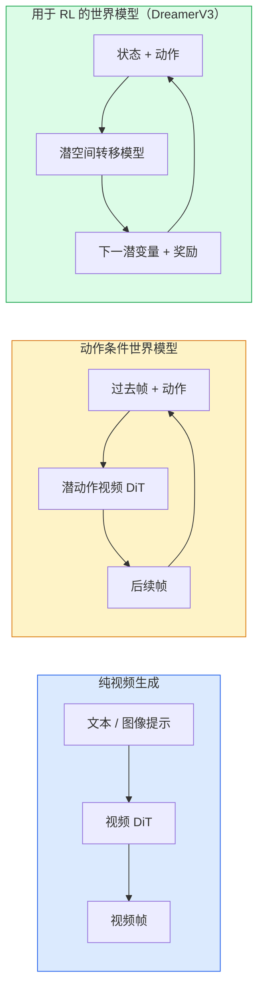

# 世界模型与视频扩散（World Models & Video Diffusion）

> 能预测场景未来几秒的视频模型，就是世界模拟器。再以动作为预测条件，就得到一个学习出来的游戏引擎。

**Type:** Learn + Build
**Languages:** Python
**Prerequisites:** 阶段 4 第 10 课（扩散）、阶段 4 第 12 课（视频理解）、阶段 4 第 23 课（DiT 与整流流）
**Time:** 约 75 分钟

## 学习目标（Learning Objectives）

- 解释纯视频生成模型（Sora 2）与动作条件世界模型（Genie 3、DreamerV3）的区别
- 描述视频扩散 Transformer（Diffusion Transformer，DiT）：时空图像块、三维位置编码、跨 (T, H, W) 词元的联合注意力
- 梳理世界模型如何接入机器人：视觉语言模型（Vision-Language Model，VLM）规划 → 视频模型模拟 → 逆动力学输出动作
- 针对创意视频、交互仿真、自动驾驶合成等用例，选择 Sora 2、Genie 3、Runway GWM-1 Worlds、Wan-Video 或 HunyuanVideo

## 问题（The Problem）

视频生成与世界建模在 2026 年走向融合。一个能生成连贯的一分钟视频的模型，在某种意义上已学会世界如何运动，包括对象恒存性、重力、因果关系和风格。如果让动作（向左走、开门）成为预测条件，视频模型就成为可学习模拟器，能够替代游戏引擎、驾驶模拟器或机器人环境。

实际影响已经显现。Genie 3 从单张图像生成可玩的环境；Runway GWM-1 Worlds 合成无限可探索场景；Sora 2 生成带同步音频和物理建模的一分钟视频。NVIDIA Cosmos-Drive、Wayve Gaia-2 和 Tesla DrivingWorld 生成逼真驾驶视频，作为自动驾驶训练数据。世界模型范式正逐渐接管机器人的仿真到现实迁移（Sim-to-real）。

本课是阶段 4 的全局视角课程，将图像生成、视频理解与智能体推理连接为主流研究正在走向的架构模式。

## 核心概念（The Concept）

### 世界建模的三个家族（Three families of world-modelling）



- **Sora 2** 是以提示为条件的纯视频生成模型，没有动作接口，无法在展开过程中操控它。
- **Genie 3**、**GWM-1 Worlds**、**Mirage / Magica** 是动作条件世界模型，从观测视频推断潜动作，再以动作为条件预测未来帧。它们可交互：按键或移动相机，场景会响应。
- **DreamerV3** 与经典强化学习（Reinforcement Learning，RL）世界模型家族，在潜空间中以明确动作为条件预测，并使用奖励信号训练。视觉表现较弱，但更适合样本高效的 RL。

### 视频 DiT 架构（Video DiT architecture）

```
视频潜变量：          (C, T, H, W)
空间分块：            每帧划分为 P_h x P_w 图像块网格
时间分块：            将 P_t 帧组合成一个时间块
最终词元：            (T / P_t) * (H / P_h) * (W / P_w) 个词元
```

位置编码是三维的：为每个 (t, h, w) 坐标使用旋转嵌入或学习嵌入。注意力可采用：

- **全联合注意力（Full Joint Attention）**：所有词元关注所有词元，N 个词元的复杂度为 O(N^2)，长视频难以承受。
- **分离注意力（Divided Attention）**：交替进行时间注意力（同一空间位置跨时间：`(H*W) * T^2`）与空间注意力（同一时间步跨空间：`T * (H*W)^2`）。TimeSformer 和多数视频 DiT 使用此方式。
- **窗口注意力（Window Attention）**：在 (t, h, w) 局部窗口内计算，Video Swin 使用此方式。

2026 年每个视频扩散模型都采用上述三种模式之一，再加上自适应层归一化（Adaptive Layer Normalization，AdaLN）条件调制（第 23 课）与整流流（Rectified Flow）。

### 以动作为条件：潜动作模型（Conditioning on actions: latent action models）

Genie 通过判别式预测连续两帧之间的动作，为每帧学习一个**潜动作（Latent Action）**。模型解码器随后以推断出的潜动作为条件，而非明确键盘按键。推理时，用户可指定一个潜动作，或从新的先验中采样一个动作，模型生成与其一致的下一帧。

Sora 完全跳过动作接口。解码器从过去时空词元预测后续时空词元，提示决定起始条件，生成过程中没有额外控制。

### 物理合理性（Physical plausibility）

Sora 2 在 2026 年发布时明确宣传**物理合理性（Physical Plausibility）**，包括重量、平衡、对象恒存性和因果关系。团队通过人工合理性评分衡量；相比 Sora 1，物体掉落、角色碰撞以及刻意失败（例如跳跃未成功）的表现有明显改善。

合理性仍是主要失效点。2024–2025 年人吃意大利面或用玻璃杯喝水的视频暴露了模型缺乏持久对象表示。2026 年模型（Sora 2、Runway Gen-5、HunyuanVideo）减少了这些问题，但并未消除。

### 自动驾驶世界模型（Autonomous driving world models）

驾驶世界模型以轨迹、边界框或导航地图为条件生成逼真道路场景，用途包括：

- **Cosmos-Drive-Dreams**（NVIDIA）：生成数分钟驾驶视频，用于 RL 训练。
- **Gaia-2**（Wayve）：以轨迹为条件合成场景，用于策略评估。
- **DrivingWorld**（Tesla）：模拟不同天气、时段和交通状况。
- **Vista**（ByteDance）：合成可响应交互的驾驶场景。

它们替代了昂贵的真实边缘场景采集，例如夜间行人乱穿马路、结冰路口、少见车辆类型，否则可能需要数百万英里驾驶才能收集。

### 机器人技术栈：VLM、视频模型与逆动力学（Robotics stack: VLM + video model + inverse dynamics）

正在形成的三组件机器人闭环：

1. **VLM** 解析目标，例如“拿起红色杯子”，规划高层动作序列。
2. **视频生成模型（Video Generation Model）** 模拟执行各动作后的画面，预测未来 N 帧的观测。
3. **逆动力学模型（Inverse Dynamics Model）** 提取能产生这些观测的具体电机指令。

这替代了奖励塑形（Reward Shaping）与耗费大量样本的 RL。世界模型负责想象，逆动力学负责闭环执行。Genie Envisioner 是一个实例，多个研究团队正在趋向这一结构。

### 评估（Evaluation）

- **视觉质量（Visual Quality）**：弗雷歇视频距离（Fréchet Video Distance，FVD）、用户研究。
- **提示对齐（Prompt Alignment）**：逐帧 CLIPScore、视觉问答（Visual Question Answering，VQA）式评估。
- **物理合理性（Physical Plausibility）**：在基准套件上人工评分，例如 Sora 2 内部基准、VBench。
- **可控性（Controllability）**：针对交互世界模型，衡量动作与观测的一致性，以及能否回到先前状态。

### 2026 年模型格局（Model landscape in 2026）

| 模型 | 用途 | 参数量 | 输出 | 许可 |
|-------|-----|------------|--------|---------|
| Sora 2 | 文生视频、音频 | — | 1 分钟 1080p 视频与音频 | 仅 API |
| Runway Gen-5 | 文本或图像生成视频 | — | 10 秒片段 | API |
| Runway GWM-1 Worlds | 交互世界 | — | 无限三维展开 | API |
| Genie 3 | 从图像生成交互世界 | 110 亿以上 | 可玩的画面 | 研究预览 |
| Wan-Video 2.1 | 开放文生视频 | 140 亿 | 高质量片段 | 非商用 |
| HunyuanVideo | 开放文生视频 | 130 亿 | 10 秒片段 | 宽松许可 |
| Cosmos / Cosmos-Drive | 自动驾驶仿真 | 70–140 亿 | 驾驶场景 | NVIDIA 开放许可 |
| Magica / Mirage 2 | AI 原生游戏引擎 | — | 可修改世界 | 产品 |

```figure
v4-world-rollout
```

## 动手构建（Build It）

### 第 1 步：视频三维分块（Step 1: 3D patchify for video）

```python
import torch
import torch.nn as nn


class VideoPatch3D(nn.Module):
    def __init__(self, in_channels=4, dim=64, patch_t=2, patch_h=2, patch_w=2):
        super().__init__()
        self.proj = nn.Conv3d(
            in_channels, dim,
            kernel_size=(patch_t, patch_h, patch_w),
            stride=(patch_t, patch_h, patch_w),
        )
        self.patch_t = patch_t
        self.patch_h = patch_h
        self.patch_w = patch_w

    def forward(self, x):
        # x: (N, C, T, H, W)
        x = self.proj(x)
        n, c, t, h, w = x.shape
        tokens = x.reshape(n, c, t * h * w).transpose(1, 2)
        return tokens, (t, h, w)
```

步幅等于卷积核尺寸的三维卷积充当时空分块器，生成 `(T, H, W) -> (T/2, H/2, W/2)` 的词元网格。

### 第 2 步：三维旋转位置编码（Step 2: 3D rotary position encoding）

沿 `t`、`h`、`w` 轴分别应用旋转位置嵌入（Rotary Position Embeddings，RoPE）：

```python
def rope_3d(tokens, t_dim, h_dim, w_dim, grid):
    """
    tokens: (N, T*H*W, D)
    grid: (T, H, W) sizes
    t_dim + h_dim + w_dim == D
    """
    T, H, W = grid
    n, seq, d = tokens.shape
    if t_dim + h_dim + w_dim != d:
        raise ValueError(f"t_dim+h_dim+w_dim ({t_dim}+{h_dim}+{w_dim}) must equal D={d}")
    assert seq == T * H * W
    t_idx = torch.arange(T, device=tokens.device).repeat_interleave(H * W)
    h_idx = torch.arange(H, device=tokens.device).repeat_interleave(W).repeat(T)
    w_idx = torch.arange(W, device=tokens.device).repeat(T * H)
    # Simplified: just scale channels by frequencies. Real RoPE rotates pairs.
    freqs_t = torch.exp(-torch.log(torch.tensor(10000.0)) * torch.arange(t_dim // 2, device=tokens.device) / (t_dim // 2))
    freqs_h = torch.exp(-torch.log(torch.tensor(10000.0)) * torch.arange(h_dim // 2, device=tokens.device) / (h_dim // 2))
    freqs_w = torch.exp(-torch.log(torch.tensor(10000.0)) * torch.arange(w_dim // 2, device=tokens.device) / (w_dim // 2))
    emb_t = torch.cat([torch.sin(t_idx[:, None] * freqs_t), torch.cos(t_idx[:, None] * freqs_t)], dim=-1)
    emb_h = torch.cat([torch.sin(h_idx[:, None] * freqs_h), torch.cos(h_idx[:, None] * freqs_h)], dim=-1)
    emb_w = torch.cat([torch.sin(w_idx[:, None] * freqs_w), torch.cos(w_idx[:, None] * freqs_w)], dim=-1)
    return tokens + torch.cat([emb_t, emb_h, emb_w], dim=-1)
```

这里是简化加法形式。真正的 RoPE 按频率旋转成对通道，位置信息相同。

### 第 3 步：分离注意力模块（Step 3: Divided attention block）

```python
class DividedAttentionBlock(nn.Module):
    def __init__(self, dim=64, heads=2):
        super().__init__()
        self.time_attn = nn.MultiheadAttention(dim, heads, batch_first=True)
        self.space_attn = nn.MultiheadAttention(dim, heads, batch_first=True)
        self.ln1 = nn.LayerNorm(dim)
        self.ln2 = nn.LayerNorm(dim)
        self.ln3 = nn.LayerNorm(dim)
        self.mlp = nn.Sequential(nn.Linear(dim, 4 * dim), nn.GELU(), nn.Linear(4 * dim, dim))

    def forward(self, x, grid):
        T, H, W = grid
        n, seq, d = x.shape
        # time attention: same (h, w), across t
        xt = x.view(n, T, H * W, d).permute(0, 2, 1, 3).reshape(n * H * W, T, d)
        a, _ = self.time_attn(self.ln1(xt), self.ln1(xt), self.ln1(xt), need_weights=False)
        xt = (xt + a).reshape(n, H * W, T, d).permute(0, 2, 1, 3).reshape(n, seq, d)
        # space attention: same t, across (h, w)
        xs = xt.view(n, T, H * W, d).reshape(n * T, H * W, d)
        a, _ = self.space_attn(self.ln2(xs), self.ln2(xs), self.ln2(xs), need_weights=False)
        xs = (xs + a).reshape(n, T, H * W, d).reshape(n, seq, d)
        xs = xs + self.mlp(self.ln3(xs))
        return xs
```

时间注意力在各空间位置跨时间计算，空间注意力在各帧内跨位置计算。用两次 O(T^2 + (HW)^2) 操作代替一次 O((THW)^2) 操作，这是 TimeSformer 和所有现代视频 DiT 的核心。

### 第 4 步：组装微型视频 DiT（Step 4: Compose a tiny video DiT）

```python
class TinyVideoDiT(nn.Module):
    def __init__(self, in_channels=4, dim=64, depth=2, heads=2):
        super().__init__()
        self.patch = VideoPatch3D(in_channels=in_channels, dim=dim, patch_t=2, patch_h=2, patch_w=2)
        self.blocks = nn.ModuleList([DividedAttentionBlock(dim, heads) for _ in range(depth)])
        self.out = nn.Linear(dim, in_channels * 2 * 2 * 2)

    def forward(self, x):
        tokens, grid = self.patch(x)
        for blk in self.blocks:
            tokens = blk(tokens, grid)
        return self.out(tokens), grid
```

这不是可用的视频生成器，而是验证每个组件形状正确的结构演示。

### 第 5 步：检查形状（Step 5: Check shapes）

```python
vid = torch.randn(1, 4, 8, 16, 16)  # (N, C, T, H, W)
model = TinyVideoDiT()
out, grid = model(vid)
print(f"input  {tuple(vid.shape)}")
print(f"tokens grid {grid}")
print(f"output {tuple(out.shape)}")
```

分块后预期得到 `grid = (4, 8, 8)` 和 `out = (1, 256, 32)`；预测头随后投影到逐词元时空块，可再逆分块恢复视频。

## 实际应用（Use It）

2026 年生产访问方式：

- **Sora 2 API**（OpenAI）：文生视频、同步音频，采用高端定价。
- **Runway Gen-5 / GWM-1**（Runway）：图生视频、交互世界。
- **Wan-Video 2.1 / HunyuanVideo**：开源自托管。
- **Cosmos / Cosmos-Drive**（NVIDIA）：开放权重的驾驶仿真。
- **Genie 3**：研究预览，需要申请访问。

构建交互世界模型演示时，先用 Wan-Video 保证质量，再叠加潜动作适配器提供交互。自动驾驶仿真则以 Cosmos-Drive 作为 2026 年开放参考。

机器人实践中的技术栈：

1. 语言目标 → VLM（Qwen3-VL）→ 高层计划。
2. 计划 → 潜动作视频模型 → 想象展开。
3. 展开结果 → 逆动力学模型 → 低层动作。
4. 执行动作 → 将观测反馈到第 1 步。

## 交付产物（Ship It）

本课产出：

- `outputs/prompt-video-model-picker.md`：根据任务、许可和延迟，选择 Sora 2、Runway、Wan、HunyuanVideo 或 Cosmos。
- `outputs/skill-physical-plausibility-checks.md`：定义自动检查的技能，覆盖对象恒存性、重力和连续性，在交付任何生成视频前运行。

## 练习（Exercises）

1. **（简单）** 计算 5 秒 360p 视频在 patch-t=2、patch-h=8、patch-w=8 时的词元数，推理该规模注意力的内存需求。
2. **（中等）** 将上述分离注意力模块替换为全联合注意力模块，测量形状与参数量，解释真实视频模型为什么需要分离注意力。
3. **（困难）** 构建最简潜动作视频模型：使用任意简单二维游戏的 (frame_t, action_t, frame_{t+1}) 三元组数据集，以动作嵌入为条件训练微型视频 DiT，展示不同动作产生不同后续帧。

## 关键术语（Key Terms）

| 术语 | 常见说法 | 实际含义 |
|------|----------------|----------------------|
| 世界模型（World Model） | “学习出来的模拟器” | 给定状态与动作，预测未来观测的模型 |
| 视频 DiT（Video DiT） | “时空 Transformer” | 使用三维分块与分离注意力的扩散 Transformer |
| 潜动作（Latent Action） | “推断出的控制” | 从帧对推断的离散或连续动作潜变量，用于下一帧生成的条件 |
| 分离注意力（Divided Attention） | “先时间后空间” | 每个模块执行两次注意力，先跨时间再跨空间，使 O(N^2) 成本可控 |
| 对象恒存性（Object Permanence） | “物体持续存在” | 视频模型必须学习的场景属性，在食物与玻璃器皿上是经典失效点 |
| 弗雷歇视频距离（Fréchet Video Distance，FVD） | “视频分布距离” | 弗雷歇 Inception 距离（Fréchet Inception Distance，FID）的视频对应指标，主要视觉质量指标 |
| 逆动力学模型（Inverse Dynamics Model） | “观测转动作” | 给定当前状态与下一状态，输出连接两者的动作，闭合机器人控制回路 |
| Cosmos-Drive | “NVIDIA 驾驶仿真” | 用于 RL 与评估的开放权重自动驾驶世界模型 |

## 延伸阅读（Further Reading）

- [Sora 技术报告（OpenAI）](https://openai.com/index/video-generation-models-as-world-simulators/)
- [Genie：生成式交互环境（Bruce 等，2024）](https://arxiv.org/abs/2402.15391)：潜动作世界模型
- [TimeSformer（Bertasius 等，2021）](https://arxiv.org/abs/2102.05095)：视频 Transformer 的分离注意力
- [DreamerV3（Hafner 等，2023）](https://arxiv.org/abs/2301.04104)：用于 RL 的世界模型
- [Cosmos-Drive-Dreams（NVIDIA，2025）](https://research.nvidia.com/labs/toronto-ai/cosmos-drive-dreams/)：驾驶世界模型
- [2026 年十大视频生成模型（DataCamp）](https://www.datacamp.com/blog/top-video-generation-models)
- [从视频生成到世界模型：综述仓库](https://github.com/ziqihuangg/Awesome-From-Video-Generation-to-World-Model/)
