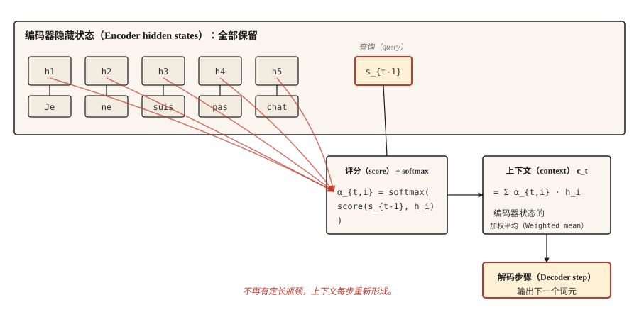

# 注意力机制：关键突破（Attention Mechanism — The Breakthrough）

> 解码器不再盯着压缩摘要猜测，而是查看整个源序列。此后的发展，就是注意力加工程。

**Type:** Build
**Languages:** Python
**Prerequisites:** 阶段 5 · 09（序列到序列模型，Sequence-to-Sequence Models）
**Time:** ~45 分钟

## 问题（The Problem）

第 09 课以一个实测失效案例结束：在玩具复制任务上训练的 GRU 编码器–解码器，准确率从长度 5 时的 89%，下降到长度 80 时接近随机水平。原因是结构性的，不是训练缺陷：编码器获得的每一点信息都必须装进一个定长隐藏状态，解码器看不到其他内容。

Bahdanau、Cho 和 Bengio 在 2014 年提出三行就能表达的修复：不要只给解码器最终编码器状态，而要保留每个编码器状态。每个解码步骤计算编码器状态的加权平均，权重回答“解码器现在需要多大程度关注编码器位置 `i`？”这个加权平均就是上下文，每个解码步骤都会改变。

核心想法仅此而已。Transformer 扩展了它，自注意力（Self-attention）把它应用于单个序列，多头注意力（Multi-head attention）并行运行它。但 2014 年的版本已经打破瓶颈；理解它之后，转向 Transformer 主要是工程变化，而非概念跳跃。

## 概念（The Concept）



在每个解码步骤 `t`：

1. 将前一解码器隐藏状态 `s_{t-1}` 用作**查询（Query）**。
2. 将其与每个编码器隐藏状态 `h_1, ..., h_T` 评分，每个编码器位置得到一个标量。
3. 对分数做 softmax，得到总和为 1 的注意力权重 `α_{t,1}, ..., α_{t,T}`。
4. 上下文向量 `c_t = Σ α_{t,i} * h_i`，即编码器状态的加权平均。
5. 解码器接收 `c_t` 和前一输出词元，生成下一个词元。

加权平均是重点。解码器需要将“Je”译为“I”时，会给“Je”对应的编码器状态较高权重，其他位置较低；需要“not”时，则给“pas”较高权重。上下文向量每步重新形成。

## 张量形状：人人都会踩的坑（Shapes）

几乎每个注意力实现第一次都会在这里出错，请慢慢读。

| 对象 | 形状 | 说明 |
|-------|-------|-------|
| 编码器隐藏状态 `H` | `(T_enc, d_h)` | 若为 BiLSTM，`d_h = 2 * d_hidden` |
| 解码器隐藏状态 `s_{t-1}` | `(d_s,)` | 一个向量 |
| 注意力分数 `e_{t,i}` | 标量 | 每个编码器位置一个 |
| 注意力权重 `α_{t,i}` | 标量 | 对全部 `i` 做 softmax 后得到 |
| 上下文向量 `c_t` | `(d_h,)` | 与编码器状态形状相同 |

**Bahdanau 加性评分（Additive score）。** `e_{t,i} = v_α^T * tanh(W_a * s_{t-1} + U_a * h_i)`。

- `s_{t-1}` 的形状是 `(d_s,)`，`h_i` 的形状是 `(d_h,)`。
- `W_a` 的形状是 `(d_attn, d_s)`，`U_a` 的形状是 `(d_attn, d_h)`。
- tanh 内两者之和的形状为 `(d_attn,)`。
- `v_α` 的形状是 `(d_attn,)`，与 `v_α` 做内积后缩为标量。**这就是 `v_α` 的作用。** 它并不神秘，只是将注意力维度向量投影为标量分数。

**Luong 乘性评分（Multiplicative score）。** 有三种变体：

- `dot`：`e_{t,i} = s_t^T * h_i`，要求 `d_s == d_h`，这是硬约束。编码器为双向时跳过它。
- `general`：`e_{t,i} = s_t^T * W * h_i`，其中 `W` 形状为 `(d_s, d_h)`，去除了维度相等约束。
- `concat`：本质上就是 Bahdanau 形式。前两种更便宜，因此它很少使用。

**一个值得说明的 Bahdanau / Luong 陷阱。** Bahdanau 使用 `s_{t-1}`，即生成当前词*之前*的解码器状态；Luong 使用 `s_t`，即*之后*的状态。混用会产生难以察觉、极难调试的错误梯度。选一篇论文，始终遵守其约定。

```figure
attention-heatmap
```

## 动手实现（Build It）

### 步骤 1：加性 Bahdanau 注意力（Additive attention）

```python
import numpy as np


def additive_attention(decoder_state, encoder_states, W_a, U_a, v_a):
    projected_dec = W_a @ decoder_state
    projected_enc = encoder_states @ U_a.T
    combined = np.tanh(projected_enc + projected_dec)
    scores = combined @ v_a
    weights = softmax(scores)
    context = weights @ encoder_states
    return context, weights


def softmax(x):
    x = x - np.max(x)
    e = np.exp(x)
    return e / e.sum()
```

对照上表检查形状：`encoder_states` 为 `(T_enc, d_h)`，`projected_enc` 为 `(T_enc, d_attn)`，`projected_dec` 为 `(d_attn,)`，参与广播。`combined` 为 `(T_enc, d_attn)`，`scores` 为 `(T_enc,)`，`weights` 为 `(T_enc,)`，`context` 为 `(d_h,)`。核对后即可交付。

### 步骤 2：Luong 点积与通用形式（Dot and general）

```python
def dot_attention(decoder_state, encoder_states):
    scores = encoder_states @ decoder_state
    weights = softmax(scores)
    return weights @ encoder_states, weights


def general_attention(decoder_state, encoder_states, W):
    projected = W.T @ decoder_state
    scores = encoder_states @ projected
    weights = softmax(scores)
    return weights @ encoder_states, weights
```

每种三行代码。这正是 Luong 论文受欢迎的原因：多数任务上准确率相同，代码却少得多。

### 步骤 3：数值示例（A worked numerical example）

给定三个编码器状态，大致对应“cat”“sat”“mat”，以及与第一个状态最对齐的解码器状态，注意力分布会集中于位置 0。若解码器状态转向与最后状态对齐，注意力便移到位置 2，上下文向量随之变化。

```python
H = np.array([
    [1.0, 0.0, 0.2],
    [0.5, 0.5, 0.1],
    [0.1, 0.9, 0.3],
])

s_close_to_cat = np.array([0.9, 0.1, 0.2])
ctx, w = dot_attention(s_close_to_cat, H)
print("weights:", w.round(3))
```

```
weights: [0.464 0.305 0.231]
```

第一行胜出。再把解码器状态移向第三个编码器状态，观察权重变化。就是这样，注意力是显式对齐（Explicit alignment）。

### 步骤 4：为什么它连接到 Transformer（The bridge to transformers）

把上述表述转换为 Q/K/V：

- **查询（Query）** = 解码器状态 `s_{t-1}`
- **键（Key）** = 编码器状态，即评分时匹配的对象
- **值（Value）** = 编码器状态，即加权求和的对象

传统注意力中，键和值相同。自注意力将其分开：序列可对自身发起查询，K 和 V 使用不同的学习投影。多头注意力用不同投影并行执行。Transformer 多次堆叠整个阶段，并去掉 RNN。

数学相同，形状相同。从 Bahdanau 注意力到缩放点积注意力（Scaled dot-product attention），教学上的跨越主要在记号。

## 实际应用（Use It）

PyTorch 和 TensorFlow 直接提供注意力。

```python
import torch
import torch.nn as nn

mha = nn.MultiheadAttention(embed_dim=128, num_heads=8, batch_first=True)
query = torch.randn(2, 5, 128)
key = torch.randn(2, 10, 128)
value = torch.randn(2, 10, 128)

output, weights = mha(query, key, value)
print(output.shape, weights.shape)
```

```
torch.Size([2, 5, 128]) torch.Size([2, 5, 10])
```

这就是 Transformer 注意力层。查询批次有 5 个位置，键和值批次有 10 个位置，每个 128 维，使用 8 个头。`output` 是融入上下文的新查询，`weights` 是可视化的 5x10 对齐矩阵（Alignment matrix）。

### 传统注意力仍然重要的场景（When classical attention still matters）

- 教学。单头、单层、基于 RNN 的版本能让每个概念直接可见。
- Transformer 放不下的设备端序列任务。
- 阅读 2014-2017 年的论文。不知道 Bahdanau 约定就会读错。
- 机器翻译（MT）的细粒度对齐分析。即使在 Transformer 上，原始注意力权重也是可解释性工具，阅读它们需要理解其含义。

### 将注意力权重当作解释的陷阱（The attention-weight-as-explanation trap）

注意力权重看起来可解释：它们在各位置之和为一，可以绘图，高权重意味着“看了这里”。评审者很喜欢这种图。

但其可解释性没有表面那么强。Jain 与 Wallace（2019）表明，在某些任务上，可以置换注意力分布，甚至替换成任意其他分布，而不改变模型预测。没有消融（Ablation）或反事实（Counterfactual）检查，绝不能将注意力权重作为推理过程的证据。

## 交付成果（Ship It）

保存为 `outputs/prompt-attention-shapes.md`：

```markdown
---
name: attention-shapes
description: 调试注意力（Attention）实现中的张量形状错误。
phase: 5
lesson: 10
---

给定有问题的注意力实现，找出形状不匹配，输出：

1. 哪个矩阵形状错误，给出张量名称。
2. 根据 (d_s, d_h, d_attn, T_enc, T_dec, batch_size) 推导它应有的形状。
3. 一行修复：转置、重塑或投影。
4. 捕捉回归的测试，通常断言 `output.shape == (batch, T_dec, d_h)`、`weights.shape == (batch, T_dec, T_enc)` 和 `weights.sum(dim=-1) close to 1`。

拒绝推荐依赖静默广播的修复。被广播掩盖的错误之后会以静默准确率下降出现，这是最糟糕的注意力缺陷。

若混淆 Bahdanau，要求解码器输入必须是 `s_{t-1}`（步骤前状态）；Luong 则是 `s_t`（步骤后状态）。点积注意力首次实现最常见的错误是查询与键维度不匹配，应指出它。
```

## 练习（Exercises）

1. **简单。** 实现 `softmax` 掩码（Masking），使编码器填充词元的注意力权重为零，在变长序列批次上测试。
2. **中等。** 为 Luong `general` 形式加入多头注意力，将 `d_h` 拆为 `n_heads` 组，每头执行注意力后拼接。验证单头情况与之前实现一致。
3. **困难。** 在第 09 课玩具复制任务上训练带 Bahdanau 注意力的 GRU 编码器–解码器，绘制准确率随序列长度变化的曲线，与无注意力基线比较。你应看到差距随长度增大，证明注意力缓解了瓶颈。

## 关键术语（Key Terms）

| 术语 | 常见说法 | 实际含义 |
|------|-----------------|-----------------------|
| 注意力（Attention） | 看向某处 | 值序列的加权平均，权重由查询与键的相似度计算。 |
| 查询、键、值（Query, Key, Value） | QKV | 三种投影：Q 提问，K 用于匹配，V 用于返回。 |
| 加性注意力（Additive attention） | Bahdanau | 前馈评分：`v^T tanh(W q + U k)`。 |
| 乘性注意力（Multiplicative attention） | Luong dot / general | 分数为 `q^T k` 或 `q^T W k`，更便宜，多数任务上准确率相同。 |
| 对齐矩阵（Alignment matrix） | 好看的图 | 以 `(T_dec, T_enc)` 网格表示注意力权重，可读出模型关注了哪里。 |

## 延伸阅读（Further Reading）

- [Bahdanau、Cho、Bengio（2014）：联合学习对齐与翻译的神经机器翻译（Neural Machine Translation by Jointly Learning to Align and Translate）](https://arxiv.org/abs/1409.0473)：原始论文。
- [Luong、Pham、Manning（2015）：基于注意力的神经机器翻译有效方法（Effective Approaches to Attention-based Neural Machine Translation）](https://arxiv.org/abs/1508.04025)：三种评分变体及其比较。
- [Jain 与 Wallace（2019）：注意力并非解释（Attention is not Explanation）](https://arxiv.org/abs/1902.10186)：关于可解释性的限制。
- [《动手学深度学习》（Dive into Deep Learning）：Bahdanau 注意力](https://d2l.ai/chapter_attention-mechanisms-and-transformers/bahdanau-attention.html)：可运行的 PyTorch 讲解。
