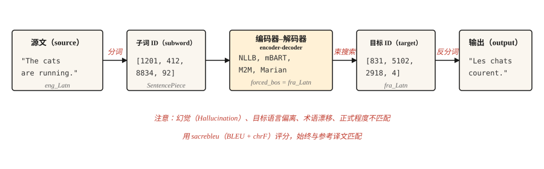

# 机器翻译（Machine Translation）

> 翻译为 NLP 研究提供了三十年的资金支持，如今仍在继续。

**Type:** Build
**Languages:** Python
**Prerequisites:** 阶段 5 · 10（注意力机制，Attention Mechanism），阶段 5 · 04（GloVe、FastText 与子词，Subword）
**Time:** ~75 分钟

## 问题（The Problem）

模型读取一种语言的句子，生成另一种语言的句子。长度会变，词序会变，有些源词对应多个目标词，反之亦然。习语不服从一一映射。“I miss you”在法语中是“tu me manques”，字面意思是“你对我而言有所缺失”。任何逐词对齐都应付不了。

机器翻译（Machine translation，MT）迫使 NLP 发明编码器–解码器、注意力、Transformer，最终发展出整个 LLM 范式。每次进步都源于翻译质量可测量，而人机差距始终难以消除。

本课不讲历史，直接教授 2026 年的可用流水线：预训练多语言编码器–解码器（NLLB-200 或 mBART）、子词分词、束搜索、BLEU 与 chrF 评估，以及少数仍会未经发现就进入生产的失效方式。

## 概念（The Concept）



现代 MT 是在平行文本（Parallel text）上训练的 Transformer 编码器–解码器。编码器按源语言分词读取输入，解码器通过交叉注意力（Cross-attention，第 10 课）使用编码器输出，逐个子词生成目标。解码用束搜索避免贪心陷阱，输出经反分词（Detokenization）、还原原始大小写（Detruecasing），再与参考译文比较评分。

三个操作选择决定现实中的 MT 质量。

- **分词器（Tokenizer）。** 在混合语言语料上训练的 SentencePiece BPE。跨语言共享词表使 NLLB 支持零样本语言对。
- **模型大小（Model size）。** NLLB-200 distilled 600M 可在笔记本电脑上运行，NLLB-200 3.3B 是已发布的生产默认选择，54.5B 是研究上限。
- **解码（Decoding）。** 通用内容使用束宽 4-5，以长度惩罚避免输出过短。需要术语一致性时使用约束解码（Constrained decoding）。

```figure
seq2seq-alignment
```

## 动手实现（Build It）

### 步骤 1：调用预训练机器翻译模型（A pretrained MT call）

```python
from transformers import AutoTokenizer, AutoModelForSeq2SeqLM

model_id = "facebook/nllb-200-distilled-600M"
tok = AutoTokenizer.from_pretrained(model_id, src_lang="eng_Latn")
model = AutoModelForSeq2SeqLM.from_pretrained(model_id)

src = "The cats are running."
inputs = tok(src, return_tensors="pt")

out = model.generate(
    **inputs,
    forced_bos_token_id=tok.convert_tokens_to_ids("fra_Latn"),
    num_beams=5,
    length_penalty=1.0,
    max_new_tokens=64,
)
print(tok.batch_decode(out, skip_special_tokens=True)[0])
```

```text
Les chats courent.
```

这里有三点重要：`src_lang` 告诉分词器采用哪种书写系统和切分方式，`forced_bos_token_id` 告诉解码器生成哪种语言。两者都是 NLLB 专有做法；mBART 与 M2M-100 有各自约定，不能互换。

### 步骤 2：BLEU 与 chrF（BLEU and chrF）

BLEU 衡量输出与参考译文的 n 元词组重叠。采用 1-4 四种长度，取精确率的几何平均，对过短输出施加短句惩罚（Brevity penalty），分数范围为 [0, 100]。它使用普遍，却难解释：30 BLEU 是“可用”，40 是“好”，50 是“出色”，小于 1 BLEU 的差异属于噪声。

chrF 衡量字符级 F 分数（Character-level F-score）。对于形态丰富、BLEU 容易少算匹配的语言，它更敏感，通常与 BLEU 一起报告。

```python
import sacrebleu

hypotheses = ["Les chats courent."]
references = [["Les chats courent."]]

bleu = sacrebleu.corpus_bleu(hypotheses, references)
chrf = sacrebleu.corpus_chrf(hypotheses, references)
print(f"BLEU: {bleu.score:.1f}  chrF: {chrf.score:.1f}")
```

始终使用 `sacrebleu`。它统一分词，使不同论文的分数可比。自行实现 BLEU 正是误导性基准出现的原因。

### 三层评估体系，2026 年（The three-tier evaluation hierarchy）

现代 MT 评估使用三类互补指标，交付时至少采用两类。

- **启发式（Heuristic）**，如 BLEU、chrF。速度快、依赖参考、可解释，但对释义改写不敏感，用于历史比较和回归检测。
- **学习式（Learned）**，如 COMET、BLEURT、BERTScore。基于人工判断训练的神经模型，比较译文与源文、参考译文的语义相似性。自 2023 年起，COMET 与 MT 研究的关联最强；到 2026 年，它成为质量重要时的生产默认选择。
- **LLM 评审（LLM-as-judge）**，无须参考。通过提示让大模型对流畅性、充分性、语气、文化适宜性评分。评分标准设计良好时，GPT-4 评审约有 80% 的情况与人工判断一致。用于没有参考译文的开放式内容。

2026 年实用技术栈：`sacrebleu` 计算 BLEU 与 chrF，`unbabel-comet` 计算 COMET，再用提示驱动的 LLM 提供最终面向人的信号。信任生产数据上的指标前，先用 50-100 个人工标注样本校准每个指标。

无参考指标（COMET-QE、BLEURT-QE、LLM 评审）让你无须参考译文即可评估翻译，对缺少参考译文的长尾语言对尤其重要。

### 步骤 3：生产中会出什么问题（What breaks in production）

上述可用流水线约 80% 的时候能流畅翻译，剩余 20% 则会悄然失效。具体包括：

- **幻觉（Hallucination）。** 模型编造源文中没有的内容，常见于陌生领域词汇。症状是译文流畅，却声称源文未陈述的事实。缓解办法：对领域术语做约束解码，受监管内容人工审核，监控远长于输入的输出。
- **目标语言偏离（Off-target generation）。** 模型译成错误语言，NLLB 在稀有语言对上尤其容易出现。缓解办法：验证 `forced_bos_token_id`，并始终用语言识别模型检查解码输出。
- **术语漂移（Terminology drift）。** “Sign up”在文档 1 中译为“s'inscrire”，文档 2 中却译为“créer un compte”。UI 和用户可见字符串的一致性比单纯质量更重要。缓解办法：词汇表约束解码或译后编辑词典。
- **正式程度不匹配（Formality mismatch）。** 如法语“tu”与“vous”、日语敬语等级。模型选择训练中更常见的形式，对客户可见内容往往不合适。缓解办法：模型支持时在提示前缀加入正式程度词元，或只用正式语料微调小模型。
- **短输入导致长度激增（Length explosion）。** 极短句子常生成过长译文，因为源词元少于约 5 个时，长度惩罚会急剧减弱。缓解办法：设置与源长度成比例的硬性最大长度。

### 步骤 4：领域微调（Fine-tuning for a domain）

预训练模型是通才。法律、医学或游戏对话翻译，在领域平行数据上微调后收益可测量，做法并不特殊：

```python
from transformers import Trainer, TrainingArguments
from datasets import Dataset

pairs = [
    {"src": "The defendant pleaded guilty.", "tgt": "L'accusé a plaidé coupable."},
]

ds = Dataset.from_list(pairs)


def preprocess(ex):
    return tok(
        ex["src"],
        text_target=ex["tgt"],
        truncation=True,
        max_length=128,
        padding="max_length",
    )


ds = ds.map(preprocess, remove_columns=["src", "tgt"])

args = TrainingArguments(output_dir="out", per_device_train_batch_size=4, num_train_epochs=3, learning_rate=3e-5)
Trainer(model=model, args=args, train_dataset=ds).train()
```

几千对高质量平行样本胜过几十万对带噪声的网页抓取样本。训练数据质量是影响生产效果最大的因素。

## 实际应用（Use It）

2026 年机器翻译生产技术栈：

| 用例 | 推荐起点 |
|---------|---------------------------|
| 200 种语言之间任意互译 | `facebook/nllb-200-distilled-600M`（笔记本电脑）或 `nllb-200-3.3B`（生产） |
| 以英语为中心，高质量，50 种语言 | `facebook/mbart-large-50-many-to-many-mmt` |
| 短任务、低成本推理、英法／英德／英西互译 | Helsinki-NLP / Marian 模型 |
| 延迟关键的浏览器端场景 | ONNX 量化 Marian（约 50 MB） |
| 追求最高质量，愿意付费 | GPT-4 / Claude / Gemini 加翻译提示词 |

截至 2026 年，LLM 在若干语言对上已超过专用 MT 模型，尤其擅长习语内容和长上下文。代价是按词元计费的成本与延迟。当上下文长度、风格一致性或通过提示适配领域比吞吐量更重要时，选 LLM。

## 交付成果（Ship It）

保存为 `outputs/skill-mt-evaluator.md`：

```markdown
---
name: mt-evaluator
description: 评估机器翻译（Machine translation）输出是否可以交付。
version: 1.0.0
phase: 5
lesson: 11
tags: [nlp, translation, evaluation]
---

给定源文本和候选译文，输出：

1. 自动评分估计：预期的 BLEU 与 chrF 范围，说明是否有参考译文。
2. 五项可人工核验的清单：（a）保留内容、没有幻觉；（b）语言正确；（c）语域及正式程度匹配；（d）提供词汇表时术语与其一致；（e）没有截断或长度激增。
3. 一个领域专用检查点。例如法律：命名实体和法条引用；医学：药名和剂量；UI：占位变量 `{name}`。
4. 置信标记：“Ship”（交付）/“Ship with review”（审核后交付）/“Do not ship”（不交付），与步骤 2 发现的问题严重性对应。

未检查输出语言 ID 时拒绝交付译文。没有参考译文时拒绝评估，除非用户明确选择无参考评分（COMET-QE、BLEURT-QE）。指出超过 1000 词元的内容可能需要分块翻译。
```

## 练习（Exercises）

1. **简单。** 用 `nllb-200-distilled-600M` 将一个五句英语段落译为法语，再译回英语。衡量往返结果与原文有多接近，应看到语义保留但选词漂移。
2. **中等。** 使用 `fasttext lid.176` 或 `langdetect` 检查翻译输出的语言 ID，集成到 MT 调用中，确保返回前发现错误目标语言。
3. **困难。** 在自选领域的 5,000 对语料上微调 `nllb-200-distilled-600M`，在留出集上测量微调前后 BLEU。报告哪些句型改善，哪些退化。

## 关键术语（Key Terms）

| 术语 | 常见说法 | 实际含义 |
|------|-----------------|-----------------------|
| BLEU | 翻译分数 | 带短句惩罚的 n 元词组精确率，范围 [0, 100]。 |
| chrF | 字符 F 分数 | 字符级 F 分数，对形态丰富的语言更敏感。 |
| 神经机器翻译（NMT） | 神经 MT | 在平行文本上训练的 Transformer 编码器–解码器，2017 年后的默认方式。 |
| NLLB | No Language Left Behind | Meta 的 200 语言机器翻译模型家族。 |
| 约束解码（Constrained decoding） | 可控输出 | 强制特定词元或 n 元词组出现在或不出现在输出中。 |
| 幻觉（Hallucination） | 编造内容 | 源文不支持的模型输出。 |

## 延伸阅读（Further Reading）

- [Costa-jussà 等（2022）：No Language Left Behind，扩展以人为中心的机器翻译（Scaling Human-Centered Machine Translation）](https://arxiv.org/abs/2207.04672)：NLLB 论文。
- [Post（2018）：呼吁清晰报告 BLEU 分数（A Call for Clarity in Reporting BLEU Scores）](https://aclanthology.org/W18-6319/)：为什么 `sacrebleu` 是报告 BLEU 的唯一正确方式。
- [Popović（2015）：chrF，用于自动 MT 评估的字符 n 元组 F 分数（Character n-gram F-score for automatic MT evaluation）](https://aclanthology.org/W15-3049/)：chrF 论文。
- [Hugging Face 机器翻译指南](https://huggingface.co/docs/transformers/tasks/translation)：实用微调讲解。
