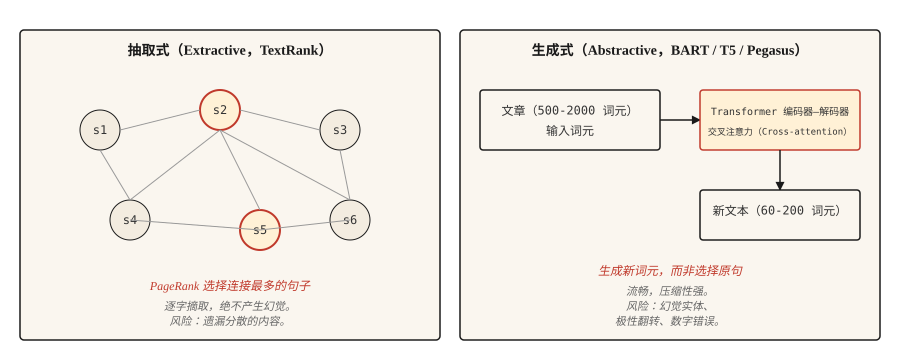

# 文本摘要（Text Summarization）

> 抽取式系统告诉你文档说了什么，生成式系统告诉你作者想表达什么。任务不同，陷阱也不同。

**Type:** Build
**Languages:** Python
**Prerequisites:** 阶段 5 · 02（词袋与 TF-IDF，BoW + TF-IDF），阶段 5 · 11（机器翻译，Machine Translation）
**Time:** ~75 分钟

## 问题（The Problem）

信息流里来了一篇 2,000 词新闻，你需要用 120 词概括它。可以挑出文章中最重要的三个句子（抽取式），也可以用自己的话重写内容（生成式）。两者都叫摘要，却是完全不同的问题。

抽取式摘要（Extractive summarization）是排序问题：为每个句子打分，返回前 `k` 个。输出直接逐字摘取，因此语法总是正确；风险是遗漏分散在全文各处的内容。

生成式摘要（Abstractive summarization）是生成问题：Transformer 以输入为条件生成新文本，输出流畅、压缩性强，但可能幻觉出源文没有的事实。风险是自信地编造。

本课构建两种方法，介绍各自的失效方式。

## 概念（The Concept）



**抽取式（Extractive）。** 把文章看作图，节点是句子，边是相似度。在图上运行 PageRank 或类似算法，按句子与其他内容的连接程度评分，最高分句子组成摘要。经典实现是 **TextRank**（Mihalcea 与 Tarau，2004）。

**生成式（Abstractive）。** 在文档–摘要对上微调 Transformer 编码器–解码器，如 BART、T5、Pegasus。推理时模型读取文档，通过交叉注意力逐词元生成摘要。Pegasus 特别使用缺句预训练目标（Gap-sentence pretraining objective），使其无须太多微调就擅长摘要。

使用 **ROUGE（Recall-Oriented Understudy for Gisting Evaluation，面向召回的摘要评估方法）**评估。ROUGE-1 和 ROUGE-2 衡量一元、二元词组重叠，ROUGE-L 衡量最长公共子序列（Longest common subsequence）。越高越好，40 ROUGE-L 算“好”，50 算“出色”。每篇论文都会报告三者，使用 `rouge-score` 包。

```figure
summarize-collapse
```

## 动手实现（Build It）

### 步骤 1：抽取式 TextRank（TextRank, extractive）

```python
import math
import re
from collections import Counter


def sentence_split(text):
    return re.split(r"(?<=[.!?])\s+", text.strip())


def similarity(s1, s2):
    w1 = Counter(s1.lower().split())
    w2 = Counter(s2.lower().split())
    intersection = sum((w1 & w2).values())
    denom = math.log(len(w1) + 1) + math.log(len(w2) + 1)
    if denom == 0:
        return 0.0
    return intersection / denom


def textrank(text, top_k=3, damping=0.85, iterations=50, epsilon=1e-4):
    sentences = sentence_split(text)
    n = len(sentences)
    if n <= top_k:
        return sentences

    sim = [[0.0] * n for _ in range(n)]
    for i in range(n):
        for j in range(n):
            if i != j:
                sim[i][j] = similarity(sentences[i], sentences[j])

    scores = [1.0] * n
    for _ in range(iterations):
        new_scores = [1 - damping] * n
        for i in range(n):
            total_out = sum(sim[i]) or 1e-9
            for j in range(n):
                if sim[i][j] > 0:
                    new_scores[j] += damping * sim[i][j] / total_out * scores[i]
        if max(abs(s - ns) for s, ns in zip(scores, new_scores)) < epsilon:
            scores = new_scores
            break
        scores = new_scores

    ranked = sorted(range(n), key=lambda k: scores[k], reverse=True)[:top_k]
    ranked.sort()
    return [sentences[i] for i in ranked]
```

有两点值得说明。相似度函数使用对数归一化的词重叠，这是原始 TextRank 变体；TF-IDF 向量余弦相似度也可行。阻尼因子（Damping factor）0.85 与迭代次数采用 PageRank 默认值。

### 步骤 2：用 BART 生成摘要（Abstractive with BART）

```python
from transformers import pipeline

summarizer = pipeline("summarization", model="facebook/bart-large-cnn")

article = """(long news article text)"""

summary = summarizer(article, max_length=120, min_length=60, do_sample=False)
print(summary[0]["summary_text"])
```

BART-large-CNN 在 CNN/DailyMail 语料上微调，开箱即可生成新闻风格摘要。其他领域，如科学论文、对话、法律，应使用对应 Pegasus 检查点，或在目标数据上微调。

### 步骤 3：ROUGE 评估（ROUGE evaluation）

```python
from rouge_score import rouge_scorer

scorer = rouge_scorer.RougeScorer(["rouge1", "rouge2", "rougeL"], use_stemmer=True)
scores = scorer.score(reference_summary, generated_summary)
print({k: round(v.fmeasure, 3) for k, v in scores.items()})
```

始终启用词干提取（Stemming）。否则“running”与“run”被算作不同词，ROUGE 会少算匹配。

### 超越 ROUGE：2026 年摘要评估（Beyond ROUGE）

ROUGE 主导摘要评估已二十年，但到 2026 年，单独使用它已不够。对自然语言生成（NLG）论文的大规模元分析表明：

- **BERTScore** 使用上下文嵌入相似度，到 2023 年持续普及，如今多数摘要论文将其与 ROUGE 一起报告。
- **BARTScore** 将评估视为生成：根据预训练 BART 在给定源文时赋予摘要的概率来评分。
- **MoverScore** 使用上下文嵌入上的推土机距离（Earth Mover's Distance），在 2025 年摘要基准中居首，因为它比 ROUGE 更能捕捉语义重叠。
- **FactCC** 和**基于问答的忠实性（QA-based faithfulness）**在 2021-2023 年常见，如今常被 **G-Eval** 取代。后者是 GPT-4 提示链，用思维链（Chain-of-thought）推理评估连贯性、一致性、流畅性和相关性。
- **G-Eval** 及类似 LLM 评审方法，在评分标准设计良好时，约有 80% 的情况与人工判断一致。

生产建议：报告 ROUGE-L 以便历史比较，BERTScore 衡量语义重叠，G-Eval 衡量连贯性与事实性，并用 50-100 个人工标注摘要校准。

### 步骤 4：事实性问题（The factuality problem）

生成式摘要容易产生幻觉。抽取式摘要逐字取自源文，因此幻觉风险低得多，但若源句脱离上下文、过时或引用顺序改变，仍可能误导。这是生产系统对合规相关内容仍偏好抽取式方法的最大原因。

需要区分的幻觉类型：

- **实体替换（Entity swap）。** 源文写“John Smith”，摘要写“John Brown”。
- **数字漂移（Number drift）。** 源文写“25,000”，摘要写“25 million”。
- **极性翻转（Polarity flip）。** 源文写“rejected the offer”（拒绝提议），摘要写“accepted the offer”（接受提议）。
- **事实编造（Fact invention）。** 源文没提 CEO，摘要却说 CEO 批准了。

有效的评估办法：

- **FactCC。** 在源句与摘要句的蕴含关系（Entailment）上训练的二分类器，预测符合事实或不符合事实。
- **基于问答的事实性（QA-based factuality）。** 向 QA 模型提出答案在源文中的问题，若摘要支持不同答案，则标记。
- **实体级 F1（Entity-level F1）。** 比较源文与摘要的命名实体，仅在摘要中出现的实体可疑。

对于事实性重要的用户可见内容，如新闻、医学、法律、金融，抽取式是风险更低的默认选择。生成式需要在流程中加入事实性检查。

## 实际应用（Use It）

2026 年的技术栈：

| 用例 | 推荐 |
|---------|-------------|
| 英语新闻，3-5 句摘要 | `facebook/bart-large-cnn` |
| 科学论文 | `google/pegasus-pubmed` 或微调后的 T5 |
| 多文档、长篇 | 任意支持 32k+ 上下文的 LLM，加提示词 |
| 对话摘要 | `philschmid/bart-large-cnn-samsum` |
| 抽取式，从机制上降低幻觉风险 | TextRank 或 `sumy` 的 LSA / LexRank |

到 2026 年，计算资源不受限时，长上下文 LLM 常胜过专用模型。取舍在于成本与可复现性，专用模型的输出更一致。

## 交付成果（Ship It）

保存为 `outputs/skill-summary-picker.md`：

```markdown
---
name: summary-picker
description: 选择抽取式或生成式摘要，给出库名，并加入事实性检查。
version: 1.0.0
phase: 5
lesson: 12
tags: [nlp, summarization]
---

根据任务（文档类型、合规要求、长度、计算预算），输出：

1. 方法：抽取式或生成式，用一句话解释原因。
2. 起始模型或库：给出名称，如 `sumy.TextRankSummarizer`、`facebook/bart-large-cnn`、`google/pegasus-pubmed`，或 LLM 提示词。
3. 评估计划：ROUGE-1、ROUGE-2、ROUGE-L，使用带词干提取的 rouge-score。若为生成式，额外加入事实性检查。
4. 一个待查失效情况。实体替换是生成式新闻摘要最常见的问题，标记源文实体未出现在摘要中的样本。

医学、法律、金融或受监管内容若没有事实性门禁，拒绝采用生成式摘要。指出超出模型上下文窗口的输入需要分块映射–归约（Map-reduce）摘要，而不只是截断。
```

## 练习（Exercises）

1. **简单。** 对 5 篇新闻运行 TextRank，将前 3 个句子与参考摘要比较并测量 ROUGE-L。在 CNN/DailyMail 风格文章上，应看到 30-45 ROUGE-L。
2. **中等。** 实现实体级事实性检查：用 spaCy 从源文和摘要提取命名实体，计算源实体在摘要中的召回率，以及摘要实体相对源文的精确率。高精确率、低召回率意味着安全但简短；低精确率意味着幻觉实体。
3. **困难。** 在 50 篇 CNN/DailyMail 文章上比较 BART-large-CNN 与 LLM（Claude 或 GPT-4），报告 ROUGE-L、基于实体 F1 的事实性，以及每条摘要成本，记录各自胜出的场景。

## 关键术语（Key Terms）

| 术语 | 常见说法 | 实际含义 |
|------|-----------------|-----------------------|
| 抽取式（Extractive） | 挑选句子 | 逐字返回源文句子，绝不产生幻觉。 |
| 生成式（Abstractive） | 重写 | 以源文为条件生成新文本，可能产生幻觉。 |
| ROUGE | 摘要指标 | 系统输出与参考之间的 n 元词组或最长公共子序列（LCS）重叠。 |
| TextRank | 基于图的抽取式方法 | 在句子相似度图上执行 PageRank。 |
| 事实性（Factuality） | 是否正确 | 摘要中的陈述是否得到源文支持。 |
| 幻觉（Hallucination） | 编造内容 | 摘要中源文不支持的内容。 |

## 延伸阅读（Further Reading）

- [Mihalcea 与 Tarau（2004）：TextRank，为文本带来秩序（Bringing Order into Texts）](https://aclanthology.org/W04-3252/)：抽取式经典论文。
- [Lewis 等（2019）：BART，去噪序列到序列预训练（Denoising Sequence-to-Sequence Pre-training）](https://arxiv.org/abs/1910.13461)：BART 论文。
- [Zhang 等（2019）：PEGASUS，通过提取缺句进行预训练（Pre-training with Extracted Gap-sentences）](https://arxiv.org/abs/1912.08777)：Pegasus 与缺句目标。
- [Lin（2004）：ROUGE，摘要自动评估工具包（A Package for Automatic Evaluation of Summaries）](https://aclanthology.org/W04-1013/)：ROUGE 论文。
- [Maynez 等（2020）：论生成式摘要的忠实性与事实性（On Faithfulness and Factuality in Abstractive Summarization）](https://arxiv.org/abs/2005.00661)：概述事实性问题的论文。
