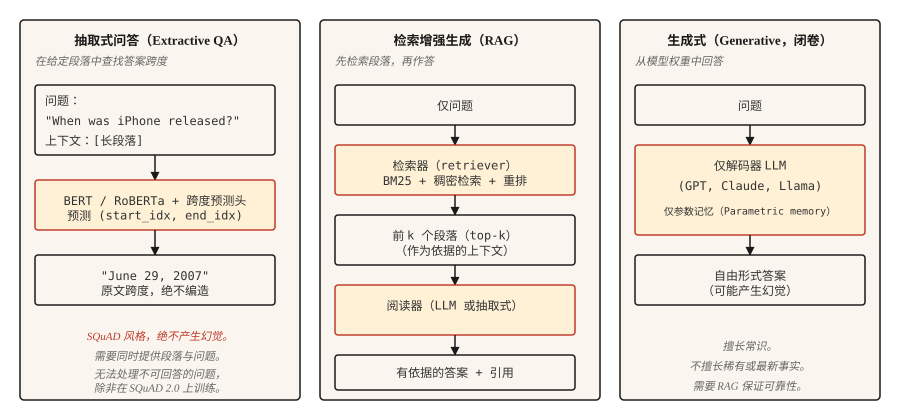

# 问答系统（Question Answering Systems）

> 三类系统塑造了现代问答：抽取式寻找跨度，检索增强式以文档为依据，生成式产出答案。现代 AI 助手都融合了这三者。

**Type:** Build
**Languages:** Python
**Prerequisites:** 阶段 5 · 11（机器翻译，Machine Translation），阶段 5 · 10（注意力机制，Attention Mechanism）
**Time:** ~75 分钟

## 问题（The Problem）

用户输入“When did the first iPhone launch?”（首款 iPhone 何时上市？），期望得到“June 29, 2007”（2007 年 6 月 29 日）。不是“Apple 的历史漫长而多样”，也不是脱离句子孤零零的“2007”，而是直接、有依据且正确的答案。

过去十年有三类架构主导问答（Question answering，QA）。

- **抽取式问答（Extractive QA）。** 给定问题及已知包含答案的段落，找出段落中答案跨度的起止索引。SQuAD 是经典基准。
- **开放域问答（Open-domain QA）。** 不提供段落，先检索相关段落，再提取或生成答案。这是当今每条 RAG 流水线的基础。
- **生成式或闭卷问答（Generative / Closed-book QA）。** 大语言模型从参数记忆（Parametric memory）回答，不做检索。推理最快，事实可靠性最低。

2026 年趋势是混合：检索最好的几个段落，再提示生成模型以它们为依据作答。这就是检索增强生成（RAG）。第 14 课深入介绍检索部分，本课构建问答部分。

## 概念（The Concept）



**抽取式（Extractive）。** 用 BERT 家族 Transformer 联合编码问题与段落，训练两个头预测答案的开始与结束词元索引，损失是有效位置上的交叉熵。输出是段落中的跨度。其构造决定了它不会产生幻觉，也无法处理段落答不了的问题。

**检索增强式（Retrieval-augmented，RAG）。** 分两阶段：检索器（Retriever）先从语料库找出前 `k` 个段落，阅读器（Reader），可以是抽取式或生成式，再使用这些段落产出答案。拆分让两者能独立训练与评估，现代 RAG 常在中间加重排器（Reranker）。

**生成式（Generative）。** 仅解码器 LLM（GPT、Claude、Llama）从学习权重回答，无检索步骤。常识表现出色，稀有或最新事实上则可能严重失误。幻觉率与事实在预训练数据中的出现频率负相关。

```figure
qa-span
```

## 动手实现（Build It）

### 步骤 1：用预训练模型做抽取式问答（Extractive QA with a pretrained model）

```python
from transformers import pipeline

qa = pipeline("question-answering", model="deepset/roberta-base-squad2")

passage = (
    "Apple Inc. released the first iPhone on June 29, 2007. "
    "The device was announced by Steve Jobs at Macworld in January 2007."
)
question = "When was the first iPhone released?"

answer = qa(question=question, context=passage)
print(answer)
```

```python
{'score': 0.98, 'start': 57, 'end': 70, 'answer': 'June 29, 2007'}
```

`deepset/roberta-base-squad2` 在包含不可回答问题的 SQuAD 2.0 上训练。默认情况下，即使模型空答案分数胜出，`question-answering` 流水线仍返回最高分跨度，*不会*自动返回空答案。要显式支持“无答案”，调用时传入 `handle_impossible_answer=True`，之后只有空答案分数超过所有跨度分数时才返回空答案。无论哪种情况，都检查 `score` 字段。

### 步骤 2：检索增强流水线示意（A retrieval-augmented pipeline）

```python
from sentence_transformers import SentenceTransformer
import numpy as np

encoder = SentenceTransformer("sentence-transformers/all-MiniLM-L6-v2")

corpus = [
    "Apple Inc. released the first iPhone on June 29, 2007.",
    "Macworld 2007 featured the iPhone announcement by Steve Jobs.",
    "Android launched in 2008 as Google's mobile operating system.",
    "The first iPod was released in 2001.",
]
corpus_embeddings = encoder.encode(corpus, normalize_embeddings=True)


def retrieve(question, top_k=2):
    q_emb = encoder.encode([question], normalize_embeddings=True)
    sims = (corpus_embeddings @ q_emb.T).squeeze()
    order = np.argsort(-sims)[:top_k]
    return [corpus[i] for i in order]


def answer(question):
    passages = retrieve(question, top_k=2)
    combined = " ".join(passages)
    return qa(question=question, context=combined)


print(answer("When was the first iPhone released?"))
```

这是两阶段流水线。稠密检索器（Dense retriever，Sentence-BERT）按语义相似度找相关段落，抽取式阅读器（RoBERTa-SQuAD）从拼接的最佳段落中提取答案跨度。适合小型语料；若有一百万篇文档，应使用 FAISS 或向量数据库。

### 步骤 3：结合 RAG 的生成（Generative with RAG）

```python
def rag_generate(question, llm):
    passages = retrieve(question, top_k=3)
    prompt = f"""Context:
{chr(10).join('- ' + p for p in passages)}

Question: {question}

Answer using only the context above. If the context does not contain the answer, say "I don't know."
"""
    return llm(prompt)
```

提示模式很重要。明确要求模型以给定上下文为依据，信息不足时回答“I don't know”（我不知道），相较朴素提示可降低 40-60% 的幻觉率。更复杂的模式加入引用、置信分数和结构化提取。

### 步骤 4：贴近现实的评估（Evaluation that reflects the real world）

SQuAD 使用**精确匹配（Exact Match，EM）**和**词元级 F1（Token-level F1）**。EM 在归一化后严格匹配，步骤是转小写、去标点、去冠词，要么完全匹配，要么得零分。F1 根据预测与参考的词元重叠计算，给予部分分数。两者都会低估释义改写：“June 29, 2007”与“June 29th, 2007”通常 EM 为 0，因为序数形式无法被归一化掉，但重叠词元仍可带来较高 F1。

生产问答应评估：

- **答案准确率（Answer accuracy）。** 由 LLM 或人工判断，因为指标无法捕捉语义等价。
- **引用准确率（Citation accuracy）。** 引用段落是否实际支持答案？可通过生成引用与检索段落之间的字符串匹配自动检查，做法简单。
- **拒答校准（Refusal calibration）。** 答案不在检索段落中时，系统能否正确说“我不知道”？测量错误自信率。
- **检索召回率（Retrieval recall）。** 评估阅读器前，先测检索器是否将正确段落纳入前 `k` 个结果，阅读器无法弥补缺失段落。

### RAGAS：2026 年生产评估框架（RAGAS）

`RAGAS` 专为 RAG 系统设计，是 2026 年交付默认框架，无须标准参考即可对四个维度评分：

- **忠实性（Faithfulness）。** 答案每项陈述是否来自检索上下文？用基于自然语言推断（NLI）的蕴含衡量，是主要幻觉指标。
- **答案相关性（Answer relevance）。** 答案是否回应问题？从答案生成假想问题，再与实际问题比较。
- **上下文精确率（Context precision）。** 检索块中实际相关的比例。低精确率意味着提示中噪声多。
- **上下文召回率（Context recall）。** 检索结果是否包含所有必需信息？低召回率意味着阅读器无法成功。

无参考评分让你无须整理标准答案，就能评估真实生产流量。对精确匹配无用的开放式问题，再叠加 LLM 评审（LLM-as-judge）。

`pip install ragas`。接入检索器与阅读器，每个查询得到四个标量，对退化告警。

## 实际应用（Use It）

2026 年技术栈：

| 用例 | 推荐 |
|---------|-------------|
| 给定段落，寻找答案跨度 | `deepset/roberta-base-squad2` |
| 固定语料库，不接受闭卷作答 | RAG：稠密检索器 + LLM 阅读器 |
| 文档存储上的实时问答 | RAG 加混合检索器（BM25 + 稠密）与重排器，见第 14 课 |
| 对话式问答，包含追问 | LLM 带对话历史，每轮结合 RAG |
| 高事实性、受监管领域 | 从权威语料抽取，绝不单独使用生成式 |

2026 年抽取式问答不再流行，因为结合 LLM 的 RAG 能覆盖更多情况。但在必须逐字引用的法律研究、监管合规、审计工具中，它仍然用于交付。

## 交付成果（Ship It）

保存为 `outputs/skill-qa-architect.md`：

```markdown
---
name: qa-architect
description: 选择问答（QA）架构、检索策略与评估计划。
version: 1.0.0
phase: 5
lesson: 13
tags: [nlp, qa, rag]
---

根据需求（语料库规模、问题类型、事实性约束、延迟预算），输出：

1. 架构：抽取式、带抽取式阅读器的 RAG、带生成式阅读器的 RAG，或闭卷 LLM，用一句话说明原因。
2. 检索器：无、BM25、稠密检索（给出编码器名称）或混合。
3. 阅读器：SQuAD 微调模型、明确名称的 LLM，或“领域微调的 DistilBERT”。
4. 评估：抽取式基准用 EM + F1；生产用答案准确率、引用准确率、拒答校准。说明测什么、如何测。

对监管或合规敏感问题，拒绝闭卷 LLM 回答。拒绝没有检索召回基线的 QA 系统，因为不知道检索器是否找到了正确段落，就无法评估阅读器。指出需要多跳推理（Multi-hop reasoning）的问题，应使用 HotpotQA 训练系统等专用多跳检索器。
```

## 练习（Exercises）

1. **简单。** 在 10 个 Wikipedia 段落上搭建上述 SQuAD 抽取流水线，手写 10 个问题，测量正确答案比例。若段落与问题质量良好，应有 7-9 个正确。
2. **中等。** 添加拒答分类器。最高检索分数低于阈值，例如余弦相似度 0.3 时，返回“我不知道”，不调用阅读器。在留出集上调节阈值。
3. **困难。** 在自选 10,000 篇文档的语料库上构建 RAG，实现 BM25 加稠密检索的混合检索，并用倒数排名融合（RRF）组合，见第 14 课。测量有无混合步骤的答案准确率，记录受益最大的题型。

## 关键术语（Key Terms）

| 术语 | 常见说法 | 实际含义 |
|------|-----------------|-----------------------|
| 抽取式问答（Extractive QA） | 找答案跨度 | 预测给定段落内答案的起止索引。 |
| 开放域问答（Open-domain QA） | 语料库上的问答 | 不给定段落，必须先检索再作答。 |
| 检索增强生成（RAG） | 先检索再生成 | 检索增强生成，由检索器与阅读器组成流水线。 |
| SQuAD | 经典基准 | Stanford 问答数据集（Stanford Question Answering Dataset），使用 EM + F1 指标。 |
| 幻觉（Hallucination） | 编造答案 | 阅读器输出没有检索上下文支持。 |
| 拒答校准（Refusal calibration） | 知道何时不作答 | 无法回答时，系统正确地说“我不知道”。 |

## 延伸阅读（Further Reading）

- [Rajpurkar 等（2016）：SQuAD，用于文本机器理解的 100,000+ 个问题（100,000+ Questions for Machine Comprehension of Text）](https://arxiv.org/abs/1606.05250)：基准论文。
- [Karpukhin 等（2020）：开放域问答的稠密段落检索（Dense Passage Retrieval for Open-Domain QA）](https://arxiv.org/abs/2004.04906)：DPR，经典 QA 稠密检索器。
- [Lewis 等（2020）：知识密集型 NLP 任务的检索增强生成（Retrieval-Augmented Generation for Knowledge-Intensive NLP Tasks）](https://arxiv.org/abs/2005.11401)：命名 RAG 的论文。
- [Gao 等（2023）：大语言模型的检索增强生成综述（Retrieval-Augmented Generation for Large Language Models: A Survey）](https://arxiv.org/abs/2312.10997)：全面的 RAG 综述。
