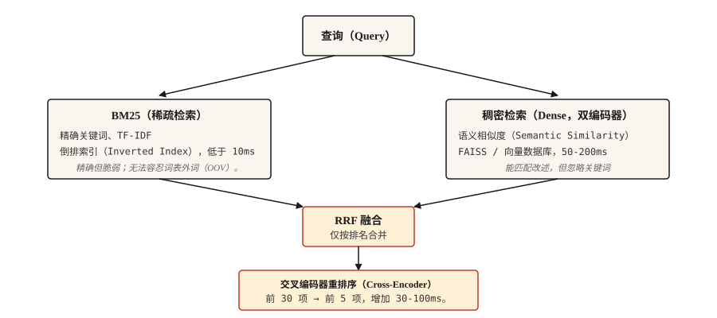

# 信息检索与搜索（Information Retrieval and Search）

> BM25 精确但脆弱，稠密检索覆盖广却会漏关键词。混合检索是 2026 年的默认选择，其余工作都是调优。

**Type:** Build
**Languages:** Python
**Prerequisites:** 阶段 5 · 02（词袋与 TF-IDF，BoW + TF-IDF），阶段 5 · 04（GloVe、FastText 与子词，Subword）
**Time:** ~75 分钟

## 问题（The Problem）

用户输入“what happens if someone lies to get money”（有人骗钱会怎样），希望找到实际适用的法条“Section 420 IPC”。关键词搜索完全漏掉它，因为没有共同词汇；若嵌入没在法律文本上训练，语义搜索也会漏掉。真实搜索必须同时处理两者。

信息检索（Information retrieval，IR）是每个 RAG 系统、搜索框、文档站模糊查找背后的流水线。2026 年能用于生产的架构不是单一方法，而是一串互补方法，每个环节弥补前面的失效。

本课构建各个部分，并指出每部分解决哪些失效。

## 概念（The Concept）



共四层，按需选用。

1. **稀疏检索（Sparse retrieval，BM25）。** 速度快，精确匹配准，语义能力差，运行于倒排索引（Inverted index）。在数百万篇文档上每次查询低于 10ms，擅长法条引用、产品代码、错误消息、命名实体。
2. **稠密检索（Dense retrieval）。** 将查询与文档编码为向量，执行最近邻搜索，捕捉释义与语义相似性。但会漏掉仅差一个字符的精确关键词匹配。使用 FAISS 或向量数据库，每次查询 50-200ms。
3. **融合（Fusion）。** 合并稀疏与稠密排序列表。倒数排名融合（Reciprocal Rank Fusion，RRF）是简单默认选择，因为它忽略量纲不同的原始分数，只用排名位置。已知领域内某一信号主导时，也可用加权融合。
4. **交叉编码器重排（Cross-encoder rerank）。** 取融合后的前 30 项，将查询和文档联合输入交叉编码器，逐对评分，保留前 5 项。交叉编码器每对处理比双编码器慢，但准确得多；只处理前 30 项可摊薄成本。

三路检索（BM25 + 稠密 + SPLADE 等学习式稀疏检索）在 2026 年基准中胜过两路，但需要学习式稀疏索引基础设施。对多数团队，两路加交叉编码器重排是合适的平衡。

```figure
gx-hybrid-retrieval
```

## 动手实现（Build It）

### 步骤 1：从零实现 BM25（BM25 from scratch）

```python
import math
import re
from collections import Counter

TOKEN_RE = re.compile(r"[a-z0-9]+")


def tokenize(text):
    return TOKEN_RE.findall(text.lower())


class BM25:
    def __init__(self, corpus, k1=1.5, b=0.75):
        if not corpus:
            raise ValueError("corpus must not be empty")
        self.corpus = [tokenize(d) for d in corpus]
        self.k1 = k1
        self.b = b
        self.n_docs = len(self.corpus)
        self.avg_dl = sum(len(d) for d in self.corpus) / self.n_docs
        self.df = Counter()
        for doc in self.corpus:
            for term in set(doc):
                self.df[term] += 1

    def idf(self, term):
        n = self.df.get(term, 0)
        return math.log(1 + (self.n_docs - n + 0.5) / (n + 0.5))

    def score(self, query, doc_idx):
        q_tokens = tokenize(query)
        doc = self.corpus[doc_idx]
        dl = len(doc)
        freq = Counter(doc)
        score = 0.0
        for term in q_tokens:
            f = freq.get(term, 0)
            if f == 0:
                continue
            numerator = f * (self.k1 + 1)
            denominator = f + self.k1 * (1 - self.b + self.b * dl / self.avg_dl)
            score += self.idf(term) * numerator / denominator
        return score

    def rank(self, query, top_k=10):
        scored = [(self.score(query, i), i) for i in range(self.n_docs)]
        scored.sort(reverse=True)
        return scored[:top_k]
```

两个参数值得了解：`k1=1.5` 控制词频饱和（Term-frequency saturation），越高越重视重复；`b=0.75` 控制长度归一化，0 忽略文档长度，1 完全归一化。默认值来自 Robertson 原论文建议，通常无须调整。

### 步骤 2：双编码器稠密检索（Dense retrieval with a bi-encoder）

```python
from sentence_transformers import SentenceTransformer
import numpy as np


def build_dense_index(corpus, model_id="sentence-transformers/all-MiniLM-L6-v2"):
    encoder = SentenceTransformer(model_id)
    embeddings = encoder.encode(corpus, normalize_embeddings=True)
    return encoder, embeddings


def dense_search(encoder, embeddings, query, top_k=10):
    q_emb = encoder.encode([query], normalize_embeddings=True)
    sims = (embeddings @ q_emb.T).flatten()
    order = np.argsort(-sims)[:top_k]
    return [(float(sims[i]), int(i)) for i in order]
```

对嵌入做 L2 归一化，使点积等于余弦相似度。`all-MiniLM-L6-v2` 为 384 维，速度快，足以胜任多数英语检索。多语言用 `paraphrase-multilingual-MiniLM-L12-v2`；追求最高准确率用 `bge-large-en-v1.5` 或 `e5-large-v2`。

### 步骤 3：倒数排名融合（Reciprocal Rank Fusion）

```python
def reciprocal_rank_fusion(rankings, k=60):
    scores = {}
    for ranking in rankings:
        for rank, (_, doc_idx) in enumerate(ranking):
            scores[doc_idx] = scores.get(doc_idx, 0.0) + 1.0 / (k + rank + 1)
    fused = sorted(scores.items(), key=lambda x: x[1], reverse=True)
    return [(score, doc_idx) for doc_idx, score in fused]
```

常量 `k=60` 来自 RRF 原论文。`k` 越高，排名差异的贡献越平缓；`k` 越低，靠前排名越占主导。60 是发表时的默认值，通常无须调节。

### 步骤 4：混合搜索与重排（Hybrid search + rerank）

```python
from sentence_transformers import CrossEncoder

reranker = CrossEncoder("cross-encoder/ms-marco-MiniLM-L-6-v2")


def hybrid_search(query, bm25, encoder, dense_embeddings, corpus, top_k=5, pool_size=30, reranker=reranker):
    sparse_ranking = bm25.rank(query, top_k=pool_size)
    dense_ranking = dense_search(encoder, dense_embeddings, query, top_k=pool_size)
    fused = reciprocal_rank_fusion([sparse_ranking, dense_ranking])[:pool_size]

    pairs = [(query, corpus[doc_idx]) for _, doc_idx in fused]
    scores = reranker.predict(pairs)
    reranked = sorted(zip(scores, [doc_idx for _, doc_idx in fused]), reverse=True)
    return reranked[:top_k]
```

将三个阶段组合起来：BM25 找词汇匹配，稠密检索找语义匹配，RRF 无须分数校准便可融合两份排名。交叉编码器将查询与文档联合输入，对前 30 项重新评分，捕捉双编码器遗漏的细粒度相关性，最终保留前 5 项。

### 步骤 5：评估（Evaluation）

| 指标 | 含义 |
|--------|---------|
| 前 k 项召回率（Recall@k） | 对存在正确文档的查询，正确文档有多大比例进入前 k 项？ |
| 平均倒数排名（Mean Reciprocal Rank，MRR） | 第一个相关文档的 1/rank 的平均值。 |
| 前 k 项归一化折损累计增益（nDCG@k） | 考虑相关性等级，而不只是相关或不相关的二元判断。 |

对 RAG 而言，检索器的 **Recall@k** 是最重要的数值。正确段落不在检索集中，阅读器就无法回答。

调试提示：对失败查询，比对稀疏与稠密排名。如果一方找到正确文档，另一方没找到，可能是词汇不匹配，可补齐缺失的另一种检索；也可能是语义歧义，可换更好的嵌入或加重排器。

## 实际应用（Use It）

2026 年技术栈：

| 规模 | 技术栈 |
|-------|-------|
| 1k-100k 篇文档 | 内存 BM25 + `all-MiniLM-L6-v2` 嵌入 + RRF，无须独立数据库。 |
| 100k-10M 篇文档 | FAISS 或 pgvector 负责稠密检索，Elasticsearch / OpenSearch 负责 BM25，两者并行运行。 |
| 10M+ 篇文档 | 使用支持混合检索的 Qdrant / Weaviate / Vespa / Milvus，对前 30 项交叉编码器重排。 |
| 追求前沿最高质量 | 三路（BM25 + 稠密 + SPLADE）加 ColBERT 后期交互（Late-interaction）重排 |

无论选哪种，都要为评估留预算。先测检索召回，再测端到端 RAG 准确率。阅读器无法补救检索器遗漏的内容。

### 2026 年生产 RAG 的实践教训（The hard-won lessons）

- **80% 的 RAG 失效可追溯到数据摄取（Ingestion）和分块（Chunking），而不是模型。** 团队花数周换 LLM、调提示词，检索却每三个查询就悄然返回一次错误上下文。先修分块。
- **分块策略比分块大小更重要。** 定长切分会破坏表格、代码和嵌套标题。默认采用感知句子边界的切分；技术文档和产品手册值得用语义或 LLM 分块。
- **父文档模式（Parent-doc pattern）。** 检索较小“子块”提高精确率；同一父章节多个子块出现时，换为父块保留上下文，无须重新训练便可持续改善答案质量。
- **k_rerank=3 通常最优。** 超出后每多一块都会增加词元成本和生成延迟，却不改善答案质量。如果 k=8 仍优于 k=3，说明重排器表现不足。
- **假设文档嵌入（HyDE）或查询扩展（Query expansion）。** 根据查询生成假想答案，嵌入它再检索，弥合短问题与长文档的措辞差距，无须训练即可提升精确率。
- **上下文预算小于 8K 词元。** 持续触及这一上限，意味着重排器阈值太宽松。
- **一切纳入版本管理。** 提示词、分块规则、嵌入模型、重排器，任何漂移都会悄然破坏答案质量。对忠实性、上下文精确率、未回答问题率设置 CI 门禁，在用户看到前阻止回归。
- **三路检索（BM25 + 稠密 + SPLADE 等学习式稀疏）在 2026 年基准中胜过两路**，尤其是混合专有名词与语义的查询。基础设施支持 SPLADE 索引时交付它。

根据 2026 年行业测量，合理检索设计可减少 70-90% 的幻觉。多数 RAG 性能提升来自更好的检索，而非模型微调。

## 交付成果（Ship It）

保存为 `outputs/skill-retrieval-picker.md`：

```markdown
---
name: retrieval-picker
description: 为给定语料库和查询模式选择检索（Retrieval）技术栈。
version: 1.0.0
phase: 5
lesson: 14
tags: [nlp, retrieval, rag, search]
---

根据需求（语料库规模、查询模式、延迟预算、质量要求、基础设施约束），输出：

1. 技术栈：仅 BM25、仅稠密检索、混合（BM25 + 稠密 + RRF）、混合加交叉编码器重排，或三路（BM25 + 稠密 + 学习式稀疏）。
2. 稠密编码器：给出具体模型名称，与语言、领域和上下文长度匹配。
3. 重排器：若使用，给出具体交叉编码器模型。指出对前 30 项重排会增加 30-100ms 延迟。
4. 评估计划：Recall@10 是检索器主要指标，多答案用 MRR。先建基线，再相对它测量增量改进。

语料含命名实体、错误代码或产品 SKU 时，拒绝推荐纯稠密检索，除非用户证明它能处理精确匹配。在法律、医学等高风险检索中，若最终前 5 项决定用户答案，拒绝跳过重排。
```

## 练习（Exercises）

1. **简单。** 在 500 篇文档的语料上实现上述 `hybrid_search`，测试 20 个查询，比较纯 BM25、纯稠密、混合三种方法的前 5 项召回率。
2. **中等。** 加入 MRR 计算。对每个已知正确文档的测试查询，找出正确文档在 BM25、稠密与混合排名中的位置，分别报告 MRR。
3. **困难。** 使用 Sentence Transformers 的 MultipleNegativesRankingLoss 在你的领域微调稠密编码器，从 500 个查询–文档对构建训练集，比较微调前后召回率。

## 关键术语（Key Terms）

| 术语 | 常见说法 | 实际含义 |
|------|-----------------|-----------------------|
| BM25 | 关键词搜索 | Okapi BM25，根据词频、IDF 和长度为文档评分。 |
| 稠密检索（Dense retrieval） | 向量搜索 | 将查询与文档编码为向量，查找最近邻。 |
| 双编码器（Bi-encoder） | 嵌入模型 | 独立编码查询与文档，查询时快。 |
| 交叉编码器（Cross-encoder） | 重排模型 | 联合编码查询与文档，慢但准确。 |
| 倒数排名融合（RRF） | 排名融合 | 将 `1/(k + rank)` 求和以组合两份排名。 |
| 前 k 项召回率（Recall@k） | 检索指标 | 相关文档进入前 k 项的查询比例。 |

## 延伸阅读（Further Reading）

- [Robertson 与 Zaragoza（2009）：概率相关性框架，BM25 及其扩展（The Probabilistic Relevance Framework: BM25 and Beyond）](https://www.staff.city.ac.uk/~sbrp622/papers/foundations_bm25_review.pdf)：权威 BM25 讲解。
- [Karpukhin 等（2020）：开放域问答的稠密段落检索（Dense Passage Retrieval for Open-Domain QA）](https://arxiv.org/abs/2004.04906)：DPR，经典双编码器。
- [Formal 等（2021）：SPLADE，稀疏词汇与扩展模型（Sparse Lexical and Expansion Model）](https://arxiv.org/abs/2107.05720)：缩小与稠密检索差距的学习式稀疏检索器。
- [Cormack、Clarke、Büttcher（2009）：倒数排名融合优于 Condorcet 与单独排名学习方法（Reciprocal Rank Fusion outperforms Condorcet and individual Rank Learning Methods）](https://plg.uwaterloo.ca/~gvcormac/cormacksigir09-rrf.pdf)：RRF 论文。
- [Khattab 与 Zaharia（2020）：ColBERT，高效有效的段落搜索（Efficient and Effective Passage Search）](https://arxiv.org/abs/2004.12832)：后期交互检索。
