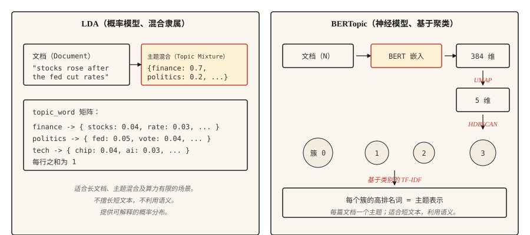

# 主题建模（Topic Modeling）：LDA 与 BERTopic

> LDA：文档是主题的混合，主题是词上的分布。BERTopic：文档在嵌入空间中聚类，簇就是主题。目标相同，分解方式不同。

**Type:** Learn
**Languages:** Python
**Prerequisites:** 阶段 5 · 02（词袋 BoW + TF-IDF）、阶段 5 · 03（Word2Vec）
**Time:** 约 45 分钟

## 问题（The Problem）

你有 10,000 条客服工单、50,000 篇新闻，或 200,000 条推文。你需要在不逐一阅读的情况下了解这批内容在谈什么。你没有标注好的类别，甚至不知道有多少类别。

主题建模（Topic Modeling）无需监督就能回答这个问题。输入语料库，得到一小组连贯的主题，以及每篇文档在这些主题上的分布。

两类算法占据主流。LDA（2003）把每篇文档视为潜在主题的混合，把每个主题视为词上的分布，通过贝叶斯方法推断。在需要混合隶属的主题分配和可解释的词级概率分布时，它仍用于生产环境。

BERTopic（2020）用 BERT 编码文档，用 UMAP 降维，用 HDBSCAN 聚类，再通过基于类别的 TF-IDF 提取主题词。对于短文本、社交媒体，以及语义相似性比词重叠更重要的场景，它更有优势。一篇文档只分配一个主题，这对长篇内容是个限制。

本课建立对两者的直观理解，并说明针对给定语料库应选择哪一种。

## 概念（The Concept）



**LDA 的生成过程（Generative Story）。**每个主题是词上的分布，每篇文档是主题的混合。生成文档中的一个词时，先从文档的混合分布中采样一个主题，再从该主题的分布中采样一个词。推断则反过来：根据观测到的词，推断每篇文档的主题分布和每个主题的词分布。数学计算通过折叠吉布斯采样（Collapsed Gibbs Sampling）或变分贝叶斯（Variational Bayes）完成。

LDA 的关键输出：

- `doc_topic`：形状为 `(n_docs, n_topics)` 的矩阵，每行之和为 1，表示文档的主题混合。
- `topic_word`：形状为 `(n_topics, vocab_size)` 的矩阵，每行之和为 1，表示主题的词分布。

**BERTopic 流水线（Pipeline）。**

1. 用句子 Transformer（Sentence Transformer，例如 `all-MiniLM-L6-v2`）编码每篇文档，得到 384 维向量。
2. 用 UMAP 降到约 5 维。BERT 嵌入维度过高，不适合直接聚类。
3. 用 HDBSCAN 聚类。这是基于密度的方法，会产生大小不一的簇和一个“离群点”标签。
4. 对每个簇的文档计算基于类别的 TF-IDF，提取排名靠前的词。

输出为每篇文档的一个主题，另有 -1 离群点标签。也可以通过 HDBSCAN 的概率向量获得软隶属关系（Soft Membership）。

```figure
topic-drift
```

## 动手实现（Build It）

### 步骤 1：通过 scikit-learn 使用 LDA

```python
from sklearn.feature_extraction.text import CountVectorizer
from sklearn.decomposition import LatentDirichletAllocation
import numpy as np


def fit_lda(documents, n_topics=5, max_features=1000):
    cv = CountVectorizer(
        max_features=max_features,
        stop_words="english",
        min_df=2,
        max_df=0.9,
    )
    X = cv.fit_transform(documents)
    lda = LatentDirichletAllocation(
        n_components=n_topics,
        random_state=42,
        max_iter=50,
        learning_method="online",
    )
    doc_topic = lda.fit_transform(X)
    feature_names = cv.get_feature_names_out()
    return lda, cv, doc_topic, feature_names


def print_top_words(lda, feature_names, n_top=10):
    for idx, topic in enumerate(lda.components_):
        top_idx = np.argsort(-topic)[:n_top]
        words = [feature_names[i] for i in top_idx]
        print(f"topic {idx}: {' '.join(words)}")
```

注意：这里移除了停用词，min_df 和 max_df 过滤稀有词和无处不在的词；使用 CountVectorizer 而非 TfidfVectorizer，因为 LDA 需要原始计数。

### 步骤 2：BERTopic（生产环境）

```python
from bertopic import BERTopic

topic_model = BERTopic(
    embedding_model="sentence-transformers/all-MiniLM-L6-v2",
    min_topic_size=15,
    verbose=True,
)

topics, probs = topic_model.fit_transform(documents)
info = topic_model.get_topic_info()
print(info.head(20))
valid_topics = info[info["Topic"] != -1]["Topic"].tolist()
for topic_id in valid_topics[:5]:
    print(f"topic {topic_id}: {topic_model.get_topic(topic_id)[:10]}")
```

筛选条件 `Topic != -1` 会去掉 BERTopic 的离群点桶，即 HDBSCAN 无法聚类的文档。`min_topic_size` 控制 HDBSCAN 的最小簇大小；BERTopic 库的默认值为 10。本例根据课程规模显式设为 15。对于超过 10,000 篇文档的语料库，将其提高到 50 或 100。

### 步骤 3：评估（Evaluation）

两种方法都输出主题词。问题是这些词是否连贯。

- **主题一致性（Topic Coherence，c_v）。**在滑动窗口上下文中，结合排名靠前的词对之间的归一化点互信息（Normalized Pointwise Mutual Information，NPMI），将分数聚合成主题向量，再通过余弦相似度比较向量。越高越好。使用 `gensim.models.CoherenceModel` 并设置 `coherence="c_v"`。
- **主题多样性（Topic Diversity）。**所有主题的高排名词中不重复词所占的比例。越高越好，表示主题不重叠。
- **定性检查（Qualitative Inspection）。**阅读每个主题的高排名词。它们能指向真实事物吗？人工判断仍是最后一道防线。

## 如何选择（When to Pick Which）

| 场景 | 选择 |
|-----------|------|
| 短文本（推文、评论、标题） | BERTopic |
| 包含混合主题的长文档 | LDA |
| 没有 GPU / 算力有限 | LDA 或 NMF |
| 需要文档级多主题分布 | LDA |
| 通过 LLM 集成实现主题命名 | BERTopic（直接支持） |
| 资源受限的边缘部署 | LDA |
| 追求最高语义一致性 | BERTopic |

实际最重要的考虑因素是文档长度。BERT 嵌入会截断输入；LDA 的计数适用于任意长度。文档超过嵌入模型上下文长度时，要么分块后聚合，要么使用 LDA。

## 实际应用（Use It）

2026 年的技术栈：

- **BERTopic。**短文本及重视语义的场景的默认选择。
- **`gensim.models.LdaModel`。**用于生产环境的经典 LDA，成熟且久经验证。
- **`sklearn.decomposition.LatentDirichletAllocation`。**便于实验的 LDA 实现。
- **NMF。**非负矩阵分解（Non-negative Matrix Factorization）。速度快，是 LDA 的替代方案，在短文本上质量相当。
- **Top2Vec。**设计与 BERTopic 类似。社区较小，但在部分基准上表现不错。
- **FASTopic。**较新的方法，在超大规模语料库上比 BERTopic 更快。
- **基于 LLM 的命名（LLM-Based Labeling）。**先运行任意聚类算法，再提示模型为每个簇命名。

## 交付成果（Ship It）

保存为 `outputs/skill-topic-picker.md`：

```markdown
---
name: topic-picker
description: 为语料库选择 LDA 或 BERTopic，指定库、调节参数与评估方式。
version: 1.0.0
phase: 5
lesson: 15
tags: [nlp, topic-modeling]
---

给定语料库描述（文档数量、平均长度、领域、语言、算力预算），输出：

1. 算法（Algorithm）。LDA / NMF / BERTopic / Top2Vec / FASTopic。用一句话说明理由。
2. 配置（Configuration）。主题数：`recommended = max(5, round(sqrt(n_docs)))`；语料库不足 40,000 篇文档时，将上限限定为 200；仅在语料库确实很大（超过 40k）时允许超过 200，并注明增加的计算成本。还应包含 `min_df` / `max_df` 过滤条件，以及神经方法采用的嵌入模型。
3. 评估（Evaluation）。通过 `gensim.models.CoherenceModel` 计算主题一致性（c_v），评估主题多样性，并人工阅读 20 个样本。
4. 要探查的失败模式（Failure Mode）。对于 LDA，是吸收停用词和高频词的“垃圾主题”；对于 BERTopic，是吞入含糊文档的 -1 离群点簇。

文档超过嵌入模型上下文窗口且没有分块策略时，拒绝使用 BERTopic。对于极短文本（推文、少于 10 个词元的评论），拒绝使用 LDA，因为一致性会崩溃。主题数 n_topics 小于 5 时，应提示该选择很可能不正确；在不足 40k 篇文档的语料库上超过 200 时，应提示可能存在过度拆分。
```

## 练习（Exercises）

1. **简单。**在 20 Newsgroups 数据集上拟合具有 5 个主题的 LDA。打印每个主题的前 10 个词，手动为主题命名。算法找到真实类别了吗？
2. **中等。**在同一个 20 Newsgroups 子集上拟合 BERTopic。与 LDA 比较找到的主题数、高排名词和定性一致性。哪种方法能更清晰地呈现真实类别？
3. **困难。**在你的语料库上计算 LDA 和 BERTopic 的 c_v 一致性。分别使用 5、10、20、50 个主题运行，绘制一致性随主题数变化的曲线。报告哪种方法在不同主题数下更稳定。

## 关键术语（Key Terms）

| 术语 | 常见说法 | 实际含义 |
|------|-----------------|-----------------------|
| 主题（Topic） | 语料库所讨论的事物 | 词上的概率分布（LDA），或相似文档的簇（BERTopic）。 |
| 混合隶属（Mixed Membership） | 文档有多个主题 | LDA 为每篇文档分配一个覆盖所有主题的分布。 |
| UMAP | 降维 | 保留局部结构的流形学习（Manifold Learning），用于 BERTopic。 |
| HDBSCAN | 密度聚类 | 寻找大小不一的簇；为离群点生成“噪声”标签（-1）。 |
| c_v 一致性（c_v Coherence） | 主题质量指标 | 滑动窗口内主题高排名词的平均点互信息。 |

## 延伸阅读（Further Reading）

- [Blei、Ng、Jordan（2003）：潜在狄利克雷分配（Latent Dirichlet Allocation）](https://www.jmlr.org/papers/volume3/blei03a/blei03a.pdf)：LDA 论文。
- [Grootendorst（2022）：BERTopic：基于类别 TF-IDF 的神经主题建模（BERTopic: Neural topic modeling with a class-based TF-IDF procedure）](https://arxiv.org/abs/2203.05794)：BERTopic 论文。
- [Röder、Both、Hinneburg（2015）：探索主题一致性度量的空间（Exploring the Space of Topic Coherence Measures）](https://svn.aksw.org/papers/2015/WSDM_Topic_Evaluation/public.pdf)：提出 c_v 等指标的论文。
- [BERTopic 文档](https://maartengr.github.io/BERTopic/)：生产环境参考资料，包含优秀示例。
