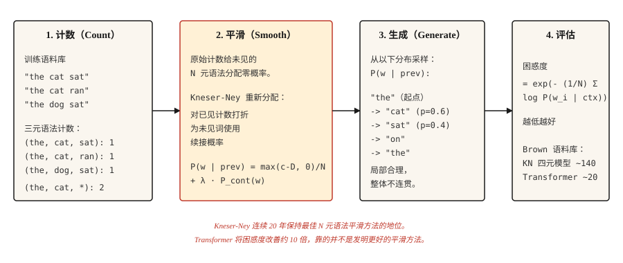

# Transformer 之前的文本生成：N 元语法语言模型（Text Generation Before Transformers — N-gram Language Models）

> 一个词让模型意外，说明模型不够好。困惑度将意外程度量化，平滑让它保持有限。

**Type:** Build
**Languages:** Python
**Prerequisites:** 阶段 5 · 01（文本处理 Text Processing）、阶段 2 · 14（朴素贝叶斯 Naive Bayes）
**Time:** 约 45 分钟

## 问题（The Problem）

在 Transformer、RNN 和词嵌入出现之前，语言模型通过统计一个词接在前 `n-1` 个词后面的频率来预测下一个词。统计发现，“the cat” → “sat” 出现 47 次，“the cat” → “jumped” 出现 12 次，“the cat” → “refrigerator” 出现 0 次。归一化后便得到概率分布。

这就是 N 元语法语言模型（N-gram Language Model）。从 1980 年到 2015 年，它支撑了所有语音识别器、拼写检查器和基于短语的机器翻译系统。在需要低成本的端侧语言建模时，它至今仍在使用。

有趣的问题在于如何处理未见过的 N 元语法。原始计数模型给任何未见过的序列分配零概率，这会造成灾难性后果：句子很长，几乎每个长句都至少包含一个未见序列。五十年的平滑研究解决了这个问题，Kneser-Ney 平滑就是成果，现代深度学习也继承了它的实证传统。

## 概念（The Concept）



### 预测游戏（The Prediction Game）

在这些机制出现之前，一项实验已经定义了什么是语言模型。遮住英语句子的下一个字母，让人逐次猜测，直到猜对，并记录猜测次数。对数百个字母重复这一过程。

猜测次数并非无关紧要的细节。它们是文本的无损重新编码：把次数序列交给另一个完全相同的猜测者，对方就能重建每个字母，因为在每个位置上都确切知道猜测顺序。能用更少符号重新编码的消息，每个符号携带的信息更少，因此猜测次数的统计给出了英语熵的上限。

Shannon 在 1951 年进行了这项实验，得到一个至今仍影响该领域的数值。包含 27 个符号的字母表（26 个字母加空格）最多可携带每字母 `log2(27) ≈ 4.75` 比特的信息。有 100 个字母上下文的人类猜测者，结果介于每字母 0.6 到 1.3 比特之间。英语约有四分之三的选择是被上下文限定的。在任何模型有能力学习语言结构之前，这种结构就已被测量。

此后的每个语言模型都是这个游戏的机械玩家，本课中的每个评估数值都是它的游戏得分：

- **交叉熵损失（Cross-Entropy Loss）**是模型编码每个符号所需的平均比特数。训练语言模型，实际上就是最小化它在猜测游戏中的得分。
- **困惑度（Perplexity）**是 `2^bits`（或 `e^nats`），表示模型完成猜测后仍面对的分支因子。在 27 个符号上均匀猜测时，困惑度为 27；每字母需 1 比特的玩家，困惑度为 2。
- **上下文长度就是玩家的记忆。**三元语法模型的记忆只有两个词元，Transformer 用 100K 个词元的记忆玩同一个游戏。规则从未改变，只是玩家变强了。

注意单位的变化：这个游戏按字母以比特（`log2`）计分，而下文的 N 元语法公式按词级词元以奈特（Nats，自然对数）计分。由于以奈特计算的困惑度 `e^H` 等于以比特计算的 `2^H`，两种视角是同一个测量，只是单位不同。

```figure
prediction-game
```

**N 元语法概率（N-gram Probability）：**`P(w_i | w_{i-n+1}, ..., w_{i-1})`。固定 `n`，通常三元语法取 3，四元语法取 4，根据计数计算：

```text
P(w | context) = count(context, w) / count(context)
```

**零计数问题（Zero-Count Problem）。**训练中没有见过的 N 元语法都会得到零概率。2007 年一项针对 Brown 语料库的研究发现，即使使用四元语法模型，留出数据中仍有 30% 的四元语法未在训练中出现。不做平滑，就无法在任何真实文本上评估。

**按复杂程度递增的平滑方法（Smoothing）：**

1. **拉普拉斯平滑（Laplace，加一）。**给每个计数加 1。简单，但对罕见事件效果很差。
2. **Good-Turing。**根据频率的频率，把概率质量从高频事件重新分配给未见事件。
3. **插值（Interpolation）。**用可调权重组合 N 元语法、(N-1) 元语法等估计值。
4. **回退（Backoff）。**如果 N 元语法计数为零，就退回 (N-1) 元语法。Katz 回退会对此进行归一化。
5. **绝对折扣（Absolute Discounting）。**从所有计数中减去固定折扣 `D`，把释放的概率质量重新分配给未见事件。
6. **Kneser-Ney。**绝对折扣，加上对低阶模型的巧妙选择：使用*续接概率（Continuation Probability）*，即一个词出现在多少种上下文中，而不是原始频率。

Kneser-Ney 的洞见很深刻。“San Francisco” 是常见的二元语法。单词 “Francisco” 主要出现在 “San” 之后。朴素绝对折扣会给 “Francisco” 很高的一元概率，因为其计数很高。Kneser-Ney 注意到 “Francisco” 只出现在一种上下文中，因此降低其续接概率。结果是：以 “Francisco” 结尾的新二元语法会得到适当的低概率。

**评估：困惑度（Perplexity）。**在留出的测试集上，计算每个词的平均负对数似然，再取指数。越低越好。困惑度为 100，意味着模型的困惑程度相当于在 100 个词之间均匀选择。

```text
perplexity = exp(- (1/N) * Σ log P(w_i | context_i))
```

```figure
ngram-backoff
```

## 动手实现（Build It）

### 步骤 1：三元语法计数（Trigram Counts）

```python
from collections import Counter, defaultdict


def train_ngram(corpus_tokens, n=3):
    ngrams = Counter()
    contexts = Counter()
    for sentence in corpus_tokens:
        padded = ["<s>"] * (n - 1) + sentence + ["</s>"]
        for i in range(len(padded) - n + 1):
            ctx = tuple(padded[i:i + n - 1])
            word = padded[i + n - 1]
            ngrams[ctx + (word,)] += 1
            contexts[ctx] += 1
    return ngrams, contexts


def raw_probability(ngrams, contexts, context, word):
    ctx = tuple(context)
    if contexts.get(ctx, 0) == 0:
        return 0.0
    return ngrams.get(ctx + (word,), 0) / contexts[ctx]
```

输入是分词后的句子列表，输出是 N 元语法计数和上下文计数。`<s>` 和 `</s>` 是句子边界。

### 步骤 2：拉普拉斯平滑（Laplace Smoothing）

```python
def laplace_probability(ngrams, contexts, vocab_size, context, word):
    ctx = tuple(context)
    numerator = ngrams.get(ctx + (word,), 0) + 1
    denominator = contexts.get(ctx, 0) + vocab_size
    return numerator / denominator
```

给每个计数加 1。虽然实现了平滑，但分配给未见事件的概率质量过多，也会损害已知但罕见的事件。

### 步骤 3：Kneser-Ney（二元语法、插值形式）

```python
def kneser_ney_bigram_model(corpus_tokens, discount=0.75):
    unigrams = Counter()
    bigrams = Counter()
    unigram_contexts = defaultdict(set)

    for sentence in corpus_tokens:
        padded = ["<s>"] + sentence + ["</s>"]
        for i, w in enumerate(padded):
            unigrams[w] += 1
            if i > 0:
                prev = padded[i - 1]
                bigrams[(prev, w)] += 1
                unigram_contexts[w].add(prev)

    total_unique_bigrams = sum(len(ctx_set) for ctx_set in unigram_contexts.values())
    continuation_prob = {
        w: len(ctx_set) / total_unique_bigrams for w, ctx_set in unigram_contexts.items()
    }

    context_totals = Counter()
    for (prev, w), count in bigrams.items():
        context_totals[prev] += count

    unique_follow = defaultdict(set)
    for (prev, w) in bigrams:
        unique_follow[prev].add(w)

    def prob(prev, w):
        count = bigrams.get((prev, w), 0)
        denom = context_totals.get(prev, 0)
        if denom == 0:
            return continuation_prob.get(w, 1e-9)
        first_term = max(count - discount, 0) / denom
        lambda_prev = discount * len(unique_follow[prev]) / denom
        return first_term + lambda_prev * continuation_prob.get(w, 1e-9)

    return prob
```

这里有三个组成部分。`continuation_prob` 捕获“这个词出现在多少种不同上下文中”，这是 Kneser-Ney 的创新。`lambda_prev` 是折扣释放的概率质量，用于加权回退项。最终概率等于折扣后的主项加上加权续接项。

### 步骤 4：通过采样生成文本（Sampling）

```python
import random


def generate(prob_fn, vocab, prefix, max_len=30, seed=0):
    rng = random.Random(seed)
    tokens = list(prefix)
    for _ in range(max_len):
        candidates = [(w, prob_fn(tokens[-1], w)) for w in vocab]
        total = sum(p for _, p in candidates)
        r = rng.random() * total
        acc = 0.0
        for w, p in candidates:
            acc += p
            if r <= acc:
                tokens.append(w)
                break
        if tokens[-1] == "</s>":
            break
    return tokens
```

按概率比例采样，不同种子总会得到不同输出。要获得类似束搜索（Beam Search）的输出，可以每步选择 argmax（贪心），再加入一个小的随机性调节参数，即温度（Temperature）。

### 步骤 5：困惑度（Perplexity）

```python
import math


def perplexity(prob_fn, sentences):
    total_log_prob = 0.0
    total_tokens = 0
    for sentence in sentences:
        padded = ["<s>"] + sentence + ["</s>"]
        for i in range(1, len(padded)):
            p = prob_fn(padded[i - 1], padded[i])
            total_log_prob += math.log(max(p, 1e-12))
            total_tokens += 1
    return math.exp(-total_log_prob / total_tokens)
```

越低越好。在 Brown 语料库上，调优良好的四元 KN 模型困惑度约为 140。Transformer 语言模型在相同测试集上可达到 15–30。差距约为 10 倍，这就是领域转向新方法的原因。

## 实际应用（Use It）

- **经典 NLP 教学。**这是理解平滑、最大似然估计（MLE）和困惑度最清晰的途径。
- **KenLM。**生产级 N 元语法库，在重视低延迟的语音和机器翻译系统中充当重评分器（Rescorer）。
- **端侧自动补全（On-Device Autocomplete）。**键盘中的三元语法模型，至今如此。
- **基线（Baselines）。**在宣称神经语言模型表现良好之前，总要先计算 N 元语法语言模型的困惑度。如果 Transformer 没有大幅优于 KN，就说明出了问题。

## 交付成果（Ship It）

保存为 `outputs/prompt-lm-baseline.md`：

```markdown
---
name: lm-baseline
description: 在训练神经语言模型之前，构建可复现的 N 元语法语言模型基线。
phase: 5
lesson: 16
---

给定语料库和目标用途（预测下一个词、重评分、困惑度基线），输出：

1. N 元语法阶数（N-gram Order）。普通英语使用三元语法，语料库很大时使用四元语法，语音重评分使用五元语法。
2. 平滑（Smoothing）。默认使用改进 Kneser-Ney；拉普拉斯平滑仅用于教学。
3. 库（Library）。生产环境使用 `kenlm`，教学使用 `nltk.lm`，只有为了学习才自己实现。
4. 评估（Evaluation）。报告留出集困惑度，训练集与测试集保持一致的分词方式。

拒绝报告所比较系统使用不同分词方式计算出的困惑度：只有在分词完全相同时，困惑度数值才可比较。标注测试集的词表外词（OOV）比例；除非训练时预留特殊的 <UNK> 词元，否则 KN 对 OOV 的处理效果很差。
```

## 练习（Exercises）

1. **简单。**在包含 1,000 个句子的 Shakespeare 语料库上训练三元语法语言模型，生成 20 个句子。它们会局部合理、整体不连贯。这是经典演示。
2. **中等。**在留出的 Shakespeare 数据划分上，为 KN 模型实现困惑度计算，并与拉普拉斯平滑比较。你应当看到 KN 将困惑度降低 30–50%。
3. **困难。**构建三元语法拼写纠错器：给定拼错的词及其上下文，生成修正候选，按语言模型中的上下文概率排序。在公开的 Birkbeck 拼写语料库上评估。

## 关键术语（Key Terms）

| 术语 | 常见说法 | 实际含义 |
|------|-----------------|-----------------------|
| N 元语法（N-gram） | 词序列 | 连续 `n` 个词元组成的序列。 |
| 平滑（Smoothing） | 避免零概率 | 重新分配概率质量，使未见事件获得非零概率。 |
| 困惑度（Perplexity） | 语言模型质量指标 | 在留出数据上计算 `exp(-average log-prob)`，越低越好。 |
| 回退（Backoff） | 退回较短上下文 | 三元语法计数为零时，使用二元语法。Katz 回退将其形式化。 |
| Kneser-Ney | 最好的 N 元语法平滑方法 | 绝对折扣加上用于低阶模型的续接概率。 |
| 续接概率（Continuation Probability） | KN 特有 | `P(w)` 按 `w` 出现的上下文数量加权，而不是按原始计数加权。 |
| 文本熵（Entropy of Text） | 每个符号的信息量 | 给定上下文，编码下一个符号所需的平均比特数。Shannon 在 1951 年对印刷英语的估计，使用最多 100 个字母的上下文，得到每字母 0.6–1.3 比特；这一测量早于任何模型。 |

## 延伸阅读（Further Reading）

- [Shannon（1951）：印刷英语的预测与熵（Prediction and Entropy of Printed English）](https://www.princeton.edu/~wbialek/rome/refs/shannon_51.pdf)：猜测游戏实验，定义了所有语言模型至今仍在优化的目标。
- [Jurafsky 与 Martin：《语音与语言处理》（Speech and Language Processing）第 3 章，2026 年草稿](https://web.stanford.edu/~jurafsky/slp3/3.pdf)：N 元语法语言模型与平滑方法的经典讲解。
- [Chen 与 Goodman（1998）：语言建模平滑技术的实证研究（An Empirical Study of Smoothing Techniques for Language Modeling）](https://dash.harvard.edu/handle/1/25104739)：确立 Kneser-Ney 为最佳 N 元语法平滑方法的论文。
- [Kneser 与 Ney（1995）：M 元语法语言建模的改进回退方法（Improved Backing-off for M-gram Language Modeling）](https://ieeexplore.ieee.org/document/479394)：原始 KN 论文。
- [KenLM](https://kheafield.com/code/kenlm/)：快速的生产级 N 元语法语言模型，2026 年仍用于延迟敏感应用。
