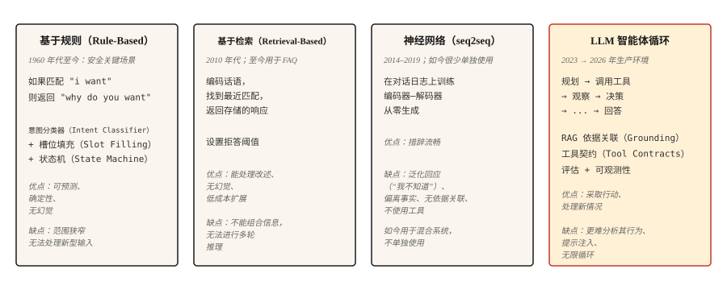

# 聊天机器人：从规则到神经网络，再到 LLM 智能体（Chatbots — Rule-Based to Neural to LLM Agents）

> ELIZA 用模式匹配回应。DialogFlow 映射意图。GPT 从权重中回答。Claude 运行工具并验证。每个时代都解决了上一代最严重的失败。

**Type:** Learn
**Languages:** Python
**Prerequisites:** 阶段 5 · 13（问答 Question Answering）、阶段 5 · 14（信息检索 Information Retrieval）
**Time:** 约 75 分钟

## 问题（The Problem）

用户说：“我想改签航班。”系统必须弄清用户想做什么、缺少哪些信息、如何获得信息，以及如何完成操作。接着用户说：“等等，如果我改成取消呢？”系统必须记住上下文、切换任务，并保留状态。

对机器学习系统而言，对话很难。输入是开放式的，输出必须跨多轮保持连贯，系统还可能需要对现实世界采取行动，例如改签航班或扣款。每个错误步骤都直接暴露给用户。

聊天机器人架构经历了四种范式，每种新范式的出现都是因为上一种的失败太明显。本课按顺序介绍它们。2026 年的生产环境主要混合使用最后两种。

## 概念（The Concept）



### 脚本主导的半个世纪，1950–2001（The Scripted Half-Century）

第一种范式持续的不是五年，而是五十年。理解它的发展轨迹很重要，因为其中每个系统都是同一台机器：匹配输入、输出预设响应、更新少量状态。给这台机器添加了五十年规则，也始终没能得到通用方案。正是这个上限催生了第二到第四种范式。

**1950 年。**Turing 绕开“机器能思考吗”，提出一个可操作的替代问题：如果提问者通过电传打字无法区分机器和人，哲学问题便失去意义。在这个领域还没有名字之前，对话就已成为它的基准。

**1956 年。**名字出现了：Dartmouth 的夏季研讨会提出“人工智能”（Artificial Intelligence），其猜想是智能的每个特征“原则上都可以被精确描述，从而让机器模拟它”。提案计划用两个月取得实质进展。

**1966 年。**ELIZA 实现了你将在步骤 1 中构建的反射技巧：分解规则从输入提取片段，重组规则将片段作为问题回应。总共约 200 个模式，没有状态，没有理解，但用户依然向它倾诉。如此少的机制就能产生这种效果，令 Weizenbaum 在余下职业生涯中始终忧虑。

**1972 年。**Stanford 开发 PARRY 来模拟偏执，它补上了 ELIZA 缺少的部分：内部状态。恐惧、愤怒和不信任的数值变量每轮更新，并控制接下来触发哪个脚本，因此相同输入会根据之前的对话产生不同响应。在对话记录盲测中，精神科医生区分 PARRY 和真实患者的表现与随机猜测相当。它是角色条件控制（Persona Conditioning）的直接祖先，相当于用三个浮点数实现系统提示词。同年，两个机器人通过 ARPANET 互相对话：治疗师脚本访谈偏执状态机，构成了网络上的第一次机器人间对话。

**1995 年。**ALICE 通过 AIML 扩大了 ELIZA 配方的规模。AIML 是用于模式与模板配对的 XML 方言。约 40,000 个手写类别带来了三次 Loebner Prize 冠军。它证明了规则系统的扩展规律：更多规则能扩大覆盖面，却不能带来通用性。每条规则都是需要有人维护的负担。

**2001 年。**SmarterChild 将这套配方带给 3,000 万即时通讯用户，并加入后端查询，将天气、股票、电影场次等结果拼接进模板。仔细看，它就是穿着 2001 年外衣的工具调用：解析意图、调用服务、将结果呈现在回复中。

五十年，同一种机制，不断增加的规则数量。这个范式结束，并不是因为有人证伪了它，而是因为手写状态机的维护成本随覆盖面线性增长，用户预期却随上周见过的新产品增长。

```figure
chatbot-lineage
```

**基于规则（Rule-Based：ELIZA、AIML、DialogFlow）。**手工编写的模式匹配用户输入并生成响应。意图分类器将请求路由到预定义流程，槽位填充状态机收集必要信息。在设计好的狭窄范围内表现出色，一旦超出范围就立即失败。它仍用于不能容忍幻觉的安全关键领域，例如银行身份验证和机票预订。

**基于检索（Retrieval-Based）。**类似 FAQ 的系统，对每组话语与响应进行编码。运行时编码用户消息，检索最接近的已存响应。可将其理解为 Zendesk 经典的“相似文章”功能。它比规则更善于处理改述，不生成新内容，因此没有幻觉。

**神经网络（Neural，seq2seq）。**在对话日志上训练编码器—解码器，从零生成回复。语言流畅，但容易给出“我不知道”一类泛化回应，并偏离事实，无法稳定围绕主题。这正是 Google、Facebook 和 Microsoft 在 2016–2019 年的聊天机器人都令人失望的原因。

**LLM 智能体（LLM Agents）。**将语言模型置于规划、工具调用和结果验证的循环中。它并非带着长提示词的聊天机器人，而是智能体循环：规划 → 调用工具 → 观察结果 → 决定下一步。检索优先的依据关联（Grounding，RAG）防止幻觉，工具调用让它真正做事。这就是 2026 年的架构。

四种范式不是依次替代的关系。2026 年的生产聊天机器人会在四者之间路由：身份验证与破坏性操作采用规则，FAQ 采用检索，自然措辞采用神经生成，含糊的开放式请求采用 LLM 智能体。

## 动手实现（Build It）

### 步骤 1：基于规则的模式匹配（Pattern Matching）

```python
import re


class RulePattern:
    def __init__(self, pattern, response_template):
        self.regex = re.compile(pattern, re.IGNORECASE)
        self.template = response_template


PATTERNS = [
    RulePattern(r"my name is (\w+)", "Nice to meet you, {0}."),
    RulePattern(r"i (need|want) (.+)", "Why do you {0} {1}?"),
    RulePattern(r"i feel (.+)", "Why do you feel {0}?"),
    RulePattern(r"(.*)", "Tell me more about that."),
]


def rule_based_respond(user_input):
    for pattern in PATTERNS:
        m = pattern.regex.match(user_input.strip())
        if m:
            return pattern.template.format(*m.groups())
    return "I don't understand."
```

20 行代码实现 ELIZA。反射技巧，例如“我感到难过” → “你为什么感到难过”，就是 Weizenbaum 在 1966 年的经典心理治疗师演示，至今仍有教学价值。

### 步骤 2：基于检索（FAQ）

这个演示片段需要 `pip install sentence-transformers`，它会引入 torch。本课可运行的 `code/main.py` 改用标准库实现的 Jaccard 相似度，因此课程可以不依赖外部库运行。

```python
from sentence_transformers import SentenceTransformer
import numpy as np


FAQ = [
    ("how do i reset my password", "Go to Settings > Security > Reset Password."),
    ("how do i cancel my order", "Go to Orders, find the order, click Cancel."),
    ("what is your return policy", "30-day returns on unused items, original packaging."),
]


encoder = SentenceTransformer("sentence-transformers/all-MiniLM-L6-v2")
faq_questions = [q for q, _ in FAQ]
faq_embeddings = encoder.encode(faq_questions, normalize_embeddings=True)


def faq_respond(user_input, threshold=0.5):
    q_emb = encoder.encode([user_input], normalize_embeddings=True)[0]
    sims = faq_embeddings @ q_emb
    best = int(np.argmax(sims))
    if sims[best] < threshold:
        return None
    return FAQ[best][1]
```

基于阈值的拒答是关键设计选择。如果最佳匹配不够接近，返回 `None`，交由系统升级处理。

### 步骤 3：神经生成（Neural Generation）基线

使用小型指令微调编码器—解码器（FLAN-T5），或经过微调的对话模型。2026 年，它们单独使用无法满足生产要求，会出现矛盾、跑题和事实错误，但仍作为混合系统中的自然措辞组件上线。DialoGPT 风格的仅解码器模型需要显式轮次分隔符和 EOS 处理才能生成连贯回复；FLAN-T5 的 text2text 流水线则适合作为开箱即用的教学示例。

```python
from transformers import pipeline

chatbot = pipeline("text2text-generation", model="google/flan-t5-small")

response = chatbot("Respond politely to: Hi there!", max_new_tokens=40)
print(response[0]["generated_text"])
```

### 步骤 4：LLM 智能体循环（Agent Loop）

2026 年生产环境中的形态：

```python
def agent_loop(user_message, tools, llm, max_steps=5):
    history = [{"role": "user", "content": user_message}]
    for _ in range(max_steps):
        response = llm(history, tools=tools)
        tool_call = response.get("tool_call")
        if tool_call:
            tool_name = tool_call.get("name")
            args = tool_call.get("arguments")
            if not isinstance(tool_name, str) or tool_name not in tools:
                history.append({"role": "assistant", "tool_call": tool_call})
                history.append({"role": "tool", "name": str(tool_name), "content": f"error: unknown tool {tool_name!r}"})
                continue
            if not isinstance(args, dict):
                history.append({"role": "assistant", "tool_call": tool_call})
                history.append({"role": "tool", "name": tool_name, "content": f"error: arguments must be a dict, got {type(args).__name__}"})
                continue
            fn = tools[tool_name]
            result = fn(**args)
            history.append({"role": "assistant", "tool_call": tool_call})
            history.append({"role": "tool", "name": tool_name, "content": result})
        else:
            return response["content"]
    return "I could not complete the task in the step budget."
```

需要明确三点：工具是 LLM 可以调用的函数；当 LLM 返回最终答案而非工具调用时，循环终止；步骤预算可以防止含糊任务导致无限循环。

实际生产还会加入：检索优先的依据关联，在每次 LLM 调用前注入相关文档；防护规则，无确认则拒绝破坏性操作；可观测性，记录每一步；以及评估，自动检查智能体行为是否符合规范。

### 步骤 5：混合路由（Hybrid Routing）

```python
def hybrid_chat(user_input):
    if is_destructive_action(user_input):
        return structured_flow(user_input)

    faq_answer = faq_respond(user_input, threshold=0.6)
    if faq_answer:
        return faq_answer

    return agent_loop(user_input, tools, llm)


def is_destructive_action(text):
    danger_words = ["delete", "cancel", "charge", "refund", "transfer"]
    return any(w in text.lower() for w in danger_words)
```

模式是：破坏性操作使用确定性规则，预设 FAQ 使用检索，其余使用 LLM 智能体。这就是 2026 年客服系统上线的方案。

## 实际应用（Use It）

2026 年的技术栈：

| 用例 | 架构 |
|---------|---------------|
| 预订、支付、身份验证 | 规则状态机 + 槽位填充 |
| 客服 FAQ | 检索经过整理的答案 |
| 开放式帮助对话 | 采用 RAG + 工具调用的 LLM 智能体 |
| 内部工具 / IDE 助手 | 具备搜索、读取、写入工具调用的 LLM 智能体 |
| 陪伴 / 角色聊天机器人 | 使用角色系统提示词调优的 LLM，加上知识检索 |

生产环境始终采用混合路由。没有单一架构能处理好所有请求。路由层本身通常是小型意图分类器。

## 生产中仍存在的失败模式（Failure Modes That Still Ship）

- **自信地编造（Confident Fabrication）。**LLM 智能体声称完成了实际未完成的操作。缓解方法：验证结果、记录工具调用，没有成功的工具返回就不允许 LLM 声称已完成操作。
- **提示注入（Prompt Injection）。**用户插入覆盖系统提示词的文本。在 OWASP 2025 年 LLM 应用十大风险中排名 LLM01。分为直接注入（粘贴到聊天中）和间接注入（隐藏在智能体读取的文档、邮件或工具输出中）。

  攻击成功率随场景变化。在通用工具使用和编程基准中，前沿模型的实测成功率约为 0.5–8.5%。特定高风险配置，例如针对 AI 编程智能体的自适应攻击或存在漏洞的编排方式，成功率曾达到约 84%。生产环境 CVE 包括 EchoLeak（CVE-2025-32711，CVSS 9.3）：Microsoft 365 Copilot 中由攻击者控制的邮件触发的零点击数据外泄漏洞。

  缓解方法：在整个循环中将用户输入视为不可信；工具调用前进行清理；将工具输出与主提示词隔离；采用规划—验证—执行（Plan-Verify-Execute，PVE）模式，智能体先规划，再将每个操作与计划核对后执行，阻止工具结果注入计划外的新操作；破坏性操作要求用户确认；工具权限范围遵循最小权限原则。

  再多提示工程也不能彻底消除此风险。必须配备外部运行时防御层，例如 LLM Guard、允许列表校验和语义异常检测。
- **范围蔓延（Scope Creep）。**工具返回了旁支相关信息，导致智能体偏离任务。缓解方法：收窄工具契约，保持系统提示词聚焦，并添加跑题率评估。
- **无限循环（Infinite Loops）。**智能体反复调用同一个工具。缓解方法：步骤预算、工具调用去重，以及通过 LLM 裁判判断“是否取得进展”。
- **上下文窗口耗尽（Context Window Exhaustion）。**长对话将最早的轮次挤出上下文。缓解方法：摘要旧轮次、按相似度检索相关历史轮次，或使用长上下文模型。

## 交付成果（Ship It）

保存为 `outputs/skill-chatbot-architect.md`：

```markdown
---
name: chatbot-architect
description: 为给定用例设计聊天机器人技术栈。
version: 1.0.0
phase: 5
lesson: 17
tags: [nlp, agents, chatbot]
---

给定产品背景（用户需求、合规约束、可用工具、数据量），输出：

1. 架构（Architecture）。规则、检索、神经网络、LLM 智能体或混合架构，说明各路径的去向。
2. 适用时选择 LLM。指出模型系列（Claude、GPT-4、Llama-3.1、Mixtral），匹配工具使用质量和成本要求。
3. 依据关联策略（Grounding Strategy）。RAG 数据源、检索方法（见第 14 课）、工具契约。
4. 评估计划（Evaluation Plan）。在留出对话上评估任务成功率、工具调用正确率、跑题率和幻觉率。

对于支付、账户删除、数据修改等破坏性操作，如果没有结构化确认流程，拒绝推荐纯 LLM 智能体。只要智能体对任何内容拥有写权限，就拒绝跳过提示注入审计。
```

## 练习（Exercises）

1. **简单。**实现上述规则响应，为咖啡店点单机器人编写 10 个模式。测试重复下单、修改、取消、意图不清等边界情况。
2. **中等。**构建 FAQ + LLM 回退的混合系统。为 SaaS 产品准备 50 条预设 FAQ，LLM 回退时检索文档站点。在 100 个真实客服问题上测量拒答率和准确率。
3. **困难。**实现上述智能体循环，提供搜索、read-user-data、send-email 三个工具。在包含提示注入尝试的 50 个测试场景上评估，报告跑题率、任务失败率及任何注入成功情况。

## 关键术语（Key Terms）

| 术语 | 常见说法 | 实际含义 |
|------|-----------------|-----------------------|
| 意图（Intent） | 用户想做什么 | 类别标签（book_flight、reset_password），被路由到处理器。 |
| 槽位（Slot） | 一项信息 | 机器人需要的参数，例如日期、目的地。槽位填充是依次询问的过程。 |
| RAG | 检索加生成 | 检索相关文档，再为 LLM 的响应提供依据。 |
| 工具调用（Tool Call） | 函数调用 | LLM 输出包含名称和参数的结构化调用，运行时执行并返回结果。 |
| 智能体循环（Agent Loop） | 规划、行动、验证 | 控制器交替运行 LLM 调用与工具调用，直到任务完成。 |
| 提示注入（Prompt Injection） | 用户攻击提示词 | 试图覆盖系统提示词的恶意输入。 |

## 延伸阅读（Further Reading）

- [Turing（1950）：计算机器与智能（Computing Machinery and Intelligence）](https://academic.oup.com/mind/article/LIX/236/433/986238)：将对话确立为领域基准的论文。
- [Weizenbaum（1966）：ELIZA：研究自然语言交流的计算机程序（ELIZA — A Computer Program For the Study of Natural Language Communication）](https://web.stanford.edu/class/cs124/p36-weizenabaum.pdf)：原始规则聊天机器人论文。
- [Colby、Weber、Hilf（1971）：人工偏执（Artificial Paranoia）](https://doi.org/10.1016/0004-3702(71)90002-6)：PARRY 的情绪变量架构，第一个有状态聊天机器人。
- [Thoppilan 等（2022）：LaMDA：面向对话应用的语言模型（LaMDA: Language Models for Dialog Applications）](https://arxiv.org/abs/2201.08239)：Google 在 LLM 智能体接管之前发表的后期神经聊天机器人论文。
- [Yao 等（2022）：ReAct：协同语言模型的推理与行动（ReAct: Synergizing Reasoning and Acting in Language Models）](https://arxiv.org/abs/2210.03629)：为智能体循环模式命名的论文。
- [Anthropic 的有效智能体构建指南](https://www.anthropic.com/research/building-effective-agents)：2024 年的生产指南，2026 年仍然适用。
- [Greshake 等（2023）：非你所愿：利用间接提示注入攻破真实 LLM 集成应用（Not what you've signed up for: Compromising Real-World LLM-Integrated Applications with Indirect Prompt Injection）](https://arxiv.org/abs/2302.12173)：提示注入论文。
- [OWASP 2025 年 LLM 应用十大风险：LLM01 提示注入](https://genai.owasp.org/llmrisk/llm01-prompt-injection/)：将提示注入列为首要安全问题的排名。
- [AWS：保护 Amazon Bedrock Agents 免受间接提示注入](https://aws.amazon.com/blogs/machine-learning/securing-amazon-bedrock-agents-a-guide-to-safeguarding-against-indirect-prompt-injections/)：实用的编排层防御，包括规划—验证—执行和用户确认流程。
- [EchoLeak（CVE-2025-32711）](https://www.vectra.ai/topics/prompt-injection)：间接提示注入导致零点击数据外泄的经典 CVE，说明具备写权限的智能体为什么需要运行时防御。
