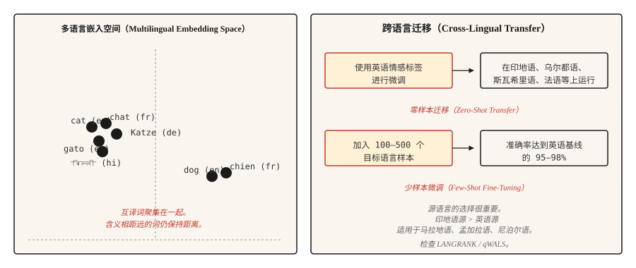

# 多语言自然语言处理（Multilingual NLP）

> 一个模型，100 多种语言，其中多数没有任务训练数据。跨语言迁移是 2020 年代的实用突破。

**Type:** Learn
**Languages:** Python
**Prerequisites:** 阶段 5 · 04（GloVe、FastText、子词 Subword）、阶段 5 · 11（机器翻译 Machine Translation）
**Time:** 约 45 分钟

## 问题（The Problem）

英语有数十亿个标注样本，乌尔都语只有数千个，迈蒂利语几乎没有。任何面向全球用户的实用 NLP 系统，都必须在缺少任务专用训练数据的长尾语言上运行。

多语言模型通过在多种语言上同时训练一个模型来解决这个问题。共享表示让模型将高资源语言中学到的能力迁移到低资源语言。在英语情感分析上微调后，模型开箱即用就能在乌尔都语上给出相当好的情感预测。这就是零样本跨语言迁移（Zero-Shot Cross-Lingual Transfer），它重塑了 NLP 服务全球用户的方式。

本课说明其中的权衡、经典模型，以及多语言新手团队容易失误的一项决策：选择迁移的源语言。

## 概念（The Concept）



**共享词表（Shared Vocabulary）。**多语言模型采用在所有目标语言文本上训练的 SentencePiece 或 WordPiece 分词器。词表是共享的：相同子词单元在相关语言中表示相同语素。英语和意大利语中的 `anti-` 会得到同一个词元。

**共享表示（Shared Representation）。**在多种语言的掩码语言建模任务上预训练的 Transformer，会学到不同语言中语义相近的句子应产生相似的隐藏状态。mBERT、XLM-R 和 NLLB 都表现出这种性质。英语 “cat” 的嵌入会聚集在法语 “chat” 和西班牙语 “gato” 附近，整句嵌入也是如此。

**零样本迁移（Zero-Shot Transfer）。**在一种语言（通常为英语）的标注数据上微调模型，推理时在模型支持的任意其他语言上运行，不需要目标语言标签。语言类型接近时效果较强，相距较远时较弱。

**少样本微调（Few-Shot Fine-Tuning）。**加入 100–500 个目标语言标注样本，分类任务准确率就能跃升到英语基线的 95–98%。这是多语言 NLP 中性价比最高的单项手段。

## 模型（The Models）

| 模型 | 年份 | 覆盖范围 | 说明 |
|-------|------|----------|-------|
| mBERT | 2018 | 104 种语言 | 在 Wikipedia 上训练。第一个实用多语言语言模型，对低资源语言较弱。 |
| XLM-R | 2019 | 100 种语言 | 在比 Wikipedia 大得多的 CommonCrawl 上训练，确立了跨语言基线。Base 为 270M，Large 为 550M。 |
| XLM-V | 2023 | 100 种语言 | 词表从 250k 扩展为 1M 词元的 XLM-R，对低资源语言更好。 |
| mT5 | 2020 | 101 种语言 | 用于多语言生成的 T5 架构。 |
| NLLB-200 | 2022 | 200 种语言 | Meta 的翻译模型，包含 55 种低资源语言。 |
| BLOOM | 2022 | 46 种自然语言 + 13 种编程语言 | 多语言训练的开放 176B LLM。 |
| Aya-23 | 2024 | 23 种语言 | Cohere 的多语言 LLM，擅长阿拉伯语、印地语和斯瓦希里语。 |

按用例选择。分类任务采用 XLM-R-base 作为合理默认值即可。生成任务根据翻译或开放生成的需求选择 mT5 或 NLLB。LLM 风格任务可搭配 Aya-23 或 Claude，并明确使用多语言提示。

## 源语言选择（The Source-Language Decision，2026 年研究）

多数团队默认使用英语作为微调源语言。近期研究（2026）表明，这往往不是正确选择。

语言相似性比原始语料库规模更能预测迁移质量。对于斯拉夫语族目标语言，德语或俄语通常优于英语；对于印度语支目标语言，印地语通常优于英语。**qWALS** 相似性指标（2026，基于《世界语言结构地图集》的特征）将其量化。**LANGRANK**（Lin 等，ACL 2019）则是独立且更早的方法，结合语言相似性、语料库规模和谱系关系，对候选源语言进行排序。

实用规则：如果目标语言存在类型接近的高资源亲缘语言，先尝试在该语言上微调，再与英语微调比较。

```figure
n5-crosslingual-bridge
```

## 动手实现（Build It）

### 步骤 1：零样本跨语言分类（Zero-Shot Cross-Lingual Classification）

```python
from transformers import AutoTokenizer, AutoModelForSequenceClassification
import torch

tok = AutoTokenizer.from_pretrained("joeddav/xlm-roberta-large-xnli")
model = AutoModelForSequenceClassification.from_pretrained("joeddav/xlm-roberta-large-xnli")


def classify(text, candidate_labels, hypothesis_template="This text is about {}."):
    scores = {}
    for label in candidate_labels:
        hypothesis = hypothesis_template.format(label)
        inputs = tok(text, hypothesis, return_tensors="pt", truncation=True)
        with torch.no_grad():
            logits = model(**inputs).logits[0]
        entail_score = torch.softmax(logits, dim=-1)[2].item()
        scores[label] = entail_score
    return dict(sorted(scores.items(), key=lambda x: -x[1]))


print(classify("I love this product!", ["positive", "negative", "neutral"]))
print(classify("मुझे यह उत्पाद पसंद है!", ["positive", "negative", "neutral"]))
print(classify("J'adore ce produit !", ["positive", "negative", "neutral"]))
```

一个模型，三种语言，相同 API。经过 NLI 数据训练的 XLM-R，通过蕴含技巧能很好地迁移到分类任务。

### 步骤 2：多语言嵌入空间（Multilingual Embedding Space）

```python
from sentence_transformers import SentenceTransformer
import numpy as np

model = SentenceTransformer("sentence-transformers/paraphrase-multilingual-MiniLM-L12-v2")

pairs = [
    ("The cat is sleeping.", "Le chat dort."),
    ("The cat is sleeping.", "El gato está durmiendo."),
    ("The cat is sleeping.", "Die Katze schläft."),
    ("The cat is sleeping.", "The dog is barking."),
]

for eng, other in pairs:
    emb_eng = model.encode([eng], normalize_embeddings=True)[0]
    emb_other = model.encode([other], normalize_embeddings=True)[0]
    sim = float(np.dot(emb_eng, emb_other))
    print(f"  {eng!r} <-> {other!r}: cos={sim:.3f}")
```

互译文本在嵌入空间中距离接近，不同含义的英语句子距离更远。这正是跨语言检索、聚类和相似性计算能够奏效的原因。

### 步骤 3：少样本微调策略（Few-Shot Fine-Tuning Strategy）

```python
from transformers import TrainingArguments, Trainer
from datasets import Dataset


def few_shot_finetune(base_model, base_tokenizer, examples):
    ds = Dataset.from_list(examples)

    def tokenize_fn(ex):
        out = base_tokenizer(ex["text"], truncation=True, max_length=128)
        out["labels"] = ex["label"]
        return out

    ds = ds.map(tokenize_fn)
    args = TrainingArguments(
        output_dir="out",
        per_device_train_batch_size=8,
        num_train_epochs=5,
        learning_rate=2e-5,
        save_strategy="no",
    )
    trainer = Trainer(model=base_model, args=args, train_dataset=ds)
    trainer.train()
    return base_model
```

对于 100–500 个目标语言样本，`num_train_epochs=5` 和 `learning_rate=2e-5` 是稳妥的默认值。较高学习率会导致多语言对齐崩溃，最终得到只能处理英语的模型。

## 真正有效的评估（Evaluation That Actually Works）

- **在留出集上逐语言评估准确率。**不要只看汇总值，汇总会掩盖长尾。
- **与单语言基线比较。**对于数据充足的语言，从零训练的单语言模型有时优于多语言模型。需要测试。
- **实体级测试（Entity-Level Tests）。**测试目标语言中的命名实体。多语言模型对与拉丁文字差异较大的书写系统，往往分词较弱。
- **跨语言一致性（Cross-Lingual Consistency）。**两种语言中相同含义应产生相同预测，测量其中差距。

## 实际应用（Use It）

2026 年的技术栈：

| 任务 | 推荐方案 |
|-----|-------------|
| 100 种语言的分类 | 微调 XLM-R-base（约 270M） |
| 零样本文本分类 | `joeddav/xlm-roberta-large-xnli` |
| 多语言句子嵌入 | `sentence-transformers/paraphrase-multilingual-MiniLM-L12-v2` |
| 200 种语言翻译 | `facebook/nllb-200-distilled-600M`（见第 11 课） |
| 多语言生成 | Claude、GPT-4、Aya-23、mT5-XXL |
| 低资源语言 NLP | XLM-V，或在相关高资源语言上进行领域专用微调 |

如果重视效果，就始终为目标语言微调预留预算。零样本是起点，不是最终答案。

### 分词税：低资源语言的问题（The Tokenization Tax）

多语言模型让所有语言共享一个分词器。这个词表的训练语料以英语、法语、西班牙语、中文和德语为主。对于主流集合之外的语言，三种额外成本会悄然叠加：

- **词元膨胀税（Fertility Tax）。**低资源语言每个词会被切成远多于英语的词元。一句印地语可能需要等义英语句子 3–5 倍的词元，消耗相应倍数的上下文窗口、训练效率和延迟。
- **变体恢复税（Variant Recovery Tax）。**每个错字、变音符变体、Unicode 归一化不一致或大小写变化，都会在嵌入空间中变成毫无关联的冷启动序列。模型无法学会母语者认为显而易见的正字法对应关系。
- **容量挤占税（Capacity Spillover Tax）。**前两种成本消耗上下文位置、层深度和嵌入维度。同一个模型留给实际推理的容量，系统性地少于高资源语言获得的容量。

实际症状是：模型在印地语上正常训练，损失曲线看似正确，评估困惑度也合理，但生产输出存在细微错误。形态结构在句子中途崩溃，罕见屈折变化始终无法恢复。**分词器出了根本问题，扩大数据规模也救不了。**

缓解方法：选择充分覆盖目标语言的分词器，XLM-V 的 1M 词元词表就是直接修复；训练前在留出的目标文本上验证词元膨胀率；对真正长尾的书写系统，使用字节级回退（Byte-Level Fallback），例如 SentencePiece 的 `byte_fallback=True` 或 GPT-2 风格字节级 BPE，确保任何内容都不会成为 OOV。

## 交付成果（Ship It）

保存为 `outputs/skill-multilingual-picker.md`：

```markdown
---
name: multilingual-picker
description: 为多语言 NLP 任务选择源语言、目标模型和评估计划。
version: 1.0.0
phase: 5
lesson: 18
tags: [nlp, multilingual, cross-lingual]
---

给定需求（目标语言、任务类型、每种语言可用的标注数据），输出：

1. 微调源语言（Source Language）。默认英语；如果目标语言存在类型接近的高资源语言，检查 LANGRANK 或 qWALS。
2. 基础模型（Base Model）。XLM-R 用于分类，mT5 用于生成，NLLB 用于翻译，Aya-23 用于生成式 LLM。
3. 少样本预算（Few-Shot Budget）。有条件时从 100–500 个目标语言样本开始，只有标注不可行时才采用零样本。
4. 评估计划（Evaluation Plan）。逐语言准确率而非汇总值、跨语言一致性、非拉丁文字的实体级 F1。

没有逐语言评估就拒绝上线多语言模型，汇总指标会掩盖长尾失败。对于分词覆盖率较低的书写系统，例如阿姆哈拉语、提格雷尼亚语和许多非洲语言，指出需要支持字节回退的模型，例如设置 byte_fallback=True 的 SentencePiece，或类似 GPT-2 的字节级分词器。
```

## 练习（Exercises）

1. **简单。**对英语、法语、印地语和阿拉伯语各 10 个句子运行零样本分类流水线，报告各语言准确率。你应当看到法语较强、印地语尚可、阿拉伯语表现不稳定。
2. **中等。**使用 `paraphrase-multilingual-MiniLM-L12-v2`，在小型混合语言语料库上构建跨语言检索器。用英语查询，检索任意语言的文档，测量 recall@5。
3. **困难。**对印地语分类任务，比较以英语和印地语为源语言的微调。两种方案都使用 500 个目标语言样本进行少样本微调。报告哪种源语言带来更高的印地语准确率，以及提高多少。这是 LANGRANK 论点的微型实验。

## 关键术语（Key Terms）

| 术语 | 常见说法 | 实际含义 |
|------|-----------------|-----------------------|
| 多语言模型（Multilingual Model） | 一个模型，多种语言 | 跨语言共享词表和参数。 |
| 跨语言迁移（Cross-Lingual Transfer） | 在一种语言上训练，在另一种语言上运行 | 在源语言上微调，在没有目标语言标签的情况下评估目标语言。 |
| 零样本（Zero-Shot） | 没有目标语言标签 | 不在目标语言上微调就进行迁移。 |
| 少样本（Few-Shot） | 少量目标语言标签 | 使用 100–500 个目标语言样本微调。 |
| mBERT | 第一个多语言语言模型 | 在 Wikipedia 上预训练、覆盖 104 种语言的 BERT。 |
| XLM-R | 标准跨语言基线 | 在 CommonCrawl 上预训练、覆盖 100 种语言的 RoBERTa。 |
| NLLB | Meta 的 200 语言机器翻译 | No Language Left Behind，包含 55 种低资源语言。 |

## 延伸阅读（Further Reading）

- [Conneau 等（2019）：大规模无监督跨语言表示学习（Unsupervised Cross-lingual Representation Learning at Scale）](https://arxiv.org/abs/1911.02116)：XLM-R 论文。
- [Pires、Schlinger、Garrette（2019）：多语言 BERT 有多多语言？（How Multilingual is Multilingual BERT?）](https://arxiv.org/abs/1906.01502)：开启跨语言迁移研究路线的分析论文。
- [Costa-jussà 等（2022）：不让任何语言掉队（No Language Left Behind）](https://arxiv.org/abs/2207.04672)：NLLB-200 论文。
- [Üstün 等（2024）：Aya 模型：指令微调的开放多语言语言模型（Aya Model: An Instruction Finetuned Open-Access Multilingual Language Model）](https://arxiv.org/abs/2402.07827)：Cohere 的多语言 LLM Aya。
- [语言相似性预测跨语言迁移学习表现（Language Similarity Predicts Cross-Lingual Transfer Learning Performance，2026）](https://www.mdpi.com/2504-4990/8/3/65)：qWALS / LANGRANK 源语言选择论文。
