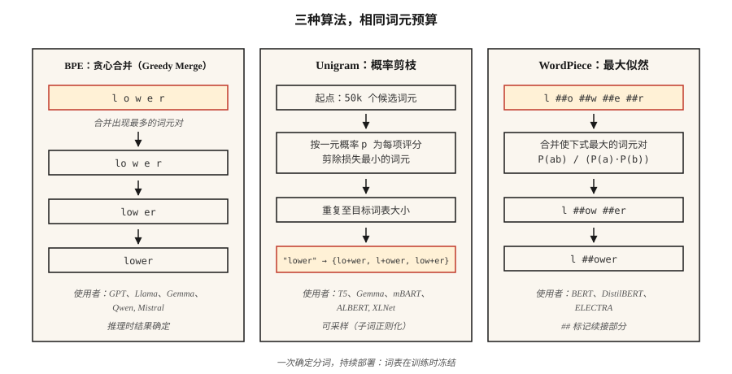

# 子词分词（Subword Tokenization）：BPE、WordPiece、Unigram、SentencePiece

> 词级分词器遇到未见词就失效，字符级分词器使序列长度暴增。子词分词器在两者之间折中，每个现代 LLM 都依赖它。

**Type:** Learn
**Languages:** Python
**Prerequisites:** 阶段 5 · 01（文本处理 Text Processing）、阶段 5 · 04（GloVe / FastText / 子词 Subword）
**Time:** 约 60 分钟

## 问题（The Problem）

词表包含 50,000 个词，用户输入“untokenizable”，分词器返回 `[UNK]`，模型于是得不到关于这个词的任何信号。更糟的是，语料库中第 90 百分位的文档有 40 个罕见词，这意味着每篇文档丢失 40 比特信息。

子词分词解决了这个问题。常见词保持为单个词元，罕见词分解为有意义的片段：`untokenizable` → `un`、`token`、`izable`。训练数据能覆盖一切，因为任何字符串最终都是字节序列。

2026 年的每个前沿 LLM 都采用 BPE、Unigram、WordPiece 三种算法之一，并封装在 tiktoken、SentencePiece、HF Tokenizers 三个库之一中。要交付语言模型，就必须做出选择。

## 概念（The Concept）



**BPE（字节对编码，Byte-Pair Encoding）。**从字符级词表开始，统计每个相邻字符对，将最常见的一对合并为新词元，重复直到达到目标词表大小。这是主流算法，GPT-2/3/4、Llama、Gemma、Qwen2 和 Mistral 均采用它。

**字节级 BPE（Byte-Level BPE）。**算法相同，但作用于原始字节，即 256 个基础词元，而不是 Unicode 字符。它保证没有 `[UNK]` 词元，因为任何字节序列都可编码。GPT-2 使用 50,257 个词元：256 个字节 + 50,000 次合并 + 1 个特殊词元。

**Unigram（一元模型）。**从巨大的词表开始，为每个词元赋予一元概率，迭代剪除那些移除后让语料库对数似然增加最少的词元。推理时具有概率性，可以采样不同分词结果，通过子词正则化（Subword Regularization）实现数据增强。T5、mBART、ALBERT、XLNet 和 Gemma 使用它。

**WordPiece。**合并能够最大化训练语料似然的词元对，而不是只看原始频率。BERT、DistilBERT 和 ELECTRA 使用它。

**SentencePiece 与 tiktoken。**SentencePiece 是直接在原始 Unicode 文本上*训练*词表的库，支持 BPE 或 Unigram，将空格编码为 `▁`。tiktoken 是 OpenAI 针对预建词表的快速*编码器*，不负责训练。

经验规则：

- **训练新词表：**SentencePiece（多语言、无需预分词）或 HF Tokenizers。
- **针对 GPT 词表快速推理：**tiktoken（cl100k_base、o200k_base）。
- **两者都要：**HF Tokenizers，一个库同时支持训练与服务。

```figure
bpe-merge
```

## 动手实现（Build It）

### 步骤 1：从零实现 BPE

参见 `code/main.py`。循环如下：

```python
def train_bpe(corpus, num_merges):
    vocab = {tuple(word) + ("</w>",): count for word, count in corpus.items()}
    merges = []
    for _ in range(num_merges):
        pairs = Counter()
        for symbols, freq in vocab.items():
            for a, b in zip(symbols, symbols[1:]):
                pairs[(a, b)] += freq
        if not pairs:
            break
        best = pairs.most_common(1)[0][0]
        merges.append(best)
        vocab = apply_merge(vocab, best)
    return merges
```

算法体现了三个事实。`</w>` 标记词尾，使作为后缀的 “low” 与作为前缀的 “lower” 保持区别。频率加权让高频字符对更早胜出。合并列表有顺序，推理按训练顺序应用合并。

### 步骤 2：使用学到的合并规则编码

```python
def encode_bpe(word, merges):
    symbols = list(word) + ["</w>"]
    for a, b in merges:
        i = 0
        while i < len(symbols) - 1:
            if symbols[i] == a and symbols[i + 1] == b:
                symbols = symbols[:i] + [a + b] + symbols[i + 2:]
            else:
                i += 1
    return symbols
```

朴素实现的复杂度是 O(n·|merges|)。生产实现（tiktoken、HF Tokenizers）使用合并优先级查询和优先队列，运行时间接近线性。

### 步骤 3：SentencePiece 实践

```python
import sentencepiece as spm

spm.SentencePieceTrainer.train(
    input="corpus.txt",
    model_prefix="my_tokenizer",
    vocab_size=8000,
    model_type="bpe",          # or "unigram"
    character_coverage=0.9995, # lower for CJK (e.g. 0.9995 for English, 0.995 for Japanese)
    normalization_rule_name="nmt_nfkc",
)

sp = spm.SentencePieceProcessor(model_file="my_tokenizer.model")
print(sp.encode("untokenizable", out_type=str))
# ['▁un', 'token', 'izable']
```

注意：无需预分词，空格编码为 `▁`；`character_coverage` 控制保留罕见字符与映射到 `<unk>` 之间的取舍力度。

### 步骤 4：使用 tiktoken 处理 OpenAI 兼容词表

```python
import tiktoken
enc = tiktoken.get_encoding("o200k_base")
print(enc.encode("untokenizable"))        # [127340, 101028]
print(len(enc.encode("Hello, world!")))   # 4
```

仅负责编码，Rust 后端带来高速度。其分词与 GPT-4/5 精确匹配，可用于字节计数、成本估计和上下文窗口预算。

## 2026 年生产中仍存在的陷阱（Pitfalls）

- **分词器漂移（Tokenizer Drift）。**在词表 A 上训练，却使用词表 B 部署。词元 ID 不同，模型就输出垃圾。在 CI 中检查 `tokenizer.json` 哈希。
- **空白歧义（Whitespace Ambiguity）。**BPE 对 “hello” 和 “ hello” 产生不同词元。始终显式指定 `add_special_tokens` 和 `add_prefix_space`。
- **多语言训练不足（Multilingual Undertraining）。**以英语为主的语料产生的词表，会把非拉丁文字切成多 5–10 倍的词元。GPT-3.5 上相同提示词使用日语或阿拉伯语时，成本高 5–10 倍。o200k_base 部分修复了这一问题。
- **表情符号拆分（Emoji Splits）。**单个表情符号可能占 5 个词元。制定上下文预算时检查表情符号处理。

## 实际应用（Use It）

2026 年的技术栈：

| 场景 | 选择 |
|-----------|------|
| 从零训练单语言模型 | HF Tokenizers（BPE） |
| 训练多语言模型 | SentencePiece（Unigram，`character_coverage=0.9995`） |
| 提供 OpenAI 兼容 API | tiktoken（GPT-4+ 使用 `o200k_base`） |
| 领域专用词表（代码、数学、蛋白质） | 在领域语料上训练自定义 BPE，再与基础词表合并 |
| 边缘推理、小模型 | Unigram（小词表表现更好） |

词表大小是规模决策，不是常数。粗略经验：参数少于 1B 用 32k，1–10B 用 50–100k，多语言或前沿模型用 200k 以上。

## 交付成果（Ship It）

保存为 `outputs/skill-bpe-vs-wordpiece.md`：

```markdown
---
name: tokenizer-picker
description: 根据给定语料库和部署目标，选择分词算法、词表大小与库。
version: 1.0.0
phase: 5
lesson: 19
tags: [nlp, tokenization]
---

给定语料库（规模、语言、领域）和部署目标（从零训练 / 微调 / API 兼容推理），输出：

1. 算法（Algorithm）。BPE、Unigram 或 WordPiece，用一句话说明理由。
2. 库（Library）。SentencePiece、HF Tokenizers 或 tiktoken，说明理由。
3. 词表大小（Vocabulary Size）。四舍五入到最接近的 1k，结合模型大小和语言覆盖说明理由。
4. 覆盖设置（Coverage Settings）。`character_coverage`、`byte_fallback`、特殊词元列表。
5. 验证计划（Validation Plan）。留出集上平均每词词元数、OOV 比例、压缩率，以及编码解码往返的一致性。

对于含罕见书写系统内容的语料库，拒绝训练字符覆盖率低于 0.995 的分词器。没有在 CI 中检查冻结的 `tokenizer.json` 哈希，就拒绝上线词表。单语言分词器词表少于 16k 时，提示规格可能不足。
```

## 练习（Exercises）

1. **简单。**在 `code/main.py` 的微型语料上训练合并 500 次的 BPE。编码三个留出词，有多少恰好产生 1 个词元，有多少超过 1 个？
2. **中等。**在 100 个英语 Wikipedia 句子上，比较 `cl100k_base`、`o200k_base` 与自行训练的 32k 词表 SentencePiece BPE 的词元数，报告各自的压缩率。
3. **困难。**在同一语料上训练 BPE、Unigram 和 WordPiece。将它们分别用于小型情感分类器，测量下游准确率。选择不同算法会让 F1 变化超过 1 个点吗？

## 关键术语（Key Terms）

| 术语 | 常见说法 | 实际含义 |
|------|-----------------|-----------------------|
| BPE | 字节对编码（Byte-Pair Encoding） | 贪心合并最常见字符对，直到达到目标词表大小。 |
| 字节级 BPE（Byte-Level BPE） | 永远没有未知词元 | 在 256 个原始字节上执行 BPE；GPT-2 / Llama 使用它。 |
| Unigram | 概率分词器（Probabilistic Tokenizer） | 使用对数似然从大型候选集合剪枝；T5、Gemma 使用它。 |
| SentencePiece | 处理空白的那个 | 在原始文本上训练 BPE/Unigram 的库，空格编码为 `▁`。 |
| tiktoken | 快的那个 | OpenAI 基于 Rust 的预建词表 BPE 编码器，不训练词表。 |
| 合并列表（Merge List） | 神奇的数字 | 有序的 `(a, b) → ab` 合并列表，推理按顺序应用。 |
| 字符覆盖率（Character Coverage） | 多罕见才算太罕见？ | 分词器必须覆盖的训练语料字符比例，典型值约为 0.9995。 |

## 延伸阅读（Further Reading）

- [Sennrich、Haddow、Birch（2015）：使用子词单元进行罕见词神经机器翻译（Neural Machine Translation of Rare Words with Subword Units）](https://arxiv.org/abs/1508.07909)：BPE 论文。
- [Kudo（2018）：基于一元语言模型的子词正则化（Subword Regularization with Unigram Language Model）](https://arxiv.org/abs/1804.10959)：Unigram 论文。
- [Kudo、Richardson（2018）：SentencePiece：简单且与语言无关的子词分词器（SentencePiece: A simple and language independent subword tokenizer）](https://arxiv.org/abs/1808.06226)：介绍该库的论文。
- [Hugging Face：分词器概览（Summary of the Tokenizers）](https://huggingface.co/docs/transformers/tokenizer_summary)：简明参考。
- [OpenAI tiktoken 仓库](https://github.com/openai/tiktoken)：用法示例与编码列表。
