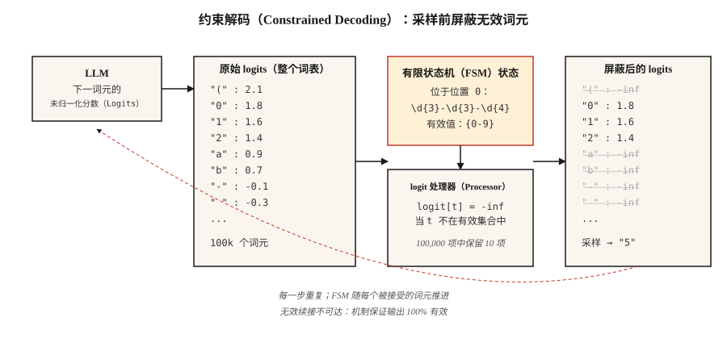

# 结构化输出与约束解码（Structured Outputs & Constrained Decoding）

> 向 LLM 请求 JSON，大多数时候能得到 JSON。但在生产环境中，“大多数”就是问题。约束解码在采样前修改 logits，将“大多数”变成“始终”。

**Type:** Build
**Languages:** Python
**Prerequisites:** 阶段 5 · 17（聊天机器人 Chatbots）、阶段 5 · 19（子词分词 Subword Tokenization）
**Time:** 约 60 分钟

## 问题（The Problem）

分类器提示 LLM：“返回 {positive, negative, neutral} 中的一个。”模型却返回：“情感是 positive，这条评论极为正面，因为顾客明确表示他们……”解析器崩溃，分类器的 F1 变成 0.0。

自由生成不是契约，只是建议。生产系统需要契约。

2026 年存在三个层次：

1. **提示（Prompting）。**好好请求：“只返回 JSON 对象。”前沿模型约有 80% 的情况有效，小模型更低。
2. **原生结构化输出 API（Native Structured Output APIs）。**OpenAI `response_format`、Anthropic 工具使用、Gemini JSON 模式。对支持的模式可靠，但绑定供应商。
3. **约束解码（Constrained Decoding）。**在每一步生成时修改 logits，使模型*无法*输出无效词元。机制本身保证 100% 有效，适用于任何本地模型。

本课建立对三者的直观理解，并说明何时选择哪一种。

## 概念（The Concept）



**约束解码如何工作。**每步生成时，LLM 为整个词表（约 100k 个词元）产生一个 logit 向量。*logit 处理器（Logit Processor）*位于模型和采样器之间，根据目标语法的当前位置计算有效词元，目标语法可以是 JSON Schema、正则表达式或上下文无关文法。它将所有无效词元的 logits 设为负无穷，剩余 logits 的 softmax 因而只把概率质量分配给合法续接。

2026 年的实现：

- **Outlines。**将 JSON Schema 或正则表达式编译为有限状态机（Finite-State Machine，FSM）。每个词元的合法下一词元查询为 O(1)。由于基于 FSM，递归模式需要展平。
- **XGrammar / llguidance。**上下文无关文法（Context-Free Grammar，CFG）引擎，支持递归 JSON Schema，解码额外开销接近零。OpenAI 在其 2025 年结构化输出实现中致谢了 llguidance。
- **vLLM 引导解码（Guided Decoding）。**通过 Outlines、XGrammar 或 lm-format-enforcer 后端内置 `guided_json`、`guided_regex`、`guided_choice`、`guided_grammar`。
- **Instructor。**基于 Pydantic、面向任意 LLM 的包装器。验证失败时重试，支持跨供应商，但不修改 logits，而是依赖重试与适配结构化输出的提示词。

### 反直觉的结果（The Counterintuitive Result）

约束解码通常比无约束生成*更快*，原因有二。首先，它缩小了下一词元搜索空间。其次，巧妙的实现会对强制词元直接跳过生成，例如 `{"name": "` 这样的框架，每个字节都已确定。

### 代价高昂的陷阱（The Pitfall That Costs You）

字段顺序很重要。将 `answer` 放在 `reasoning` 之前，模型就会在思考前确定答案。JSON 有效，但答案错误，任何验证都捕获不到。

```json
// BAD
{"answer": "yes", "reasoning": "because ..."}

// GOOD
{"reasoning": "... therefore ...", "answer": "yes"}
```

模式字段顺序属于逻辑，而不是格式。

```figure
constrained-decoder
```

## 动手实现（Build It）

### 步骤 1：从零实现正则约束生成（Regex-Constrained Generation）

独立 FSM 实现见 `code/main.py`。核心思想用 30 行代码表示：

```python
def mask_logits(logits, valid_token_ids):
    mask = [float("-inf")] * len(logits)
    for tid in valid_token_ids:
        mask[tid] = logits[tid]
    return mask


def generate_constrained(model, tokenizer, prompt, fsm):
    ids = tokenizer.encode(prompt)
    state = fsm.initial_state
    while not fsm.is_accept(state):
        logits = model.next_token_logits(ids)
        valid = fsm.valid_tokens(state, tokenizer)
        logits = mask_logits(logits, valid)
        tok = sample(logits)
        ids.append(tok)
        state = fsm.transition(state, tok)
    return tokenizer.decode(ids)
```

FSM 跟踪当前已满足哪些语法部分。`valid_tokens(state, tokenizer)` 计算哪些词表词元可以推进 FSM，同时不离开通向接受状态的路径。

### 步骤 2：使用 Outlines 约束 JSON Schema

```python
from pydantic import BaseModel
from typing import Literal
import outlines


class Review(BaseModel):
    sentiment: Literal["positive", "negative", "neutral"]
    confidence: float
    evidence_span: str


model = outlines.models.transformers("meta-llama/Llama-3.2-3B-Instruct")
generator = outlines.generate.json(model, Review)

result = generator("Classify: 'The wait staff was attentive and the food arrived hot.'")
print(result)
# Review(sentiment='positive', confidence=0.93, evidence_span='attentive ... hot')
```

验证错误始终为零。FSM 让无效输出不可达。

### 步骤 3：用 Instructor 实现跨供应商 Pydantic

```python
import instructor
from anthropic import Anthropic
from pydantic import BaseModel, Field


class Invoice(BaseModel):
    vendor: str
    total_usd: float = Field(ge=0)
    line_items: list[str]


client = instructor.from_anthropic(Anthropic())
invoice = client.messages.create(
    model="claude-opus-4-7",
    max_tokens=1024,
    response_model=Invoice,
    messages=[{"role": "user", "content": "Extract from: 'Acme Corp $420. Widget, Gizmo.'"}],
)
```

机制不同。Instructor 不碰 logits，而是将模式格式化到提示词中、解析输出，并在验证失败时重试，默认重试 3 次。它适用于任何供应商。重试增加延迟和成本，跨供应商可移植性是其卖点。

### 步骤 4：供应商原生 API（Native Vendor APIs）

```python
from openai import OpenAI

client = OpenAI()
response = client.responses.create(
    model="gpt-5",
    input=[{"role": "user", "content": "Classify: 'The food was cold.'"}],
    text={"format": {"type": "json_schema", "name": "sentiment",
          "schema": {"type": "object", "required": ["sentiment"],
                     "properties": {"sentiment": {"type": "string",
                                                  "enum": ["positive", "negative", "neutral"]}}}}},
)
print(response.output_parsed)
```

服务端约束解码。对支持的模式，可靠性与 Outlines 相当。不必管理本地模型，但会绑定供应商。

## 陷阱（Pitfalls）

- **递归模式（Recursive Schemas）。**Outlines 将递归展平到固定深度。嵌套评论、AST 等树形输出需要基于 CFG 的 XGrammar 或 llguidance。
- **巨大枚举（Huge Enums）。**包含 10,000 个选项的枚举编译缓慢，甚至超时。改用检索器：先预测前 k 个候选，再约束为这些候选。
- **语法过严（Grammar Too Strict）。**强制使用 `date: "YYYY-MM-DD"` 正则时，日期缺失也无法输出 `"unknown"`，模型会通过编造日期补偿。应允许 `null` 或哨兵值（Sentinel）。
- **过早定案（Premature Commitment）。**参见上文的字段顺序陷阱。始终将推理放在前面。
- **没有模式的供应商 JSON 模式。**纯 JSON 模式只保证 JSON 语法有效，不保证*符合你的用例*。始终提供完整模式。

## 实际应用（Use It）

2026 年的技术栈：

| 场景 | 选择 |
|-----------|------|
| OpenAI/Anthropic/Google 模型，简单模式 | 供应商原生结构化输出 |
| 任意供应商，Pydantic 工作流，可容忍重试 | Instructor |
| 本地模型，需要 100% 有效性，扁平模式 | Outlines（FSM） |
| 本地模型，递归模式 | XGrammar 或 llguidance |
| 自托管推理服务器 | vLLM 引导解码 |
| 可接受重试的批处理 | Instructor + 最便宜的模型 |

## 交付成果（Ship It）

保存为 `outputs/skill-structured-output-picker.md`：

```markdown
---
name: structured-output-picker
description: 选择结构化输出方案、模式设计与验证计划。
version: 1.0.0
phase: 5
lesson: 20
tags: [nlp, llm, structured-output]
---

给定用例（供应商、延迟预算、模式复杂度、失败容忍度），输出：

1. 机制（Mechanism）。供应商原生结构化输出、Instructor 重试、Outlines FSM 或 XGrammar CFG。用一句话说明理由。
2. 模式设计（Schema Design）。字段顺序（推理在前、答案在后）、表示“未知”的可空字段、枚举与正则的选择、必填字段。
3. 失败策略（Failure Strategy）。最大重试次数、回退模型、妥善处理 `null`、对分布外输入拒答。
4. 验证计划（Validation Plan）。模式符合率（目标 100%）、语义有效性（LLM 裁判）、字段覆盖率、延迟 p50/p99。

拒绝将 `answer` 或 `decision` 放在推理字段之前的任何设计。拒绝使用没有模式的裸 JSON 模式。对使用仅支持 FSM 的库处理递归模式的方案提出警示。
```

## 练习（Exercises）

1. **简单。**不使用约束解码，提示小型开放权重模型，例如 Llama-3.2-3B，生成 `Review(sentiment, confidence, evidence_span)`。在 100 条评论上测量可解析为有效 JSON 的比例。
2. **中等。**在相同语料上使用 Outlines JSON 模式，比较符合率、延迟和语义准确率。
3. **困难。**从零实现电话号码正则 `\d{3}-\d{3}-\d{4}` 的约束解码器。在 1000 个样本上验证无效输出数量为 0。

## 关键术语（Key Terms）

| 术语 | 常见说法 | 实际含义 |
|------|-----------------|-----------------------|
| 约束解码（Constrained Decoding） | 强制有效输出 | 在每步生成时屏蔽无效词元的 logits。 |
| logit 处理器（Logit Processor） | 执行约束的组件 | 函数：`(logits, state) -> masked_logits`。 |
| FSM | 有限状态机（Finite-State Machine） | 编译后的语法表示，合法下一词元查询为 O(1)。 |
| CFG | 上下文无关文法（Context-Free Grammar） | 能处理递归的文法，比 FSM 慢，但表达能力更强。 |
| 模式字段顺序（Schema Field Order） | 重要吗？ | 是的，首个字段会先定案；始终将推理放在答案前。 |
| 引导解码（Guided Decoding） | vLLM 的叫法 | 同一概念，集成在推理服务器中。 |
| JSON 模式（JSON Mode） | OpenAI 的早期版本 | 保证 JSON 语法，不保证匹配模式。 |

## 延伸阅读（Further Reading）

- [Willard、Louf（2023）：LLM 的高效引导生成（Efficient Guided Generation for LLMs）](https://arxiv.org/abs/2307.09702)：Outlines 论文。
- [XGrammar 论文（2024）](https://arxiv.org/abs/2411.15100)：基于 CFG 的快速约束解码。
- [vLLM：结构化输出（Structured Outputs）](https://docs.vllm.ai/en/latest/features/structured_outputs.html)：推理服务器集成。
- [OpenAI：结构化输出指南](https://platform.openai.com/docs/guides/structured-outputs)：API 参考与注意事项。
- [Instructor 库](https://python.useinstructor.com/)：跨供应商的 Pydantic 与重试。
- [JSONSchemaBench（2025）](https://arxiv.org/abs/2501.10868)：对 6 个约束解码框架进行基准评估。
