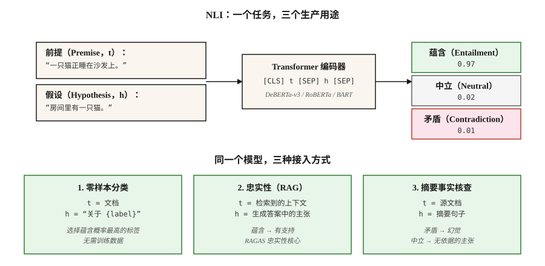

# 自然语言推断：文本蕴含（Natural Language Inference — Textual Entailment）

> “t 蕴含 h”意味着人类读完 t 会认为 h 为真。NLI 的任务是预测蕴含、矛盾或中立。表面平淡，却是生产系统的重要支撑。

**Type:** Learn
**Languages:** Python
**Prerequisites:** 阶段 5 · 05（情感分析 Sentiment Analysis）、阶段 5 · 13（问答 Question Answering）
**Time:** 约 60 分钟

## 问题（The Problem）

你构建了摘要器，它生成了摘要。如何知道其中没有幻觉？

你构建了聊天机器人，它回答“是”。如何知道检索到的段落支持这个答案？

你需要按主题分类 10,000 篇新闻，却没有训练标签。能复用模型吗？

三个问题都可归约为自然语言推断（Natural Language Inference，NLI）。NLI 询问：给定前提 `t` 和假设 `h`，`h` 是被 `t` 蕴含、与其矛盾，还是中立（无关）？

- **幻觉检查（Hallucination Check）：**`t` = 源文档，`h` = 摘要主张。不蕴含 = 幻觉。
- **有依据的问答（Grounded QA）：**`t` = 检索段落，`h` = 生成答案。不蕴含 = 编造。
- **零样本分类（Zero-Shot Classification）：**`t` = 文档，`h` = 用自然语言表述的标签，例如“这是关于体育的”。蕴含 = 预测标签。

一个任务，三个生产用途。因此每个 RAG 评估框架内部都带有 NLI 模型。

## 概念（The Concept）



**三个标签（Labels）。**

- **蕴含（Entailment）。**`t` → `h`。“猫在垫子上”蕴含“有一只猫”。
- **矛盾（Contradiction）。**`t` → ¬`h`。“猫在垫子上”与“没有猫”矛盾。
- **中立（Neutral）。**两个方向都无法推断。“猫在垫子上”对“猫饿了”是中立的。

**并非逻辑蕴含（Logical Entailment）。**NLI 是*自然*语言推断，判断普通读者会推断什么，而非严格逻辑。在 NLI 中，“John 遛了他的狗”蕴含“John 有一只狗”；但严格的一阶逻辑只有在将所有权关系公理化后才接受这个结论。

**数据集（Datasets）。**

- **SNLI**（2015）。570k 个人工标注句对，以图像描述为前提，领域狭窄。
- **MultiNLI**（2017）。覆盖 10 种体裁的 433k 个句对，是 2026 年的标准训练语料。
- **ANLI**（2019）。对抗式 NLI（Adversarial NLI）。人类专门编写用于击败现有模型的样本，难度更高。
- **DocNLI、ConTRoL**（2020–2021）。文档长度的前提，测试多跳和长距离推断。

**架构（Architecture）。**Transformer 编码器（BERT、RoBERTa、DeBERTa）读取 `[CLS] premise [SEP] hypothesis [SEP]`，将 `[CLS]` 表示送入三分类 softmax。在 MNLI 上训练，在留出基准上评估，可以在分布内句对上获得超过 90% 的准确率。

**通过 NLI 实现零样本。**给定文档和候选标签，将每个标签转为假设，例如“这段文本关于体育”，计算各自的蕴含概率并选取最大值。这就是 Hugging Face `zero-shot-classification` 流水线背后的机制。

```figure
nli-router
```

## 动手实现（Build It）

### 步骤 1：运行预训练 NLI 模型

```python
from transformers import pipeline

nli = pipeline("text-classification",
               model="facebook/bart-large-mnli",
               top_k=None)  # return all labels; replaces deprecated return_all_scores=True

premise = "The cat is sleeping on the couch."
hypothesis = "There is a cat in the room."

result = nli({"text": premise, "text_pair": hypothesis})[0]
print(result)
# [{'label': 'entailment', 'score': 0.97},
#  {'label': 'neutral', 'score': 0.02},
#  {'label': 'contradiction', 'score': 0.01}]
```

生产 NLI 的开放默认选择是 `facebook/bart-large-mnli` 和 `MoritzLaurer/DeBERTa-v3-large-mnli-fever-anli-ling-wanli`。DeBERTa-v3 位居排行榜前列。

### 步骤 2：零样本分类（Zero-Shot Classification）

```python
zs = pipeline("zero-shot-classification", model="facebook/bart-large-mnli")

text = "The stock market rallied after the central bank cut interest rates."
labels = ["finance", "sports", "politics", "technology"]

result = zs(text, candidate_labels=labels)
print(result)
# {'labels': ['finance', 'politics', 'technology', 'sports'],
#  'scores': [0.92, 0.05, 0.02, 0.01]}
```

默认模板是“This example is about {label}.”，即“这个样本关于 {label}”。通过 `hypothesis_template` 自定义。无需训练数据或微调，开箱即用。

### 步骤 3：RAG 忠实性检查（Faithfulness Check）

```python
def is_faithful(answer, context, threshold=0.5):
    result = nli({"text": context, "text_pair": answer})[0]
    entail = next(s for s in result if s["label"] == "entailment")
    return entail["score"] > threshold
```

这就是 RAGAS 忠实性的核心：将生成答案拆为原子主张（Atomic Claims），针对检索上下文检查每项主张，报告被蕴含的比例。

### 步骤 4：手工实现 NLI 分类器（概念演示）

仅用标准库实现的玩具示例见 `code/main.py`：通过词汇重叠和否定检测比较前提与假设。它无法与 Transformer 模型竞争，但展示了任务形态：输入两段文本，输出三分类标签，损失为 `{entail, contradict, neutral}` 上的交叉熵。

## 陷阱（Pitfalls）

- **仅假设捷径（Hypothesis-Only Shortcuts）。**在 SNLI 上，模型只看假设就能以约 60% 的准确率预测标签，因为“not”“nobody”“never”等否定词与矛盾标签相关。这是检测标签泄漏的强基线。
- **词汇重叠启发式（Lexical Overlap Heuristic）。**“每个子序列都被蕴含”的子序列启发式能通过 SNLI，却会在 HANS/ANLI 上失败。要使用对抗基准。
- **文档长度退化（Document-Length Degradation）。**句级 NLI 模型在文档长度前提上的 F1 下降超过 20 点。长上下文应使用经过 DocNLI 训练的模型。
- **零样本模板敏感性（Template Sensitivity）。**“This example is about {label}”“{label}”“The topic is {label}”等不同措辞可能使准确率变化超过 10 点。需要调优模板。
- **领域不匹配（Domain Mismatch）。**MNLI 在通用英语上训练。法律、医学和科学文本需要 SciNLI、MedNLI 等领域专用 NLI 模型。

## 实际应用（Use It）

2026 年的技术栈：

| 用例 | 模型 |
|---------|-------|
| 通用 NLI | `MoritzLaurer/DeBERTa-v3-large-mnli-fever-anli-ling-wanli` |
| 快速 / 边缘场景 | `cross-encoder/nli-deberta-v3-base` |
| 轻量零样本分类 | `facebook/bart-large-mnli` |
| 文档级 NLI | `MoritzLaurer/DeBERTa-v3-large-mnli-fever-anli-ling-wanli` |
| 多语言 | `MoritzLaurer/multilingual-MiniLMv2-L6-mnli-xnli` |
| RAG 幻觉检测 | RAGAS / DeepEval 内的 NLI 层 |

2026 年的通用模式：NLI 是文本理解的通用连接工具。只要需要判断“A 是否支持 B”或“A 是否与 B 矛盾”，在增加一次 LLM 调用之前，先考虑 NLI。

## 交付成果（Ship It）

保存为 `outputs/skill-nli-picker.md`：

```markdown
---
name: nli-picker
description: 为分类、忠实性或零样本任务选择 NLI 模型、标签模板和评估配置。
version: 1.0.0
phase: 5
lesson: 21
tags: [nlp, nli, zero-shot]
---

给定用例（忠实性检查、零样本分类、文档级推断），输出：

1. 模型（Model）。指出具体 NLI 检查点，并结合领域、长度、语言说明理由。
2. 模板（Template，零样本时）。标签自然语言表述模式及示例。
3. 阈值（Threshold）。决策规则中的蕴含概率截断值，依据校准说明理由。
4. 评估（Evaluation）。留出标注集准确率、仅假设基线、对抗子集。

没有 100 个标注样本的合理性检查，就拒绝上线零样本分类。拒绝将句级 NLI 模型用于文档长度前提。对任何“NLI 解决了幻觉”的主张提出警示：它能减少幻觉，不能消除幻觉。
```

## 练习（Exercises）

1. **简单。**在覆盖全部三类的 20 个人工构造的前提、假设、标签三元组上运行 `facebook/bart-large-mnli`，测量准确率。添加“我没有吃蛋糕”与“我吃了蛋糕”这样的对抗性子序列启发式陷阱，看看它是否失败。
2. **中等。**在 100 个 AG News 标题上，比较零样本模板 `"This text is about {label}"`、`"The topic is {label}"` 和 `"{label}"`，报告准确率变化。
3. **困难。**构建 RAG 忠实性检查器：原子主张分解，再逐主张执行 NLI。在带有标准上下文的 50 个 RAG 生成答案上评估，相对人工标签测量假阳性率和假阴性率。

## 关键术语（Key Terms）

| 术语 | 常见说法 | 实际含义 |
|------|-----------------|-----------------------|
| NLI | 自然语言推断（Natural Language Inference） | 对前提—假设关系进行三分类。 |
| RTE | 文本蕴含识别（Recognizing Textual Entailment） | NLI 的旧称，任务相同。 |
| 蕴含（Entailment） | “t 推出 h” | 给定 t，普通读者会认为 h 为真。 |
| 矛盾（Contradiction） | “t 排除 h” | 给定 t，普通读者会认为 h 为假。 |
| 中立（Neutral） | “未定” | 从 t 到 h 在任一方向上都无法推断。 |
| 零样本分类（Zero-Shot Classification） | 用 NLI 分类 | 将标签表述为假设，选择最大蕴含概率。 |
| 忠实性（Faithfulness） | 答案有支持吗？ | 对检索上下文与生成答案执行 NLI。 |

## 延伸阅读（Further Reading）

- [Bowman 等（2015）：用于学习自然语言推断的大型标注语料（A large annotated corpus for learning natural language inference）](https://arxiv.org/abs/1508.05326)：SNLI。
- [Williams、Nangia、Bowman（2017）：通过推断理解句子的广覆盖挑战语料（A Broad-Coverage Challenge Corpus for Sentence Understanding through Inference）](https://arxiv.org/abs/1704.05426)：MultiNLI。
- [Nie 等（2019）：对抗式 NLI（Adversarial NLI）](https://arxiv.org/abs/1910.14599)：ANLI 基准。
- [Yin、Hay、Roth（2019）：零样本文本分类基准评估（Benchmarking Zero-shot Text Classification）](https://arxiv.org/abs/1909.00161)：将 NLI 用作分类器。
- [He 等（2021）：DeBERTa：采用解耦注意力的解码增强 BERT（DeBERTa: Decoding-enhanced BERT with Disentangled Attention）](https://arxiv.org/abs/2006.03654)：2026 年 NLI 主力模型。
