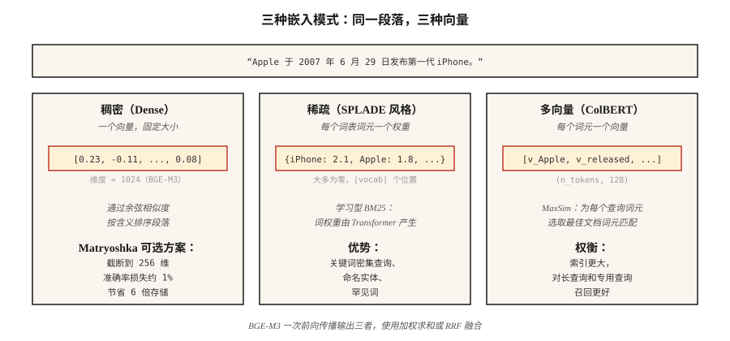

# 嵌入模型：2026 年深入解析（Embedding Models — The 2026 Deep Dive）

> Word2Vec 为每个词提供向量。现代嵌入模型为每个段落提供跨语言向量，具有稀疏、稠密和多向量视角，并可调整大小以适配索引。选错模型，RAG 就会检索错内容。

**Type:** Learn
**Languages:** Python
**Prerequisites:** 阶段 5 · 03（Word2Vec）、阶段 5 · 14（信息检索 Information Retrieval）
**Time:** 约 60 分钟

## 问题（The Problem）

你的 RAG 系统有 40% 的时候检索到错误段落。问题很少出在向量数据库或提示词，而在嵌入模型。

2026 年选择嵌入模型，需要考虑五个维度：

1. **稠密、稀疏或多向量（Dense / Sparse / Multi-Vector）。**每段一个向量、每词元一个向量，或稀疏加权词袋。
2. **语言覆盖（Language Coverage）。**纯英语任务上，单语言英语模型仍胜出；语料混合多种语言时，多语言模型胜出。
3. **上下文长度（Context Length）。**512、8,192 或 32,768 个词元，但真实有效容量通常只有标称最大值的 60–70%。
4. **维度预算（Dimension Budget）。**全精度的 3,072 个浮点数等于每向量 12 KB。存储 100M 个向量时，每月费用为 1,300 美元。Matryoshka 截断可将其缩减 4 倍。
5. **开放或托管（Open / Hosted）。**开放权重意味着掌控技术栈和数据，托管则用控制权换取始终使用最新模型。

本课说明这些权衡，让你基于证据选择，而不是跟随上季度的流行方案。

## 概念（The Concept）



**稠密嵌入（Dense Embeddings）。**每段一个向量，通常为 384–3,072 维。余弦相似度按语义接近程度对段落排序。代表包括 OpenAI `text-embedding-3-large`、BGE-M3 稠密模式和 Voyage-3，是默认选择。

**稀疏嵌入（Sparse Embeddings）。**SPLADE 风格：Transformer 为词表中每个词元预测权重，再将大部分置零，得到大小为 |vocab| 的稀疏向量。它像 BM25 一样捕获词汇匹配，但词权重通过学习得到，擅长关键词密集查询。

**多向量（Multi-Vector，后期交互 Late Interaction）。**例如 ColBERTv2、Jina-ColBERT，每个词元一个向量。使用 MaxSim 评分：为每个查询词元找到最相似的文档词元，再对分数求和。存储与评分更昂贵，但在长查询和领域专用语料上更有优势。

**BGE-M3：同时提供三者。**单个模型同时输出稠密、稀疏和多向量表示。各自可独立查询，再通过加权求和融合分数。2026 年，希望一个检查点提供灵活性时，它是默认选择。

**套娃表示学习（Matryoshka Representation Learning）。**训练使向量的前 N 个维度能够独立构成有用的嵌入。将 1,536 维截到 256 维，只需付出约 1% 的准确率，就能节省 6 倍存储。OpenAI text-3、Cohere v4、Voyage-4、Jina v5、Gemini Embedding 2 和 Nomic v1.5+ 均支持。

### MTEB 排行榜只反映部分情况（The MTEB Leaderboard）

大规模文本嵌入基准（Massive Text Embedding Benchmark）在 2022 年发布时包含 8 类任务中的 56 个任务，MTEB v2 扩展到 100 多个。2026 年初，Gemini Embedding 2 在检索上领先（67.71 MTEB-R），Cohere embed-v4 在通用任务领先（65.2 MTEB），BGE-M3 在开放权重多语言模型中领先（63.0）。排行榜必要但不充分，始终在自己的领域上做基准测试。

### 三层模式（The Three-Tier Pattern）

| 用例 | 模式 |
|----------|---------|
| 快速首轮检索 | 稠密双编码器（BGE-M3、text-3-small） |
| 提升召回 | 稀疏检索（SPLADE、BGE-M3 稀疏模式）+ RRF 融合 |
| 提高前 50 项精度 | 多向量（ColBERTv2）或交叉编码器重排序器 |

多数生产技术栈同时使用三者。

```figure
gx-matryoshka
```

## 动手实现（Build It）

### 步骤 1：基线，使用 Sentence-BERT 生成稠密嵌入

```python
from sentence_transformers import SentenceTransformer
import numpy as np

encoder = SentenceTransformer("BAAI/bge-small-en-v1.5")
corpus = [
    "The first iPhone launched in 2007.",
    "Apple released the iPod in 2001.",
    "Android is an operating system from Google.",
]
emb = encoder.encode(corpus, normalize_embeddings=True)

query = "When was the iPhone released?"
q_emb = encoder.encode([query], normalize_embeddings=True)[0]
scores = emb @ q_emb
print(sorted(enumerate(scores), key=lambda x: -x[1]))
```

`normalize_embeddings=True` 让点积等于余弦相似度。始终设置它。

### 步骤 2：Matryoshka 截断（Truncation）

```python
def truncate(vectors, dim):
    out = vectors[:, :dim]
    return out / np.linalg.norm(out, axis=1, keepdims=True)

emb_256 = truncate(emb, 256)
emb_128 = truncate(emb, 128)
```

截断后重新归一化。Nomic v1.5、OpenAI text-3 和 Voyage-4 的训练让前几个层级的截断无损。未采用 Matryoshka 的模型，例如原始 Sentence-BERT，截断后效果会急剧下降。

### 步骤 3：BGE-M3 的多功能性（Multi-Functionality）

```python
from FlagEmbedding import BGEM3FlagModel

model = BGEM3FlagModel("BAAI/bge-m3", use_fp16=True)

output = model.encode(
    corpus,
    return_dense=True,
    return_sparse=True,
    return_colbert_vecs=True,
)
# output["dense_vecs"]:    (n_docs, 1024)
# output["lexical_weights"]: list of dict {token_id: weight}
# output["colbert_vecs"]:  list of (n_tokens, 1024) arrays
```

三个索引，一次推理调用。分数融合如下：

```python
dense_score = ... # cosine over dense_vecs
sparse_score = model.compute_lexical_matching_score(q_lex, d_lex)
colbert_score = model.colbert_score(q_col, d_col)
final = 0.4 * dense_score + 0.2 * sparse_score + 0.4 * colbert_score
```

在自己的领域上调优权重。

### 步骤 4：在自定义任务上进行 MTEB 评估

```python
from mteb import MTEB

tasks = ["ArguAna", "SciFact", "NFCorpus"]
evaluation = MTEB(tasks=tasks)
results = evaluation.run(encoder, output_folder="./mteb-results")
```

在*具有代表性*的子集上运行候选模型。不要只信排行榜名次，你的领域很重要。

### 步骤 5：从零手工实现余弦相似度

参见 `code/main.py`。使用仅依赖标准库的平均哈希技巧（Hashing Trick）嵌入。它无法与 Transformer 嵌入竞争，但展示了流程：分词 → 向量 → 归一化 → 点积。

## 陷阱（Pitfalls）

- **查询与文档使用同一模型。**某些模型，例如 Voyage、Jina-ColBERT，采用非对称编码（Asymmetric Encoding），查询和文档经过不同路径。始终检查模型卡。
- **缺少前缀（Missing Prefix）。**`bge-*` 模型要求在查询前加上 `"Represent this sentence for searching relevant passages: "`。忘记会导致召回率相差 3–5 点。
- **Matryoshka 截断过度。**1,536 → 256 通常安全，1,536 → 64 则不然。应在自己的评估集上验证。
- **上下文截断（Context Truncation）。**多数模型会静默截断超过最大长度的输入。长文档需要分块，见第 23 课。
- **忽视延迟长尾（Latency Tail）。**MTEB 分数掩盖了 p99 延迟。600M 模型可能比 335M 模型高 2 点，但每次查询成本高 3 倍。

## 实际应用（Use It）

2026 年的技术栈：

| 场景 | 选择 |
|-----------|------|
| 纯英语、快速、API | `text-embedding-3-large` 或 `voyage-3-large` |
| 开放权重、英语 | `BAAI/bge-large-en-v1.5` |
| 开放权重、多语言 | `BAAI/bge-m3` 或 `Qwen3-Embedding-8B` |
| 长上下文（32k 以上） | Voyage-3-large、Cohere embed-v4、Qwen3-Embedding-8B |
| 仅 CPU 部署 | Nomic Embed v2（137M 参数，MoE） |
| 存储受限 | Matryoshka 截断 + int8 量化 |
| 关键词密集查询 | 添加 SPLADE 稀疏检索，通过 RRF 与稠密检索融合 |

2026 年的模式：从 BGE-M3 或 text-3-large 开始，使用 MTEB 在自己的领域上评估；如果领域专用模型胜出超过 3 点，再替换。

## 交付成果（Ship It）

保存为 `outputs/skill-embedding-picker.md`：

```markdown
---
name: embedding-picker
description: 根据给定语料库和部署环境选择嵌入模型、维度与检索模式。
version: 1.0.0
phase: 5
lesson: 22
tags: [nlp, embeddings, retrieval]
---

给定语料库（规模、语言、领域、平均长度）、部署目标（云 / 边缘 / 本地机房）、延迟预算和存储预算，输出：

1. 模型（Model）。具体检查点或 API，用一句话说明理由。
2. 维度（Dimension）。完整维度、Matryoshka 截断或 int8 量化，结合存储预算说明理由。
3. 模式（Mode）。稠密、稀疏、多向量或混合，说明理由。
4. 若模型卡要求，给出查询前缀或模板。
5. 评估计划（Evaluation Plan）。与领域相关的 MTEB 任务，加上使用 nDCG@10 的领域留出评估。

未经领域验证，拒绝推荐将 Matryoshka 截断到少于 64 维。语料不足 10k 个段落时拒绝 ColBERTv2，因为额外开销不合理。对将超过 8k 词元的长文档语料送入 512 词元窗口模型的方案提出警示。
```

## 练习（Exercises）

1. **简单。**用 `bge-small-en-v1.5` 对 100 个句子按完整 384 维编码，再使用 Matryoshka 128 维。在 10 个查询上测量 MRR 下降。
2. **中等。**在你的领域的 500 个段落上比较 BGE-M3 的稠密、稀疏和 colbert 模式。哪种 recall@10 最高？RRF 融合是否优于最佳单模式？
3. **困难。**在你的两个最重要领域任务上，对三个候选模型运行 MTEB。报告 MTEB 分数、100 次查询批次的 p99 延迟，以及每 1M 次查询的美元成本，选择帕累托最优（Pareto-Optimal）方案。

## 关键术语（Key Terms）

| 术语 | 常见说法 | 实际含义 |
|------|-----------------|-----------------------|
| 稠密嵌入（Dense Embedding） | 那个向量 | 每段文本一个固定大小向量，使用余弦相似度排序。 |
| 稀疏嵌入（Sparse Embedding） | 学习型 BM25 | 每个词表词元一个权重，大多为零，端到端训练。 |
| 多向量（Multi-Vector） | ColBERT 风格 | 每词元一个向量，MaxSim 评分，索引更大，召回更好。 |
| Matryoshka | 俄罗斯套娃技巧 | 前 N 维本身就是有效的较小嵌入。 |
| MTEB | 那个基准 | 大规模文本嵌入基准，发布时 56 个任务，v2 超过 100 个。 |
| BEIR | 检索基准 | 18 个零样本检索任务，常用于说明跨领域鲁棒性。 |
| 非对称编码（Asymmetric Encoding） | 查询路径 ≠ 文档路径 | 模型对查询和文档使用不同投影。 |

## 延伸阅读（Further Reading）

- [Reimers、Gurevych（2019）：Sentence-BERT](https://arxiv.org/abs/1908.10084)：双编码器论文。
- [Muennighoff 等（2022）：MTEB：大规模文本嵌入基准（Massive Text Embedding Benchmark）](https://arxiv.org/abs/2210.07316)：排行榜论文。
- [Chen 等（2024）：BGE-M3：多语言、多功能、多粒度（Multi-lingual, Multi-functionality, Multi-granularity）](https://arxiv.org/abs/2402.03216)：统一三模式模型。
- [Kusupati 等（2022）：套娃表示学习（Matryoshka Representation Learning）](https://arxiv.org/abs/2205.13147)：维度阶梯训练目标。
- [Santhanam 等（2022）：ColBERTv2：通过轻量后期交互实现有效且高效的检索（Effective and Efficient Retrieval via Lightweight Late Interaction）](https://arxiv.org/abs/2112.01488)：生产中的后期交互。
- [Hugging Face 上的 MTEB 排行榜](https://huggingface.co/spaces/mteb/leaderboard)：实时排名。
