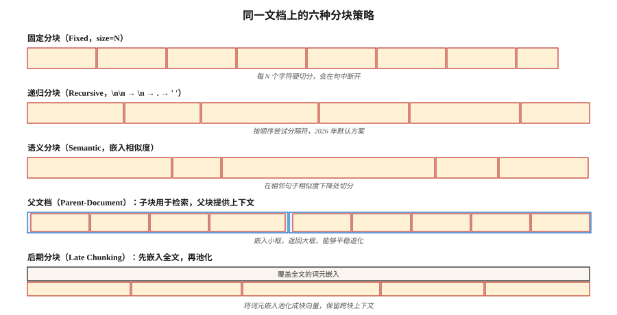

# RAG 分块策略（Chunking Strategies for RAG）

> 分块配置对检索质量的影响与嵌入模型选择同样大（Vectara，NAACL 2025）。分块做错，再多重排序也救不了。

**Type:** Build
**Languages:** Python
**Prerequisites:** 阶段 5 · 14（信息检索 Information Retrieval）、阶段 5 · 22（嵌入模型 Embedding Models）
**Time:** 约 60 分钟

## 问题（The Problem）

你把一份 50 页合同放入 RAG 系统，用户问：“终止条款是什么？”检索器却返回封面。为什么？因为模型在 512 词元的块上训练，而终止条款位于第 20 页，被分页拆开，局部又没有将其与查询关联的关键词。

修复方法不是“买更好的嵌入模型”，而是分块：多大？是否重叠？在哪里切？要不要周围上下文？

2026 年 2 月的基准给出了意外结果：

- Vectara 2026 年研究：递归 512 词元分块胜过语义分块，准确率为 69% 对 54%。
- Natural Questions 上的 SPLADE + Mistral-8B：重叠没有可测量的收益。
- 上下文断崖（Context Cliff）：上下文达到约 2,500 个词元时，响应质量急剧下降。

“显而易见”的答案，例如语义分块、20% 重叠、1000 词元，往往不对。本课建立对六种策略的直观理解，并说明如何选择。

## 概念（The Concept）



**固定分块（Fixed Chunking）。**每 N 个字符或词元切分一次，是最简单的基线。会在句中断开，压缩效果好，连贯性差。

**递归分块（Recursive Chunking）。**LangChain 的 `RecursiveCharacterTextSplitter`。先尝试按 `\n\n`，再按 `\n`、`.`、空格切分，能够顺畅回退，是 2026 年默认方案。

**语义分块（Semantic Chunking）。**嵌入每个句子，计算相邻句子的余弦相似度，在相似度低于阈值处切分。保留主题连贯性，但速度较慢，有时会生成只有 40 个词元的小碎片，损害检索。

**句子分块（Sentence Chunking）。**按句子边界切分，每块一句或 N 句窗口。规模达到约 5k 词元之前，可用远低于语义分块的成本取得相当效果。

**父文档分块（Parent-Document）。**既存储用于检索的小子块，*也*存储提供上下文的大父块。根据子块检索，返回父块。能够平稳退化：子块不好，仍能返回合理父块。

**后期分块（Late Chunking，2024）。**先为整篇文档生成词元级嵌入，再将词元嵌入池化为块嵌入。保留跨块上下文，适用于 BGE-M3、Jina v3 等长上下文嵌入模型，计算成本更高。

**上下文化检索（Contextual Retrieval，Anthropic，2024）。**在每个块前加入 LLM 生成的定位摘要，例如“这个块是终止条款的第 3.2 节……”。在 Anthropic 自身基准中，检索提升 35–50%，但索引构建昂贵。

### 优于任何默认值的规则（The Rule That Beats Every Default）

让分块大小匹配查询类型：

| 查询类型 | 分块大小 |
|------------|-----------|
| 事实型，例如“CEO 叫什么？” | 256–512 词元 |
| 分析型 / 多跳 | 512–1024 词元 |
| 整节理解 | 1024–2048 词元 |

这是 NVIDIA 2026 年基准的结果。块要足够大，容纳答案和局部上下文；也要足够小，让检索器前 K 个结果聚焦答案，而不是上下文噪声。

```figure
n5-chunk-cuts
```

## 动手实现（Build It）

### 步骤 1：固定与递归分块（Fixed and Recursive Chunking）

```python
def chunk_fixed(text, size=512, overlap=0):
    step = size - overlap
    return [text[i:i + size] for i in range(0, len(text), step)]


def chunk_recursive(text, size=512, seps=("\n\n", "\n", ". ", " ")):
    if len(text) <= size:
        return [text]
    for sep in seps:
        if sep not in text:
            continue
        parts = text.split(sep)
        chunks = []
        buf = ""
        for p in parts:
            if len(p) > size:
                if buf:
                    chunks.append(buf)
                    buf = ""
                chunks.extend(chunk_recursive(p, size=size, seps=seps[1:] or (" ",)))
                continue
            candidate = buf + sep + p if buf else p
            if len(candidate) <= size:
                buf = candidate
            else:
                if buf:
                    chunks.append(buf)
                buf = p
        if buf:
            chunks.append(buf)
        return [c for c in chunks if c.strip()]
    return chunk_fixed(text, size)
```

### 步骤 2：语义分块（Semantic Chunking）

```python
def chunk_semantic(text, encoder, threshold=0.6, min_chars=200, max_chars=2048):
    sentences = split_sentences(text)
    if not sentences:
        return []
    embs = encoder.encode(sentences, normalize_embeddings=True)
    chunks = [[sentences[0]]]
    for i in range(1, len(sentences)):
        sim = float(embs[i] @ embs[i - 1])
        current_len = sum(len(s) for s in chunks[-1])
        if sim < threshold and current_len >= min_chars:
            chunks.append([sentences[i]])
        else:
            chunks[-1].append(sentences[i])

    result = []
    for group in chunks:
        text_group = " ".join(group)
        if len(text_group) > max_chars:
            result.extend(chunk_recursive(text_group, size=max_chars))
        else:
            result.append(text_group)
    return result
```

在自己的领域上调优 `threshold`。太高会产生碎片，太低会得到一个巨块。

### 步骤 3：父文档（Parent-Document）

```python
def chunk_parent_child(text, parent_size=2048, child_size=256):
    parents = chunk_recursive(text, size=parent_size)
    mapping = []
    for p_idx, parent in enumerate(parents):
        children = chunk_recursive(parent, size=child_size)
        for child in children:
            mapping.append({"child": child, "parent_idx": p_idx, "parent": parent})
    return mapping


def retrieve_parent(child_query, mapping, encoder, top_k=3):
    child_embs = encoder.encode([m["child"] for m in mapping], normalize_embeddings=True)
    q_emb = encoder.encode([child_query], normalize_embeddings=True)[0]
    scores = child_embs @ q_emb
    top = np.argsort(-scores)[:top_k]
    seen, parents = set(), []
    for i in top:
        if mapping[i]["parent_idx"] not in seen:
            parents.append(mapping[i]["parent"])
            seen.add(mapping[i]["parent_idx"])
    return parents
```

关键洞见：父块去重。多个子块可以映射到同一个父块，全部返回会浪费上下文。

### 步骤 4：上下文化检索（Anthropic 模式）

```python
def contextualize_chunks(document, chunks, llm):
    context_prompts = [
        f"""<document>{document}</document>
Here is the chunk to situate: <chunk>{c}</chunk>
Write 50-100 words placing this chunk in the document's context."""
        for c in chunks
    ]
    contexts = llm.batch(context_prompts)
    return [f"{ctx}\n\n{c}" for ctx, c in zip(contexts, chunks)]
```

为上下文化后的块建立索引。查询时，检索受益于额外的周围信息。

### 步骤 5：评估（Evaluate）

```python
def recall_at_k(queries, corpus_chunks, encoder, k=5):
    chunk_embs = encoder.encode(corpus_chunks, normalize_embeddings=True)
    hits = 0
    for q_text, gold_idxs in queries:
        q_emb = encoder.encode([q_text], normalize_embeddings=True)[0]
        top = np.argsort(-(chunk_embs @ q_emb))[:k]
        if any(i in gold_idxs for i in top):
            hits += 1
    return hits / len(queries)
```

始终做基准测试。对你的语料最好的策略，可能与任何博客文章都不同。

## 陷阱（Pitfalls）

- **只在事实型查询上评估分块。**多跳查询会揭示完全不同的赢家。使用按查询类型分层的评估集。
- **语义分块没有最小大小。**会产生损害检索的 40 词元碎片。始终强制 `min_tokens`。
- **盲从重叠（Overlap）。**2026 年研究发现，重叠往往毫无收益，却让索引成本翻倍。应测量，不要假设。
- **不强制最小或最大大小。**5 词元和 5000 词元的块都会破坏检索，应限制范围。
- **跨文档分块（Cross-Doc Chunking）。**绝不让一个块跨越两篇文档。始终逐文档分块，再合并结果。

## 实际应用（Use It）

2026 年的技术栈：

| 场景 | 策略 |
|-----------|----------|
| 首次构建，语料未知 | 递归，512 词元，无重叠 |
| 事实型问答 | 递归，256–512 词元 |
| 分析型 / 多跳 | 递归，512–1024 词元 + 父文档 |
| 大量交叉引用（合同、论文） | 后期分块或上下文化检索 |
| 对话语料 | 按轮次分块 + 说话者元数据 |
| 短话语（推文、评论） | 一篇文档 = 一个块 |

从递归 512 开始，在 50 查询评估集上测量 recall@5，再据此调优。

## 交付成果（Ship It）

保存为 `outputs/skill-chunker.md`：

```markdown
---
name: chunker
description: 根据给定语料库与查询分布选择分块策略、大小和重叠。
version: 1.0.0
phase: 5
lesson: 23
tags: [nlp, rag, chunking]
---

给定语料库（文档类型、平均长度、领域）和查询分布（事实型 / 分析型 / 多跳），输出：

1. 策略（Strategy）。递归、句子、语义、父文档、后期或上下文化，说明理由。
2. 分块大小（Chunk Size）。词元数量，结合查询类型说明理由。
3. 重叠（Overlap）。默认 0，大于 0 时说明依据。
4. 最小与最大大小约束。`min_tokens`、`max_tokens` 防护。
5. 评估计划（Evaluation Plan）。在 50 查询分层评估集（事实型、分析型、多跳）上测量 Recall@5。

拒绝任何不强制最小与最大块大小的策略。没有消融实验显示收益，就拒绝超过 20% 的重叠。对没有最小词元下限的语义分块建议提出警示。
```

## 练习（Exercises）

1. **简单。**用 fixed(512, 0)、recursive(512, 0) 和 recursive(512, 100) 对一份 20 页文档分块，比较块数量和边界质量。
2. **中等。**围绕 5 篇文档构建 30 查询评估集，测量递归、语义和父文档策略的 recall@5。谁胜出？结果与博客说法一致吗？
3. **困难。**实现上下文化检索，测量相对递归基线的 MRR 提升，报告索引成本（LLM 调用）与准确率收益。

## 关键术语（Key Terms）

| 术语 | 常见说法 | 实际含义 |
|------|-----------------|-----------------------|
| 块（Chunk） | 文档的一部分 | 被嵌入、索引和检索的子文档单位。 |
| 重叠（Overlap） | 安全余量 | 相邻块共享 N 个词元；在 2026 年基准中通常无用。 |
| 语义分块（Semantic Chunking） | 智能分块 | 在相邻句子嵌入相似度下降处切分。 |
| 父文档（Parent-Document） | 两级检索 | 检索小子块，返回大父块。 |
| 后期分块（Late Chunking） | 嵌入后再分块 | 先对全文做词元级嵌入，再池化成块向量。 |
| 上下文化检索（Contextual Retrieval） | Anthropic 的技巧 | 索引前在每个块前加入 LLM 生成的摘要。 |
| 上下文断崖（Context Cliff） | 2500 词元墙 | 2026 年 1 月观察到，RAG 在约 2.5k 上下文词元附近质量下降。 |

## 延伸阅读（Further Reading）

- [Yepes 等 / LangChain：递归字符切分文档](https://python.langchain.com/docs/how_to/recursive_text_splitter/)：生产默认方案。
- [Vectara（2024，NAACL 2025）：分块配置分析（Chunking Configurations Analysis）](https://arxiv.org/abs/2410.13070)：分块与嵌入选择同样重要。
- [Jina AI：长上下文嵌入模型中的后期分块（Late Chunking in Long-Context Embedding Models，2024）](https://jina.ai/news/late-chunking-in-long-context-embedding-models/)：后期分块论文。
- [Anthropic：上下文化检索（Contextual Retrieval）](https://www.anthropic.com/news/contextual-retrieval)：LLM 生成的上下文前缀带来 35–50% 检索提升。
- [NVIDIA 2026 年分块大小基准：Premai 摘要](https://blog.premai.io/rag-chunking-strategies-the-2026-benchmark-guide/)：按查询类型选择块大小。
