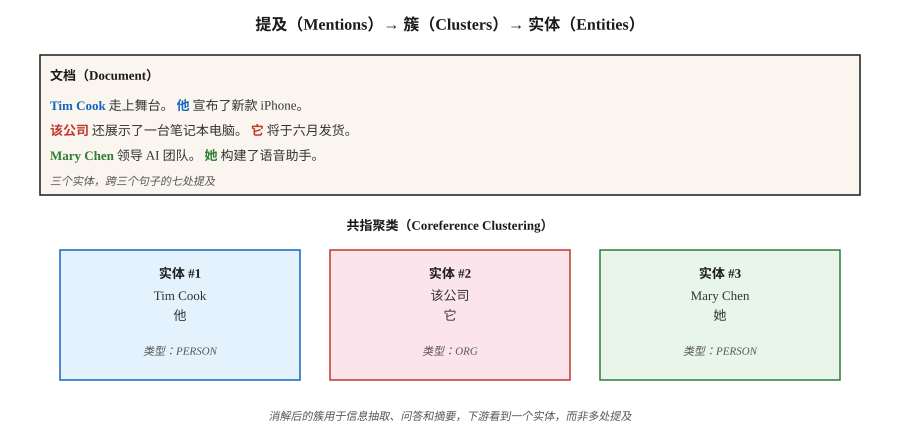

# 共指消解（Coreference Resolution）

> “她给他打了电话。他没有接。医生正在吃午饭。”三处指称涉及两个人，却没人被点名。共指消解负责弄清谁是谁。

**Type:** Learn
**Languages:** Python
**Prerequisites:** 阶段 5 · 06（命名实体识别 NER）、阶段 5 · 07（词性与句法分析 POS & Parsing）
**Time:** 约 60 分钟

## 问题（The Problem）

从一篇 300 词文章中提取所有对 Apple Inc. 的提及。文章写“Apple”时很容易，写“该公司”“他们”“Cupertino 的科技巨头”或“Jobs 的公司”时就难了。如果不将这些提及解析到同一个实体，NER 流水线就会遗漏 60–80% 的提及。

共指消解将指向同一现实实体的所有表达链接为一个簇。它连接了表层 NLP（NER、句法分析）与下游语义任务（信息抽取 IE、问答 QA、摘要、知识图谱 KG）。

它在 2026 年的重要性：

- 摘要：“CEO 宣布……”与“Tim Cook 宣布……”相比，摘要应点明 CEO 姓名。
- 问答：“她给谁打了电话？”需要解析“她”。
- 信息抽取：知识图谱将“PER1 创立 Apple”和“Jobs 创立 Apple”列为独立条目是不正确的。
- 多文档信息抽取：合并不同文章中关于同一事件的提及，就是跨文档共指。

## 概念（The Concept）



**任务（Task）。**输入一篇文档，输出提及片段的聚类，每个簇对应一个实体。

**提及类型（Mention Types）。**

- **命名实体（Named Entity）。**“Tim Cook”。
- **名词性提及（Nominal）。**“CEO”“该公司”。
- **代词性提及（Pronominal）。**“他”“她”“他们”“它”。
- **同位语（Appositive）。**“Tim Cook，Apple 的 CEO，”。

**架构（Architectures）。**

1. **规则方法（Rule-Based，Hobbs，1978）。**利用语法规则、基于句法树进行代词消解，是很好的基线，在代词上出乎意料地难以超越。
2. **提及对分类器（Mention-Pair Classifier）。**对每对提及 (m_i, m_j) 预测是否共指，再通过传递闭包聚类，是 2016 年前的标准。
3. **提及排序（Mention-Ranking）。**对每个提及，排序候选先行词，包括“无先行词”，选择最高项。
4. **基于片段的端到端方法（Span-Based End-to-End，Lee 等，2017）。**使用 Transformer 编码器，枚举长度上限内的所有候选片段，预测提及分数及各片段的先行词概率，再贪心聚类，是现代默认方案。
5. **生成式方法（Generative，2024 年起）。**提示 LLM：“列出文本中每个代词及其先行词。”简单情况表现良好，长文档和罕见指称对象仍困难。

**评估指标（Evaluation Metrics）。**有五种标准指标：MUC、B³、CEAF、BLANC、LEA，因为没有单一指标能全面反映聚类质量。将前三者的平均值报告为 CoNLL F1。2026 年 CoNLL-2012 上的最佳水平约为 83 F1。

**已知难例（Known Hard Cases）。**

- 定指描述指向数页前引入的实体。
- 桥接照应（Bridging Anaphora），例如“车轮”指向之前提到的汽车。
- 中文和日语等语言中的零形照应（Zero Anaphora）。
- 后指（Cataphora），代词出现在指称对象之前：“当**她**走进来时，Mary 笑了。”

```figure
coref-links
```

## 动手实现（Build It）

### 步骤 1：预训练神经共指模型（AllenNLP / spaCy-experimental）

```python
import spacy
nlp = spacy.load("en_coreference_web_trf")   # experimental model
doc = nlp("Apple announced new products. The company said they would ship soon.")
for cluster in doc._.coref_clusters:
    print(cluster, "->", [m.text for m in cluster])
```

在较长文档上，可能得到：
- 簇 1：[Apple, The company, they]，即 Apple、该公司、他们。
- 簇 2：[new products]，即新产品。

### 步骤 2：基于规则的代词消解器（教学）

仅依赖标准库的实现见 `code/main.py`：

1. 提取提及：命名实体（首字母大写片段）、代词（字典查询）、定指描述（“the X”）。
2. 对每个代词，查看之前 K 个提及，按以下因素评分：
   - 性别与数的一致性（启发式）
   - 新近程度（越近越优先）
   - 句法角色（偏好主语）
3. 链接得分最高的先行词。

它无法与神经模型竞争，但展示了搜索空间，以及端到端模型必须做出的决策。

### 步骤 3：使用 LLM 进行共指消解

```python
prompt = f"""Text: {text}

List every pronoun and noun phrase that refers to a person or company.
Cluster them by what they refer to. Output JSON:
[{{"entity": "Apple", "mentions": ["Apple", "the company", "it"]}}, ...]
"""
```

注意两种失败模式。首先，LLM 过度合并，例如将指向两个不同人的“him”和“her”合并。其次，LLM 在长文档中会静默遗漏提及。始终通过片段偏移量检查验证。

### 步骤 4：评估（Evaluation）

标准 conll-2012 脚本计算 MUC、B³、CEAF-φ4 并报告平均值。内部评估可先在标注测试集上测量片段级精确率和召回率，再添加提及链接 F1。

## 陷阱（Pitfalls）

- **单例膨胀（Singleton Explosion）。**某些系统把每个提及都报告为独立簇。B³ 较宽容，MUC 会惩罚这种情况。始终检查全部三个指标。
- **长上下文中的代词。**文档超过 2,000 词元时，效果下降约 15 F1，需谨慎分块。
- **性别假设（Gender Assumptions）。**硬编码性别规则在非二元性别指称对象、组织和动物上失效。使用学习模型或中性评分。
- **LLM 在长文档上漂移。**单次 API 调用无法可靠聚类跨 50 多个段落的提及。使用滑动窗口加合并。

## 实际应用（Use It）

2026 年的技术栈：

| 场景 | 选择 |
|-----------|------|
| 英语，单文档 | `en_coreference_web_trf`（spaCy-experimental）或 AllenNLP 神经共指 |
| 多语言 | 在 OntoNotes 或 Multilingual CoNLL 上训练的 SpanBERT / XLM-R |
| 跨文档事件共指 | 专用端到端模型（2025–2026 最佳水平） |
| 快速 LLM 基线 | GPT-4o / Claude + 结构化输出共指提示词 |
| 生产对话系统 | 规则回退 + 神经主模型 + 关键槽位人工复核 |

2026 年上线的集成模式：先运行 NER，再运行共指消解，将共指簇合并到 NER 实体。下游任务看到每簇一个实体，而不是每次提及一个实体。

## 交付成果（Ship It）

保存为 `outputs/skill-coref-picker.md`：

```markdown
---
name: coref-picker
description: 选择共指消解方法、评估计划与集成策略。
version: 1.0.0
phase: 5
lesson: 24
tags: [nlp, coref, information-extraction]
---

给定用例（单文档 / 多文档、领域、语言），输出：

1. 方法（Approach）。规则、神经片段模型、LLM 提示或混合，用一句话说明理由。
2. 模型（Model）。如果采用神经方法，指出具体检查点。
3. 集成（Integration）。操作顺序：分词 → NER → 共指消解 → 下游任务。
4. 评估（Evaluation）。留出集 CoNLL F1（MUC、B³、CEAF-φ4 平均值），以及 20 篇文档的人工簇复核。

文档超过 2,000 词元且没有滑动窗口合并时，拒绝仅用 LLM 共指消解。拒绝没有提及级精确率与召回率报告的共指流水线。对将性别启发式系统部署在人口特征多样文本中的方案提出警示。
```

## 练习（Exercises）

1. **简单。**在 5 个人工构造段落上运行 `code/main.py` 中的规则消解器，对照真值测量提及链接准确率。
2. **中等。**在新闻文章上使用预训练神经共指模型，将簇与自己的人工标注比较。它在哪里失败？
3. **困难。**构建共指增强 NER 流水线：先 NER，再通过共指簇合并。在 100 篇文章上测量相对于纯 NER 的实体覆盖率提升。

## 关键术语（Key Terms）

| 术语 | 常见说法 | 实际含义 |
|------|-----------------|-----------------------|
| 提及（Mention） | 一次指称 | 指向实体的文本片段，如名称、代词、名词短语。 |
| 先行词（Antecedent） | “它”指什么 | 与后面提及共指的更早提及。 |
| 簇（Cluster） | 实体的各次提及 | 全部指向同一个现实实体的提及集合。 |
| 回指（Anaphora） | 向后回溯指称 | 后面的提及指向前面的提及，例如“他” → “John”。 |
| 后指（Cataphora） | 向前指称 | 前面的提及指向后面的提及，例如“当他到达时，John……”。 |
| 桥接（Bridging） | 隐含指称 | “我买了一辆车。车轮很差。”指的是那辆车的车轮。 |
| CoNLL F1 | 排行榜上的数字 | MUC、B³、CEAF-φ4 的 F1 分数平均值。 |

## 延伸阅读（Further Reading）

- [Jurafsky 与 Martin，SLP3 第 26 章：共指消解与实体链接（Coreference Resolution and Entity Linking）](https://web.stanford.edu/~jurafsky/slp3/26.pdf)：经典教材章节。
- [Lee 等（2017）：端到端神经共指消解（End-to-end Neural Coreference Resolution）](https://arxiv.org/abs/1707.07045)：基于片段的端到端方法。
- [Joshi 等（2020）：SpanBERT](https://arxiv.org/abs/1907.10529)：改善共指消解的预训练。
- [Pradhan 等（2012）：CoNLL-2012 共享任务（Shared Task）](https://aclanthology.org/W12-4501/)：该基准。
- [Hobbs（1978）：代词指称消解（Resolving Pronoun References）](https://www.sciencedirect.com/science/article/pii/0024384178900064)：规则方法经典论文。
