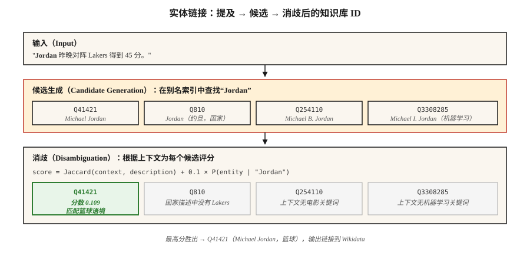

# 实体链接与消歧（Entity Linking & Disambiguation）

> NER 找到了“Paris”。实体链接判断它是法国巴黎、Paris Hilton、得克萨斯州 Paris，还是特洛伊王子 Paris？没有链接，知识图谱就始终存在歧义。

**Type:** Build
**Languages:** Python
**Prerequisites:** 阶段 5 · 06（命名实体识别 NER）、阶段 5 · 24（共指消解 Coreference Resolution）
**Time:** 约 60 分钟

## 问题（The Problem）

句子写道：“Jordan beat the press.”（Jordan 突破了紧逼防守。）NER 将“Jordan”标为 PERSON，很好。但究竟是哪位 Jordan？

- Michael Jordan（篮球运动员）？
- Michael B. Jordan（演员）？
- Michael I. Jordan（Berkeley 的机器学习教授；没错，这种混淆确实存在于机器学习论文中）？
- Jordan（约旦这个国家）？
- Jordan（希伯来语人名）？

实体链接（Entity Linking，EL）将每个提及解析为知识库中的唯一条目，知识库可以是 Wikidata、Wikipedia、DBpedia 或你的领域知识库。它有两个子任务：

1. **候选生成（Candidate Generation）。**给定“Jordan”，哪些知识库条目合理？
2. **消歧（Disambiguation）。**结合上下文，哪个候选才正确？

两个步骤都可学习，都有基准评估。组合流水线已稳定十年，变化的是消歧器的质量。

## 概念（The Concept）



**候选生成。**给定提及的表层形式“Jordan”，在别名索引中查找候选。Wikipedia 别名字典覆盖大多数命名实体，例如“JFK” → John F. Kennedy、Jacqueline Kennedy、JFK 机场、电影 JFK。典型索引为每个提及返回 10–30 个候选。

**消歧的三种方法。**

1. **先验 + 上下文（Prior + Context，Milne 与 Witten，2008）。**`P(entity | mention) × context-similarity(entity, text)`。效果好、速度快、无需训练。
2. **基于嵌入（Embedding-Based，ESS / REL / Blink）。**编码提及及上下文，再编码每个候选的描述，选取最大余弦相似度，是 2020–2024 年的默认方案。
3. **生成式（Generative，GENRE，2021；基于 LLM，2023 年起）。**逐词元解码实体的规范名称，约束到合法实体名称的前缀树（Trie），保证输出是有效知识库 ID。

**端到端与流水线（End-to-End / Pipeline）。**现代模型（ELQ、BLINK、ExtEnD、GENRE）一次运行 NER、候选生成和消歧。生产中仍以流水线为主，因为可以替换组件。

### 两项测量（The Two Measurements）

- **提及召回率（Mention Recall，候选生成）。**标准提及中，正确知识库条目出现在候选列表中的比例，是整个流水线的基础限制。
- **消歧准确率 / F1（Disambiguation Accuracy）。**候选正确时，排名第一的结果有多大比例正确。

始终报告两者。候选召回率 80%、消歧准确率 99% 的系统，整体也只是约 80% 的流水线。

```figure
gx-entity-linking
```

## 动手实现（Build It）

### 步骤 1：从 Wikipedia 重定向构建别名索引

```python
alias_to_entities = {
    "jordan": ["Q41421 (Michael Jordan)", "Q810 (Jordan, country)", "Q254110 (Michael B. Jordan)"],
    "paris":  ["Q90 (Paris, France)", "Q663094 (Paris, Texas)", "Q55411 (Paris Hilton)"],
    "apple":  ["Q312 (Apple Inc.)", "Q89 (apple, fruit)"],
}
```

Wikipedia 别名数据约有 18M 组别名—实体对。从 Wikidata 转储下载，并存为倒排索引。

### 步骤 2：基于上下文消歧（Context-Based Disambiguation）

```python
def disambiguate(mention, context, alias_index, entity_desc):
    candidates = alias_index.get(mention.lower(), [])
    if not candidates:
        return None, 0.0
    context_words = set(tokenize(context))
    best, best_score = None, -1
    for entity_id in candidates:
        desc_words = set(tokenize(entity_desc[entity_id]))
        union = len(context_words | desc_words)
        score = len(context_words & desc_words) / union if union else 0.0
        if score > best_score:
            best, best_score = entity_id, score
    return best, best_score
```

Jaccard 重叠只是玩具方案。替换为嵌入上的余弦相似度，Transformer 版本见 `code/main.py` 的步骤 2。

### 步骤 3：基于嵌入（BLINK 风格）

```python
from sentence_transformers import SentenceTransformer
encoder = SentenceTransformer("sentence-transformers/all-MiniLM-L6-v2")

def embed_mention(text, mention_span):
    start, end = mention_span
    marked = f"{text[:start]} [MENTION] {text[start:end]} [/MENTION] {text[end:]}"
    return encoder.encode([marked], normalize_embeddings=True)[0]

def embed_entity(entity_id, description):
    return encoder.encode([f"{entity_id}: {description}"], normalize_embeddings=True)[0]
```

建立索引时，每个知识库实体只嵌入一次。查询时，将提及与上下文嵌入一次，与候选池做点积，选择最大值。

### 步骤 4：生成式实体链接（概念）

GENRE 逐字符解码实体的 Wikipedia 标题。约束解码（见第 20 课）确保只输出合法标题，并与知识库支持的前缀树紧密集成。现代衍生方案是 REL-GEN，以及使用结构化输出的 LLM 提示式实体链接。

```python
prompt = f"""Text: {text}
Mention: {mention}
List the best Wikipedia title for this mention.
Respond with JSON: {{"title": "..."}}"""
```

结合允许列表（Outlines `choice`），这是 2026 年最简单的可上线实体链接流水线。

### 步骤 5：在 AIDA-CoNLL 上评估

AIDA-CoNLL 是标准实体链接基准，包含 1,393 篇 Reuters 文章、34k 个提及和 Wikipedia 实体。报告知识库内准确率（`P@1`）与知识库外 NIL 检出率。

## 陷阱（Pitfalls）

- **NIL 处理。**某些提及不在知识库中，例如新出现的实体、不知名人物。系统必须预测 NIL，而不是猜错实体，且要单独测量。
- **提及边界错误（Mention Boundary Errors）。**上游 NER 漏掉部分片段，例如把“Bank of America”只标为“Bank”，会降低实体链接召回率。
- **流行度偏差（Popularity Bias）。**训练后的系统过度预测高频实体。机器学习论文中的“Michael I. Jordan”经常被链接到篮球运动员 Jordan。
- **跨语言实体链接（Cross-Lingual EL）。**将中文提及映射到英语 Wikipedia 实体，需要多语言编码器或翻译步骤。
- **知识库陈旧（KB Staleness）。**新公司、事件和人物不在去年的 Wikipedia 转储中。生产流水线需要刷新循环。

## 实际应用（Use It）

2026 年的技术栈：

| 场景 | 选择 |
|-----------|------|
| 通用英语 + Wikipedia | BLINK 或 REL |
| 跨语言，知识库为 Wikipedia | mGENRE |
| 适合 LLM，每天提及量少 | 给 Claude/GPT-4 提供候选列表 + 约束 JSON |
| 医疗、法律等领域知识库 | 自定义 BERT，结合知识库感知检索，并在领域 AIDA 风格数据集上微调 |
| 极低延迟 | 仅精确匹配先验（Milne-Witten 基线） |
| 研究最佳水平 | GENRE / ExtEnD / 生成式 LLM-EL |

2026 年生产模式：NER → 共指消解 → 对每个提及做实体链接 → 每簇归并为一个规范实体。输出是文档中每个实体一个知识库 ID，而不是每次提及一个。

## 交付成果（Ship It）

保存为 `outputs/skill-entity-linker.md`：

```markdown
---
name: entity-linker
description: 设计实体链接流水线，包括知识库、候选生成器、消歧器与评估。
version: 1.0.0
phase: 5
lesson: 25
tags: [nlp, entity-linking, knowledge-graph]
---

给定用例（领域知识库、语言、处理量、延迟预算），输出：

1. 知识库（Knowledge Base）。Wikidata、Wikipedia 或自定义知识库，注明版本日期和刷新周期。
2. 候选生成器（Candidate Generator）。别名索引、嵌入或混合，给出目标提及 recall @ K。
3. 消歧器（Disambiguator）。先验 + 上下文、基于嵌入、生成式或 LLM 提示式。
4. NIL 策略。最高分阈值、分类器或显式 NIL 候选。
5. 评估（Evaluation）。留出集提及 recall @ 30、top-1 准确率和 NIL 检测 F1。

拒绝没有提及召回率基线的实体链接流水线；不知道候选生成是否找出正确实体，就无法评估消歧器。拒绝未将输出约束为有效知识库 ID 的 LLM 提示式实体链接流水线。对于流行度偏差影响少数实体（例如同名冲突），却没有进行领域微调的系统，提出警示。
```

## 练习（Exercises）

1. **简单。**针对 Paris、Jordan、Apple 等 10 个歧义提及，实现 `code/main.py` 的先验 + 上下文消歧器。手工标注正确实体，测量准确率。
2. **中等。**用句子 Transformer 编码 50 个歧义提及，并嵌入每个候选描述。比较嵌入消歧与 Jaccard 上下文重叠。
3. **困难。**构建 1k 实体的领域知识库，例如公司的员工和产品。端到端实现 NER + 实体链接，在 100 个留出句子上测量精确率和召回率。

## 关键术语（Key Terms）

| 术语 | 常见说法 | 实际含义 |
|------|-----------------|-----------------------|
| 实体链接（Entity Linking，EL） | 链接到 Wikipedia | 将提及映射到唯一知识库条目。 |
| 候选生成（Candidate Generation） | 可能是谁？ | 为提及返回合理知识库条目的短名单。 |
| 消歧（Disambiguation） | 选对的那个 | 使用上下文为候选评分，选取胜者。 |
| 别名索引（Alias Index） | 查询表 | 从表层形式映射到候选实体。 |
| NIL | 不在知识库 | 显式预测没有匹配的知识库条目。 |
| KB | 知识库（Knowledge Base） | Wikidata、Wikipedia、DBpedia 或领域知识库。 |
| AIDA-CoNLL | 那个基准 | 带标准实体链接的 1,393 篇 Reuters 文章。 |

## 延伸阅读（Further Reading）

- [Milne、Witten（2008）：学习与 Wikipedia 链接（Learning to Link with Wikipedia）](https://www.cs.waikato.ac.nz/~ihw/papers/08-DM-IHW-LearningToLinkWithWikipedia.pdf)：基础的先验 + 上下文方法。
- [Wu 等（2020）：通过稠密实体检索进行零样本实体链接（Zero-shot Entity Linking with Dense Entity Retrieval，BLINK）](https://arxiv.org/abs/1911.03814)：基于嵌入的主力方法。
- [De Cao 等（2021）：自回归实体检索（Autoregressive Entity Retrieval，GENRE）](https://arxiv.org/abs/2010.00904)：采用约束解码的生成式实体链接。
- [Hoffart 等（2011）：文本命名实体的稳健消歧（Robust Disambiguation of Named Entities in Text，AIDA）](https://www.aclweb.org/anthology/D11-1072.pdf)：基准论文。
- [REL：站在巨人肩膀上的实体链接器（An Entity Linker Standing on the Shoulders of Giants，2020）](https://arxiv.org/abs/2006.01969)：开放生产技术栈。
