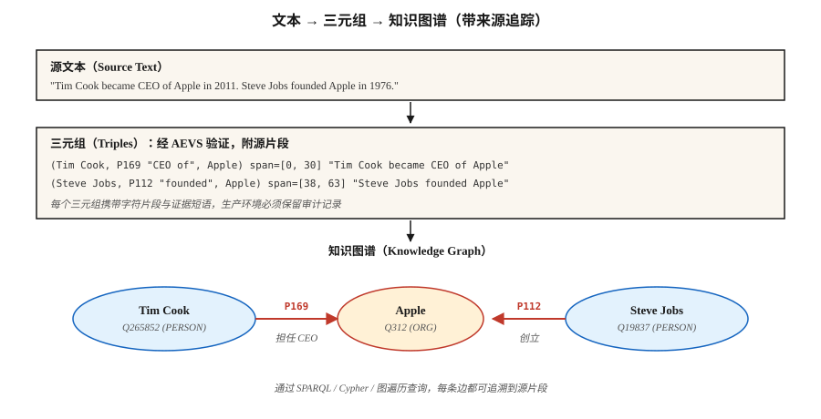

# 关系抽取与知识图谱构建（Relation Extraction & Knowledge Graph Construction）

> NER 找到实体，实体链接将它们锚定，关系抽取找到实体间的边。知识图谱是节点、边及其来源的集合。

**Type:** Build
**Languages:** Python
**Prerequisites:** 阶段 5 · 06（命名实体识别 NER）、阶段 5 · 25（实体链接 Entity Linking）
**Time:** 约 60 分钟

## 问题（The Problem）

分析师读到：“Tim Cook 于 2011 年成为 Apple 的 CEO。”其中有四个事实：

- `(Tim Cook, role, CEO)`
- `(Tim Cook, employer, Apple)`
- `(Tim Cook, start_date, 2011)`
- `(Apple, type, Organization)`

关系抽取（Relation Extraction，RE）将自由文本转为结构化三元组 `(subject, relation, object)`。跨语料聚合就得到知识图谱，再加上查询，就得到支撑 RAG、分析或合规审计的推理基础。

2026 年的问题：LLM 积极抽取关系，甚至过于积极，会产生源文本不支持的三元组幻觉。没有来源追踪，就无法区分真实三元组与看似合理的虚构。2026 年的答案是 AEVS 风格的锚定与验证流水线。

## 概念（The Concept）



**三元组形式（Triple Form）。**`(subject_entity, relation_type, object_entity)`。关系来自封闭本体（Closed Ontology），例如 Wikidata 属性、FIBO、UMLS，或来自开放集合，即 OpenIE 风格、不限定关系。

**三种抽取方法。**

1. **基于规则或模式（Rule / Pattern-Based）。**Hearst 模式：“X such as Y” → `(Y, isA, X)`，再加手写正则。脆弱，但精确且可解释。
2. **监督分类器（Supervised Classifier）。**给定句中两个实体提及，从固定集合预测关系。在 TACRED、ACE、KBP 上训练，是 2015–2022 年的标准。
3. **生成式 LLM（Generative LLM）。**提示模型输出三元组，开箱即用。需要来源，否则会编造看似合理的垃圾信息。

**AEVS（锚定—抽取—验证—补充，Anchor-Extraction-Verification-Supplement，2026）。**当前的幻觉缓解框架：

- **锚定（Anchor）。**识别所有实体片段和关系短语片段的精确位置。
- **抽取（Extract）。**生成链接到锚定片段的三元组。
- **验证（Verify）。**将每个三元组元素匹配回源文本，拒绝无支持内容。
- **补充（Supplement）。**执行覆盖检查，确保不遗漏任何锚定片段。

幻觉显著减少。计算更多，但可审计。

**开放与封闭的权衡（Open / Closed）。**

- **封闭本体。**固定属性列表，例如 Wikidata 的 11,000 多项属性。可预测、可查询、难以随意编造。
- **开放信息抽取（Open IE）。**任何动词短语都可成为关系。召回高，精确率低，查询混乱。

生产知识图谱通常混合使用：开放信息抽取用于发现，再将关系规范化到封闭本体，合入主图谱。

```figure
relation-triples
```

## 动手实现（Build It）

### 步骤 1：基于模式抽取（Pattern-Based Extraction）

```python
PATTERNS = [
    (r"(?P<s>[A-Z]\w+) (?:is|was) (?:a|an|the) (?P<o>[A-Z]?\w+)", "isA"),
    (r"(?P<s>[A-Z]\w+) (?:is|was) born in (?P<o>\w+)", "bornIn"),
    (r"(?P<s>[A-Z]\w+) works? (?:at|for) (?P<o>[A-Z]\w+)", "worksAt"),
    (r"(?P<s>[A-Z]\w+) founded (?P<o>[A-Z]\w+)", "founded"),
]
```

完整玩具抽取器见 `code/main.py`。Hearst 模式由于便于调试，仍用于领域专用流水线。

### 步骤 2：监督关系分类（Supervised Relation Classification）

```python
from transformers import AutoTokenizer, AutoModelForSequenceClassification

tok = AutoTokenizer.from_pretrained("Babelscape/rebel-large")
model = AutoModelForSequenceClassification.from_pretrained("Babelscape/rebel-large")

text = "Tim Cook was born in Alabama. He later became CEO of Apple."
encoded = tok(text, return_tensors="pt", truncation=True)
output = model.generate(**encoded, max_length=200)
triples = tok.batch_decode(output, skip_special_tokens=False)
```

REBEL 是 seq2seq 关系抽取器：输入文本，输出已使用 Wikidata 属性 ID 的三元组，在远程监督数据上微调，是标准开放权重基线。

### 步骤 3：带锚定的 LLM 提示式抽取

```python
prompt = f"""Extract (subject, relation, object) triples from the text.
For each triple, include the exact character span in the source text.

Text: {text}

Output JSON:
[{{"subject": {{"text": "...", "span": [start, end]}},
   "relation": "...",
   "object": {{"text": "...", "span": [start, end]}}}}, ...]

Only include triples fully supported by the text. No inference beyond what is stated.
"""
```

将返回的每个片段与源文本核验。凡是 `text[start:end] != triple_entity` 的结果都拒绝。这是 AEVS 验证步骤的最小形式。

### 步骤 4：规范化到封闭本体（Canonicalization）

```python
RELATION_MAP = {
    "is the CEO of": "P169",       # "chief executive officer"
    "was born in":   "P19",         # "place of birth"
    "founded":        "P112",       # "founded by" (inverted subject/object)
    "works at":       "P108",       # "employer"
}


def canonicalize(relation):
    rel_low = relation.lower().strip()
    if rel_low in RELATION_MAP:
        return RELATION_MAP[rel_low]
    return None   # drop unmapped open relations or route to manual review
```

规范化通常占工程工作的 60–80%，要为它预留预算。

### 步骤 5：构建小图谱并查询

```python
triples = extract(text)
graph = {}
for s, r, o in triples:
    graph.setdefault(s, []).append((r, o))


def neighbors(node, relation=None):
    return [(r, o) for r, o in graph.get(node, []) if relation is None or r == relation]


print(neighbors("Tim Cook", relation="P108"))    # -> [(P108, Apple)]
```

这是每个基于知识图谱的 RAG 系统的基本单元。可通过 RDF 三元组存储（Blazegraph、Virtuoso）、属性图（Neo4j）或向量增强图存储扩展。

## 陷阱（Pitfalls）

- **关系抽取前先共指消解。**“他创立了 Apple”，抽取器需要知道“他”是谁。先执行共指消解，见第 24 课。
- **实体规范化（Entity Canonicalization）。**“Apple Inc”和“Apple”必须解析为同一节点。先做实体链接，见第 25 课。
- **三元组幻觉（Hallucinated Triples）。**LLM 输出文本不支持的三元组，应强制片段验证。
- **关系规范化漂移。**开放信息抽取的关系不一致，例如“出生于”“来自”“是……本地人”。需归并到规范 ID，否则图谱无法查询。
- **时间错误（Temporal Errors）。**“Tim Cook 是 Apple 的 CEO”，现在为真，2005 年为假。许多关系有时间范围，应使用限定符，例如 Wikidata 中开始时间 `P580` 和结束时间 `P582`。
- **领域不匹配（Domain Mismatch）。**REBEL 在 Wikipedia 上训练。法律、医学和科学文本往往需要领域微调关系抽取模型。

## 实际应用（Use It）

2026 年的技术栈：

| 场景 | 选择 |
|-----------|------|
| 快速生产、通用领域 | REBEL 或 LlamaPred，结合 Wikidata 规范化 |
| 生物医学、法律等专用领域 | SciREX 风格领域微调 + 自定义本体 |
| LLM 提示、需审计输出 | AEVS 流水线：锚定 → 抽取 → 验证 → 补充 |
| 大规模新闻信息抽取 | 模式与监督混合 |
| 从零构建知识图谱 | 开放信息抽取 + 人工规范化 |
| 时序知识图谱 | 带限定符抽取，包括起止时间和时间点 |

集成模式：NER → 共指消解 → 实体链接 → 关系抽取 → 本体映射 → 图谱加载。每一阶段都可设置质量检查。

## 交付成果（Ship It）

保存为 `outputs/skill-re-designer.md`：

```markdown
---
name: re-designer
description: 设计带来源追踪与规范化的关系抽取流水线。
version: 1.0.0
phase: 5
lesson: 26
tags: [nlp, relation-extraction, knowledge-graph]
---

给定语料库（领域、语言、处理量）和下游用途（KG-RAG、分析、合规），输出：

1. 抽取器（Extractor）。模式、监督、LLM 或 AEVS 混合方案，结合精确率与召回率目标说明理由。
2. 本体（Ontology）。封闭属性列表（Wikidata / 领域），或附带规范化步骤的开放信息抽取。
3. 来源追踪（Provenance）。每个三元组携带源字符片段与文档 ID，这是审计的硬性要求。
4. 合并策略（Merge Strategy）。规范实体 ID + 关系 ID + 时间限定符，以及去重策略。
5. 评估（Evaluation）。在 200 个人工标注三元组上测量精确率与召回率，并在 LLM 抽取样本上测量幻觉率。

拒绝没有片段验证（来源追踪）的 LLM 关系抽取流水线。拒绝将未经规范化的开放信息抽取结果流入生产图谱。对雇主、配偶、职位等有时间范围的关系缺少时间限定符的流水线提出警示。
```

## 练习（Exercises）

1. **简单。**在 5 个新闻句子上运行 `code/main.py` 中的模式抽取器，人工检查精确率。
2. **中等。**在相同句子上使用 REBEL 或小型 LLM，比较三元组。哪个抽取器精确率更高？哪个召回率更高？
3. **困难。**构建 AEVS 流水线：用 LLM 抽取，再对照源文本验证片段。在 50 个 Wikipedia 风格句子上，测量验证前后的幻觉率。

## 关键术语（Key Terms）

| 术语 | 常见说法 | 实际含义 |
|------|-----------------|-----------------------|
| 三元组（Triple） | 主体—关系—客体 | `(s, r, o)` 元组，知识图谱的原子单位。 |
| 开放信息抽取（Open IE） | 什么都抽取 | 开放词表的关系短语，召回高、精确率低。 |
| 封闭本体（Closed Ontology） | 固定模式 | 有界的关系类型集合，例如 Wikidata、UMLS、FIBO。 |
| 规范化（Canonicalization） | 全部统一 | 将表层名称和关系映射为规范 ID。 |
| AEVS | 有依据的抽取 | 锚定—抽取—验证—补充流水线（2026）。 |
| 来源追踪（Provenance） | 真实来源链接 | 每个三元组携带源文档 ID 与字符片段。 |
| 远程监督（Distant Supervision） | 低成本标签 | 将文本与现有知识图谱对齐，创建训练数据。 |

## 延伸阅读（Further Reading）

- [Mintz 等（2009）：无标注数据的关系抽取远程监督（Distant supervision for relation extraction without labeled data）](https://www.aclweb.org/anthology/P09-1113.pdf)：远程监督论文。
- [Huguet Cabot、Navigli（2021）：REBEL：通过端到端语言生成抽取关系（Relation Extraction By End-to-end Language generation）](https://aclanthology.org/2021.findings-emnlp.204.pdf)：seq2seq 关系抽取主力。
- [Wadden 等（2019）：使用上下文化片段表示抽取实体、关系与事件（Entity, Relation, and Event Extraction with Contextualized Span Representations，DyGIE++）](https://arxiv.org/abs/1909.03546)：联合信息抽取。
- [AEVS：锚定—抽取—验证—补充框架（Anchor-Extraction-Verification-Supplement）](https://www.mdpi.com/2073-431X/15/3/178)：2026 年幻觉缓解设计。
- [Wikidata SPARQL 教程](https://www.wikidata.org/wiki/Wikidata:SPARQL_tutorial)：规范图谱查询。
