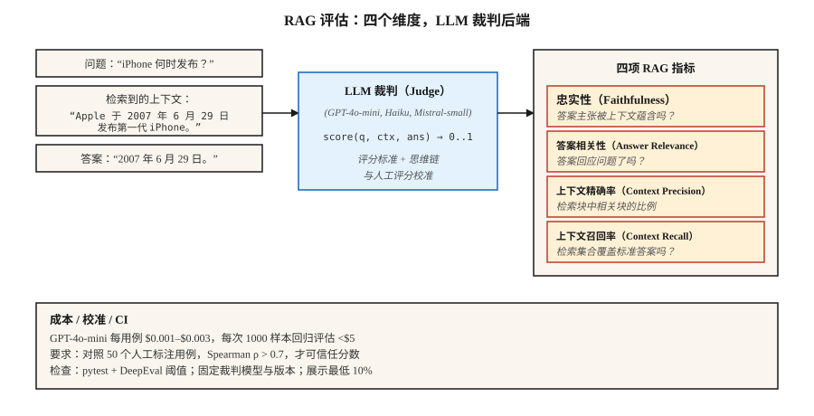

# LLM 评估（LLM Evaluation）：RAGAS、DeepEval、G-Eval

> 精确匹配和 F1 会遗漏语义等价，人工复核难以扩展。用 LLM 作裁判是生产方案，但必须充分校准，才能信任分数。

**Type:** Build
**Languages:** Python
**Prerequisites:** 阶段 5 · 13（问答 Question Answering）、阶段 5 · 14（信息检索 Information Retrieval）
**Time:** 约 75 分钟

## 问题（The Problem）

RAG 系统回答：“June 29th, 2007.”（2007 年 6 月 29 日）。
标准参考答案是：“June 29, 2007.”。
精确匹配得分为 0，F1 约为 75%，人类却会给 100%。

现在把它乘以 10,000 个测试用例，再乘以检索器、分块、提示词或模型的每次变更。你需要一个理解含义、可低成本规模化运行、不会隐瞒回归、能揭示正确失败模式的评估器。

2026 年有三个框架主导这个问题：

- **RAGAS。**检索增强生成评估（Retrieval-Augmented Generation ASsessment）。四个 RAG 指标：忠实性、答案相关性、上下文精确率、上下文召回率，采用 NLI + LLM 裁判后端，有研究支撑且轻量。
- **DeepEval。**面向 LLM 的 pytest，提供 G-Eval、任务完成度、幻觉和偏差指标，原生适配 CI/CD。
- **G-Eval。**一种方法，也是 DeepEval 指标：具有思维链、自定义标准和 0–1 分数的 LLM 裁判。

三者都依赖 LLM 作裁判。本课建立对该方法及其可信度保障的直观理解。

## 概念（The Concept）



**LLM 作裁判（LLM-as-Judge）。**用根据评分标准评估输出的 LLM 替代静态指标。给定 `(query, context, answer)`，提示裁判 LLM：“按忠实性打 0–1 分”，返回分数。

有效的原因：LLM 以远低于人工的成本近似人类判断。GPT-4o-mini 每个评分用例约 0.003 美元，让 1000 样本回归评估成本低于 5 美元。

静默失效的原因：

1. **裁判偏差（Judge Bias）。**裁判偏好长答案、同系列模型生成的答案，以及符合提示词风格的答案。
2. **JSON 解析失败。**错误 JSON → NaN 分数 → 被悄然排除在汇总之外，RAGAS 用户很熟悉这个问题。用 try/except 与显式失败模式设置检查。
3. **跨模型版本漂移。**升级裁判会改变所有指标。固定裁判模型及版本。

**RAG 四项指标。**

| 指标 | 问题 | 后端 |
|--------|----------|---------|
| 忠实性（Faithfulness） | 答案的每项主张是否来自检索上下文？ | 基于 NLI 的蕴含判断 |
| 答案相关性（Answer Relevance） | 答案是否回应问题？ | 根据答案生成假想问题，与真实问题比较 |
| 上下文精确率（Context Precision） | 检索块中相关块占多少？ | LLM 裁判 |
| 上下文召回率（Context Recall） | 检索是否返回所有所需内容？ | LLM 裁判对照标准答案 |

**G-Eval。**定义自定义标准，例如“答案是否引用正确来源”。框架自动扩展为思维链评估步骤，再给出 0–1 分。适合 RAGAS 未覆盖的领域专用质量维度。

**校准（Calibration）。**在与人工标签做相关性分析之前，绝不信任原始裁判分数。运行 100 个人工标注样本，绘制裁判与人工分数对比，计算 Spearman rho。rho < 0.7 时，裁判评分标准还需改进。

```figure
n5-judge-gauge
```

## 动手实现（Build It）

### 步骤 1：用 NLI 评估忠实性（RAGAS 风格）

```python
from typing import Callable
from transformers import pipeline

nli = pipeline("text-classification",
               model="MoritzLaurer/DeBERTa-v3-large-mnli-fever-anli-ling-wanli",
               top_k=None)

# `llm` is any callable: prompt str -> generated str.
# Example: llm = lambda p: client.messages.create(model="claude-haiku-4-5", ...).content[0].text
LLM = Callable[[str], str]


def atomic_claims(answer: str, llm: LLM) -> list[str]:
    prompt = f"""Break this answer into simple factual claims (one per line):
{answer}
"""
    return llm(prompt).splitlines()


def faithfulness(answer: str, context: str, llm: LLM) -> float:
    claims = atomic_claims(answer, llm)
    if not claims:
        return 0.0
    supported = 0
    for claim in claims:
        result = nli({"text": context, "text_pair": claim})[0]
        entail = next((s for s in result if s["label"] == "entailment"), None)
        if entail and entail["score"] > 0.5:
            supported += 1
    return supported / len(claims)
```

将答案分解为原子主张，针对检索上下文逐项做 NLI 检查。忠实性 = 获支持的比例。

### 步骤 2：答案相关性（Answer Relevance）

```python
import numpy as np
from sentence_transformers import SentenceTransformer

# encoder: any model implementing .encode(texts, normalize_embeddings=True) -> ndarray
# e.g., encoder = SentenceTransformer("BAAI/bge-small-en-v1.5")

def answer_relevance(question: str, answer: str, encoder, llm: LLM, n: int = 3) -> float:
    prompt = f"Write {n} questions this answer could be the answer to:\n{answer}"
    generated = [line for line in llm(prompt).splitlines() if line.strip()][:n]
    if not generated:
        return 0.0
    q_emb = np.asarray(encoder.encode([question], normalize_embeddings=True)[0])
    g_embs = np.asarray(encoder.encode(generated, normalize_embeddings=True))
    sims = [float(q_emb @ g_emb) for g_emb in g_embs]
    return sum(sims) / len(sims)
```

如果答案隐含的问题与实际提问不同，相关性就会下降。

### 步骤 3：G-Eval 自定义指标

```python
from deepeval.metrics import GEval
from deepeval.test_case import LLMTestCaseParams, LLMTestCase

metric = GEval(
    name="Correctness",
    criteria="The answer should be factually accurate and match the expected output.",
    evaluation_steps=[
        "Read the expected output.",
        "Read the actual output.",
        "List factual claims in the actual output.",
        "For each claim, mark supported or unsupported by the expected output.",
        "Return score = fraction supported.",
    ],
    evaluation_params=[LLMTestCaseParams.INPUT, LLMTestCaseParams.ACTUAL_OUTPUT, LLMTestCaseParams.EXPECTED_OUTPUT],
)

test = LLMTestCase(input="When was the first iPhone released?",
                   actual_output="June 29th, 2007.",
                   expected_output="June 29, 2007.")
metric.measure(test)
print(metric.score, metric.reason)
```

这些评估步骤就是评分标准。明确步骤比隐含的“打 0–1 分”提示更稳定。

### 步骤 4：CI 检查（CI Gate）

```python
import deepeval
from deepeval.metrics import FaithfulnessMetric, ContextualRelevancyMetric


def test_rag_system():
    cases = load_regression_cases()
    faith = FaithfulnessMetric(threshold=0.85)
    rel = ContextualRelevancyMetric(threshold=0.7)
    for case in cases:
        faith.measure(case)
        assert faith.score >= 0.85, f"faithfulness regression on {case.id}"
        rel.measure(case)
        assert rel.score >= 0.7, f"relevancy regression on {case.id}"
```

作为 pytest 文件交付，在每个 PR 上运行，出现回归就阻止合并。

### 步骤 5：从零实现玩具评估

参见 `code/main.py`。仅用标准库近似忠实性（答案主张与上下文的重叠）和相关性（答案词元与问题词元的重叠）。不用于生产，只展示方法形态。

## 陷阱（Pitfalls）

- **没有校准。**与人工标签相关性只有 0.3 的裁判就是噪声。上线前必须进行校准。
- **自我评估（Self-Evaluation）。**同一 LLM 同时生成和评分会使分数膨胀 10–20%。裁判使用不同模型系列。
- **成对评判的位置偏差（Positional Bias）。**裁判偏好先呈现的选项。始终随机化顺序，并对两种顺序都运行。
- **原始汇总掩盖失败。**均分 0.85 经常掩盖 5% 的灾难性失败。始终查看底部分位样本。
- **标准数据集腐化（Golden Dataset Rot）。**没有版本控制、随时间漂移的评估集会破坏纵向比较。每次变更都为数据集打标签。
- **LLM 成本。**规模化时裁判调用主导成本。使用满足校准阈值的最便宜模型，例如 GPT-4o-mini、Claude Haiku、Mistral-small。

## 实际应用（Use It）

2026 年的技术栈：

| 用例 | 框架 |
|---------|-----------|
| RAG 质量监控 | RAGAS（4 项指标） |
| CI/CD 回归检查 | DeepEval + pytest |
| 自定义领域标准 | DeepEval 中的 G-Eval |
| 在线真实流量监控 | RAGAS 无参考模式 |
| 人在回路中的抽查 | 带标注界面的 LangSmith 或 Phoenix |
| 红队 / 安全评估 | Promptfoo + DeepEval |

典型技术栈：RAGAS 做监控，DeepEval 做 CI，G-Eval 评估新维度。三个都运行，它们的分歧有价值。

## 交付成果（Ship It）

保存为 `outputs/skill-eval-architect.md`：

```markdown
---
name: eval-architect
description: 设计具有校准裁判与 CI 检查的 LLM 评估计划。
version: 1.0.0
phase: 5
lesson: 27
tags: [nlp, evaluation, rag]
---

给定用例（RAG / 智能体 / 生成任务），输出：

1. 指标（Metrics）。忠实性、相关性、上下文精确率、上下文召回率，以及附标准的自定义 G-Eval 指标。
2. 裁判模型（Judge Model）。具体模型及版本，说明成本与准确率权衡。
3. 校准（Calibration）。人工标注集大小，目标为相对人工的 Spearman rho > 0.7。
4. 数据集版本控制（Dataset Versioning）。标签策略、变更日志、分层。
5. CI 检查（CI Gate）。各指标阈值、回归窗口逻辑、底部分位告警。

拒绝依赖未在至少 50 个人工标注样本上测试的裁判。拒绝同一模型生成与评分的自我评估。拒绝仅报告汇总而不展示最低 10% 样本。对裁判升级时没有并行基线评估的流水线提出警示。
```

## 练习（Exercises）

1. **简单。**在 10 个含已知幻觉的 RAG 样本上使用 RAGAS，验证忠实性指标能捕获每一个。
2. **中等。**为 50 个问答答案人工标注 0–1 正确性分数，再用 G-Eval 评分，测量裁判与人工之间的 Spearman rho。
3. **困难。**用 DeepEval 构建 pytest CI 检查。故意让检索器退化，验证检查失败，再对最低 10% 样本做阈值检查以添加底部分位告警。

## 关键术语（Key Terms）

| 术语 | 常见说法 | 实际含义 |
|------|-----------------|-----------------------|
| LLM 作裁判（LLM-as-Judge） | 用 LLM 评分 | 给裁判模型评分标准，提示其为输出打 0–1 分。 |
| RAGAS | RAG 指标库 | 开源评估框架，提供 4 个无参考 RAG 指标。 |
| 忠实性（Faithfulness） | 答案有依据吗？ | 答案主张中被检索上下文蕴含的比例。 |
| 上下文精确率（Context Precision） | 检索块相关吗？ | 前 K 个块中真正有用的比例。 |
| 上下文召回率（Context Recall） | 检索找全了吗？ | 标准答案主张中被检索块支持的比例。 |
| G-Eval | 自定义 LLM 裁判 | 评分标准 + 思维链评估步骤 + 0–1 分数。 |
| 校准（Calibration） | 信任但验证 | 裁判与人工分数之间的 Spearman 相关性。 |

## 延伸阅读（Further Reading）

- [Es 等（2023）：RAGAS：检索增强生成的自动评估（Automated Evaluation of Retrieval Augmented Generation）](https://arxiv.org/abs/2309.15217)：RAGAS 论文。
- [Liu 等（2023）：G-Eval：使用 GPT-4 实现更好人类对齐的自然语言生成评估（NLG Evaluation using GPT-4 with Better Human Alignment）](https://arxiv.org/abs/2303.16634)：G-Eval 论文。
- [DeepEval 文档](https://deepeval.com/docs/metrics-introduction)：开放生产技术栈。
- [Zheng 等（2023）：使用 MT-Bench 与 Chatbot Arena 评判 LLM 裁判（Judging LLM-as-a-Judge with MT-Bench and Chatbot Arena）](https://arxiv.org/abs/2306.05685)：偏差、校准与限制。
- [MLflow GenAI Scorer](https://mlflow.org/blog/third-party-scorers)：集成 RAGAS、DeepEval、Phoenix 的统一框架。
