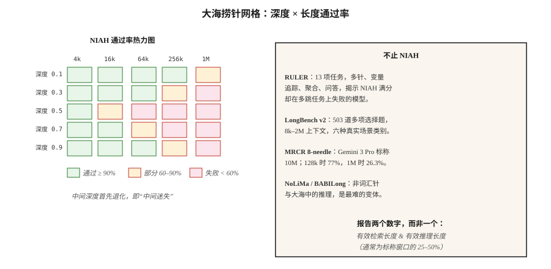

# 长上下文评估（Long-Context Evaluation）：NIAH、RULER、LongBench、MRCR

> Gemini 3 Pro 标称 10M 词元上下文，但在 1M 词元下，8 针 MRCR 得分降至 26.3%。标称不等于可用。长上下文评估告诉你部署模型的实际容量。

**Type:** Learn
**Languages:** Python
**Prerequisites:** 阶段 5 · 13（问答 Question Answering）、阶段 5 · 23（分块策略 Chunking Strategies）
**Time:** 约 60 分钟

## 问题（The Problem）

你有一份 200 页合同，模型声称支持 1M 词元上下文。你粘贴合同并询问“终止条款是什么”，模型回答了，却依据封面，因为终止条款位于 120k 词元深处，超出了模型真正关注的位置。

这就是 2026 年的上下文容量差距。规格表写 1M 或 10M，实际只有 60–70% 可用，而且“可用”取决于任务。

- **检索（大海捞针，单针）：**前沿模型在标称最大长度之前接近完美。
- **多跳 / 聚合：**多数模型超过约 128k 后急剧退化。
- **分散事实上的推理：**最先失败的任务。

长上下文评估测量这些维度。本课说明各基准、它们实际测量什么，以及如何为你的领域构建自定义捞针测试。

## 概念（The Concept）



**大海捞针（Needle-in-a-Haystack，NIAH，2023）。**将一个事实，例如“魔法词是菠萝”，放在长上下文中可控的深度，让模型检索它，遍历深度与长度的组合。这是最初的长上下文基准。前沿模型如今已趋于满分，它是必要但不充分的基线。

**RULER（Nvidia，2024）。**四类共 13 种任务：检索（单键、多键、多值）、多跳追踪（变量追踪）、聚合（常见词频）、问答。上下文长度可配置为 4k 到 128k 以上，能揭示在 NIAH 满分却在多跳失败的模型。2024 年发布时，17 个声称支持 32k 以上上下文的模型中，只有一半在 32k 仍保持质量。

**LongBench v2（2024）。**503 道多项选择题，上下文为 8k–2M 个词，六类任务：单文档问答、多文档问答、长上下文学习、长对话、代码仓库、长结构化数据。它是评估真实长上下文行为的生产基准。

**MRCR（多轮共指消解，Multi-Round Coreference Resolution）。**大规模多轮共指，有 8 针、24 针和 100 针变体，揭示注意力退化前模型能同时处理多少事实。

**NoLiMa。**“非词汇针”（Non-Lexical Needle）。目标事实与查询没有字面重叠，检索需要一步语义推理，比 NIAH 更难。

**HELMET。**拼接多篇文档，提出其中任意一篇的问题，测试选择性注意力。

**BABILong。**将 bAbI 推理链嵌入无关填充文本，测试大海中的推理，而不只是检索。

### 实际应报告什么（What to Actually Report）

- **标称上下文窗口（Advertised Context Window）。**规格表上的数字。
- **有效检索长度（Effective Retrieval Length）。**NIAH 在某阈值，例如 90%，下仍通过的长度。
- **有效推理长度（Effective Reasoning Length）。**多跳或聚合任务在同一阈值下仍通过的长度。
- **退化曲线（Degradation Curve）。**按任务类型绘制准确率随上下文长度变化的曲线。

规格表应给两个数字：检索有效长度和推理有效长度。推理有效长度通常只有标称窗口的 25–50%。

```figure
gx-niah-decay
```

## 动手实现（Build It）

### 步骤 1：为领域定制 NIAH

参见 `code/main.py`，基本结构如下：

```python
def build_haystack(filler_text, needle, depth_ratio, total_tokens):
    if not (0.0 <= depth_ratio <= 1.0):
        raise ValueError(f"depth_ratio must be in [0, 1], got {depth_ratio}")
    if total_tokens <= 0:
        raise ValueError(f"total_tokens must be positive, got {total_tokens}")

    filler_tokens = tokenize(filler_text)
    needle_tokens = tokenize(needle)
    if not filler_tokens:
        raise ValueError("filler_text produced no tokens")

    # Repeat filler until long enough to fill the haystack body.
    body_len = max(total_tokens - len(needle_tokens), 0)
    while len(filler_tokens) < body_len:
        filler_tokens = filler_tokens + filler_tokens
    filler_tokens = filler_tokens[:body_len]

    insert_at = min(int(body_len * depth_ratio), body_len)
    haystack = filler_tokens[:insert_at] + needle_tokens + filler_tokens[insert_at:]
    return " ".join(haystack)


def score_niah(model, haystack, question, expected):
    answer = model.complete(f"Context: {haystack}\nQ: {question}\nA:", max_tokens=50)
    return 1 if expected.lower() in answer.lower() else 0
```

遍历 `depth_ratio` ∈ {0, 0.25, 0.5, 0.75, 1.0} × `total_tokens` ∈ {1k, 4k, 16k, 64k}，绘制热力图，这就是目标模型的 NIAH 评估卡。

### 步骤 2：多针变体（Multi-Needle）

```python
def build_multi_needle(filler, needles, total_tokens):
    depths = [0.1, 0.4, 0.7]
    chunks = [filler[:int(total_tokens * 0.1)]]
    for depth, needle in zip(depths, needles):
        chunks.append(needle)
        next_chunk = filler[int(total_tokens * depth): int(total_tokens * (depth + 0.3))]
        chunks.append(next_chunk)
    return " ".join(chunks)
```

“三个魔法词是什么”这样的问题要求找全三个。单针成功并不能预测多针成功。

### 步骤 3：多跳变量追踪（RULER 风格）

```python
haystack = """X1 = 42. ... (filler) ... X2 = X1 + 10. ... (filler) ... X3 = X2 * 2."""
question = "What is X3?"
```

答案需要串联三个赋值步骤。前沿模型在 128k 时，这里的准确率常降到 50–70%。

### 步骤 4：在你的技术栈上运行 LongBench v2

```python
from datasets import load_dataset
longbench = load_dataset("THUDM/LongBench-v2")

def eval_model_on_longbench(model, subset="single-doc-qa"):
    tasks = [x for x in longbench["test"] if x["task"] == subset]
    correct = 0
    for x in tasks:
        answer = model.complete(x["context"] + "\n\nQ: " + x["question"], max_tokens=20)
        if normalize(answer) == normalize(x["answer"]):
            correct += 1
    return correct / len(tasks)
```

报告逐类别准确率。汇总分数会掩盖很大的任务级差异。

## 陷阱（Pitfalls）

- **仅 NIAH 评估。**在 1M 词元通过 NIAH，无法说明多跳能力。始终运行 RULER 或自定义多跳测试。
- **深度采样不充分。**许多实现只测试 depth=0.5。应测试 depth=0、0.25、0.5、0.75、1.0，因为“中间迷失”（Lost in the Middle）确实存在。
- **与填充文本的词汇重叠。**目标事实与填充文本共享关键词时，检索变得简单。使用 NoLiMa 风格的无重叠目标事实。
- **忽略延迟。**1M 词元提示的预填充（Prefill）需要 30–120 秒。除了准确率，还要测量首词元延迟（Time-to-First-Token）。
- **供应商自报分数。**OpenAI、Google、Anthropic 都公布自己的分数。始终针对你的用例独立重跑。

## 实际应用（Use It）

2026 年的技术栈：

| 场景 | 基准 |
|-----------|-----------|
| 快速合理性检查 | 自定义 NIAH，3 个深度 × 3 个长度 |
| 生产模型选择 | 目标长度上的 RULER（13 项任务） |
| 真实问答质量 | LongBench v2 单文档问答子集 |
| 多跳推理 | BABILong 或自定义变量追踪 |
| 对话 | 目标长度上的 MRCR 8 针 |
| 模型升级回归 | 固定内部 NIAH + RULER 测试工具，每个新模型都运行 |

生产经验：在预期长度上完成 NIAH 加一项推理任务测试之前，不要信任上下文窗口。

## 交付成果（Ship It）

保存为 `outputs/skill-long-context-eval.md`：

```markdown
---
name: long-context-eval
description: 为给定模型和用例设计长上下文评估组合。
version: 1.0.0
phase: 5
lesson: 28
tags: [nlp, long-context, evaluation]
---

给定目标模型、目标上下文长度和用例，输出：

1. 测试（Tests）。NIAH 深度 × 长度网格、RULER 多跳、自定义领域任务。
2. 采样（Sampling）。每个长度都测试深度 0、0.25、0.5、0.75、1.0。
3. 指标（Metrics）。检索通过率、推理通过率、首词元延迟、每次查询成本。
4. 截止点（Cutoff）。有效检索长度（90% 通过）和有效推理长度（70% 通过），两者都报告。
5. 回归（Regression）。固定测试工具，每次模型升级重跑，展示差值。

拒绝仅凭模型卡信任上下文窗口。对任何多跳工作负载拒绝仅做 NIAH 评估。拒绝把供应商自报的长上下文分数当作独立证据。
```

## 练习（Exercises）

1. **简单。**构建 3 个深度（0.25、0.5、0.75）× 3 个长度（1k、4k、16k）的 NIAH，在任意模型运行，将通过率绘为 3×3 热力图。
2. **中等。**加入 3 针变体，测量每个长度下找全 3 针的表现，与相同长度的单针通过率比较。
3. **困难。**构建包含 3 跳、X1 → X2 → X3 的变量追踪任务，嵌入 64k 填充文本。在三个前沿模型上测量准确率，报告各模型的有效推理长度。

## 关键术语（Key Terms）

| 术语 | 常见说法 | 实际含义 |
|------|-----------------|-----------------------|
| NIAH | 大海捞针（Needle in a Haystack） | 在填充文本植入事实，让模型检索它。 |
| RULER | 强化版 NIAH | 检索、多跳、聚合、问答四类共 13 种任务。 |
| 有效上下文（Effective Context） | 实际容量 | 准确率仍高于阈值时的长度。 |
| 中间迷失（Lost in the Middle） | 深度偏差 | 模型对长输入中部内容关注不足。 |
| 多针（Multi-Needle） | 同时处理多个事实 | 植入多个目标，测试注意力分配，而不只是检索。 |
| MRCR | 多轮共指消解 | 8、24 或 100 针共指，揭示注意力饱和。 |
| NoLiMa | 非词汇针（Non-Lexical Needle） | 目标与查询没有字面词元重叠，需要推理。 |

## 延伸阅读（Further Reading）

- [Kamradt（2023）：大海捞针分析（Needle in a Haystack Analysis）](https://github.com/gkamradt/LLMTest_NeedleInAHaystack)：原始 NIAH 仓库。
- [Hsieh 等（2024）：RULER：长上下文语言模型的真实上下文有多大？（What's the Real Context Size of Your Long-Context LMs?）](https://arxiv.org/abs/2404.06654)：多任务基准。
- [Bai 等（2024）：LongBench v2](https://arxiv.org/abs/2412.15204)：真实场景长上下文评估。
- [Modarressi 等（2024）：NoLiMa：非词汇针（Non-Lexical Needles）](https://arxiv.org/abs/2404.06666)：更难的捞针任务。
- [Kuratov 等（2024）：BABILong](https://arxiv.org/abs/2406.10149)：大海中的推理。
- [Liu 等（2024）：中间迷失：语言模型如何使用长上下文（Lost in the Middle: How Language Models Use Long Contexts）](https://arxiv.org/abs/2307.03172)：深度偏差论文。
