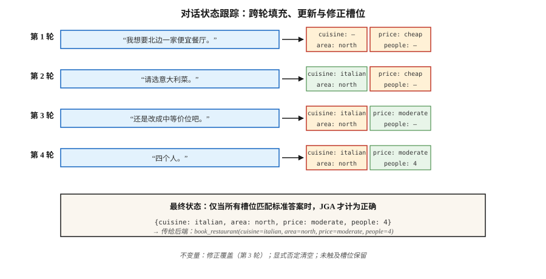

# 对话状态跟踪（Dialogue State Tracking）

> “我想要北边一家便宜餐厅……还是改成中等价位……再加上意大利菜。”三轮对话，三次状态更新。DST 保持槽位值字典同步，让预订正确执行。

**Type:** Build
**Languages:** Python
**Prerequisites:** 阶段 5 · 17（聊天机器人 Chatbots）、阶段 5 · 20（结构化输出 Structured Outputs）
**Time:** 约 75 分钟

## 问题（The Problem）

在任务型对话系统中，用户目标编码为一组槽位值对：`{cuisine: italian, area: north, price: moderate}`。用户每轮都可能添加、修改或移除槽位。系统必须阅读完整对话并正确输出当前状态。

一个槽位出错，系统就会订错餐厅、安排错误航班或从错误卡片扣款。DST 连接了用户所说与后端执行。

即使已有 LLM，它在 2026 年仍然重要：

- 银行、医疗和机票预订等合规敏感领域，需要确定的槽位值，而非自由生成。
- 使用工具的智能体仍需在调用 API 前解析槽位。
- 多轮修正比看起来难，例如“其实不，改成周四”。

现代流水线：经典 DST 概念 + LLM 抽取器 + 结构化输出防护。

## 概念（The Concept）



**任务结构（Task Structure）。**模式定义餐厅、酒店、出租车等领域，及菜系、地区、价格、人数等槽位。每个槽位可以为空、填入封闭集合中的值，例如 price: {cheap, moderate, expensive}，或自由文本值，例如 name: "The Copper Kettle"。

**两种 DST 问题形式。**

- **分类（Classification）。**对每个槽位与候选值配对预测是或否，适合封闭词表槽位，是 2020 年前的标准。
- **生成（Generation）。**给定对话，以自由文本生成槽位值，适合开放词表槽位，是现代默认方式。

**指标（Metric）。**联合目标准确率（Joint Goal Accuracy，JGA）：*所有*槽位均正确的轮次比例，要么全对，要么不得分。2026 年 MultiWOZ 2.4 排行榜最高约为 83%。

**架构（Architectures）。**

1. **规则方法（Rule-Based，槽位正则 + 关键词）。**狭窄领域的强基线，便于调试。
2. **TripPy / BERT-DST。**BERT 编码配合基于复制的生成，是 LLM 之前的标准。
3. **LDST（LLaMA + LoRA）。**使用领域—槽位提示的指令微调 LLM，在 MultiWOZ 2.4 上达到 ChatGPT 水平。
4. **无本体方法（Ontology-Free，2024–2026）。**跳过模式，直接生成槽位名和值，可处理开放领域。
5. **提示 + 结构化输出（2024–2026）。**LLM 配合 Pydantic 模式与约束解码，5 行代码即可用于生产。

### 经典失败模式（The Classic Failure Modes）

- **跨轮共指。**“还是第一个选项吧。”需要解析指的是哪项。
- **覆盖还是追加。**用户说“加上意大利菜”，是替换菜系还是追加？
- **隐式确认（Implicit Confirmations）。**“好，挺好。”是否接受了提出的预订？
- **修正（Correction）。**“还是改成晚上 7 点。”必须更新时间，同时不清空其他槽位。
- **指向之前系统话语的共指。**“对，就那个。”“那个”是哪一个？

```figure
n5-slot-tracker
```

## 动手实现（Build It）

### 步骤 1：基于规则的槽位抽取器

参见 `code/main.py`。正则与同义词字典能覆盖狭窄领域 70% 的典型话语：

```python
CUISINE_SYNONYMS = {
    "italian": ["italian", "pasta", "pizza", "italy"],
    "chinese": ["chinese", "chow mein", "noodles"],
}


def extract_cuisine(utterance):
    for canonical, synonyms in CUISINE_SYNONYMS.items():
        if any(syn in utterance.lower() for syn in synonyms):
            return canonical
    return None
```

超出规范词表就很脆弱，但适用于确定性的槽位确认。

### 步骤 2：状态更新循环（State Update Loop）

```python
def update_state(state, utterance):
    new_state = dict(state)
    for slot, extractor in SLOT_EXTRACTORS.items():
        value = extractor(utterance)
        if value is not None:
            new_state[slot] = value
    for slot in NEGATION_CLEARS:
        if is_negated(utterance, slot):
            new_state[slot] = None
    return new_state
```

三个不变量：

- 绝不重置用户没有触及的槽位。
- 显式否定，例如“菜系无所谓了”，必须清空槽位。
- 用户修正，例如“其实……”，必须覆盖，而不是追加。

### 步骤 3：带结构化输出的 LLM 驱动 DST

```python
from pydantic import BaseModel
from typing import Literal, Optional
import instructor

class RestaurantState(BaseModel):
    cuisine: Optional[Literal["italian", "chinese", "indian", "thai", "any"]] = None
    area: Optional[Literal["north", "south", "east", "west", "center"]] = None
    price: Optional[Literal["cheap", "moderate", "expensive"]] = None
    people: Optional[int] = None
    day: Optional[str] = None


def llm_dst(history, llm):
    prompt = f"""You track the slot values of a restaurant booking across turns.
Dialogue so far:
{render(history)}

Update the state based on the latest user turn. Output only the JSON state."""
    return llm(prompt, response_model=RestaurantState)
```

Instructor + Pydantic 保证有效状态对象。无需正则，没有模式不匹配，也没有幻觉槽位。

### 步骤 4：JGA 评估

```python
def joint_goal_accuracy(predicted_states, gold_states):
    correct = sum(1 for p, g in zip(predicted_states, gold_states) if p == g)
    return correct / len(predicted_states)
```

校准：系统在多少比例的轮次中将所有槽位都答对？2026 年 MultiWOZ 2.4 顶尖系统为 80–83%。你的领域系统在自己的狭窄词表上应超过这个水平，否则 LLM 基线就胜过你。

### 步骤 5：处理修正（Correction）

```python
CORRECTION_CUES = {"actually", "no wait", "on second thought", "change that to"}


def is_correction(utterance):
    return any(cue in utterance.lower() for cue in CORRECTION_CUES)
```

检测到修正时，覆盖最近更新的槽位，而不是追加。没有 LLM 辅助时很难做好。现代模式是始终让 LLM 从历史重新生成完整状态，而非增量更新，这样自然处理修正。

## 陷阱（Pitfalls）

- **完整历史重生成成本。**每轮让 LLM 重生成状态，总词元成本为 O(n²)。限制历史长度或摘要旧轮次。
- **模式漂移（Schema Drift）。**事后增加槽位会破坏旧训练数据，必须为模式做版本控制。
- **大小写敏感。**“Italian”“italian”“ITALIAN”不同，应处处归一化。
- **隐式继承（Implicit Inheritance）。**用户之前已说明“4 个人”，新请求改变时间不应清空人数。始终传入完整历史。
- **自由文本与封闭集合。**姓名、时间、地址需要自由文本槽位，菜系与地区使用封闭集合。模式中混合两者。

## 实际应用（Use It）

2026 年的技术栈：

| 场景 | 方法 |
|-----------|----------|
| 狭窄领域（一两个意图） | 规则 + 正则 |
| 广泛领域，有标注数据 | LDST（在 MultiWOZ 风格数据上使用 LLaMA + LoRA） |
| 广泛领域，无标签，需生产可用 | LLM + Instructor + Pydantic 模式 |
| 口语 / 语音 | ASR + 归一化器 + LLM-DST |
| 多领域预订流程 | 模式引导 LLM，各领域使用独立 Pydantic 模型 |
| 合规敏感 | 规则为主，带确认流程的 LLM 回退 |

## 交付成果（Ship It）

保存为 `outputs/skill-dst-designer.md`：

```markdown
---
name: dst-designer
description: 设计对话状态跟踪器，包括模式、抽取器、更新策略和评估。
version: 1.0.0
phase: 5
lesson: 29
tags: [nlp, dialogue, task-oriented]
---

给定用例（领域、语言、词表开放程度、合规需求），输出：

1. 模式（Schema）。领域列表、每个领域的槽位、每个槽位使用开放还是封闭词表。
2. 抽取器（Extractor）。规则、seq2seq 或 LLM 配合 Pydantic，说明理由。
3. 更新策略（Update Policy）。重生成完整状态或增量更新，修正处理、否定处理。
4. 评估（Evaluation）。留出对话集上的联合目标准确率、槽位级精确率与召回率，以及最难槽位的混淆情况。
5. 确认流程（Confirmation Flow）。何时明确要求用户确认，例如破坏性操作、低置信度抽取。

对于合规敏感槽位，没有规则二次检查就拒绝仅用 LLM 的 DST。拒绝任何无法在用户修正时回退槽位的 DST。对没有版本标签的模式提出警示。
```

## 练习（Exercises）

1. **简单。**为 cuisine、area、price 三个槽位构建 `code/main.py` 中的规则状态跟踪器，在 10 段人工构造对话上测试，测量 JGA。
2. **中等。**在同一数据集使用 Instructor + Pydantic + 小型 LLM，比较 JGA，并检查最难的轮次。
3. **困难。**实现两者并进行路由：规则优先，当规则无法有把握地输出至少 2 个槽位时，回退到 LLM。测量组合 JGA 和每轮推理成本。

## 关键术语（Key Terms）

| 术语 | 常见说法 | 实际含义 |
|------|-----------------|-----------------------|
| DST | 对话状态跟踪（Dialogue State Tracking） | 跨对话轮次维护槽位值字典。 |
| 槽位（Slot） | 用户意图单位 | 后端所需的具名参数，例如菜系、日期。 |
| 领域（Domain） | 任务范围 | 餐厅、酒店、出租车等槽位集合。 |
| JGA | 联合目标准确率（Joint Goal Accuracy） | 每个槽位都正确的轮次比例，全对才计分。 |
| MultiWOZ | 那个基准 | 多领域 WOZ 数据集，标准 DST 评估。 |
| 无本体 DST（Ontology-Free DST） | 没有模式 | 直接生成槽位名和值，不使用固定列表。 |
| 修正（Correction） | “其实……” | 覆盖之前已填槽位的轮次。 |

## 延伸阅读（Further Reading）

- [Budzianowski 等（2018）：MultiWOZ：大规模多领域 Wizard-of-Oz（A Large-Scale Multi-Domain Wizard-of-Oz）](https://arxiv.org/abs/1810.00278)：经典基准。
- [Feng 等（2023）：迈向 LLM 驱动的对话状态跟踪（Towards LLM-driven Dialogue State Tracking，LDST）](https://arxiv.org/abs/2310.14970)：面向 DST 的 LLaMA + LoRA 指令调优。
- [Heck 等（2020）：TripPy：用于值无关神经对话状态跟踪的三重复制策略（A Triple Copy Strategy for Value Independent Neural Dialog State Tracking）](https://arxiv.org/abs/2005.02877)：基于复制的 DST 主力。
- [King、Flanigan（2024）：使用 LLM 的无监督端到端任务型对话（Unsupervised End-to-End Task-Oriented Dialogue with LLMs）](https://arxiv.org/abs/2404.10753)：基于 EM 的无监督任务型对话。
- [MultiWOZ 排行榜](https://github.com/budzianowski/multiwoz)：经典 DST 结果。
