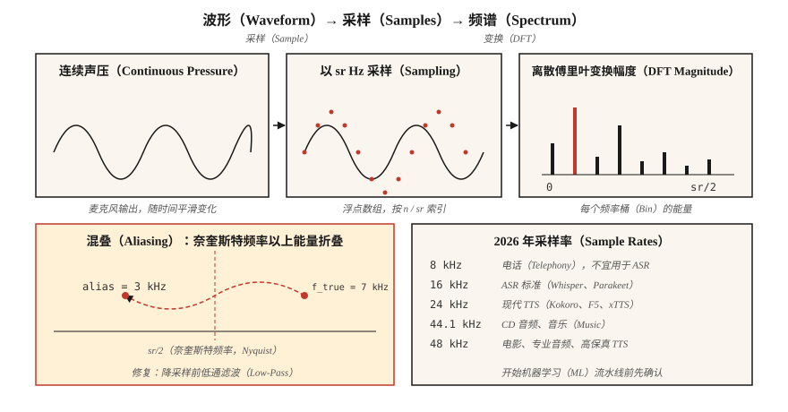

# 音频基础：波形、采样与傅里叶变换（Audio Fundamentals — Waveforms, Sampling, Fourier Transform）

> 波形是原始信号，频谱图是表示形式，梅尔特征是适合机器学习的形式。现代自动语音识别和文本转语音流水线都会经过这些层次，第一步是理解采样与傅里叶变换。

**Type:** Learn
**Languages:** Python
**Prerequisites:** 阶段 1 · 06（向量与矩阵），阶段 1 · 14（概率分布）
**Time:** ~45 分钟

## 问题（The Problem）

麦克风产生声压随时间变化的信号，神经网络接收的却是张量。两者之间有一整套约定，违反约定会造成不易察觉的错误：模型训练正常，词错误率（Word Error Rate，WER）却翻倍；文本转语音（Text-to-Speech，TTS）输出嘶嘶声；声音克隆系统记住了麦克风而不是说话人。

语音系统中的每个错误都可追溯到三个问题之一：

1. 数据录制时的采样率是多少，模型要求什么采样率？
2. 信号是否发生了混叠？
3. 你操作的是原始采样点还是频域表示？

弄清这些问题，阶段 6 的其余内容就容易处理。弄错了，即使 Whisper-Large-v4 也只会产生无用结果。

## 概念（The Concept）



**波形（Waveform）。** 取值在 `[-1.0, 1.0]` 的一维浮点数组，以采样点序号索引。换算为秒时除以采样率：`t = n / sr`。16 kHz 下的 10 秒音频包含 160,000 个浮点数。

**采样率（Sampling Rate，sr）。** 每秒的采样点数。2026 年常见采样率：

| 采样率 | 用途 |
|------|-----|
| 8 kHz | 电话、旧式网络语音。4 kHz 的奈奎斯特频率会损失辅音信息，不宜用于自动语音识别（Automatic Speech Recognition，ASR）。 |
| 16 kHz | ASR 标准。Whisper、Parakeet、SeamlessM4T v2 都接收 16 kHz 音频。 |
| 22.05 kHz | 较早的 TTS 模型的声码器训练。 |
| 24 kHz | 现代 TTS（Kokoro、F5-TTS、xTTS v2）。 |
| 44.1 kHz | CD 音频、音乐。 |
| 48 kHz | 电影、专业音频、高保真 TTS（VALL-E 2、NaturalSpeech 3）。 |

**奈奎斯特–香农采样定理（Nyquist-Shannon）。** 采样率为 `sr` 时，可以无歧义地表示最高 `sr/2` 的频率。`sr/2` 边界称为*奈奎斯特频率（Nyquist Frequency）*。高于它的能量会发生*混叠（Aliasing）*，折叠到较低频率并污染信号。降采样前务必低通滤波。

**位深（Bit Depth）。** 16 位脉冲编码调制（Pulse-Code Modulation，PCM；有符号 int16，范围 ±32,767）是通用交换格式。音乐使用 24 位，内部数字信号处理（Digital Signal Processing，DSP）使用 32 位浮点数。`soundfile` 等库读取 int16，但向用户提供 `[-1, 1]` 范围的 float32 数组。

**傅里叶变换（Fourier Transform）。** 任何有限信号都是不同频率正弦波的叠加。离散傅里叶变换（Discrete Fourier Transform，DFT）针对 `N` 个采样点计算 `N` 个复数系数，每个频率桶对应一个。`bin k` 对应频率 `k · sr / N` Hz。模长表示该频率的幅度，角度表示相位。

**快速傅里叶变换（Fast Fourier Transform，FFT）。** 当 `N` 为 2 的幂时，用于计算 DFT 的 `O(N log N)` 算法。所有音频库底层都使用 FFT。在 16 kHz 下，对 1024 个采样点做 FFT，可得到覆盖 0–8 kHz 的 512 个可用频率桶，分辨率为 15.6 Hz。

**分帧与加窗（Framing + Window）。** 不对整段音频做一次 FFT，而是切成重叠的*帧*（通常帧长 25 ms、帧移 10 ms），每帧乘以窗函数（Hann、Hamming）消除边缘不连续，再分别做 FFT。这就是短时傅里叶变换（Short-Time Fourier Transform，STFT）。第 02 课从这里继续。

```figure
mel-scale
```

## 动手实现（Build It）

### 第 1 步：读取音频并绘制波形（Step 1: read a clip and plot the waveform）

`code/main.py` 仅使用标准库的 `wave` 模块，让演示不依赖外部库。生产环境会使用 `soundfile` 或 `torchaudio.load`（两者都返回 `(waveform, sr)` 元组）：

```python
import soundfile as sf
waveform, sr = sf.read("clip.wav", dtype="float32")  # shape (T,), sr=int
```

### 第 2 步：从基本原理合成正弦波（Step 2: synthesize a sine wave from first principles）

```python
import math

def sine(freq_hz, sr, seconds, amp=0.5):
    n = int(sr * seconds)
    return [amp * math.sin(2 * math.pi * freq_hz * i / sr) for i in range(n)]
```

16 kHz 采样率下持续 1 秒的 440 Hz 正弦波（标准音 A）包含 16,000 个浮点数。使用 `wave.open(..., "wb")`，以 16 位 PCM 编码写入。

### 第 3 步：手工计算 DFT（Step 3: compute the DFT by hand）

```python
def dft(x):
    N = len(x)
    out = []
    for k in range(N):
        re = sum(x[n] * math.cos(-2 * math.pi * k * n / N) for n in range(N))
        im = sum(x[n] * math.sin(-2 * math.pi * k * n / N) for n in range(N))
        out.append((re, im))
    return out
```

复杂度为 `O(N²)`，用 `N=256` 验证正确性尚可，却不适合真实音频。实际代码调用 `numpy.fft.rfft` 或 `torch.fft.rfft`。

### 第 4 步：找出主频（Step 4: find the dominant frequency）

幅度峰值索引 `k_star` 对应频率 `k_star * sr / N`。对 440 Hz 正弦波运行时，峰值应出现在频率桶 `440 * N / sr`。

### 第 5 步：演示混叠（Step 5: demonstrate aliasing）

用 10 kHz 采样率采集 7 kHz 正弦波（奈奎斯特频率 = 5 kHz）。7 kHz 音调高于奈奎斯特频率，会折叠至 `10 − 7 = 3 kHz`，FFT 峰值出现在 3 kHz。这是经典混叠演示，也解释了为什么每个数模转换器（Digital-to-Analog Converter，DAC）和模数转换器（Analog-to-Digital Converter，ADC）都配有砖墙式低通滤波器。

## 实际应用（Use It）

2026 年实际交付会用到的技术栈：

| 任务 | 库 | 原因 |
|------|---------|-----|
| 读写 WAV/FLAC/OGG | `soundfile`（libsndfile 封装） | 速度最快、稳定，返回 float32。 |
| 重采样 | `torchaudio.transforms.Resample` 或 `librosa.resample` | 内置正确的抗混叠处理。 |
| STFT / 梅尔特征 | `torchaudio` 或 `librosa` | 适合 GPU，属于 PyTorch 生态。 |
| 实时流处理 | `sounddevice` 或 `pyaudio` | 跨平台 PortAudio 绑定。 |
| 检查文件 | `ffprobe` 或 `soxi` | 命令行工具，速度快，可报告采样率、声道数和编解码器。 |

决策原则：**先匹配采样率，再匹配其他条件**。Whisper 要求 16 kHz、单声道、float32。传入 44.1 kHz 立体声音频，产生的无用输出会看起来像模型故障。

## 交付成果（Ship It）

保存为 `outputs/skill-audio-loader.md`。该技能帮助检查音频输入是否符合下游模型要求，并在不符合时正确重采样。

## 练习（Exercises）

1. **简单。** 以 16 kHz 合成 1 秒的 220 Hz + 440 Hz + 880 Hz 混合音频。运行 DFT，确认预期频率桶上出现三个峰值。
2. **中等。** 以 48 kHz 录制一段 3 秒的人声 WAV。使用 `torchaudio.transforms.Resample`（带抗混叠）降采样至 16 kHz，再用朴素抽取（每三个采样点取一个）降至 16 kHz。分别进行 FFT。混叠出现在哪里？
3. **困难。** 仅使用 `math` 和第 3 步的 DFT，从零构建 STFT。帧长 400，帧移 160，使用 Hann 窗。用 `matplotlib.pyplot.imshow` 绘制幅度，这就是第 02 课的频谱图。

## 关键术语（Key Terms）

| 术语 | 常见说法 | 实际含义 |
|------|-----------------|-----------------------|
| 采样率（Sample Rate） | 每秒有多少采样点 | ADC 测量信号的频率，以 Hz 为单位。 |
| 奈奎斯特频率（Nyquist） | 能表示的最高频率 | `sr/2`；高于它的能量会混叠回低频。 |
| 位深（Bit Depth） | 每个采样点的分辨率 | `int16` = 65,536 个量化级；`float32` = `[-1, 1]` 内的 24 位精度。 |
| 离散傅里叶变换（DFT） | 序列的傅里叶变换 | `N` 个采样点 → `N` 个复数频率系数。 |
| 快速傅里叶变换（FFT） | 快速的 DFT | 要求 `N` 为 2 的幂的 `O(N log N)` 算法。 |
| 频率桶（Bin） | 频率列 | `k · sr / N` Hz；分辨率 = `sr / N`。 |
| 短时傅里叶变换（STFT） | 频谱图的底层计算 | 随时间推进，分帧、加窗后做 FFT。 |
| 混叠（Aliasing） | 奇怪的频率伪影 | 奈奎斯特频率以上的能量镜像折叠到较低频率桶。 |

## 延伸阅读（Further Reading）

- [Shannon（1949）：噪声存在时的通信](https://people.math.harvard.edu/~ctm/home/text/others/shannon/entropy/entropy.pdf)：采样定理的理论来源论文。
- [Smith：《科学家与工程师数字信号处理指南》](https://www.dspguide.com/ch8.htm)：免费、经典的 DSP 教材。
- [librosa 文档：音频入门](https://librosa.org/doc/latest/tutorial.html)：包含代码的实践教程。
- [Heinrich Kuttruff：《室内声学》第 6 版](https://www.routledge.com/Room-Acoustics/Kuttruff/p/book/9781482260434)：解释真实音频为何不是纯净正弦波的参考书。
- [Steve Eddins：FFT 解读笔记](https://blogs.mathworks.com/steve/2020/03/30/fft-spectrum-and-spectral-densities/)：用 10 分钟厘清对频率桶的直觉。
