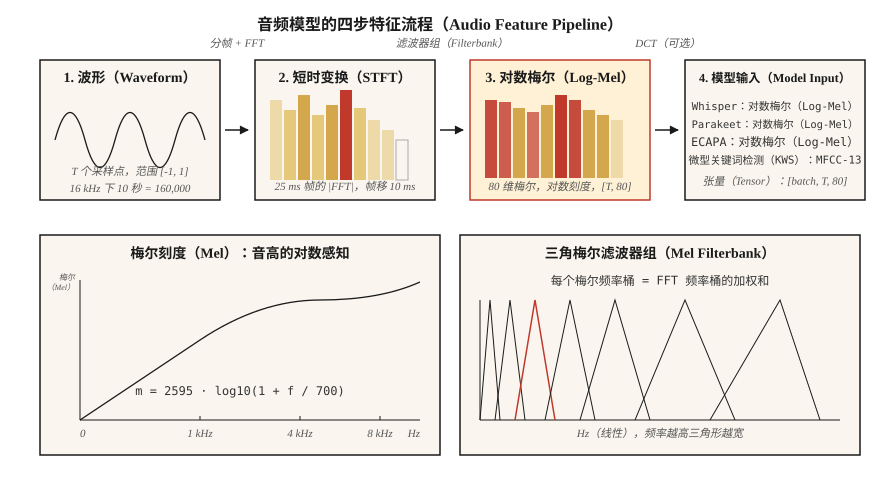

# 频谱图、梅尔刻度与音频特征（Spectrograms, Mel Scale & Audio Features）

> 神经网络不擅长直接处理原始波形，频谱图更适合它们，梅尔频谱图则更进一步。2026 年的每个自动语音识别、文本转语音和音频分类系统，成败都取决于这一项预处理选择。

**Type:** Build
**Languages:** Python
**Prerequisites:** 阶段 6 · 01（音频基础）
**Time:** ~45 分钟

## 问题（The Problem）

一段 10 秒、16 kHz 的音频包含 160,000 个浮点数，都在 `[-1, 1]` 内，与“狗叫”或“单词 cat”标签几乎毫无相关性。原始波形包含信息，但这种形式不便于模型提取。相同音素间隔 100 ms 发出时，原始采样值会完全不同。

频谱图（Spectrogram）解决了这个问题：它压缩人类感知忽略的时间细节（微秒级抖动），保留感知关注的结构（在约 10–25 ms 的时间窗内，哪些频率具有较高能量）。

梅尔频谱图（Mel Spectrogram）更进一步。人类对音高的感知呈对数关系：100 Hz 与 200 Hz 听起来的“距离”，与 1000 Hz 和 2000 Hz 相同。梅尔刻度据此变换频率轴。从 2010 年到 2026 年，梅尔刻度频谱图一直是语音机器学习最重要的单项特征。

## 概念（The Concept）



**短时傅里叶变换（Short-Time Fourier Transform，STFT）。** 将波形切成重叠帧（典型设置：25 ms 窗、10 ms 帧移，在 16 kHz 下即 400 / 160 个采样点）。每帧乘以窗函数（默认 Hann；Hamming 的取舍略有不同），再做快速傅里叶变换（Fast Fourier Transform，FFT）。将幅度谱堆叠成形状为 `(n_frames, n_freq_bins)` 的矩阵，即频谱图。

**对数幅度（Log-Magnitude）。** 原始幅度跨越 5–6 个数量级。取 `log(|X| + 1e-6)` 或 `20 * log10(|X|)` 压缩动态范围。所有生产流水线都使用对数幅度，而非原始幅度。

**梅尔刻度（Mel Scale）。** 以 Hz 为单位的频率 `f` 通过 `m = 2595 * log10(1 + f / 700)` 映射为梅尔值 `m`。1 kHz 以下近似线性，以上近似对数。覆盖 0–8 kHz 的 80 个梅尔频率桶是自动语音识别（Automatic Speech Recognition，ASR）的标准输入。

**梅尔滤波器组（Mel Filterbank）。** 在梅尔刻度上等间隔排列的一组三角滤波器。每个滤波器是相邻 FFT 频率桶的加权和。STFT 幅度与滤波器组矩阵相乘，一次矩阵乘法就得到梅尔频谱图。

**对数梅尔频谱图（Log-Mel Spectrogram）。** `log(mel_spec + 1e-10)`。它是 Whisper、Parakeet 和 SeamlessM4T 的输入，也是 2026 年通用的音频前端。

**梅尔频率倒谱系数（Mel-Frequency Cepstral Coefficients，MFCC）。** 对对数梅尔频谱图做 II 型离散余弦变换（Discrete Cosine Transform，DCT），保留前 13 个系数，以去相关并进一步压缩。它一直占据主导，直到约 2015 年，直接处理对数梅尔特征的卷积神经网络（Convolutional Neural Network，CNN）和 Transformer 赶上来。说话人识别（x-vectors、ECAPA）仍使用它。

**分辨率取舍（Resolution Trade）。** FFT 越长，频率分辨率越高，但时间分辨率越低。音频机器学习默认采用 25 ms / 10 ms；音乐用 50 ms / 12.5 ms；瞬态检测（鼓点、爆破音）用 5 ms / 2 ms。

```figure
spectrogram-window
```

## 动手实现（Build It）

### 第 1 步：对波形分帧（Step 1: frame the waveform）

```python
def frame(signal, frame_len, hop):
    n = 1 + (len(signal) - frame_len) // hop
    return [signal[i * hop : i * hop + frame_len] for i in range(n)]
```

一段 10 秒、16 kHz 的音频在 `frame_len=400, hop=160` 时会产生 998 帧。

### 第 2 步：Hann 窗（Step 2: Hann window）

```python
import math

def hann(N):
    return [0.5 * (1 - math.cos(2 * math.pi * n / (N - 1))) for n in range(N)]
```

在 FFT 前逐元素相乘，消除在非零端点截断造成的频谱泄漏（Spectral Leakage）。

### 第 3 步：STFT 幅度（Step 3: STFT magnitude）

```python
def stft_magnitude(signal, frame_len=400, hop=160):
    win = hann(frame_len)
    frames = frame(signal, frame_len, hop)
    return [magnitudes(dft([w * s for w, s in zip(win, f)])) for f in frames]
```

生产环境使用 `torch.stft` 或 `librosa.stft`（底层采用 FFT 并向量化）。这里的循环用于教学，在 `code/main.py` 中处理短音频。

### 第 4 步：梅尔滤波器组（Step 4: mel filterbank）

```python
def hz_to_mel(f):
    return 2595.0 * math.log10(1.0 + f / 700.0)

def mel_to_hz(m):
    return 700.0 * (10 ** (m / 2595.0) - 1)

def mel_filterbank(n_mels, n_fft, sr, fmin=0, fmax=None):
    fmax = fmax or sr / 2
    mels = [hz_to_mel(fmin) + (hz_to_mel(fmax) - hz_to_mel(fmin)) * i / (n_mels + 1)
            for i in range(n_mels + 2)]
    hzs = [mel_to_hz(m) for m in mels]
    bins = [int(h * n_fft / sr) for h in hzs]
    fb = [[0.0] * (n_fft // 2 + 1) for _ in range(n_mels)]
    for m in range(n_mels):
        for k in range(bins[m], bins[m + 1]):
            fb[m][k] = (k - bins[m]) / max(1, bins[m + 1] - bins[m])
        for k in range(bins[m + 1], bins[m + 2]):
            fb[m][k] = (bins[m + 2] - k) / max(1, bins[m + 2] - bins[m + 1])
    return fb
```

当 `n_fft=400` 时，覆盖 0–8 kHz 的 80 个梅尔频率桶形成 `(80, 201)` 矩阵。将 `(n_frames, 201)` 的 STFT 幅度矩阵乘以它的转置，得到 `(n_frames, 80)` 的梅尔频谱图。

### 第 5 步：对数梅尔特征（Step 5: log-mel）

```python
def log_mel(mel_spec, eps=1e-10):
    return [[math.log(max(v, eps)) for v in frame] for frame in mel_spec]
```

常见替代方式包括 `librosa.power_to_db`（相对于参考值归一化的分贝）和 `10 * log10(power + eps)`。Whisper 使用更复杂的截断加归一化流程，参见其 `log_mel_spectrogram`。

### 第 6 步：MFCC（Step 6: MFCCs）

```python
def dct_ii(x, n_coeffs):
    N = len(x)
    return [
        sum(x[n] * math.cos(math.pi * k * (2 * n + 1) / (2 * N)) for n in range(N))
        for k in range(n_coeffs)
    ]
```

对每一帧对数梅尔特征执行 DCT，保留前 13 个系数，得到 MFCC 矩阵。通常舍弃第一个系数，因为它编码整体能量。

## 实际应用（Use It）

2026 年的技术栈：

| 任务 | 特征 |
|------|----------|
| ASR（Whisper、Parakeet、SeamlessM4T） | 80 维对数梅尔特征，帧移 10 ms，窗长 25 ms |
| 文本转语音（Text-to-Speech，TTS）声学模型（VITS、F5-TTS、Kokoro） | 80 维梅尔特征，帧移 5–12 ms，以精细控制时序 |
| 音频分类（AST、PANNs、BEATs） | 128 维对数梅尔特征，帧移 10 ms |
| 说话人嵌入（ECAPA-TDNN、WavLM） | 80 维对数梅尔特征，或原始波形自监督学习（Self-Supervised Learning，SSL） |
| 音乐（MusicGen、Stable Audio 2） | EnCodec 离散词元（不是梅尔特征） |
| 关键词检测 | 面向微型设备的 40 维 MFCC |

经验法则：**只要不是处理音乐，就先用 80 维对数梅尔特征。** 采用其他配置需要给出证据。

## 2026 年仍会进入生产的问题（Pitfalls that still ship in 2026）

- **梅尔维数不匹配。** 训练用 80 维，推理用 128 维，会静默失败。两端都要记录特征形状。
- **上游采样率不匹配。** 22.05 kHz 下计算的梅尔特征与 16 kHz 下不同。应在特征提取*之前*修正采样率。
- **分贝与对数混淆。** Whisper 要求对数梅尔特征，而不是分贝梅尔特征。某些 Hugging Face 流水线会自动检测，自定义代码不会。
- **归一化漂移。** 训练时逐语句归一化，推理时却使用全局归一化。这种生产故障会使词错误率（Word Error Rate，WER）翻倍。
- **填充导致泄漏。** 在音频末尾补零，会使尾部帧产生平坦频谱。应使用对称填充或复制填充。

## 交付成果（Ship It）

保存为 `outputs/skill-feature-extractor.md`。该技能为给定目标模型选择特征类型、梅尔维数、帧长与帧移以及归一化方式。

## 练习（Exercises）

1. **简单。** 运行 `code/main.py`。它合成扫频信号（频率从 200 → 4000 Hz），并打印每帧最大值所在的梅尔频率桶。可选绘图，确认结果与扫频一致。
2. **中等。** 将 `n_mels` 设为 `{40, 80, 128}`，将 `frame_len` 设为 `{200, 400, 800}`，重新运行。沿时间轴测量尖峰带宽。哪种组合最能分辨扫频信号？
3. **困难。** 实现 `power_to_db`，在 AudioMNIST 上用小型 CNN 分类器比较三种输入的 ASR 准确率：(a) 原始对数梅尔特征，(b) `ref=max` 的分贝梅尔特征，(c) MFCC-13 加一阶差分和二阶差分。报告 top-1 准确率。

## 关键术语（Key Terms）

| 术语 | 常见说法 | 实际含义 |
|------|-----------------|-----------------------|
| 帧（Frame） | 一个切片 | 输入一次 FFT 的 25 ms 波形片段。 |
| 帧移（Hop） | 步幅 | 相邻帧之间的采样点数；ASR 默认 10 ms。 |
| 窗（Window） | Hann/Hamming 那类东西 | 逐点相乘，让帧边缘逐渐降至零的函数。 |
| 短时傅里叶变换（STFT） | 频谱图生成器 | 分帧加窗后做 FFT，生成时间 × 频率矩阵。 |
| 梅尔（Mel） | 变换后的频率 | 对数感知刻度；`m = 2595·log10(1 + f/700)`。 |
| 滤波器组（Filterbank） | 那个矩阵 | 将 STFT 投影到梅尔频率桶的三角滤波器。 |
| 对数梅尔特征（Log-Mel） | Whisper 的输入 | `log(mel_spec + eps)`；2026 年已标准化。 |
| 梅尔频率倒谱系数（MFCC） | 传统特征 | 对对数梅尔特征做 DCT；13 个去相关系数。 |

## 延伸阅读（Further Reading）

- [Davis、Mermelstein（1980）：单音节词识别的参数表示比较](https://ieeexplore.ieee.org/document/1163420)：MFCC 论文。
- [Stevens、Volkmann、Newman（1937）：测量音高心理量值的刻度](https://pubs.aip.org/asa/jasa/article-abstract/8/3/185/735757/)：梅尔刻度的原始论文。
- [OpenAI：Whisper 源码中的 log_mel_spectrogram](https://github.com/openai/whisper/blob/main/whisper/audio.py)：阅读参考实现。
- [librosa 特征提取文档](https://librosa.org/doc/main/feature.html)：`mfcc`、`melspectrogram` 以及帧移和窗函数的参考。
- [NVIDIA NeMo：音频预处理](https://docs.nvidia.com/deeplearning/nemo/user-guide/docs/en/main/asr/asr_all.html#featurizers)：面向 Parakeet 和 Canary 模型的生产级流水线。
