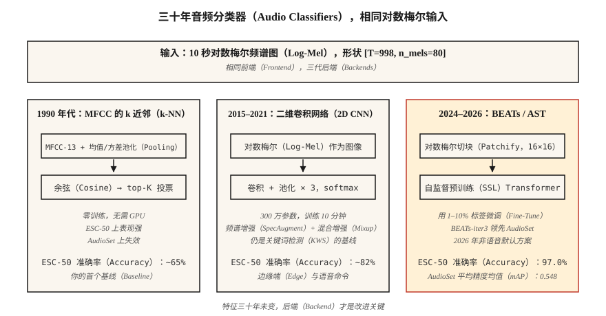

# 音频分类：从 MFCC 的 k 近邻到 AST 与 BEATs（Audio Classification — From k-NN on MFCCs to AST and BEATs）

> 从“狗叫还是警笛”到“这是什么语言”，都是音频分类。特征是梅尔特征，架构每十年演进一次，评估始终离不开曲线下面积（Area Under the Curve，AUC）、F1 和逐类召回率。

**Type:** Build
**Languages:** Python
**Prerequisites:** 阶段 6 · 02（频谱图与梅尔特征），阶段 3 · 06（卷积神经网络），阶段 5 · 08（用于文本的卷积神经网络与循环神经网络）
**Time:** ~75 分钟

## 问题（The Problem）

拿到一段 10 秒音频，你想知道“它是什么”：城市声音（警笛、电钻、狗）、语音命令（是/否/停止）、语言识别（en/es/ar）、说话人情绪（愤怒/中性），或环境声音（室内/室外、嘈杂人声）。这些都是*音频分类（Audio Classification）*。2026 年的基线架构已经成熟：对数梅尔特征 → 卷积神经网络（Convolutional Neural Network，CNN）或 Transformer → softmax。

核心困难不是网络，而是数据。音频数据集存在严重的类别不均衡、显著的领域偏移（干净与嘈杂环境）以及标签噪声（谁来界定“城市嘈杂人声”和“餐厅噪声”？）。问题的 80% 在数据整理、增强和评估，而非把 CNN 换成 Transformer。

## 概念（The Concept）



**基于梅尔频率倒谱系数（Mel-Frequency Cepstral Coefficients，MFCC）的 k 近邻（k-Nearest Neighbors，k-NN；1990 年代基线）。** 将每段音频的 MFCC 展平，与带标签的样本库计算余弦相似度，返回前 K 个邻居的多数票。在干净的小数据集（Speech Commands、ESC-50）上表现出乎意料地好，不需要 GPU。

**对数梅尔特征上的二维 CNN（2015–2019）。** 将 `(T, n_mels)` 对数梅尔特征视为图像，使用 ResNet-18 或 VGG 风格架构，对时间轴做全局均值池化，再对类别做 softmax。它仍是 2026 年大多数 Kaggle 竞赛的基线。

**音频频谱图 Transformer（Audio Spectrogram Transformer，AST；2021–2024）。** 将对数梅尔特征切成图块（例如 16×16），加入位置嵌入，输入视觉 Transformer（Vision Transformer，ViT）。在 AudioSet 的监督学习中达到当时最先进水平（平均精度均值 mAP 为 0.485）。

**BEATs 与 WavLM-base（2024–2026）。** 在数百万小时音频上进行自监督预训练，针对任务微调时，只需原本监督学习所需数据的 1–10%。2026 年，这是非语音音频任务的默认起点。BEATs-iter3 在 AudioSet 上比 AST 高 1–2 个 mAP 点，计算量却只有 1/4。

**将 Whisper 编码器作为冻结骨干网络（2024）。** 取出 Whisper 编码器，丢弃解码器，接上线性分类器。不做音频增强，在语言识别和简单事件分类上也能接近最先进水平。这是“免费的午餐”式基线。

### 类别不均衡才是真正挑战（Class imbalance is the real challenge）

ESC-50 有 50 类，每类 40 段，均衡且容易。UrbanSound8K 有 10 类，不均衡比例为 10:1。AudioSet 有 632 类，长尾比例达 100,000:1。有效方法包括：

- 训练时均衡采样，评估时不这样做。
- 混合增强（Mixup）：对两段音频及其标签做线性插值。
- 频谱增强（SpecAugment）：随机遮蔽时间带与频率带。方法简单，但至关重要。

### 评估（Evaluation）

- 多类别互斥任务（Speech Commands）：top-1 准确率、top-5 准确率。
- 多类别多标签任务（AudioSet、UrbanSound 风格）：平均精度均值（Mean Average Precision，mAP）。
- 严重不均衡任务：逐类召回率加宏平均 F1。

你应了解的 2026 年数据：

| 基准测试 | 基线 | 2026 年最先进水平 | 来源 |
|-----------|----------|-----------|--------|
| ESC-50 | 82%（AST） | 97.0%（BEATs-iter3） | BEATs 论文（2024） |
| AudioSet mAP | 0.485（AST） | 0.548（BEATs-iter3） | HEAR 2026 排行榜 |
| Speech Commands v2 | 98%（CNN） | 99.0%（Audio-MAE） | HEAR v2 结果 |

```figure
mfcc-pipeline
```

## 动手实现（Build It）

### 第 1 步：提取特征（Step 1: featurize）

```python
def featurize_mfcc(signal, sr, n_mfcc=13, n_mels=40, frame_len=400, hop=160):
    mag = stft_magnitude(signal, frame_len, hop)
    fb = mel_filterbank(n_mels, frame_len, sr)
    mels = apply_filterbank(mag, fb)
    log = log_transform(mels)
    return [dct_ii(frame, n_mfcc) for frame in log]
```

### 第 2 步：定长汇总（Step 2: fixed-length summary）

```python
def summarize(mfcc_frames):
    n = len(mfcc_frames[0])
    mean = [sum(f[i] for f in mfcc_frames) / len(mfcc_frames) for i in range(n)]
    var = [
        sum((f[i] - mean[i]) ** 2 for f in mfcc_frames) / len(mfcc_frames) for i in range(n)
    ]
    return mean + var
```

简单却有效：对 13 个系数的 MFCC 沿时间求均值和方差，得到 26 维定长嵌入，计算几乎瞬间完成。直到 2017 年，这种方法还曾在 ESC-50 上击败最先进的神经网络基线。

### 第 3 步：k 近邻（Step 3: k-NN）

```python
def cosine(a, b):
    dot = sum(x * y for x, y in zip(a, b))
    na = math.sqrt(sum(x * x for x in a)) or 1e-12
    nb = math.sqrt(sum(x * x for x in b)) or 1e-12
    return dot / (na * nb)

def knn_classify(q, bank, labels, k=5):
    sims = sorted(range(len(bank)), key=lambda i: -cosine(q, bank[i]))[:k]
    votes = Counter(labels[i] for i in sims)
    return votes.most_common(1)[0][0]
```

### 第 4 步：升级为对数梅尔特征上的 CNN（Step 4: upgrade to CNN on log-mels）

PyTorch 实现：

```python
import torch.nn as nn

class AudioCNN(nn.Module):
    def __init__(self, n_mels=80, n_classes=50):
        super().__init__()
        self.body = nn.Sequential(
            nn.Conv2d(1, 32, 3, padding=1), nn.ReLU(), nn.MaxPool2d(2),
            nn.Conv2d(32, 64, 3, padding=1), nn.ReLU(), nn.MaxPool2d(2),
            nn.Conv2d(64, 128, 3, padding=1), nn.ReLU(),
            nn.AdaptiveAvgPool2d(1),
        )
        self.head = nn.Linear(128, n_classes)

    def forward(self, x):  # x: (B, 1, T, n_mels)
        return self.head(self.body(x).flatten(1))
```

300 万参数。在单张 RTX 4090 上，用 ESC-50 训练约 10 分钟，准确率超过 80%。

### 步骤 5：微调预训练音频 Transformer（以 AST 为例）

```python
from transformers import ASTFeatureExtractor, ASTForAudioClassification

ext = ASTFeatureExtractor.from_pretrained("MIT/ast-finetuned-audioset-10-10-0.4593")
model = ASTForAudioClassification.from_pretrained(
    "MIT/ast-finetuned-audioset-10-10-0.4593",
    num_labels=50,
    ignore_mismatched_sizes=True,
)

inputs = ext(audio, sampling_rate=16000, return_tensors="pt")
logits = model(**inputs).logits
```

这个示例微调的是 Hub 上的 AST。作为 2026 年默认选择的 BEATs 并未发布在 Hugging Face Hub 上：请从 [microsoft/unilm 中的 BEATs 发布目录](https://github.com/microsoft/unilm/tree/master/beats) 下载检查点，并使用该仓库的 `BEATs` 和 `BEATsConfig` 类加载；微调循环的结构保持相同。

## 实际应用（Use It）

2026 年的技术栈：

| 情况 | 起步方案 |
|-----------|-----------|
| 微型数据集（<1000 段） | MFCC 均值上的 k-NN（你的基线）加音频增强 |
| 中等数据集（1K–100K） | 微调 BEATs 或 AST |
| 大型数据集（>100K） | 从零训练或微调 Whisper 编码器 |
| 实时、边缘端 | 40 维 MFCC 的 CNN，量化为 int8（关键词检测风格） |
| 多标签（AudioSet） | BEATs-iter3 加二元交叉熵损失、Mixup 和 SpecAugment |
| 语言识别 | MMS-LID、SpeechBrain VoxLingua107 基线 |

决策原则：**从冻结骨干网络开始，而不是全新模型**。微调 BEATs 的分类头，几小时而不是几周就能达到最先进水平的 95%。

## 交付成果（Ship It）

保存为 `outputs/skill-classifier-designer.md`。为给定音频分类任务选择架构、增强方式、类别平衡策略和评估指标。

## 练习（Exercises）

1. **简单。** 运行 `code/main.py`。它在四分类合成数据集（不同音高的纯音）上训练 k-NN MFCC 基线。报告混淆矩阵。
2. **中等。** 将 `summarize` 替换为 [均值、方差、偏度、峰度]。在同一合成数据集上，四阶矩池化是否优于均值加方差？
3. **困难。** 使用 `torchaudio`，在 ESC-50 第 1 折上训练二维 CNN。报告五折交叉验证准确率。加入 SpecAugment（时间掩码 = 20，频率掩码 = 10），报告变化量。

## 关键术语（Key Terms）

| 术语 | 常见说法 | 实际含义 |
|------|-----------------|-----------------------|
| AudioSet | 音频领域的 ImageNet | Google 的 YouTube 弱标签数据集，含 200 万段、632 类。 |
| ESC-50 | 小型分类基准 | 50 类 × 每类 40 段环境声音。 |
| AST | 音频频谱图 Transformer | 对数梅尔图块上的 ViT；2021 年最先进架构。 |
| BEATs | 自监督音频 | Microsoft 模型，截至 2026 年 iter3 领先 AudioSet。 |
| 混合增强（Mixup） | 成对增强 | `x = λ·x1 + (1-λ)·x2; y = λ·y1 + (1-λ)·y2`。 |
| 频谱增强（SpecAugment） | 基于遮蔽的增强 | 将频谱图随机时间带和频率带置零。 |
| 平均精度均值（mAP） | 主要的多标签指标 | 跨类别与阈值计算的平均精度均值。 |

## 延伸阅读（Further Reading）

- [Gong、Chung、Glass（2021）：AST，音频频谱图 Transformer](https://arxiv.org/abs/2104.01778)：2021–2024 年的代表架构。
- [Chen 等（2022，2024 年修订）：BEATs，使用声学分词器进行音频预训练](https://arxiv.org/abs/2212.09058)：2024 年以后的默认方案。
- [Park 等（2019）：频谱增强 SpecAugment](https://arxiv.org/abs/1904.08779)：占主导的音频增强方法。
- [Piczak（2015）：ESC-50 数据集](https://github.com/karolpiczak/ESC-50)：沿用至今的 50 类基准。
- [Gemmeke 等（2017）：AudioSet 数据集](https://research.google.com/audioset/)：632 类 YouTube 声音分类体系，仍是黄金标准。
