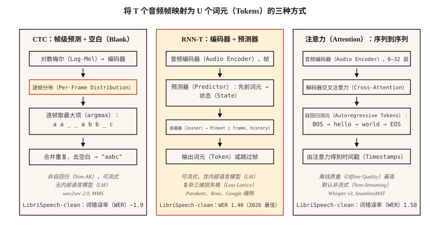

# 自动语音识别：CTC、RNN-T 与注意力（Speech Recognition (ASR) — CTC, RNN-T, Attention）

> 语音识别是在每个时间步进行音频分类，再用理解英语与静音的序列模型连接结果。CTC、RNN-T 和注意力是三条路线。选定一种，并理解原因。

**Type:** Build
**Languages:** Python
**Prerequisites:** 阶段 6 · 02（频谱图与梅尔特征），阶段 5 · 08（用于文本的卷积神经网络与循环神经网络），阶段 5 · 10（注意力）
**Time:** ~45 分钟

## 问题（The Problem）

你有一段 10 秒、16 kHz 的音频，希望得到“打开厨房的灯”这样的字符串。困难来自结构：音频帧与字符并非一一对应。“okay”可能持续 200 ms，也可能持续 1200 ms；静音穿插在话语中；有些音素比其他音素长；输出词元数量事先未知。

三种建模方式解决了这个问题：

1. **连接时序分类（Connectionist Temporal Classification，CTC）。** 输出每帧的词元概率，其中包含特殊的*空白词元（Blank）*。解码时合并重复并移除空白。非自回归、速度快，wav2vec 2.0 和 MMS 使用它。
2. **循环神经网络转导器（Recurrent Neural Network Transducer，RNN-T）。** 联合网络根据编码器帧和先前词元预测下一个词元，支持流式处理。Google 端侧 ASR 和 NVIDIA Parakeet 使用它。
3. **注意力编码器–解码器（Attention Encoder-Decoder）。** 编码器将音频压缩为隐藏状态，解码器通过交叉注意力自回归生成词元。Whisper 和 SeamlessM4T 使用它。

2026 年，LibriSpeech test-clean 上最先进的词错误率为 1.4%（NVIDIA Parakeet-TDT-1.1B）和 1.58%（Whisper-Large-v3-turbo）。质量差异很小，部署差异却很大。

## 概念（The Concept）



**CTC 直觉。** 编码器输出 `T` 个帧级分布，每个分布覆盖 `V+1` 个词元（V 个字符加空白）。目标字符串 `y` 的长度为 `U < T` 时，所有能折叠成 `y` 的帧对齐都计入。CTC 损失对这些对齐求和。推理时逐帧取最大概率项，合并重复，再移除空白。

优点：非自回归、可流式处理、不需前瞻。缺点是*条件独立假设（Conditional Independence Assumption）*：各帧预测彼此独立，因此没有内部语言模型。可通过束搜索或浅层融合引入外部语言模型（Language Model，LM）弥补。

**RNN-T 直觉。** 增加一个嵌入词元历史的*预测器（Predictor）*网络，以及把预测器状态与编码器帧合并成 `V+1` 联合分布的*连接器（Joiner）*（`+1` 表示空值或不输出）。它显式建模 CTC 忽略的条件依赖。每一步只依赖过去的帧与词元，因此支持流式处理。

优点：支持流式处理并包含内部语言模型。缺点：训练更复杂、更耗内存（三维损失格）；RNN-T 损失内核本身就构成一类库。

**注意力编码器–解码器。** 编码器用 6–32 层 Transformer 处理对数梅尔帧。解码器也有 6–32 层，通过对编码器输出做交叉注意力，自回归生成词元。没有对齐约束，注意力可查看音频任意位置。除非限制注意力，否则不能流式处理（例如 2024 年分块的 Whisper-Streaming）。

优点：离线 ASR 质量最高，可用标准序列到序列（Sequence-to-Sequence，seq2seq）工具方便训练。缺点：自回归延迟与输出长度成正比，需要额外工程才能流式处理。

### 词错误率：核心指标（WER: the one number）

**词错误率（Word Error Rate，WER）** = `(S + D + I) / N`，其中 S 为替换数，D 为删除数，I 为插入数，N 为参考文本词数。它对应词级 Levenshtein 编辑距离，越低越好。超过 20% 通常不可用；低于 5% 时，朗读语音识别可与人类水平相当。2026 年标准基准数据：

| 模型 | LibriSpeech test-clean | LibriSpeech test-other | 大小 |
|-------|------------------------|------------------------|------|
| Parakeet-TDT-1.1B | 1.40% | 2.78% | 11 亿参数 |
| Whisper-Large-v3-turbo | 1.58% | 3.03% | 8.09 亿 |
| Canary-1B Flash | 1.48% | 2.87% | 10 亿 |
| Seamless M4T v2 | 1.7% | 3.5% | 23 亿 |

它们均基于编码器–解码器或 RNN-T。纯 CTC 系统（wav2vec 2.0）在 test-clean 上约为 1.8–2.1%。

```figure
ctc-collapse
```

## 动手实现（Build It）

### 第 1 步：CTC 贪心解码（Step 1: greedy CTC decode）

```python
def ctc_greedy(frame_logits, blank=0, vocab=None):
    # frame_logits: list of per-frame probability vectors
    preds = [max(range(len(p)), key=lambda i: p[i]) for p in frame_logits]
    out = []
    prev = -1
    for p in preds:
        if p != prev and p != blank:
            out.append(p)
        prev = p
    return "".join(vocab[i] for i in out) if vocab else out
```

两条规则：合并连续重复，删除空白。例如 `a a _ _ a b b _ c` → `a a b c`。

### 第 2 步：CTC 束搜索（Step 2: beam-search CTC）

```python
def ctc_beam(frame_logits, beam=8, blank=0):
    import math
    beams = [([], 0.0)]  # (tokens, log_prob)
    for p in frame_logits:
        log_p = [math.log(max(pi, 1e-10)) for pi in p]
        candidates = []
        for seq, lp in beams:
            for t, lpt in enumerate(log_p):
                new = seq[:] if t == blank else (seq + [t] if not seq or seq[-1] != t else seq)
                candidates.append((new, lp + lpt))
        candidates.sort(key=lambda x: -x[1])
        beams = candidates[:beam]
    return beams[0][0]
```

生产环境使用带语言模型融合的前缀树束搜索；这里只展示概念骨架。

### 第 3 步：词错误率（Step 3: WER）

```python
def wer(ref, hyp):
    r, h = ref.split(), hyp.split()
    dp = [[0] * (len(h) + 1) for _ in range(len(r) + 1)]
    for i in range(len(r) + 1):
        dp[i][0] = i
    for j in range(len(h) + 1):
        dp[0][j] = j
    for i in range(1, len(r) + 1):
        for j in range(1, len(h) + 1):
            cost = 0 if r[i - 1] == h[j - 1] else 1
            dp[i][j] = min(
                dp[i - 1][j] + 1,
                dp[i][j - 1] + 1,
                dp[i - 1][j - 1] + cost,
            )
    return dp[len(r)][len(h)] / max(1, len(r))
```

### 第 4 步：使用 Whisper 推理（Step 4: inference against Whisper）

```python
import whisper
model = whisper.load_model("large-v3-turbo")
result = model.transcribe("clip.wav")
print(result["text"])
```

几行代码即可调用 2026 年最强的通用 ASR。在 24 GB GPU 上运行速度约为实时的 20 倍。

### 第 5 步：使用 Parakeet 或 wav2vec 2.0 流式处理（Step 5: streaming with Parakeet or wav2vec 2.0）

```python
from transformers import pipeline
asr = pipeline("automatic-speech-recognition", model="nvidia/parakeet-tdt-1.1b")
for chunk in streaming_audio():
    print(asr(chunk, return_timestamps=True))
```

流式 ASR 需要分块编码器注意力与跨块状态传递；使用支持这些能力的库（Parakeet 用 NeMo，或使用带 `chunk_length_s` 的 `transformers` 流水线）。

## 实际应用（Use It）

2026 年的技术栈：

| 情况 | 选择 |
|-----------|------|
| 英语、离线、追求最高质量 | Whisper-large-v3-turbo |
| 多语言、要求稳健 | SeamlessM4T v2 |
| 流式、低延迟 | Parakeet-TDT-1.1B 或 Riva |
| 边缘端、移动端、延迟 <500 ms | 量化 Whisper-Tiny 或 Moonshine（2024） |
| 长音频 | 基于语音活动检测分块的 Whisper（WhisperX） |
| 专业领域（医疗、法律） | 微调 wav2vec 2.0，加领域语言模型融合 |

## 2026 年仍会进入生产的问题（Pitfalls that still ship in 2026）

- **没有语音活动检测（Voice Activity Detection，VAD）。** Whisper 在静音上会产生幻觉，例如“感谢观看！”。始终用 VAD 把关。
- **字符、词与子词级 WER 混淆。** 应在文本归一化（小写、去标点）*之后*报告词级 WER。
- **语言识别漂移。** Whisper 自动语言识别会将嘈杂音频错分为日语或威尔士语；已知语言时强制设置 `language="en"`。
- **长音频不分块。** Whisper 窗口为 30 秒，更长内容使用 `chunk_length_s=30, stride=5`。

## 交付成果（Ship It）

保存为 `outputs/skill-asr-picker.md`。为给定部署目标选择模型、解码策略、分块和语言模型融合方案。

## 练习（Exercises）

1. **简单。** 运行 `code/main.py`。它对手工构造的 CTC 输出做贪心解码，并与参考文本比较计算 WER。
2. **中等。** 正确实现第 2 步的前缀树束搜索，考虑空白合并规则。在含 10 个样例的合成数据集上与贪心解码比较。
3. **困难。** 在 [LibriSpeech test-clean 数据集](https://www.openslr.org/12) 上使用 `whisper-large-v3-turbo`。计算前 100 条语句的 WER，与公布的数据比较。

## 关键术语（Key Terms）

| 术语 | 常见说法 | 实际含义 |
|------|-----------------|-----------------------|
| 连接时序分类（CTC） | 空白词元损失 | 对所有帧到词元对齐进行边缘化；非自回归。 |
| 循环神经网络转导器（RNN-T） | 流式损失 | CTC 加下一词元预测器；能处理词序。 |
| 注意力编码器–解码器（Attention Enc-Dec） | Whisper 风格 | 编码器加交叉注意力解码器；离线质量最佳。 |
| 词错误率（WER） | 要报告的那个数字 | 词级 `(S+D+I)/N`。 |
| 空白（Blank） | 空内容 | CTC 中表示“本帧不输出”的特殊词元。 |
| 语言模型融合（LM Fusion） | 外部语言模型 | 束搜索时加入加权的语言模型对数概率。 |
| 语音活动检测（VAD） | 静音门控 | 检测语音活动，裁去非语音内容。 |

## 延伸阅读（Further Reading）

- [Graves 等（2006）：连接时序分类](https://www.cs.toronto.edu/~graves/icml_2006.pdf)：CTC 论文。
- [Graves（2012）：使用循环神经网络进行序列转导](https://arxiv.org/abs/1211.3711)：RNN-T 论文。
- [Radford 等 / OpenAI（2022）：Whisper，通过大规模弱监督实现稳健语音识别](https://arxiv.org/abs/2212.04356)：2022 年的经典论文，2024 年扩展为 v3-turbo。
- [NVIDIA NeMo：Parakeet-TDT 模型卡](https://huggingface.co/nvidia/parakeet-tdt-1.1b)：2026 年 Open ASR 排行榜领先者。
- [Hugging Face：Open ASR 排行榜](https://huggingface.co/spaces/hf-audio/open_asr_leaderboard)：覆盖 25 个以上模型的动态基准。
