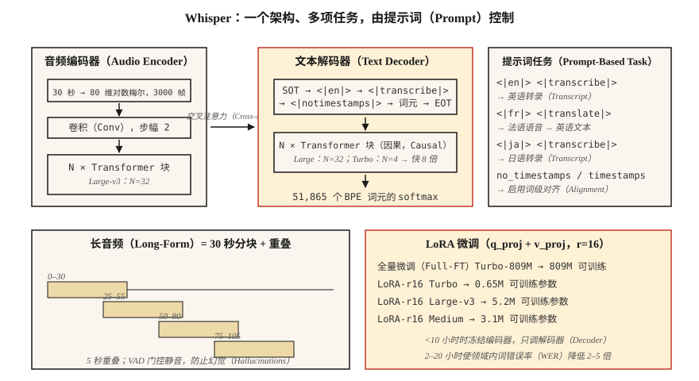

# Whisper：架构与微调（Whisper — Architecture & Fine-Tuning）

> Whisper 是窗口为 30 秒的 Transformer 编码器–解码器，在 68 万小时多语言弱监督音频–文本对上训练。一个架构支持多项任务，在 99 种语言上表现稳健，是 2026 年的参考自动语音识别模型。

**Type:** Build
**Languages:** Python
**Prerequisites:** 阶段 6 · 04（自动语音识别），阶段 5 · 10（注意力），阶段 7 · 05（完整 Transformer）
**Time:** ~75 分钟

## 问题（The Problem）

OpenAI 于 2022 年 9 月发布 Whisper，这是首个以通用现成工具形式交付的自动语音识别（Automatic Speech Recognition，ASR）模型：输入音频、获得文本，支持 99 种语言、耐受噪声，还能在笔记本电脑上运行。到 2024 年，OpenAI 已推出 Large-v3 和 Turbo；到 2026 年，从播客转录、语音助手到 YouTube 字幕，Whisper 都是默认基线。

但你不能永远把 Whisper 当成黑箱流水线。领域偏移会让它失效：技术术语、说话人口音、专有名词、短片段和静音都可能出问题。你需要知道：

1. 它的内部到底是什么。
2. 如何正确输入分块、流式或长音频。
3. 何时需要微调，以及如何微调。

## 概念（The Concept）



**架构（Architecture）。** 标准 Transformer 编码器–解码器。

- 输入：30 秒对数梅尔频谱图，80 维梅尔特征，10 ms 帧移 → 3000 帧。较短片段补零，较长片段分块。
- 编码器：卷积降采样（步幅 2）加 `N` 个 Transformer 块。Large-v3 为 32 层、1280 维、20 个头。
- 解码器：`N` 个 Transformer 块，包含因果自注意力和对编码器输出的交叉注意力，大小与编码器相同。
- 输出：在包含 51,865 个词元的词表上生成字节对编码（Byte-Pair Encoding，BPE）词元。

Large-v3 有 15.5 亿参数。Turbo 将解码器从 32 层减为 4 层，延迟缩短 8 倍，词错误率退化不到 1%。

**提示词格式（Prompt Format）。** Whisper 是多任务模型，通过解码器提示词中的特殊词元控制任务：

```
<|startoftranscript|><|en|><|transcribe|><|notimestamps|> Hello world.<|endoftext|>
```

- `<|en|>`：语言标签，强制控制翻译与转录行为。
- `<|transcribe|>` 或 `<|translate|>`：逐字转录，或将任意语言输入翻译为英语输出。
- `<|notimestamps|>`：跳过词级时间戳，速度更快。

提示词让一个模型执行多种任务。把 `<|en|>` 改为 `<|fr|>`，它就转录法语。

**30 秒窗口（30-Second Window）。** 所有处理都固定在 30 秒窗口上，长音频分块，短音频填充。窗口并非原生流式处理，这就是 WhisperX、Whisper-Streaming 和 faster-whisper 存在的原因。

**对数梅尔归一化（Log-Mel Normalization）。** `(log_mel - mean) / std`，统计量来自 Whisper 自身训练语料。你*必须*使用 Whisper 的预处理（`whisper.audio.log_mel_spectrogram`），而非 `librosa.feature.melspectrogram`。

### 2026 年的变体（Variants in 2026）

| 变体 | 参数量 | 延迟（A100） | 词错误率（LibriSpeech-clean） |
|---------|--------|----------------|------------------------|
| Tiny | 3900 万 | 1× 实时 | 5.4% |
| Base | 7400 万 | 1× | 4.1% |
| Small | 2.44 亿 | 1× | 3.0% |
| Medium | 7.69 亿 | 1× | 2.7% |
| Large-v3 | 15.5 亿 | 2× | 1.8% |
| Large-v3-turbo | 8.09 亿 | 8× | 1.58% |
| Whisper-Streaming（2024） | 15.5 亿 | 流式 | 2.0% |

### 微调（Fine-tuning）

2026 年的标准流程：

1. 收集 10–100 小时带对齐转录文本的目标领域音频。
2. 使用带 `generate_with_loss` 回调的 `transformers.Seq2SeqTrainer`。
3. 参数高效方法：在注意力层的 `q_proj`、`k_proj`、`v_proj` 上使用低秩适配（Low-Rank Adaptation，LoRA），GPU 内存需求降至 1/4，WER 代价小于 0.3。
4. 数据不足 10 小时时冻结编码器，只微调解码器。
5. 使用 Whisper 自带分词器和提示词格式，绝不替换分词器。

社区结果：用 20 小时医疗口述微调 Medium，医疗词汇上的 WER 从 12% 降至 4.5%；用 4 小时冰岛语微调 Turbo，WER 从 18% 降至 6%。

```figure
sp-asr-attention
```

## 动手实现（Build It）

### 第 1 步：直接运行 Whisper（Step 1: run Whisper out of the box）

```python
import whisper
model = whisper.load_model("large-v3-turbo")
result = model.transcribe(
    "clip.wav",
    language="en",
    task="transcribe",
    temperature=0.0,
    condition_on_previous_text=False,  # prevents runaway repetition
)
print(result["text"])
for seg in result["segments"]:
    print(f"[{seg['start']:.2f}–{seg['end']:.2f}] {seg['text']}")
```

应始终覆盖的关键默认值：`temperature=0.0`（采样默认采用 0.0 → 0.2 → 0.4 … 的回退链）、`condition_on_previous_text=False`（防止级联幻觉）和 `no_speech_threshold=0.6`（静音检测）。

### 第 2 步：长音频分块（Step 2: chunked long-form）

```python
# whisperx is the 2026 reference for long-form with word-level timestamps
import whisperx
model = whisperx.load_model("large-v3-turbo", device="cuda", compute_type="float16")
segments = model.transcribe("1hour.mp3", batch_size=16, chunk_size=30)
```

WhisperX 增加了三项功能：(1) Silero 语音活动检测（Voice Activity Detection，VAD）门控，(2) 通过 wav2vec 2.0 做词级对齐，(3) 通过 `pyannote.audio` 做说话人分离（Diarization）。它是 2026 年生产转录的主力工具。

### 第 3 步：用 LoRA 微调（Step 3: fine-tune with LoRA）

```python
from transformers import WhisperForConditionalGeneration, WhisperProcessor
from peft import LoraConfig, get_peft_model

model = WhisperForConditionalGeneration.from_pretrained("openai/whisper-large-v3-turbo")
lora = LoraConfig(
    r=16, lora_alpha=32, target_modules=["q_proj", "v_proj"],
    lora_dropout=0.1, bias="none", task_type="SEQ_2_SEQ_LM",
)
model = get_peft_model(model, lora)
# model.print_trainable_parameters()  -> ~3M trainable / 809M total
```

随后使用标准 Trainer 循环，每 1000 步保存检查点，在留出集上用词错误率（Word Error Rate，WER）评估。

### 第 4 步：查看每层学到了什么（Step 4: inspect what each layer learns）

```python
# Grab cross-attention weights during decode to see what the decoder attends to.
with torch.inference_mode():
    out = model.generate(
        input_features=features,
        return_dict_in_generate=True,
        output_attentions=True,
    )
# out.cross_attentions: layer × head × step × src_len
```

用热力图可视化，你会看到解码步骤扫描编码器帧时形成对角线对齐。这条对角线就是 Whisper 对词时间戳的内部表示。

## 实际应用（Use It）

2026 年的技术栈：

| 情况 | 选择 |
|-----------|------|
| 通用英语、离线 | 通过 `whisperx` 使用 Large-v3-turbo |
| 移动端 / 边缘端 | int8 量化 Whisper-Tiny 或 Moonshine |
| 多语言长音频 | 通过 `whisperx` 使用 Large-v3，加说话人分离 |
| 低资源语言 | 用 LoRA 微调 Medium 或 Turbo |
| 流式（延迟 2 秒） | Whisper-Streaming 或 Parakeet-TDT |
| 词级时间戳 | WhisperX（通过 wav2vec 2.0 强制对齐） |

`faster-whisper`（CTranslate2 后端）是 2026 年最快的 CPU+GPU 推理运行时，比原版快 4 倍，输出相同。

## 2026 年仍会进入生产的问题（Pitfalls that still ship in 2026）

- **静音上产生幻觉文本。** Whisper 的字幕训练数据包括“感谢观看！”、“请订阅！”和歌词。调用前始终使用 VAD 门控。
- **`condition_on_previous_text` 级联。** 一次幻觉会污染后续窗口。除非需要跨块流畅性，否则设为 `False`。
- **短片段填充。** 2 秒音频填充至 30 秒后，尾部静音可能触发幻觉。使用 `pad=False` 或 VAD 门控。
- **错误的梅尔统计量。** 使用 librosa 的梅尔特征而非 Whisper 的，会产生近似随机的输出。使用 `whisper.audio.log_mel_spectrogram`。

## 交付成果（Ship It）

保存为 `outputs/skill-whisper-tuner.md`。为给定领域设计 Whisper 微调或推理流水线。

## 练习（Exercises）

1. **简单。** 运行 `code/main.py`。它对 Whisper 风格提示词分词，计算解码的形状预算，并打印 10 分钟音频的分块计划。
2. **中等。** 安装 `faster-whisper`，转录 10 分钟播客，与人工转录比较 WER。尝试 `language="auto"` 与强制 `language="en"`。
3. **困难。** 使用 Hugging Face 的 `datasets`，选择 Whisper 不擅长的语言（如乌尔都语），在 2 小时数据上用 LoRA 微调 Medium 两轮，报告 WER 变化。

## 关键术语（Key Terms）

| 术语 | 常见说法 | 实际含义 |
|------|-----------------|-----------------------|
| 30 秒窗口（30-Sec Window） | Whisper 的限制 | 硬性输入上限，长音频需分块。 |
| 转录起始（Start-of-Transcript，SOT） | 转录的开头 | `<\|startoftranscript\|>` 启动解码器提示词。 |
| 时间戳词元（Timestamps Token） | 时间对齐 | 每 0.02 秒偏移对应 51k 词表中的一个特殊词元。 |
| Turbo | 快速变体 | 4 层解码器、快 8 倍、WER 退化 <1%。 |
| WhisperX | 长音频封装 | VAD + Whisper + wav2vec 对齐 + 说话人分离。 |
| LoRA 微调（LoRA Fine-Tune） | 高效调优 | 在注意力中加入低秩适配器，训练约 0.3% 参数。 |
| 幻觉（Hallucination） | 静默故障 | Whisper 从噪声或静音生成流畅英语。 |

## 延伸阅读（Further Reading）

- [Radford 等（2022）：Whisper 论文](https://arxiv.org/abs/2212.04356)：原始架构与训练方案。
- [OpenAI（2024）：Whisper Large-v3-turbo 发布说明](https://github.com/openai/whisper/discussions/2363)：4 层解码器，8 倍加速。
- [Bain 等（2023）：WhisperX 论文](https://arxiv.org/abs/2303.00747)：长音频、词级对齐和说话人分离。
- [Systran：faster-whisper 仓库](https://github.com/SYSTRAN/faster-whisper)：基于 CTranslate2，快 4 倍。
- [Hugging Face：Whisper 微调教程](https://huggingface.co/blog/fine-tune-whisper)：标准 LoRA / 全量微调教程。
