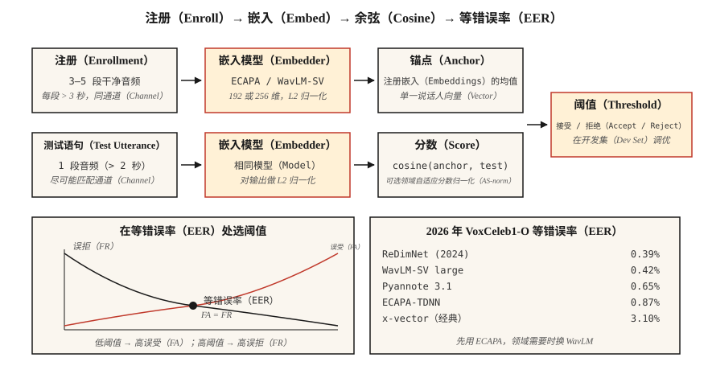

# 说话人识别与验证（Speaker Recognition & Verification）

> 自动语音识别问“说了什么”，说话人识别问“谁说的”。数学形式看起来相同，都是嵌入加余弦，但生产中的每项决策都围绕一个等错误率数字展开。

**Type:** Build
**Languages:** Python
**Prerequisites:** 阶段 6 · 02（频谱图与梅尔特征），阶段 5 · 22（嵌入模型）
**Time:** ~45 分钟

## 问题（The Problem）

用户说出口令，你想知道：此人是否是其声称的身份（*验证，Verification*，1:1），还是注册库中的第一个人（*辨识，Identification*，1:N）？也可能都不是，而是未知说话人（*开放集，Open-Set*）？

2018 年之前使用高斯混合模型–通用背景模型（GMM-UBM）加 i-vectors，等错误率尚可，但容易受通道变化（电话与笔记本）和情绪影响。2018–2022 年使用 x-vectors（以角度间隔训练的时延神经网络骨干）。2022 年以后使用 ECAPA-TDNN 与 WavLM-large 嵌入。到 2026 年，这一领域由三个模型和一个指标主导。

这个指标是**等错误率（Equal Error Rate，EER）**：调整决策阈值，使错误接受率（False Accept Rate，FAR）等于错误拒绝率（False Reject Rate，FRR），交点即 EER。论文、排行榜和采购讨论都会用它。

## 概念（The Concept）



**流水线（Pipeline）。** 注册时录制目标说话人 5–30 秒音频，计算定维嵌入（ECAPA-TDNN 为 192 维，WavLM-large 为 256 维）。验证时提取测试语句嵌入，计算余弦相似度，与阈值比较。

**ECAPA-TDNN（2020，2026 年仍占主导）。** 强化通道注意力、传播与聚合的时延神经网络（Emphasized Channel Attention, Propagation and Aggregation - Time-Delay Neural Network）。采用带压缩激励的一维卷积块、多头注意力池化，再接映射至 192 维的线性层。在 VoxCeleb 1+2（2,700 名说话人、110 万条语句）上用加性角度间隔损失（Additive Angular Margin，AAM-softmax）训练。

**WavLM-SV（2022 年以后）。** 用 AAM 损失微调已预训练的 WavLM-large 自监督学习（Self-Supervised Learning，SSL）骨干。质量更高但更慢，大小超过 300 MB，相比之下另一方案为 15 MB。

**x-vector（基线）。** 时延神经网络（Time-Delay Neural Network，TDNN）加统计池化。经典方案，在 CPU 和边缘端仍有价值。

**AAM-softmax。** 在标准 softmax 的角度空间加入间隔 `m`，正确类别使用 `cos(θ + m)`，强制不同类别在角度上分离。典型设置为 `m=0.2`、缩放系数 `s=30`。

### 打分（Scoring）

- 注册嵌入与测试嵌入之间的**余弦相似度（Cosine）**，根据阈值决策。
- **概率线性判别分析（Probabilistic Linear Discriminant Analysis，PLDA）。** 将嵌入投影至潜在空间，在其中可对同一说话人与不同说话人计算闭式似然比。在余弦方案上加入它，可额外降低 10–20% 的 EER。2020 年前属于标准做法，如今仅用于封闭集设置。
- **分数归一化（Score Normalization）。** `S-norm` 或 `AS-norm`：根据一组冒名者分数的均值与标准差归一化每个分数，跨领域评估不可缺少。

### 应了解的 2026 年数据（Numbers you should know (2026)）

| 模型 | VoxCeleb1-O 等错误率 | 参数量 | 吞吐量（A100） |
|-------|-----------------|--------|-------------------|
| x-vector（经典） | 3.10% | 500 万 | 400× 实时 |
| ECAPA-TDNN | 0.87% | 1500 万 | 200× 实时 |
| WavLM-SV large | 0.42% | 3.16 亿 | 20× 实时 |
| Pyannote 3.1 分段与嵌入 | 0.65% | 600 万 | 100× 实时 |
| ReDimNet（2024） | 0.39% | 2400 万 | 100× 实时 |

### 说话人分离（Diarization）

确定多人音频中“谁在何时说话”。流水线为：语音活动检测（Voice Activity Detection，VAD）→ 分段 → 每段提取嵌入 → 聚类（凝聚式或谱聚类）→ 平滑边界。现代技术栈 `pyannote.audio` 3.1 将说话人分段、嵌入和聚类封装为一次调用。2026 年 AMI 上最先进的说话人分离错误率约为 15%，低于 2022 年的 23%。

```figure
sp-eer-crossover
```

## 动手实现（Build It）

### 第 1 步：从 MFCC 统计量构造教学嵌入（Step 1: toy embedding from MFCC statistics）

```python
def embed_mfcc_stats(signal, sr):
    frames = featurize_mfcc(signal, sr, n_mfcc=13)
    mean = [sum(f[i] for f in frames) / len(frames) for i in range(13)]
    std = [
        math.sqrt(sum((f[i] - mean[i]) ** 2 for f in frames) / len(frames))
        for i in range(13)
    ]
    return mean + std  # 26-d
```

它远非最先进方法，仅用于教学。`code/main.py` 在合成说话人数据上用它做概念验证。

### 第 2 步：余弦相似度与阈值（Step 2: cosine similarity + threshold）

```python
def cosine(a, b):
    dot = sum(x * y for x, y in zip(a, b))
    na = math.sqrt(sum(x * x for x in a))
    nb = math.sqrt(sum(x * x for x in b))
    return dot / (na * nb) if na and nb else 0.0

def verify(enroll, test, threshold=0.75):
    return cosine(enroll, test) >= threshold
```

### 第 3 步：从成对相似度计算 EER（Step 3: EER from similarity pairs）

```python
def eer(same_scores, diff_scores):
    thresholds = sorted(set(same_scores + diff_scores))
    best = (1.0, 1.0, 0.0)  # (fa, fr, threshold)
    for t in thresholds:
        fr = sum(1 for s in same_scores if s < t) / len(same_scores)
        fa = sum(1 for s in diff_scores if s >= t) / len(diff_scores)
        if abs(fa - fr) < abs(best[0] - best[1]):
            best = (fa, fr, t)
    return (best[0] + best[1]) / 2, best[2]
```

返回等错误率及对应阈值（eer、threshold_at_eer），两者都要报告。

### 第 4 步：用 SpeechBrain 实现生产方案（Step 4: production with SpeechBrain）

```python
from speechbrain.pretrained import EncoderClassifier

clf = EncoderClassifier.from_hparams(source="speechbrain/spkrec-ecapa-voxceleb")

# enroll: average the embeddings of 3-5 clean samples
enroll = torch.stack([clf.encode_batch(load(x)) for x in enrollment_clips]).mean(0)
# verify
score = clf.similarity(enroll, clf.encode_batch(load("test.wav"))).item()
verdict = score > 0.25   # ECAPA typical threshold; tune on your data
```

### 第 5 步：用 pyannote 做说话人分离（Step 5: diarize with pyannote）

```python
from pyannote.audio import Pipeline

pipe = Pipeline.from_pretrained("pyannote/speaker-diarization-3.1")
diarization = pipe("meeting.wav", num_speakers=None)
for turn, _, speaker in diarization.itertracks(yield_label=True):
    print(f"{turn.start:.1f}–{turn.end:.1f}  {speaker}")
```

## 实际应用（Use It）

2026 年的技术栈：

| 情况 | 选择 |
|-----------|------|
| 封闭集 1:1 验证、边缘端 | ECAPA-TDNN 加余弦阈值 |
| 开放集验证、云端 | WavLM-SV 加 AS-norm |
| 说话人分离（会议、播客） | `pyannote/speaker-diarization-3.1` |
| 防伪（重放 / 深度伪造检测） | AASIST 或 RawNet2 |
| 微型嵌入式设备（关键词检测加注册） | Titanet-Small（NeMo） |

## 常见陷阱（Pitfalls）

- **通道不匹配。** VoxCeleb（网络视频）训练模型不等于电话音频模型，始终在目标通道上评估。
- **语句过短。** 测试音频短于 3 秒时，EER 急剧恶化。
- **带噪注册。** 一条嘈杂注册音频就会污染参考锚点。至少使用 3 条干净样本并取平均。
- **跨条件固定阈值。** 始终在来自目标领域的留出开发集上调阈值。
- **对未归一化嵌入使用余弦。** 先做 L2 归一化，否则幅值会主导结果。

## 交付成果（Ship It）

保存为 `outputs/skill-speaker-verifier.md`。选择模型、注册协议、阈值调优计划及反欺诈防护措施。

## 练习（Exercises）

1. **简单。** 运行 `code/main.py`。它构造合成“说话人”（不同音调组合）、进行注册，并在 100 对试验列表上计算 EER。
2. **中等。** 在 30 条 VoxCeleb1 语句上使用 SpeechBrain ECAPA（5 名说话人，每人 6 条），分别用余弦与 PLDA 计算 EER。
3. **困难。** 用 `pyannote.audio` 构建完整的注册 → 说话人分离 → 验证流水线，在 AMI 开发集上评估说话人分离错误率。

## 关键术语（Key Terms）

| 术语 | 常见说法 | 实际含义 |
|------|-----------------|-----------------------|
| 等错误率（EER） | 核心指标 | 错误接受率等于错误拒绝率的阈值处的错误率。 |
| 验证（Verification） | 1:1 | “这是 Alice 吗？” |
| 辨识（Identification） | 1:N | “是谁在说话？” |
| 开放集（Open-Set） | 可能未知 | 测试集可以包含未注册说话人。 |
| 注册（Enrollment） | 登记 | 计算说话人的参考嵌入。 |
| AAM-softmax | 那个损失函数 | 带加性角度间隔的 softmax，强制簇间分离。 |
| 概率线性判别分析（PLDA） | 经典打分 | 在嵌入上进行似然比打分的概率线性判别分析。 |
| 说话人分离错误率（Diarization Error Rate，DER） | 说话人分离指标 | 漏检加误报加说话人混淆。 |

## 延伸阅读（Further Reading）

- [Snyder 等（2018）：X-Vectors，用于说话人识别的稳健深度神经网络嵌入](https://www.danielpovey.com/files/2018_icassp_xvectors.pdf)：经典深度嵌入论文。
- [Desplanques 等（2020）：ECAPA-TDNN 论文](https://arxiv.org/abs/2005.07143)：2020–2026 年的主导架构。
- [Chen 等（2022）：WavLM，面向全栈语音处理的大规模自监督预训练](https://arxiv.org/abs/2110.13900)：用于说话人验证与分离的自监督骨干。
- [Bredin 等（2023）：pyannote.audio 3.1 项目](https://github.com/pyannote/pyannote-audio)：生产级说话人分离与嵌入技术栈。
- [VoxCeleb 排行榜（2026 年更新）](https://www.robots.ox.ac.uk/~vgg/data/voxceleb/)：各模型的当前 EER 排名。
