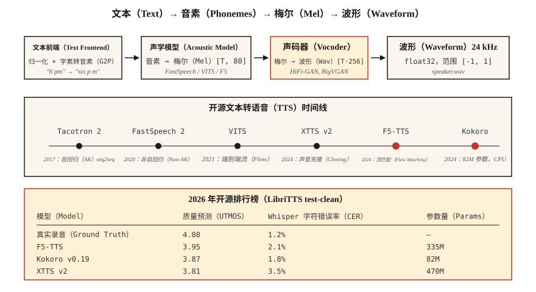

# 文本转语音：从 Tacotron 到 F5 与 Kokoro（Text-to-Speech (TTS) — From Tacotron to F5 and Kokoro）

> 自动语音识别将语音转为文本，文本转语音则反向将文本转为语音。2026 年的技术栈分三部分：文本 → 词元、词元 → 梅尔特征、梅尔特征 → 波形。每部分都有适合笔记本电脑的默认模型。

**Type:** Build
**Languages:** Python
**Prerequisites:** 阶段 6 · 02（频谱图与梅尔特征），阶段 5 · 09（序列到序列），阶段 7 · 05（完整 Transformer）
**Time:** ~75 分钟

## 问题（The Problem）

你有一个字符串：“请提醒我下午 6 点给植物浇水。”你需要一段 3 秒音频，听起来自然，韵律（停顿、重音）正确，“plants”的元音发音准确，并且为了实时语音助手，能在 CPU 上于 300 ms 内生成。你还需要切换声音、处理语码混合输入（“remind me at 6 pm, daijoubu?”，即英语提醒中夹杂日语确认），并避免把人名念错。

现代文本转语音（Text-to-Speech，TTS）流水线如下：

1. **文本前端（Text Frontend）。** 归一化文本（日期、数字、邮箱），转为音素或子词词元，预测韵律特征。
2. **声学模型（Acoustic Model）。** 文本 → 梅尔频谱图。包括 Tacotron 2（2017）、FastSpeech 2（2020）、VITS（2021）、F5-TTS（2024）、Kokoro（2024）。
3. **声码器（Vocoder）。** 梅尔特征 → 波形。包括 WaveNet（2016）、WaveRNN、HiFi-GAN（2020）、BigVGAN（2022），以及 2024 年以后的神经编解码声码器。

2026 年，端到端扩散和流匹配模型使声学模型与声码器的界限模糊，但三部分的思维模型仍然适合调试。

## 概念（The Concept）



**Tacotron 2（2017）。** 序列到序列（Sequence-to-Sequence，Seq2seq）：字符嵌入 → 双向长短期记忆网络（BiLSTM）编码器 → 位置敏感注意力 → 自回归 LSTM 解码器输出梅尔帧。自回归导致速度慢，长文本上不稳定，仍常被引用为基线。

**FastSpeech 2（2020）。** 非自回归。时长预测器输出每个音素对应多少梅尔帧，一次前向完成，比 Tacotron 快 10 倍。单调对齐会牺牲一些自然度，但已广泛部署。

**VITS（2021）。** 通过变分推断，端到端联合训练编码器、基于流的时长建模和 HiFi-GAN 声码器。单模型、高质量，是 2022–2024 年主导的开源 TTS。变体包括 YourTTS（多说话人零样本）和 XTTS v2（2024，Coqui）。

**F5-TTS（2024）。** 基于流匹配（Flow Matching）的扩散 Transformer。韵律自然，仅用 5 秒参考音频即可零样本声音克隆，位居 2026 年开源 TTS 排行榜前列，参数量 3.35 亿。

**Kokoro（2024）。** 小型模型（8200 万参数），可在 CPU 上运行，是实时英语 TTS 中的领先方案。封闭词表、仅英语、apache-2.0 许可。

**OpenAI TTS-1-HD、ElevenLabs v2.5、Google Chirp-3。** 商业最先进方案。ElevenLabs v2.5 的情绪标签（“[whispered]”，低声说；“[laughing]”，笑着说）和角色声音在 2026 年有声书制作中占主导。

### 声码器演进（Vocoder evolution）

| 年代 | 声码器 | 延迟 | 质量 |
|-----|---------|---------|---------|
| 2016 | WaveNet | 仅离线 | 发布时最先进 |
| 2018 | WaveRNN | 约实时 | 良好 |
| 2020 | HiFi-GAN | 100× 实时 | 接近人声 |
| 2022 | BigVGAN | 50× 实时 | 可泛化到不同说话人与语言 |
| 2024 | SNAC、DAC（神经编解码器） | 与自回归模型集成 | 离散词元、比特效率高 |

到 2026 年，多数“TTS”模型已端到端地从文本生成波形，梅尔频谱图成为内部表示。

### 评估（Evaluation）

- **平均意见分（Mean Opinion Score，MOS）。** 众包评定的 1–5 分量表，仍是黄金标准，但速度慢。
- **比较平均意见分（Comparative MOS，CMOS）。** A 与 B 的偏好比较，单次标注可得到更窄的置信区间。
- **UTMOS、DNSMOS。** 无参考的神经网络 MOS 预测器，用于排行榜。
- **通过 ASR 计算字符错误率（Character Error Rate，CER）。** 将 TTS 输出送入 Whisper，对照输入文本计算 CER，作为可懂度的代理指标。
- **说话人嵌入余弦相似度（Speaker Embedding Cosine Similarity，SECS）。** 衡量声音克隆质量。

2026 年 LibriTTS test-clean 数据：

| 模型 | UTMOS | CER（通过 Whisper） | 大小 |
|-------|-------|-------------------|------|
| 真实录音 | 4.08 | 1.2% | — |
| F5-TTS | 3.95 | 2.1% | 3.35 亿 |
| XTTS v2 | 3.81 | 3.5% | 4.7 亿 |
| VITS | 3.62 | 3.1% | 2500 万 |
| Kokoro v0.19 | 3.87 | 1.8% | 8200 万 |
| Parler-TTS Large | 3.76 | 2.8% | 23 亿 |

```figure
sp-tts-stack
```

## 动手实现（Build It）

### 第 1 步：将输入转换为音素（Step 1: phonemize input）

```python
from phonemizer import phonemize
ph = phonemize("Hello world", language="en-us", backend="espeak")
# 'həloʊ wɜːld'
```

音素是通用桥梁。质量低于 VITS 水平的模型，应避免直接输入原始文本。

### 第 2 步：运行 Kokoro，2026 年的 CPU 默认选择（Step 2: run Kokoro (2026 CPU default)）

```python
from kokoro import KPipeline
tts = KPipeline(lang_code="a")  # "a" = American English
audio, sr = tts("Please remind me to water the plants at 6 pm.", voice="af_bella")
# audio: float32 tensor, sr=24000
```

可离线运行，单文件，8200 万参数。

### 第 3 步：运行带声音克隆的 F5-TTS（Step 3: run F5-TTS with voice cloning）

```python
from f5_tts.api import F5TTS
tts = F5TTS()
wav = tts.infer(
    ref_file="my_voice_5s.wav",
    ref_text="The quick brown fox jumps over the lazy dog.",
    gen_text="Please remind me to water the plants.",
)
```

传入 5 秒参考片段及其转录文本，F5 会克隆韵律与音色。

### 第 4 步：从零构建 HiFi-GAN 声码器（Step 4: HiFi-GAN vocoder from scratch）

完整实现太大，无法放进教程脚本，但结构如下：

```python
class HiFiGAN(nn.Module):
    def __init__(self, mel_channels=80, upsample_rates=[8, 8, 2, 2]):
        super().__init__()
        # 4 upsample blocks, total 256x to go from mel-rate to audio-rate
        ...
    def forward(self, mel):
        return self.blocks(mel)  # -> waveform
```

训练包括对抗损失（在短窗口上使用判别器）、梅尔频谱图重建损失和特征匹配损失。这已是成熟组件，使用 `hifi-gan` 仓库或 nvidia-NeMo 的预训练检查点即可。

### 第 5 步：完整流水线，伪代码（Step 5: the full pipeline (pseudocode)）

```python
text = "Please remind me at 6 pm."
phones = phonemize(text)
mel = acoustic_model(phones, speaker=alice)      # [T, 80]
wav = vocoder(mel)                                # [T * 256]
soundfile.write("out.wav", wav, 24000)
```

## 实际应用（Use It）

2026 年的技术栈：

| 情况 | 选择 |
|-----------|------|
| 实时英语语音助手 | Kokoro（CPU）或 XTTS v2（GPU） |
| 根据 5 秒参考音频克隆声音 | F5-TTS |
| 商业角色声音 | ElevenLabs v2.5 |
| 有声书旁白 | ElevenLabs v2.5 或微调 XTTS v2 |
| 低资源语言 | 在 5–20 小时目标语言数据上训练 VITS |
| 表现力 / 情绪标签 | ElevenLabs v2.5 或微调 StyleTTS 2 |

截至 2026 年，开源领先选择是：**质量选 F5-TTS，效率选 Kokoro**。除非研究历史，否则不必再选 Tacotron。

## 常见陷阱（Pitfalls）

- **没有文本归一化器。** “Dr. Smith”中的 Dr. 读作 Doctor（博士）还是 Drive（道路）？“2026”读作 twenty twenty six 还是 two zero two six？在音素转换之前归一化。
- **词表外专有名词（Out-of-Vocabulary，OOV）。** “Ghumare”会被读成“ghyu-mair”吗？为未知词元提供字素到音素模型作为回退。
- **削波（Clipping）。** 声码器输出很少削波，但推理时梅尔缩放不匹配可能使输出超过 ±1.0。始终执行 `np.clip(wav, -1, 1)`。
- **采样率不匹配。** Kokoro 输出 24 kHz，下游要求 16 kHz，必须重采样，否则会发生混叠。

## 交付成果（Ship It）

保存为 `outputs/skill-tts-designer.md`。针对给定声音、延迟与语言目标设计 TTS 流水线。

## 练习（Exercises）

1. **简单。** 运行 `code/main.py`。它从教学词表构建音素词典，估计每个音素时长，并打印模拟的“梅尔”时间安排。
2. **中等。** 安装 Kokoro，用声音 `af_bella` 与 `am_adam` 合成同一句话，比较音频时长与主观质量。
3. **困难。** 录制自己的 5 秒参考音频，用 F5-TTS 克隆，报告参考音频与克隆输出之间的 SECS。

## 关键术语（Key Terms）

| 术语 | 常见说法 | 实际含义 |
|------|-----------------|-----------------------|
| 音素（Phoneme） | 声音单位 | 抽象语音类别；英语 ARPABet 有 39 个。 |
| 时长预测器（Duration Predictor） | 每个音素持续多久 | 非自回归模型的输出，即每个音素对应的整数帧数。 |
| 声码器（Vocoder） | 梅尔特征 → 波形 | 将梅尔频谱图映射为原始采样点的神经网络。 |
| HiFi-GAN | 标准声码器 | 基于生成对抗网络，2020–2024 年占主导。 |
| 平均意见分（MOS） | 主观质量 | 人工评分者给出的 1–5 分平均意见分。 |
| 说话人嵌入余弦相似度（SECS） | 声音克隆指标 | 目标与输出说话人嵌入的余弦相似度。 |
| F5-TTS | 2024 年开源最先进方案 | 流匹配扩散，支持零样本克隆。 |
| Kokoro | CPU 英语领先方案 | 8200 万参数模型，Apache 2.0。 |

## 延伸阅读（Further Reading）

- [Shen 等（2017）：Tacotron 2 论文](https://arxiv.org/abs/1712.05884)：序列到序列基线。
- [Kim、Kong、Son（2021）：VITS 论文](https://arxiv.org/abs/2106.06103)：基于流的端到端模型。
- [Chen 等（2024）：F5-TTS 论文](https://arxiv.org/abs/2410.06885)：当前开源最先进方案。
- [Kong、Kim、Bae（2020）：HiFi-GAN 论文](https://arxiv.org/abs/2010.05646)：2026 年仍在部署的声码器。
- [Hugging Face 上的 Kokoro-82M 模型](https://huggingface.co/hexgrad/Kokoro-82M)：2024 年适合 CPU 的英语 TTS。
