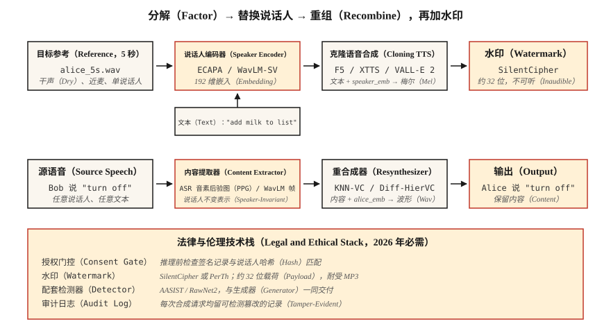

# 声音克隆与声音转换（Voice Cloning & Voice Conversion）

> 声音克隆用他人的声音朗读你的文本；声音转换保留你说的内容，却将声音改为他人的。两者都依赖同一种分解：将说话人身份与内容分离。

**Type:** Build
**Languages:** Python
**Prerequisites:** 阶段 6 · 06（说话人识别），阶段 6 · 07（文本转语音）
**Time:** ~75 分钟

## 问题（The Problem）

2026 年，使用消费级 GPU 和 5 秒音频就足以高质量克隆任何人的声音。ElevenLabs、F5-TTS、OpenVoice v2 和 VoiceBox 都提供零样本或少样本克隆。这项技术既可造福用户（无障碍文本转语音、配音、辅助发声），也可成为武器（诈骗电话、政治深度伪造、知识产权盗用）。

两项密切相关的任务：

- **声音克隆（Voice Cloning，文本转语音侧）：** 文本 + 5 秒参考声音 → 该声音说出的音频。
- **声音转换（Voice Conversion，语音侧）：** 源音频（A 说 X）+ B 的参考声音 → B 说 X 的音频。

两者都将波形分解为内容、说话人和韵律，再把一个来源的内容与另一个来源的说话人身份重新组合。

2026 年交付时的一项关键约束是：**欧盟（《人工智能法案》，2026 年 8 月开始执行）和加利福尼亚州（AB 2905，2025 年生效）在法律上要求水印与授权门控**。流水线必须嵌入不可听水印，并拒绝未经同意的克隆。

## 概念（The Concept）



**零样本克隆（Zero-Shot Cloning）。** 将 5 秒片段输入在数千名说话人上训练的模型。说话人编码器将其映射为说话人嵌入，文本转语音（Text-to-Speech，TTS）解码器以该嵌入和文本为条件生成。

采用者包括 F5-TTS（2024）、YourTTS（2022）、XTTS v2（2024）、OpenVoice v2（2024）。

**少样本微调（Few-Shot Fine-Tuning）。** 录制目标声音 5–30 分钟，对基础模型进行一小时低秩适配（Low-Rank Adaptation，LoRA）微调，质量从“尚可”跃升至“难以区分”。Coqui 和 ElevenLabs 都支持这种模式，社区也用它微调 F5-TTS。

**声音转换（Voice Conversion，VC）。** 分两类：

- **识别–合成（Recognition-Synthesis）。** 用类似自动语音识别的模型提取内容表示（如软音素后验概率、音素后验概率图 PPG），再用目标说话人嵌入重新合成。对语言和口音变化稳健，KNN-VC（2023）、Diff-HierVC（2023）采用它。
- **解耦（Disentanglement）。** 训练自编码器，在瓶颈的潜在空间中分离内容、说话人和韵律，推理时替换说话人嵌入。质量较低但更快，AutoVC（2019）和 VITS-VC 变体采用它。

**基于神经编解码器的克隆（Neural Codec-Based Cloning，2024 年以后）。** VALL-E、VALL-E 2、NaturalSpeech 3、VoiceBox 将音频视为 SoundStream / EnCodec 的离散词元，在这些词元上训练大型自回归或流匹配模型。短提示词下的质量与 ElevenLabs 相当。

### 伦理不是附加功能（The ethics bit, not a bolt-on）

**水印（Watermarking）。** PerTh（Perth）与 SilentCipher（2024）将约 16–32 位标识嵌入音频，人耳无法察觉。它可经受重新编码、流式传输和常见编辑，是可用于生产的开源方案。

**授权门控（Consent Gates）。** 每份克隆输出都必须关联可验证的同意记录，例如“本人 Rohit 于 2026-04-22 授权此声音用于 X 用途”。存入可检测篡改的日志。

**检测（Detection）。** AASIST、RawNet2、Wav2Vec2-AASIST 都提供检测器。ASVspoof 2025 挑战赛公布：面对 ElevenLabs、VALL-E 2 和 Bark 输出，最先进检测器的等错误率为 0.8–2.3%。

### 2026 年数据（Numbers (2026)）

| 模型 | 零样本？ | SECS（目标相似度） | WER（可懂度） | 参数量 |
|-------|-----------|--------------------|--------------|--------|
| F5-TTS | 是 | 0.72 | 2.1% | 3.35 亿 |
| XTTS v2 | 是 | 0.65 | 3.5% | 4.7 亿 |
| OpenVoice v2 | 是 | 0.70 | 2.8% | 2.2 亿 |
| VALL-E 2 | 是 | 0.77 | 2.4% | 3.7 亿 |
| VoiceBox | 是 | 0.78 | 2.1% | 3.3 亿 |

说话人嵌入余弦相似度（Speaker Embedding Cosine Similarity，SECS）>0.70 时，大多数听者通常无法将输出与目标区分。

```figure
sp-voice-factorize
```

## 动手实现（Build It）

### 第 1 步：以识别–合成方式分解，main.py 中的纯代码演示（Step 1: decompose with recognition-synthesis (code-only demo in main.py)）

```python
def clone_pipeline(ref_audio, text, target_embedder, tts_model):
    speaker_emb = target_embedder.encode(ref_audio)
    mel = tts_model(text, speaker=speaker_emb)
    return vocoder(mel)
```

概念简单，主要实现体量在 `tts_model` 和说话人编码器中。

### 第 2 步：用 F5-TTS 零样本克隆（Step 2: zero-shot clone with F5-TTS）

```python
from f5_tts.api import F5TTS
tts = F5TTS()
wav = tts.infer(
    ref_file="rohit_5s.wav",
    ref_text="The quick brown fox jumps over the lazy dog.",
    gen_text="Please add milk and bread to my list.",
)
```

参考转录必须与音频完全一致，不匹配会破坏对齐。

### 第 3 步：用 KNN-VC 转换声音（Step 3: voice conversion with KNN-VC）

```python
import torch
from knnvc import KNNVC  # 2023 model, https://github.com/bshall/knn-vc
vc = KNNVC.load("wavlm-base-plus")
out_wav = vc.convert(source="my_voice.wav", target_pool=["alice_1.wav", "alice_2.wav"])
```

KNN-VC 用 WavLM 提取源音频与目标池的逐帧嵌入，再用目标池中最近邻替换每个源帧。这是非参数方法，一分钟目标语音即可使用。

### 第 4 步：嵌入水印（Step 4: embed a watermark）

```python
from silentcipher import SilentCipher
sc = SilentCipher(model="2024-06-01")
payload = b"consent_id:abc123;ts:1745353200"
watermarked = sc.embed(wav, sr=24000, message=payload)
detected = sc.detect(watermarked, sr=24000)   # returns payload bytes
```

载荷约 32 位，经 MP3 重编码并加入轻微噪声后仍可检测。

### 第 5 步：授权门控（Step 5: consent gate）

```python
def cloned_inference(text, ref_audio, consent_record):
    assert verify_signature(consent_record), "Signed consent required"
    assert consent_record["speaker_id"] == hash_speaker(ref_audio)
    wav = tts.infer(ref_file=ref_audio, gen_text=text)
    wav = watermark(wav, payload=consent_record["id"])
    return wav
```

## 实际应用（Use It）

2026 年的技术栈：

| 情况 | 选择 |
|-----------|------|
| 5 秒零样本克隆、开源 | F5-TTS 或 OpenVoice v2 |
| 商业生产克隆 | ElevenLabs Instant Voice Clone v2.5 |
| 声音转换（改写声音） | KNN-VC 或 Diff-HierVC |
| 多说话人微调 | StyleTTS 2 加说话人适配器 |
| 跨语言克隆 | XTTS v2 或 VALL-E X |
| 深度伪造检测 | Wav2Vec2-AASIST |

## 常见陷阱（Pitfalls）

- **参考转录不对齐。** F5-TTS 等模型要求参考文本与参考音频完全匹配，包括标点。
- **参考音频有混响。** 回声会破坏克隆效果。录制干声，并靠近麦克风。
- **情绪不匹配。** 用欢快的参考声音，会让所有克隆输出都显得欢快。让参考情绪符合目标用途。
- **语言泄漏。** 克隆英语说话人后要求说法语，常仍带有原口音；使用跨语言模型（XTTS、VALL-E X）。
- **没有水印。** 2026 年 8 月起在欧盟无法合法交付。

## 交付成果（Ship It）

保存为 `outputs/skill-voice-cloner.md`。设计包含授权门控、水印与质量目标的克隆或转换流水线。

## 练习（Exercises）

1. **简单。** 运行 `code/main.py`。通过计算两个“说话人”在替换前后的余弦相似度，演示说话人嵌入替换。
2. **中等。** 用 OpenVoice v2 克隆自己的声音，测量参考与克隆之间的 SECS，并通过 Whisper 测量字符错误率（Character Error Rate，CER）。
3. **困难。** 对 20 份克隆输出加 SilentCipher 水印，进行 128 kbps MP3 编解码后检测载荷，报告比特准确率。

## 关键术语（Key Terms）

| 术语 | 常见说法 | 实际含义 |
|------|-----------------|-----------------------|
| 零样本克隆（Zero-Shot Clone） | 5 秒足够 | 预训练模型加说话人嵌入，不需训练。 |
| 音素后验概率图（Phonetic Posteriorgram，PPG） | 音素后验图 | 逐帧 ASR 后验概率，用作语言无关内容表示。 |
| KNN-VC | 最近邻转换 | 用最近的目标池帧替换每个源帧。 |
| 神经编解码 TTS（Neural Codec TTS） | VALL-E 风格 | 对 EnCodec/SoundStream 词元建模的自回归模型。 |
| 水印（Watermark） | 不可听签名 | 嵌入音频、经重编码仍保留的比特。 |
| 说话人嵌入余弦相似度（SECS） | 克隆保真度 | 目标与克隆说话人嵌入的余弦相似度。 |
| AASIST | 深度伪造检测器 | 检测合成语音的防伪模型。 |

## 延伸阅读（Further Reading）

- [Chen 等（2024）：F5-TTS 论文](https://arxiv.org/abs/2410.06885)：开源最先进零样本克隆。
- [Baevski 等 / Microsoft（2023）：VALL-E 论文](https://arxiv.org/abs/2301.02111) 和 [VALL-E 2 论文（2024）](https://arxiv.org/abs/2406.05370)：神经编解码 TTS。
- [Qian 等（2019）：AutoVC 论文](https://arxiv.org/abs/1905.05879)：基于解耦的声音转换。
- [Baas、Waubert de Puiseau、Kamper（2023）：KNN-VC 论文](https://arxiv.org/abs/2305.18975)：基于检索的声音转换。
- [SilentCipher（2024）：音频水印](https://github.com/sony/silentcipher)：可用于生产的 32 位音频水印。
- [ASVspoof 2025 结果](https://www.asvspoof.org/)：检测器与合成器的对抗竞赛，2026 年更新。
