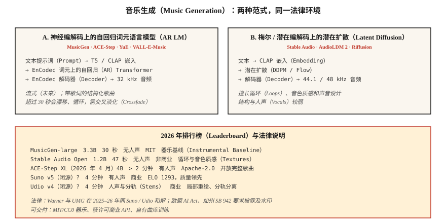

# 音乐生成：MusicGen、Stable Audio、Suno 与许可变局（Music Generation — MusicGen, Stable Audio, Suno, and the Licensing Earthquake）

> 2026 年音乐生成领域，Suno v5 和 Udio v4 主导商业市场，MusicGen、Stable Audio Open 和 ACE-Step 领先开源领域。技术问题大体解决，法律问题（Warner Music 的 5 亿美元和解、UMG 和解）在 2025–2026 年重塑了行业。

**Type:** Build
**Languages:** Python
**Prerequisites:** 阶段 6 · 02（频谱图），阶段 4 · 10（扩散模型）
**Time:** ~75 分钟

## 问题（The Problem）

从文本生成 30 秒至 4 分钟音乐，包含歌词、人声和结构。可分为三个子问题：

1. **器乐生成（Instrumental Generation）。** “带温暖键盘音色的低保真嘻哈鼓点”之类文本 → 音频。模型包括 MusicGen、Stable Audio、AudioLDM。
2. **歌曲生成（Song Generation，含人声与歌词）。** “关于得克萨斯雨夜的乡村歌曲” → 完整歌曲。模型包括 Suno、Udio、YuE、ACE-Step。
3. **条件化 / 可控生成（Conditional / Controllable）。** 延长已有片段、重新生成桥段、切换流派、分离分轨或局部重绘。Udio 的局部重绘加分轨分离是 2026 年需要对标的功能。

## 概念（The Concept）



### 神经编解码词元上的语言模型（Token LM over neural-codec tokens）

Meta 的 **MusicGen**（2023，MIT）及众多衍生模型，以文本或旋律嵌入为条件，自回归预测 EnCodec 词元（32 kHz、4 个码本），再用 EnCodec 解码。参数量 3 亿至 33 亿，是强基线，但超过 30 秒便力不从心。

**ACE-Step**（开源，40 亿参数 XL 于 2026 年 4 月发布）将这种方式扩展到以歌词为条件的完整歌曲生成，是开源社区最接近 Suno 的方案。

### 梅尔特征或潜变量上的扩散（Diffusion over mels or latents）

**Stable Audio（2023）** 与 **Stable Audio Open（2024）** 在压缩音频上进行潜在扩散。擅长循环片段、声音设计和氛围音色，不擅长结构完整的歌曲。

**AudioLDM / AudioLDM2**：采用文本到图像式的潜在扩散实现文本到音频，推广到音乐、音效与语音。

### 混合生产方案：Suno、Udio 与 Lyria（Hybrid (production) — Suno, Udio, Lyria）

权重不公开。可能采用自回归编解码词元语言模型，加基于扩散的声码器，以及专门的人声、鼓点、旋律头。Suno v5（2026）以 ELO 1293 领先质量榜。Udio v4 增加局部重绘和分轨分离，低音、鼓、人声可单独下载。

### 评估（Evaluation）

- **弗雷歇音频距离（Fréchet Audio Distance，FAD）。** 用 VGGish 或 PANNs 特征，衡量生成音频与真实音频分布在嵌入层面的距离，越低越好。MusicGen small 在 MusicCaps 上为 4.5，最先进水平约 3.0。
- **音乐性（主观）。** 人类偏好。Suno v5 以 ELO 1293 领先。
- **文本–音频对齐。** 提示词与输出间的对比语言–音频预训练（Contrastive Language-Audio Pretraining，CLAP）分数。
- **音乐性伪影。** 转场不合拍、人声乐句漂移、超过 30 秒后结构丢失。

## 2026 年模型版图（2026 model map）

| 模型 | 参数量 | 时长 | 人声 | 许可 |
|-------|--------|--------|--------|---------|
| MusicGen-large | 33 亿 | 30 秒 | 无 | MIT |
| Stable Audio Open | 12 亿 | 47 秒 | 无 | Stability 非商业 |
| ACE-Step XL（2026 年 4 月） | 40 亿 | &gt; 2 分钟 | 有 | Apache-2.0 |
| YuE | 70 亿 | &gt; 2 分钟 | 有，多语言 | Apache-2.0 |
| Suno v5（闭源） | ? | 4 分钟 | 有，ELO 1293 | 商业 |
| Udio v4（闭源） | ? | 4 分钟 | 有，带分轨 | 商业 |
| Google Lyria 3（闭源） | ? | 实时 | 有 | 商业 |
| MiniMax Music 2.5 | ? | 4 分钟 | 有 | 商业 API |

## 法律环境，2025–2026 年（The legal landscape (2025-2026)）

- **Warner Music 与 Suno 和解。** 金额 5 亿美元。WMG 现对 Suno 上的 AI 形象模拟、音乐权利和用户生成曲目拥有监督权。UMG 与 Udio 也达成类似和解。
- **欧盟《人工智能法案》**与**加州 SB 942**：必须披露 AI 生成的音乐。
- **Riffusion / MusicGen** 使用 MIT 许可，没有合规包袱，但也不提供商业人声。

可安全交付的模式：

1. 仅生成器乐（MusicGen、Stable Audio Open，MIT/CC0 输出）。
2. 使用商业 API（Suno、Udio、ElevenLabs Music），逐次生成获得许可。
3. 在自有或已授权曲库上训练，多数企业最终选择这条路。
4. 为生成内容添加水印和元数据。

```figure
sp-codec-tokens
```

## 动手实现（Build It）

### 第 1 步：用 MusicGen 生成（Step 1: generate with MusicGen）

```python
from audiocraft.models import MusicGen
import torchaudio

model = MusicGen.get_pretrained("facebook/musicgen-small")
model.set_generation_params(duration=10)
wav = model.generate(["upbeat synthwave with driving drums, 128 BPM"])
torchaudio.save("out.wav", wav[0].cpu(), 32000)
```

三种大小：`small`（3 亿，速度快）、`medium`（15 亿）、`large`（33 亿）。验证“这个想法是否有效”时 small 已足够。

### 第 2 步：旋律条件化（Step 2: melody conditioning）

```python
melody, sr = torchaudio.load("humming.wav")
wav = model.generate_with_chroma(
    ["jazz piano cover"],
    melody.squeeze(),
    sr,
)
```

MusicGen-melody 接收色度图（Chromagram），保留曲调并替换音色，适合“把这段旋律改成弦乐四重奏”。

### 第 3 步：FAD 评估（Step 3: FAD evaluation）

```python
from frechet_audio_distance import FrechetAudioDistance
fad = FrechetAudioDistance()

fad.get_fad_score("generated_folder/", "reference_folder/")
```

计算 VGGish 嵌入距离，适合流派级回归测试，但不能代替真人聆听。

### 第 4 步：加入大语言模型音乐工作流（Step 4: adding to the LLM-music workflow）

结合第 7–8 课的思路：

```python
prompt = "Write a 30-second jazz loop. Describe the drums, bass, and piano voicing."
description = llm.complete(prompt)
music = musicgen.generate([description], duration=30)
```

## 实际应用（Use It）

| 目标 | 技术栈 |
|------|-------|
| 器乐声音设计 | Stable Audio Open |
| 游戏 / 自适应音乐 | Google Lyria RealTime（闭源） |
| 带人声完整歌曲，商业 | 有明确许可的 Suno v5 或 Udio v4 |
| 带人声完整歌曲，开放 | ACE-Step XL 或 YuE |
| 短广告曲 | 以哼唱参考做旋律条件的 MusicGen |
| 音乐视频背景 | MusicGen 加 Stable Video Diffusion |

## 2026 年仍会进入生产的问题（Pitfalls that still ship in 2026）

- **借提示词规避版权。** “Taylor Swift 风格的歌曲”：商业 Suno/Udio 已过滤此类请求，开放模型不会。需要自己的过滤列表。
- **超过 30 秒后的重复与漂移。** 自回归模型会循环。对多次生成交叉淡化，或用 ACE-Step 保持结构连贯。
- **速度漂移。** 模型会偏离每分钟拍数（Beats Per Minute，BPM）。在提示词中标注 BPM，再用 librosa 的 `beat_track` 后置筛选。
- **人声可懂度。** Suno 表现出色，开放模型的词语常含糊。歌词重要时，使用商业 API 或微调。
- **单声道输出。** 开放模型生成单声道或伪立体声。使用正确的立体声重建改进，例如 ezst、Cartesia 的立体声扩散。

## 交付成果（Ship It）

保存为 `outputs/skill-music-designer.md`。为音乐生成部署选择模型、许可策略、时长与结构方案以及披露元数据。

## 练习（Exercises）

1. **简单。** 运行 `code/main.py`。它以 ASCII 符号产生“生成式”和弦进行与鼓点模式，是音乐生成的简化示意。可用任意 MIDI 渲染器播放。
2. **中等。** 安装 `audiocraft`，用 MusicGen-small 针对 4 种流派提示词生成 10 秒片段，对照参考流派集测量 FAD。
3. **困难。** 使用 ACE-Step（或 MusicGen-melody），以不同音色提示词为同一旋律生成三个变体，计算与提示词的 CLAP 相似度来验证对齐。

## 关键术语（Key Terms）

| 术语 | 常见说法 | 实际含义 |
|------|-----------------|-----------------------|
| 弗雷歇音频距离（FAD） | 音频版 FID | 真实与生成音频嵌入分布之间的弗雷歇距离。 |
| 色度图（Chromagram） | 用音高表示旋律 | 每帧 12 维向量，是旋律条件输入。 |
| 分轨（Stems） | 乐器轨道 | 分离出的低音、鼓、人声、旋律 WAV。 |
| 局部重绘（Inpainting） | 重新生成某一段 | 遮蔽时间窗，让模型只重生成该处。 |
| 对比语言–音频预训练（CLAP） | 文本–音频版 CLIP | 对比式音频–文本嵌入，评估两者对齐。 |
| EnCodec | 音乐编解码器 | MusicGen 使用的 Meta 神经编解码器，32 kHz、4 个码本。 |

## 延伸阅读（Further Reading）

- [Copet 等（2023）：MusicGen 论文](https://arxiv.org/abs/2306.05284)：开放自回归基准。
- [Evans 等（2024）：Stable Audio Open 论文](https://arxiv.org/abs/2407.14358)：声音设计默认方案。
- [ACE-Step 项目](https://github.com/ace-step/ACE-Step)：2026 年 4 月推出的开放 40 亿参数完整歌曲生成器。
- [Suno v5 平台文档](https://suno.com)：商业质量领先者。
- [AudioLDM2 论文](https://arxiv.org/abs/2308.05734)：用于音乐与音效的潜在扩散。
- [WMG 与 Suno 和解报道](https://www.musicbusinessworldwide.com/warner-music-group-settles-with-suno-strikes-first-of-its-kind-deal-with-ai-song-generator/)：2025 年 11 月的先例。
