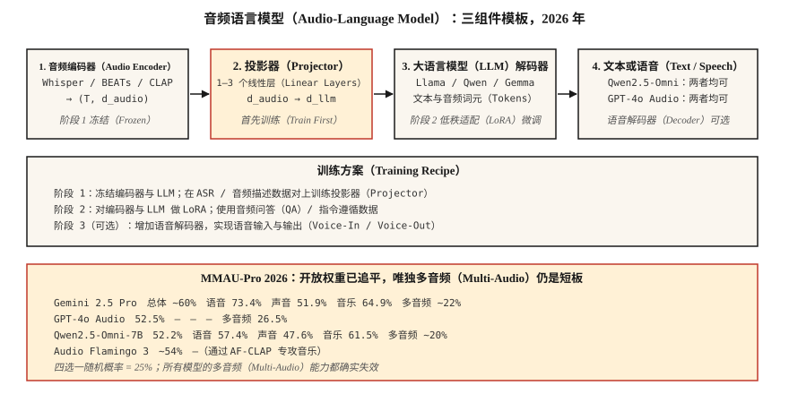

# 音频语言模型：Qwen2.5-Omni、Audio Flamingo 与 GPT-4o Audio（Audio-Language Models — Qwen2.5-Omni, Audio Flamingo, GPT-4o Audio）

> 2026 年的音频语言模型能对语音、环境声音和音乐进行推理。Qwen2.5-Omni-7B 在 MMAU-Pro 上追平 GPT-4o Audio，Audio Flamingo Next 在 LongAudioBench 上超过 Gemini 2.5 Pro。开放与封闭模型间的差距基本消失，唯独多音频任务上，所有模型都接近随机水平。

**Type:** Learn
**Languages:** Python
**Prerequisites:** 阶段 6 · 04（自动语音识别），阶段 12 · 03（视觉语言模型），阶段 7 · 10（音频 Transformer）
**Time:** ~45 分钟

## 问题（The Problem）

一段 5 秒音频中，先有狗叫，有人喊“停！”，然后静音。可以从多个角度提出有用问题：

- **转录。** “说了什么？”属于自动语音识别（Automatic Speech Recognition，ASR）。
- **语义推理。** “这个人处于危险中吗？”需要联合理解狗叫、喊声和静音。
- **音乐推理。** “哪些乐器在演奏旋律？”
- **长音频检索。** “这堂 90 分钟课中，教师在哪里解释了梯度下降？”

一个模型通过一条提示词回答这些问题，就是**音频语言模型（Audio-Language Model，ALM；大型版本也称 LALM）**。不同于纯 ASR，LALM 生成自由形式的自然语言回答，而不仅是转录。

## 概念（The Concept）



### 三组件模板（The three-component template）

2026 年的每个 LALM 都有同一骨架：

1. **音频编码器（Audio Encoder）。** Whisper 编码器、BEATs、CLAP、WavLM，或模型自定义编码器。
2. **投影器（Projector）。** 用线性层或多层感知机（Multilayer Perceptron，MLP），将音频编码器特征连接到大语言模型的词元嵌入空间。
3. **大语言模型（Large Language Model，LLM）。** 基于 Llama、Qwen 或 Gemma 的解码器，接收交错的文本与音频词元，生成文本。

训练：

- **阶段 1。** 冻结编码器和 LLM，只在 ASR / 音频描述数据上训练投影器。
- **阶段 2。** 在遵循指令的音频任务（问答、推理、音乐理解）上全量或低秩适配（LoRA）微调。
- **阶段 3（可选）。** 语音输入与输出需要增加语音解码器，Qwen2.5-Omni 和 AF3-Chat 采用这种方式。

### 2026 年模型版图（The 2026 model map）

| 模型 | 骨干 | 音频编码器 | 输出模态 | 获取方式 |
|-------|----------|---------------|-----------------|--------|
| Qwen2.5-Omni-7B | Qwen2.5-7B | 自定义 + Whisper | 文本 + 语音 | Apache-2.0 |
| Qwen3-Omni | Qwen3 | 自定义 | 文本 + 语音 | Apache-2.0 |
| Audio Flamingo 3 | Qwen2 | AF-CLAP | 文本 | NVIDIA 非商业 |
| Audio Flamingo Next | Qwen2 | AF-CLAP v2 | 文本 | NVIDIA 非商业 |
| SALMONN | Vicuna | Whisper + BEATs | 文本 | Apache-2.0 |
| LTU / LTU-AS | Llama | CAV-MAE | 文本 | Apache-2.0 |
| GAMA | Llama | AST + Q-Former | 文本 | Apache-2.0 |
| Gemini 2.5 Flash/Pro（闭源） | Gemini | 专有 | 文本 + 语音 | API |
| GPT-4o Audio（闭源） | GPT-4o | 专有 | 文本 + 语音 | API |

### 基准现实检验，2026 年（Benchmark reality check (2026)）

**MMAU-Pro。** 1800 对问答，覆盖语音、声音、音乐及混合任务，也包含多音频子集。

| 模型 | 总体 | 语音 | 声音 | 音乐 | 多音频 |
|-------|---------|--------|-------|-------|-------------|
| Gemini 2.5 Pro | ~60% | 73.4% | 51.9% | 64.9% | ~22% |
| Gemini 2.5 Flash | ~57% | 73.4% | 50.5% | 64.9% | 21.2% |
| GPT-4o Audio | 52.5% | — | — | — | 26.5% |
| Qwen2.5-Omni-7B | 52.2% | 57.4% | 47.6% | 61.5% | ~20% |
| Audio Flamingo 3 | ~54% | — | — | — | — |
| Audio Flamingo Next | LongAudioBench 最先进水平 | — | — | — | — |

**多音频一列暴露了所有模型的短板。** 四选一随机猜测的正确率为 25%，大多数模型就在这一水平附近。LALM 仍难以比较两段音频。

### 2026 年 LALM 有用的场景（Where LALMs are useful in 2026）

- **呼叫中心录音合规审计。** “客服是否说出了规定的披露内容？”
- **无障碍。** 向聋人用户描述声音事件，而不只是转录。
- **内容审核。** 检测暴力语言、威胁语气及背景上下文。
- **播客 / 会议分章。** 生成语义摘要，而不仅划分说话轮次。
- **音乐曲库分析。** “找出所有 B 段发生转调的曲目。”

### 尚不适用的场景（Where they are NOT (yet) useful）

- 细粒度乐理，细于和弦层面的分析。
- 长对话中带说话人归属的推理，超过 10 分钟就会退化。
- 多音频比较，22–26% 几乎不比随机猜测好。
- 实时流式推理，大多数模型采用离线批量推理。

```figure
v4-alm-tokens
```

## 动手实现（Build It）

### 第 1 步：查询 Qwen2.5-Omni（Step 1: query Qwen2.5-Omni）

```python
from transformers import AutoModelForCausalLM, AutoProcessor

processor = AutoProcessor.from_pretrained("Qwen/Qwen2.5-Omni-7B")
model = AutoModelForCausalLM.from_pretrained("Qwen/Qwen2.5-Omni-7B", torch_dtype="auto")

audio, sr = load_wav("clip.wav", sr=16000)
messages = [{
    "role": "user",
    "content": [
        {"type": "audio", "audio": audio},
        {"type": "text", "text": "What sounds do you hear, and what's happening?"},
    ],
}]
inputs = processor.apply_chat_template(messages, tokenize=True, return_tensors="pt")
output = model.generate(**inputs, max_new_tokens=200)
print(processor.decode(output[0], skip_special_tokens=True))
```

### 第 2 步：投影器模式（Step 2: the projector pattern）

```python
import torch.nn as nn

class AudioProjector(nn.Module):
    def __init__(self, audio_dim=1280, llm_dim=4096):
        super().__init__()
        self.down = nn.Linear(audio_dim, llm_dim)
        self.act = nn.GELU()
        self.up = nn.Linear(llm_dim, llm_dim)

    def forward(self, audio_features):
        return self.up(self.act(self.down(audio_features)))
```

就这么简单。投影器通常由 1–3 个线性层构成。在 ASR 数据对（音频 → 转录）上训练它，就是阶段 1 的预训练代理任务。

### 第 3 步：测试 MMAU / LongAudioBench（Step 3: benchmarking MMAU / LongAudioBench）

```python
from datasets import load_dataset
mmau = load_dataset("gamma-lab-umd/MMAU-Pro", split="test")
mcq = mmau.filter(lambda item: len(item["choices"] or []) > 1)

correct = 0
for item in mcq:
    answer = call_model(item["audio_path"], item["question"], item["choices"])
    if answer == item["answer"]:
        correct += 1
print(f"Accuracy: {correct / len(mcq):.3f}")
```

`audio_path` 指向数据集仓库中的 `data.zip`（约 47 GB），因此评分前需要先下载并解压。这个完全匹配循环仅用于基本合理性检查，其结果不能与已发布的 MMAU-Pro 基准成绩直接比较。官方评估器通过嵌入相似度（NV-Embed-v2）匹配选择题答案，使用大语言模型评判器为开放题评分，并通过正则规则检查指令遵循题：将预测结果写入 `model_output` 列，然后运行 [MMAU-Pro 仓库](https://github.com/sonalkum/MMAUPro)中的 `evaluate_mmau_pro_comprehensive.py`。应分别报告各个 `category`（speech、sound、music、multi 等）的结果，汇总分数会掩盖模型的薄弱之处。

## 实际应用（Use It）

| 任务 | 2026 年选择 |
|------|-----------|
| 自由形式音频问答，开放 | Qwen2.5-Omni-7B |
| 长音频最佳开放模型 | Audio Flamingo Next |
| 最佳封闭模型 | Gemini 2.5 Pro |
| 语音输入与输出智能体 | Qwen2.5-Omni 或 GPT-4o Audio |
| 音乐推理 | Audio Flamingo 3 或 2，使用专门面向音乐的 AF-CLAP |
| 呼叫中心审计 | 通过 API 使用 Gemini 2.5 Pro，结合政策文档的检索增强生成（RAG） |

## 常见陷阱（Pitfalls）

- **过度相信多音频能力。** 如果任务问“哪个片段有 X”，随机水平的表现是真实存在的。
- **长音频退化。** 超过 10 分钟，大多数模型的说话人归属会出错。先按第 6 课做说话人分离，再总结。
- **静音幻觉。** 使用 Whisper 编码器的 LALM 继承了同类问题。加入语音活动检测（VAD）门控。
- **挑选有利基准。** 厂商博客突出表现最好的类别。应亲自运行 MMAU-Pro 多音频子集。

## 交付成果（Ship It）

保存为 `outputs/skill-alm-picker.md`。为给定音频理解任务选择 LALM、基准子集和输出模态（文本或语音）。

## 练习（Exercises）

1. **简单。** 运行 `code/main.py`，查看教学投影器模式，以及从音频嵌入、文本词元到输出词元的模拟 LALM 路由。
2. **中等。** 在 100 个 MMAU-Pro 语音样例上评估 Qwen2.5-Omni-7B，与论文报告比较。
3. **困难。** 构建最小音频描述基线：BEATs 编码器、两层投影器、冻结的 Llama-3.2-1B。仅在 AudioCaps 上微调投影器，在 Clotho-AQA 上与 SALMONN 比较。

## 关键术语（Key Terms）

| 术语 | 常见说法 | 实际含义 |
|------|-----------------|-----------------------|
| 大型音频语言模型（Large Audio-Language Model，LALM） | 音频 ChatGPT | 音频编码器加投影器加 LLM 解码器。 |
| 投影器（Projector） | 适配器 | 将音频特征映射到 LLM 嵌入空间的小型 MLP。 |
| MMAU | 那个基准 | 跨语音、声音和音乐的 1 万对音频问答。 |
| MMAU-Pro | 更难的 MMAU | 1800 道多音频或偏重推理的问题。 |
| LongAudioBench | 长音频评估 | 多分钟片段搭配语义查询。 |
| 语音输入与输出（Voice-In / Voice-Out） | 语音原生 | 模型直接接收并输出语音，不绕道文本。 |

## 延伸阅读（Further Reading）

- [Chu 等（2024）：Qwen2-Audio 论文](https://arxiv.org/abs/2407.10759)：参考架构。
- [Alibaba（2025）：Qwen2.5-Omni 模型](https://huggingface.co/Qwen/Qwen2.5-Omni-7B)：语音输入与输出。
- [NVIDIA（2025）：Audio Flamingo 3 论文](https://arxiv.org/abs/2507.08128)：开放长音频领先模型。
- [NVIDIA（2026）：Audio Flamingo Next 论文](https://arxiv.org/abs/2604.10905)：LongAudioBench 最先进水平。
- [Tang 等（2023）：SALMONN 论文](https://arxiv.org/abs/2310.13289)：双编码器先驱。
- [MMAU-Pro 排行榜](https://sonalkum.github.io/mmau-pro/) — 2026 年实时排名。
