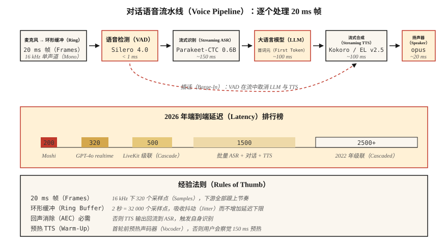

# 实时音频处理（Real-Time Audio Processing）

> 批处理流水线处理文件，实时流水线必须在下一个 20 毫秒到达前处理完当前 20 毫秒。对话式 AI、广播工作室和电话机器人都受这一延迟预算约束。

**Type:** Build
**Languages:** Python
**Prerequisites:** 阶段 6 · 02（频谱图），阶段 6 · 04（自动语音识别），阶段 6 · 07（文本转语音）
**Time:** ~75 分钟

## 问题（The Problem）

你希望语音助手像真人一样及时回应。人类对话轮次切换延迟约 230 ms（从静音到响应）。超过 500 ms 显得机械，超过 1500 ms 则像系统出了故障。2026 年完整的**听见 → 理解 → 回应 → 说出**循环预算如下：

| 阶段 | 预算 |
|-------|--------|
| 麦克风 → 缓冲区 | 20 ms |
| 语音活动检测（VAD） | 10 ms |
| 自动语音识别（ASR，流式） | 150 ms |
| 大语言模型（LLM，首词元） | 100 ms |
| 文本转语音（TTS，首块） | 100 ms |
| 渲染 → 扬声器 | 20 ms |
| **总计** | **~400 ms** |

Moshi（Kyutai，2024）实现了 200 ms 全双工，GPT-4o-realtime（2024）约 320 ms。2022 年的级联流水线交付延迟为 2500 ms。10 倍提升来自三项技术：(1) 全链路流式，(2) 利用部分结果的异步流水线，(3) 可中断生成。

## 概念（The Concept）



**帧 / 块 / 窗口（Frame / Chunk / Window）。** 实时音频以固定大小块流动，常用 20 ms（16 kHz 下 320 个采样点）。所有下游处理都必须跟上这一节奏。

**环形缓冲区（Ring Buffer）。** 固定大小的循环缓冲区，生产者线程写新帧，消费者线程读取，避免热点路径分配内存。大小约等于最大延迟乘采样率；2 秒、16 kHz 的环形缓冲区包含 32,000 个采样点。

**语音活动检测（Voice Activity Detection，VAD）。** 无人说话时停止下游工作。Silero VAD 4.0（2024）在 CPU 上处理每 30 ms 帧耗时 <1 ms。`webrtcvad` 是较早的替代方案。

**流式自动语音识别（Streaming ASR）。** 音频到达时就输出部分转录。Parakeet-CTC-0.6B 的流式模式（NeMo，2024）在 320 ms 延迟下实现 2–5% 词错误率。Whisper-Streaming（Macháček 等，2023）通过分块让 Whisper 近似流式工作，延迟约 2 秒。

**中断（Interruption）。** 用户在助手说话时开口，系统必须：(a) 检测插话，(b) 停止 TTS，(c) 丢弃剩余 LLM 输出。所有操作需在 100 ms 内完成，否则用户会觉得助手听不见。

**WebRTC Opus 传输（WebRTC Opus Transport）。** 20 ms 帧、48 kHz、自适应码率 8–128 kbps，是浏览器和移动端标准。LiveKit、Daily.co、Pion 是 2026 年构建语音应用的技术栈。

**抖动缓冲区（Jitter Buffer）。** 网络包会乱序或迟到，抖动缓冲区负责重排和平滑。过小会出现可听间隙，过大则增加延迟，典型为 60–80 ms。

### 常见问题（Common gotchas）

- **线程争用。** Python 全局解释器锁（Global Interpreter Lock，GIL）加重型模型可能饿死音频线程。使用 C 回调音频库（sounddevice、PortAudio），让 Python 离开热点路径。
- **采样率转换延迟。** 流水线内部重采样增加 5–20 ms。提前重采样，或使用零延迟重采样器（PolyPhase、`soxr_hq`）。
- **TTS 预热。** 即使 Kokoro 等快速 TTS，首次请求也需 100–200 ms 预热。缓存模型，并在首个真实轮次前做一次虚拟运行。
- **回声消除。** 没有声学回声消除（Acoustic Echo Cancellation，AEC），TTS 输出会重入麦克风，让 ASR 识别机器人自身声音。WebRTC AEC3 是默认开源方案。

```figure
nyquist-aliasing
```

## 动手实现（Build It）

### 第 1 步：环形缓冲区（Step 1: ring buffer）

```python
import collections

class RingBuffer:
    def __init__(self, capacity):
        self.buf = collections.deque(maxlen=capacity)
    def write(self, frame):
        self.buf.extend(frame)
    def read(self, n):
        return [self.buf.popleft() for _ in range(min(n, len(self.buf)))]
    def level(self):
        return len(self.buf)
```

容量决定最大缓冲延迟。16 kHz 下的 32,000 个采样点等于 2 秒。

### 第 2 步：VAD 门控（Step 2: VAD gate）

```python
def simple_energy_vad(frame, threshold=0.01):
    return sum(x * x for x in frame) / len(frame) > threshold ** 2
```

生产环境换成 Silero VAD：

```python
import torch
vad, _ = torch.hub.load("snakers4/silero-vad", "silero_vad")
is_speech = vad(torch.tensor(frame), 16000).item() > 0.5
```

### 第 3 步：流式 ASR（Step 3: streaming ASR）

```python
# Parakeet-CTC-0.6B streaming via NeMo
from nemo.collections.asr.models import EncDecCTCModelBPE
asr = EncDecCTCModelBPE.from_pretrained("nvidia/parakeet-ctc-0.6b")
# chunk_ms=320 ms, look_ahead_ms=80 ms
for chunk in audio_stream():
    partial_text = asr.transcribe_streaming(chunk)
    print(partial_text, end="\r")
```

### 第 4 步：中断处理器（Step 4: interruption handler）

```python
class Dialog:
    def __init__(self):
        self.tts_task = None

    def on_user_speech(self, frame):
        if self.tts_task and not self.tts_task.done():
            self.tts_task.cancel()   # barge-in
        # then feed to streaming ASR

    def on_final_user_utterance(self, text):
        self.tts_task = asyncio.create_task(self.reply(text))

    async def reply(self, text):
        async for tts_chunk in llm_then_tts(text):
            speaker.write(tts_chunk)
```

关键是异步输入输出和可取消的 TTS 流。对音轨调用 WebRTC peerconnection.stop() 是标准做法。

## 实际应用（Use It）

2026 年的技术栈：

| 层 | 选择 |
|-------|------|
| 传输 | LiveKit（WebRTC）或 Pion（Go） |
| VAD | Silero VAD 4.0 |
| 流式 ASR | Parakeet-CTC-0.6B 或 Whisper-Streaming |
| LLM 首词元 | Groq、Cerebras、vLLM-streaming |
| 流式 TTS | Kokoro 或 ElevenLabs Turbo v2.5 |
| 回声消除 | WebRTC AEC3 |
| 端到端原生 | OpenAI Realtime API 或 Moshi |

## 常见陷阱（Pitfalls）

- **为保险而缓冲 500 ms。** 缓冲区*就是*延迟下限，应缩小。
- **不固定线程调度。** 音频回调运行在线程优先级低于界面线程的位置，负载下就会出现音频故障。
- **TTS 块过小。** 小于 200 ms 的块会使声码器伪影可听，320 ms 是较佳折中。
- **没有抖动缓冲区。** 真实网络存在抖动，不平滑会产生爆音。
- **一次性错误处理。** 音频流水线必须能抵御崩溃，一次异常就可能结束会话。

## 交付成果（Ship It）

保存为 `outputs/skill-realtime-designer.md`。设计各阶段有明确延迟预算的实时音频流水线。

## 练习（Exercises）

1. **简单。** 运行 `code/main.py`，模拟环形缓冲区和能量 VAD，打印模拟 10 秒流的各阶段延迟。
2. **中等。** 用 `sounddevice` 构建直通循环，以 20 ms 帧处理麦克风输入，每帧打印 VAD 状态。
3. **困难。** 用 `aiortc` 构建全双工回声测试：浏览器 → WebRTC → Python → WebRTC → 浏览器。用 1 kHz 脉冲测量端到端延迟。

## 关键术语（Key Terms）

| 术语 | 常见说法 | 实际含义 |
|------|-----------------|-----------------------|
| 环形缓冲区（Ring Buffer） | 循环队列 | 固定大小、无锁或单生产者单消费者锁保护的音频帧先进先出队列。 |
| 语音活动检测（VAD） | 静音门控 | 标记语音与非语音的模型或启发式算法。 |
| 流式 ASR（Streaming ASR） | 实时语音转文本 | 音频到达即输出部分文本，前瞻有界。 |
| 抖动缓冲区（Jitter Buffer） | 网络平滑器 | 对乱序包重排的队列，典型 60–80 ms。 |
| 声学回声消除（AEC） | 消除回声 | 消除扬声器到麦克风的反馈路径。 |
| 插话（Barge-In） | 用户打断 | 系统在 TTS 期间检测到用户语音，必须取消播放。 |
| 全双工（Full Duplex） | 双向同时进行 | 用户与机器人可同时说话，Moshi 是全双工。 |

## 延伸阅读（Further Reading）

- [Macháček 等（2023）：Whisper-Streaming 论文](https://arxiv.org/abs/2307.14743)：分块近似流式 Whisper。
- [Kyutai（2024）：Moshi 论文](https://kyutai.org/Moshi.pdf)：全双工，200 ms 延迟。
- [LiveKit Agents 框架（2024）](https://docs.livekit.io/agents/)：生产级音频智能体编排。
- [Silero VAD 仓库](https://github.com/snakers4/silero-vad)：不到 1 ms 的 VAD，Apache 2.0。
- [WebRTC AEC3 论文与实现](https://webrtc.googlesource.com/src/+/main/modules/audio_processing/aec3/)：开源回声消除。
