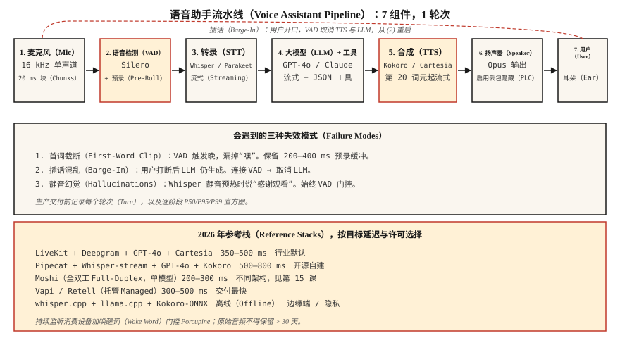

# 构建语音助手流水线：阶段 6 综合实践（Build a Voice Assistant Pipeline — The Phase 6 Capstone）

> 将第 01–11 课串起来，构建能听、能推理、能回答的语音助手。2026 年这已是有成熟解法的工程问题，而非研究问题，但集成细节决定它能否交付。

**Type:** Build
**Languages:** Python
**Prerequisites:** 阶段 6 · 04、05、06、07、11；阶段 11 · 09（函数调用）；阶段 14 · 01（智能体循环）
**Time:** ~120 分钟

## 问题（The Problem）

构建端到端助手：

1. 采集麦克风输入（16 kHz 单声道）。
2. 检测用户语音起止。
3. 流式转录。
4. 将转录传给可调用工具（计时器、天气、日历）的大语言模型。
5. 将模型文本流式传给文本转语音系统。
6. 向用户播放音频。
7. 用户在响应中途插话时停止。

延迟目标：在笔记本 CPU 上，用户说完后 800 ms 内产生首个 TTS 音频字节。质量目标：不漏词、不在静音上生成幻觉字幕、不泄漏克隆声音、不让提示词注入成功。

## 概念（The Concept）



### 七个组件（The seven components）

1. **音频采集（Audio Capture）。** 麦克风 → 16 kHz 单声道 → 20 ms 块。Python 通常用 `sounddevice`，生产环境用原生 AudioUnit/ALSA/WASAPI。
2. **语音活动检测（Voice Activity Detection，VAD；第 11 课）。** Silero VAD 阈值 0.5，最短语音 250 ms，静音延续 500 ms，发出“开始”和“结束”信号。
3. **流式语音转文本（Speech-to-Text，STT；第 4–5 课）。** Whisper-streaming、Parakeet-TDT 或 Deepgram Nova-3（API），提供部分与最终转录。
4. **带工具调用的大语言模型（Large Language Model，LLM）。** GPT-4o / Claude 3.5 / Gemini 2.5 Flash。以 JSON 模式定义工具，流式输出词元。
5. **流式文本转语音（Text-to-Speech，TTS；第 7 课）。** Kokoro-82M（最快开放方案）或 Cartesia Sonic（商业），在 20 个 LLM 词元后启动 TTS。
6. **播放（Playback）。** 扬声器输出，低带宽网络采用 Opus 编码。
7. **中断处理器（Interruption Handler）。** TTS 播放期间 VAD 触发，则停止播放、取消 LLM、重启 STT。

### 会遇到的三种失效模式（The three failure modes you will hit）

1. **首词被截断。** VAD 启动稍晚，漏掉用户的“嘿”。初始阈值设为 0.3 而不是 0.5。
2. **响应中断混乱。** 用户插话后 LLM 还在生成，助手盖过用户说话。连接 VAD 与取消 LLM 的动作。
3. **静音幻觉。** Whisper 在静音预热帧上输出“感谢观看”。始终使用 VAD 门控。

### 2026 年生产参考栈（2026 production reference stacks）

| 技术栈 | 延迟 | 许可 | 说明 |
|-------|---------|---------|-------|
| LiveKit + Deepgram + GPT-4o + Cartesia | 350–500 ms | 商业 API | 2026 年行业默认 |
| Pipecat + Whisper-streaming + GPT-4o + Kokoro | 500–800 ms | 大部分开放 | 适合自行搭建 |
| Moshi（全双工） | 200–300 ms | CC-BY 4.0 | 单模型，不同架构，见第 15 课 |
| Vapi / Retell（托管） | 300–500 ms | 商业 | 上线最快，定制受限 |
| Whisper.cpp + llama.cpp + Kokoro-ONNX | 离线 | 开放 | 隐私 / 边缘端 |

```figure
v4-voice-latency
```

## 动手实现（Build It）

### 第 1 步：麦克风采集与分块，伪代码（Step 1: mic capture with chunking (pseudocode)）

```python
import sounddevice as sd

def mic_stream(chunk_ms=20, sr=16000):
    q = queue.Queue()
    def cb(indata, frames, time, status):
        q.put(indata.copy().flatten())
    with sd.InputStream(channels=1, samplerate=sr, blocksize=int(sr * chunk_ms/1000), callback=cb):
        while True:
            yield q.get()
```

### 第 2 步：VAD 门控的轮次采集（Step 2: VAD-gated turn capture）

```python
def capture_turn(stream, vad, pre_roll_ms=300, silence_ms=500):
    buf, pre, triggered = [], collections.deque(maxlen=pre_roll_ms // 20), False
    silent = 0
    for chunk in stream:
        pre.append(chunk)
        if vad(chunk):
            if not triggered:
                buf = list(pre)
                triggered = True
            buf.append(chunk)
            silent = 0
        elif triggered:
            silent += 20
            buf.append(chunk)
            if silent >= silence_ms:
                return b"".join(buf)
```

### 第 3 步：流式 STT → LLM → TTS（Step 3: streaming STT → LLM → TTS）

```python
async def turn(audio_bytes):
    transcript = await stt.transcribe(audio_bytes)
    async for token in llm.stream(transcript):
        async for audio in tts.stream(token):
            await speaker.play(audio)
```

### 第 4 步：LLM 循环中的工具调用（Step 4: tool calling inside the LLM loop）

```python
tools = [
    {"name": "get_weather", "parameters": {"location": "string"}},
    {"name": "set_timer", "parameters": {"seconds": "int"}},
]

async for chunk in llm.stream(user_text, tools=tools):
    if chunk.type == "tool_call":
        result = dispatch(chunk.name, chunk.args)
        continue_streaming(result)
    if chunk.type == "text":
        await tts.stream(chunk.text)
```

### 第 5 步：中断处理（Step 5: interruption handling）

```python
tts_task = asyncio.create_task(tts_loop())
while True:
    chunk = await mic.get()
    if vad(chunk):
        tts_task.cancel()
        await speaker.stop()
        await new_turn()
        break
```

## 实际应用（Use It）

`code/main.py` 提供可运行模拟，用桩模型连接全部七个组件，无硬件也能看到流水线结构。真实实现用以下组件替换桩：

- 语音活动检测：`silero-vad`（`pip install silero-vad`）
- 语音识别：`deepgram-sdk` 或 `openai-whisper`
- 大语言模型：`openai`（`gpt-4o`）或 `anthropic`
- 文本转语音：`kokoro` 或 `cartesia`
- 输入输出：`sounddevice`

## 常见陷阱（Pitfalls）

- **永久记录个人身份信息。** 完整轮次音频在大多数司法辖区属于个人身份信息（Personally Identifiable Information，PII）。保留 30 天，静态加密。
- **不支持插话。** 用户会打断，助手必须停止说话。
- **阻塞式 TTS。** 同步 TTS 阻塞事件循环，应使用异步或独立线程。
- **没有工具调用错误处理。** 工具会失败，LLM 必须收到错误并重试一次，然后平稳降级。
- **幻觉过滤过强。** 过滤过度会让助手反复说“我无法帮助处理”，不足则让它什么都说。在留出集上校准。
- **没有唤醒词选项。** 持续监听有隐私风险，加入唤醒词门控（Porcupine 或 openWakeWord）。

## 交付成果（Ship It）

保存为 `outputs/skill-voice-assistant-architect.md`。根据预算、规模、语言与合规约束产出完整技术栈规格。

## 练习（Exercises）

1. **简单。** 运行 `code/main.py`，用桩模块模拟完整端到端轮次，打印逐阶段延迟。
2. **中等。** 将 STT 桩替换为真实 Whisper 模型，处理预录制 `.wav`，测量词错误率和端到端延迟。
3. **困难。** 加入工具调用：实现 `get_weather`（任意 API）和 `set_timer`。让 LLM 通过工具执行，验证用户说“设一个 5 分钟计时器”时触发正确函数，语音答复确认结果。

## 关键术语（Key Terms）

| 术语 | 常见说法 | 实际含义 |
|------|-----------------|-----------------------|
| 轮次（Turn） | 用户与助手的一次往返 | 一段由 VAD 划界的用户语音，加一次 LLM-TTS 响应。 |
| 插话（Barge-In） | 中断 | 用户在助手说话时开口，助手停止。 |
| 唤醒词（Wake Word） | “嘿，助手” | 短关键词检测器，如 Porcupine、Snowboy、openWakeWord。 |
| 端点检测（End-Pointing） | 轮次结束 | 用 VAD 和最短静音时长判断用户已说完。 |
| 预录缓冲（Pre-Roll） | 语音前缓冲 | 保留 VAD 触发前 200–400 ms 音频，防止首词截断。 |
| 工具调用（Tool Call） | 函数调用 | LLM 输出 JSON，运行时分发，结果反馈回循环。 |

## 延伸阅读（Further Reading）

- [LiveKit：语音智能体快速入门](https://docs.livekit.io/agents/)：生产级参考。
- [Pipecat：语音智能体示例](https://github.com/pipecat-ai/pipecat)：适合自行搭建的框架。
- [OpenAI Realtime API 文档](https://platform.openai.com/docs/guides/realtime)：托管语音原生路线。
- [Kyutai Moshi 项目](https://github.com/kyutai-labs/moshi)：全双工参考，见第 15 课。
- [Porcupine 唤醒词检测](https://picovoice.ai/products/porcupine/)：唤醒词门控。
- [Anthropic：工具使用指南](https://docs.anthropic.com/en/docs/build-with-claude/tool-use)：LLM 函数调用。
