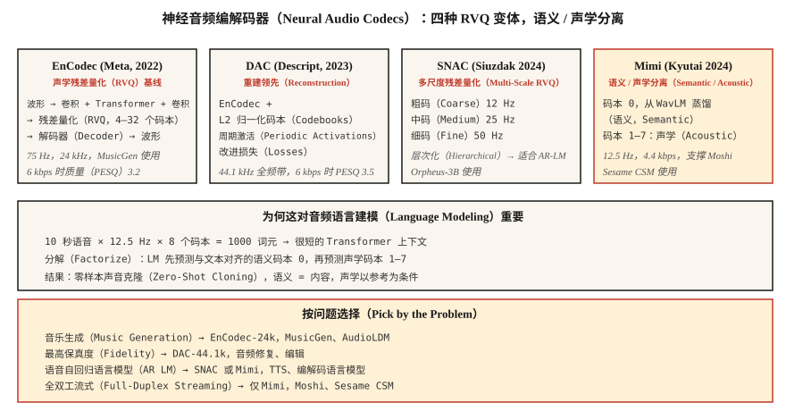

# 神经音频编解码器：EnCodec、SNAC、Mimi、DAC 与语义–声学分离（Neural Audio Codecs — EnCodec, SNAC, Mimi, DAC and the Semantic-Acoustic Split）

> 2026 年的音频生成几乎都基于词元。EnCodec、SNAC、Mimi 和 DAC 将连续波形转成 Transformer 可以预测的离散序列。第一个码本负责语义、其余码本负责声学的分离，是音频 Transformer 以来最重要的架构变化。

**Type:** Learn
**Languages:** Python
**Prerequisites:** 阶段 6 · 02（频谱图），阶段 10 · 11（量化），阶段 5 · 19（子词分词）
**Time:** ~60 分钟

## 问题（The Problem）

语言模型处理离散词元，音频却是连续的。要为语音或音乐构建类似大语言模型的系统，例如 MusicGen、Moshi、Sesame CSM、VibeVoice、Orpheus，首先需要**神经音频编解码器（Neural Audio Codec）**：一个学得的编码器，将音频离散化为小词表中的词元；配套解码器再重建波形。

目前形成两类：

1. **重建优先编解码器（Reconstruction-First Codecs）**，如 EnCodec、DAC。优化感知音质，词元属于“声学”表示，涵盖说话人身份、音色、背景噪声等一切内容。
2. **语义优先编解码器（Semantic-First Codecs）**，如 Mimi（Kyutai）、SpeechTokenizer。强制第一个码本编码语言或音素内容，通常通过 WavLM 蒸馏实现，后续码本表示声学细节。

2024–2026 年的洞见是：**用纯重建编解码器从文本生成语音，语音会模糊**。编解码词元语言模型必须在同一码本中同时学习语言结构和声学结构，难以扩展。将语义放在码本 0、声学放在码本 1–N，正是 Moshi 和 Sesame CSM 能够工作的原因。

## 概念（The Concept）



### 核心技巧：残差向量量化（The core trick: Residual Vector Quantization (RVQ)）

单个大码本若要高质量，需要数百万码字。因此，所有现代音频编解码器都采用**残差向量量化（Residual Vector Quantization，RVQ）**：级联多个小码本。第一个量化编码器输出，第二个量化残差，依此类推。每个码本有 1024 个码字，8 个码本的有效词表为 1024^8 = 10^24。

推理时，解码器对每帧选中的全部码字求和进行重建。

### 2026 年重要的四个编解码器（The four codecs that matter in 2026）

**EnCodec（Meta，2022）。** 基线方案，波形编码器–解码器加 RVQ 瓶颈。24 kHz，可用 32 个码本，默认 4 个码本、1.5 kbps。采用 `1D conv + transformer + 1D conv` 架构，MusicGen 使用它。

**DAC（Descript，2023）。** 使用 L2 归一化码本、周期激活函数和改进损失的 RVQ。在开放编解码器中重建保真度最高，12 个码本时有时与原始语音难以区分。44.1 kHz 全频带。

**SNAC（Hubert Siuzdak，2024）。** 多尺度 RVQ：粗码本的帧率低于细码本，以约 12 Hz 的粗略“草图”加 50 Hz 细节对音频分层建模。Orpheus-3B 使用它，因为层次结构适合基于语言模型的生成。

**Mimi（Kyutai，2024）。** 改变 2026 年格局的方案。帧率仅 12.5 Hz，8 个码本、4.4 kbps。码本 0 **从 WavLM 蒸馏**，训练其预测 WavLM 的语音内容特征；码本 1–7 表示声学残差。该分离支撑 Moshi（第 15 课）和 Sesame CSM。

### 帧率对语言建模的重要性（Frame rates matter for language modeling）

帧率越低，序列越短，语言模型越快。

| 编解码器 | 帧率 | 1 秒的帧数 | 适用场景 |
|-------|-----------|----------------|---------|
| EnCodec-24k | 75 Hz | 75 | 音乐、通用音频 |
| DAC-44.1k | 86 Hz | 86 | 高保真音乐 |
| SNAC-24k（粗尺度） | ~12 Hz | 12 | 高效自回归语言模型 |
| Mimi | 12.5 Hz | 12.5 | 流式语音 |

在 12.5 Hz 下，10 秒语句只有 125 个编解码帧，Transformer 很容易预测。

### 语义与声学词元（Semantic vs acoustic tokens）

```
frame_t → [semantic_token_t, acoustic_token_0_t, acoustic_token_1_t, ..., acoustic_token_6_t]
```

- **语义词元（Semantic Token，Mimi 码本 0）。** 编码所说内容：音素、词和内容，通过辅助预测损失从 WavLM 蒸馏。
- **声学词元（Acoustic Tokens，码本 1–7）。** 编码音色、说话人身份、韵律、背景噪声和精细信息。

自回归语言模型先以文本为条件预测语义词元，再以语义和说话人参考为条件预测声学词元。这种分解让现代文本转语音（Text-to-Speech，TTS）能够零样本克隆声音：语义模型处理内容，声学模型处理音色。

### 2026 年重建质量，每秒比特数越低越好（2026 reconstruction quality (bits per sec, lower bitrate is better)）

| 编解码器 | 码率 | PESQ | ViSQOL |
|-------|---------|------|--------|
| Opus-20kbps | 20 kbps | 4.0 | 4.3 |
| EnCodec-6kbps | 6 kbps | 3.2 | 3.8 |
| DAC-6kbps | 6 kbps | 3.5 | 4.0 |
| SNAC-3kbps | 3 kbps | 3.3 | 3.8 |
| Mimi-4.4kbps | 4.4 kbps | 3.1 | 3.7 |

Opus 等传统编解码器在单位比特的感知质量上仍领先。神经编解码器赢在**离散词元**（Opus 不提供）和**生成模型质量**（语言模型可用这些词元做什么）。

```figure
rvq-codec-cascade
```

## 动手实现（Build It）

### 第 1 步：用 EnCodec 编码（Step 1: encode with EnCodec）

```python
from encodec import EncodecModel
import torch

model = EncodecModel.encodec_model_24khz()
model.set_target_bandwidth(6.0)  # kbps

wav = torch.randn(1, 1, 24000)
with torch.no_grad():
    encoded = model.encode(wav)
codes, scale = encoded[0]
# codes: (1, n_codebooks, n_frames), dtype=int64
```

6 kbps 时 `n_codebooks=8`，每个码字取值 0–1023，即 10 位。

### 第 2 步：解码并测量重建（Step 2: decode and measure reconstruction）

```python
with torch.no_grad():
    wav_recon = model.decode([(codes, scale)])

from torchaudio.functional import compute_deltas
import torch.nn.functional as F

mse = F.mse_loss(wav_recon[:, :, :wav.shape[-1]], wav).item()
```

### 第 3 步：Mimi 风格的语义–声学分离（Step 3: the semantic-acoustic split (Mimi-style)）

```python
from moshi.models import loaders
mimi = loaders.get_mimi()

with torch.no_grad():
    codes = mimi.encode(wav)  # shape (1, 8, frames@12.5Hz)

semantic = codes[:, 0]
acoustic = codes[:, 1:]
```

语义码本 0 与 WavLM 对齐。你可以训练文本到语义的 Transformer，词表远小于直接生成音频的方案，再用独立的声学到波形解码器，以说话人参考为条件生成。

### 第 4 步：为何编解码词元上的自回归语言模型有效（Step 4: why AR LM over codec tokens works）

10 秒语音在 Mimi 的 12.5 Hz、8 个码本下：

```
N_tokens = 10 * 12.5 * 8 = 1000 tokens
```

1000 个词元对 Transformer 只是很短的上下文。2.56 亿参数的 Transformer 可在现代 GPU 上以毫秒级耗时生成 10 秒语音。

## 实际应用（Use It）

将问题映射到编解码器：

| 任务 | 编解码器 |
|------|-------|
| 通用音乐生成 | EnCodec-24k |
| 最高保真重建 | DAC-44.1k |
| 语音上的自回归语言模型（TTS） | SNAC 或 Mimi |
| 流式全双工语音 | Mimi（12.5 Hz） |
| 带文本的音效库 | EnCodec 加 T5 条件 |
| 细粒度音频编辑 | DAC 加局部重绘 |

经验法则：**构建生成模型，先用 Mimi 或 SNAC；构建压缩流水线，用 Opus。**

## 常见陷阱（Pitfalls）

- **码本过多。** 增加码本会线性提高保真度，也线性增加语言模型序列长度。到 8–12 个就停止。
- **帧率不匹配。** 在 12.5 Hz Mimi 上训练语言模型，再到 50 Hz EnCodec 上微调，会静默失败。
- **假定各码本等价。** Mimi 的码本 0 携带内容，丢失会摧毁可懂度；码本 7 丢失几乎察觉不到。
- **只看重建质量。** 编解码器重建可以很好，但语义结构差时，对语言模型生成仍毫无用处。

## 交付成果（Ship It）

保存为 `outputs/skill-codec-picker.md`。为给定生成或压缩任务选择编解码器。

## 练习（Exercises）

1. **简单。** 运行 `code/main.py`，实现教学用标量加残差量化器，测量增加码本时的重建误差。
2. **中等。** 安装 `encodec`，在留出语音上比较 1、4、8、32 个码本，绘制 PESQ 或均方误差（MSE）随码率的变化。
3. **困难。** 加载 Mimi 并编码片段，将码本 0 替换为随机整数后解码，再对码本 7 做相同操作。比较两种损坏：码本 0 损坏应摧毁可懂度，码本 7 损坏应几乎不改变结果。

## 关键术语（Key Terms）

| 术语 | 常见说法 | 实际含义 |
|------|-----------------|-----------------------|
| 残差向量量化（RVQ） | 残差量化 | 小码本级联，每个量化前一步残差。 |
| 帧率（Frame Rate） | 编解码器速度 | 每秒词元帧数，越低则语言模型越快。 |
| 语义码本（Semantic Codebook） | Mimi 的码本 0 | 从自监督特征蒸馏、编码内容的码本。 |
| 声学码本（Acoustic Codebooks） | 其余全部 | 音色、韵律、噪声和精细信息。 |
| 语音质量感知评估（PESQ）/ 虚拟语音质量客观评估（ViSQOL） | 感知质量 | 与平均意见分（MOS）相关的客观指标。 |
| EnCodec | Meta 编解码器 | RVQ 基线，MusicGen 使用它。 |
| Mimi | Kyutai 编解码器 | 12.5 Hz 帧率、语义–声学分离，支撑 Moshi。 |

## 延伸阅读（Further Reading）

- [Défossez 等（2023）：EnCodec 论文](https://arxiv.org/abs/2210.13438)：RVQ 基线。
- [Kumar 等（2023）：Descript 音频编解码器 DAC](https://arxiv.org/abs/2306.06546)：最高保真的开放方案。
- [Siuzdak（2024）：SNAC 论文](https://arxiv.org/abs/2410.14411)：多尺度 RVQ。
- [Kyutai（2024）：Mimi 编解码器说明](https://kyutai.org/codec-explainer)：语义–声学分离与 WavLM 蒸馏。
- [Borsos 等（2023）：AudioLM 论文](https://arxiv.org/abs/2209.03143)：两阶段语义 / 声学范式。
- [Zeghidour 等（2021）：SoundStream 论文](https://arxiv.org/abs/2107.03312)：原始可流式 RVQ 编解码器。
