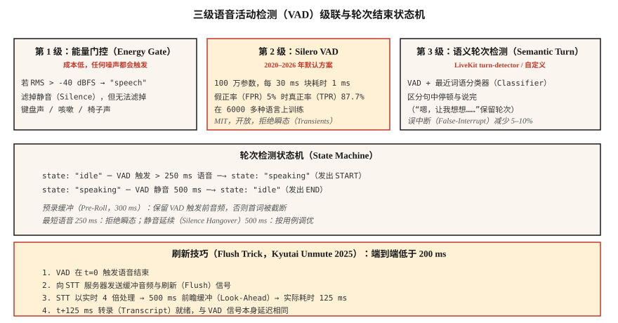

# 语音活动检测与轮次切换：Silero、Cobra 与刷新技巧（Voice Activity Detection & Turn-Taking — Silero, Cobra, and the Flush Trick）

> 每个语音智能体都依赖两项判断：用户现在是否在说话，以及是否已经说完。语音活动检测回答前者，轮次检测（语音活动检测、静音延续、语义端点模型）回答后者。任一判断错误，助手就会打断用户，或说个不停。

**Type:** Build
**Languages:** Python
**Prerequisites:** 阶段 6 · 11（实时音频），阶段 6 · 12（语音助手）
**Time:** ~45 分钟

## 问题（The Problem）

语音智能体对每个 20 ms 块作出三项不同判断：

1. **本帧是语音吗？** 语音活动检测（Voice Activity Detection，VAD），逐帧二分类。
2. **用户开始了新语句吗？** 起始检测（Onset Detection）。
3. **用户说完了吗？** 端点检测（End-Pointing），即轮次结束。

朴素能量阈值遇到任何噪声都会失败，包括交通、键盘和嘈杂人声。2026 年的方案是 Silero VAD（开放、基于深度学习）加轮次检测模型（语义端点检测），再加基于 VAD 校准的静音延续。

## 概念（The Concept）



### 三级 VAD 级联（The three-tier VAD cascade）

**第一级：能量门控（Energy Gate）。** 成本最低。均方根（Root Mean Square，RMS）阈值设为 -40 dBFS，滤掉明显静音，但任何超过阈值的噪声都会触发。

**第二级：Silero VAD**（2020–2026，MIT）。100 万参数，在 6000 多种语言上训练。单 CPU 线程处理每 30 ms 块约需 1 ms。在假正率（False Positive Rate，FPR）5% 时，真正率（True Positive Rate，TPR）为 87.7%，是开源默认选择。

**第三级：语义轮次检测器（Semantic Turn Detector）。** 使用 LiveKit 轮次检测模型（2024–2026）或自建小型分类器，区分“句中停顿”与“已经说完”。它利用语言上下文（语调和最近词语），而不只看静音。

### 关键参数与默认值（Key parameters and their defaults）

- **阈值（Threshold）。** Silero 输出概率，&gt; 0.5 为语音（默认），或设 &gt; 0.3（敏感）。阈值越低，首词截断越少，误报越多。
- **最短语音时长（Minimum Speech Duration）。** 拒绝短于 250 ms 的语音，通常是咳嗽或椅子噪声。
- **静音延续（Silence Hangover，端点检测）。** VAD 回到 0 后等待 500–800 ms，再宣告轮次结束。过短会打断用户，过长显得迟缓。
- **预录缓冲（Pre-Roll Buffer）。** 保留 VAD 触发前 300–500 ms 音频，防止“嘿”被截断。

### 刷新技巧，Kyutai 2025（The flush trick (Kyutai 2025)）

流式语音转文本（Speech-to-Text，STT）模型有前瞻延迟：Kyutai STT-1B 为 500 ms，STT-2.6B 为 2.5 秒。通常语音结束后还要等这么久才能得到转录。刷新技巧是：VAD 发出语音结束信号时，**向 STT 发送刷新信号**，强制立即输出。STT 处理速度约为实时 4 倍，因此 500 ms 缓冲约 125 ms 就能处理完。

端到端看，125 ms 的 VAD 与刷新 STT 组合可达到对话级延迟。

### 2026 年 VAD 比较（2026 VAD comparison）

| VAD | FPR 5% 时的 TPR | 延迟 | 许可 |
|-----|--------------|---------|---------|
| WebRTC VAD（Google，2013） | 50.0% | 30 ms | BSD |
| Silero VAD（2020–2026） | 87.7% | ~1 ms | MIT |
| Cobra VAD（Picovoice） | 98.9% | ~1 ms | 商业 |
| pyannote 分段 | 95% | ~10 ms | 类 MIT |

Silero 是合适的默认选择，Cobra 是合规与准确率升级方案。纯能量 VAD 不应进入 2026 年生产环境。

```figure
sp-vad-cascade
```

## 动手实现（Build It）

### 第 1 步：能量门控（Step 1: the energy gate）

```python
def energy_vad(chunk, threshold_dbfs=-40.0):
    rms = (sum(x * x for x in chunk) / len(chunk)) ** 0.5
    dbfs = 20.0 * math.log10(max(rms, 1e-10))
    return dbfs > threshold_dbfs
```

### 第 2 步：在 Python 中使用 Silero VAD（Step 2: Silero VAD in Python）

```python
from silero_vad import load_silero_vad, get_speech_timestamps

vad = load_silero_vad()
audio = torch.tensor(waveform_16k, dtype=torch.float32)
segments = get_speech_timestamps(
    audio, vad, sampling_rate=16000,
    threshold=0.5,
    min_speech_duration_ms=250,
    min_silence_duration_ms=500,
    speech_pad_ms=300,
)
for s in segments:
    print(f"{s['start']/16000:.2f}s - {s['end']/16000:.2f}s")
```

### 第 3 步：轮次结束状态机（Step 3: turn-end state machine）

```python
class TurnDetector:
    def __init__(self, silence_hangover_ms=500, min_speech_ms=250):
        self.state = "idle"
        self.speech_ms = 0
        self.silence_ms = 0
        self.silence_hangover_ms = silence_hangover_ms
        self.min_speech_ms = min_speech_ms

    def update(self, is_speech, chunk_ms=20):
        if is_speech:
            self.speech_ms += chunk_ms
            self.silence_ms = 0
            if self.state == "idle" and self.speech_ms >= self.min_speech_ms:
                self.state = "speaking"
                return "START"
        else:
            self.silence_ms += chunk_ms
            if self.state == "speaking" and self.silence_ms >= self.silence_hangover_ms:
                self.state = "idle"
                self.speech_ms = 0
                return "END"
        return None
```

### 第 4 步：刷新技巧骨架（Step 4: the flush trick skeleton）

```python
def flush_on_end(stt_client, audio_buffer):
    stt_client.send_audio(audio_buffer)
    stt_client.send_flush()
    return stt_client.recv_transcript(timeout_ms=150)
```

STT（Kyutai、Deepgram、AssemblyAI）必须支持刷新，这才有效。Whisper streaming 不支持，因为它基于块，总要等待块完成。

## 实际应用（Use It）

| 情况 | VAD 选择 |
|-----------|-----------|
| 开放、快速、通用 | Silero VAD |
| 商业呼叫中心 | Cobra VAD |
| 端侧，手机 | Silero VAD ONNX |
| 研究 / 说话人分离 | pyannote 分段 |
| 零依赖回退 | WebRTC VAD（旧方案） |
| 要求轮次结束质量 | Silero 叠加 LiveKit turn-detector |

经验法则：除非确实别无选择，否则不要交付纯能量 VAD。

## 常见陷阱（Pitfalls）

- **固定阈值。** 安静环境有效，噪声环境失效。端侧校准，或改用 Silero。
- **静音延续过短。** 智能体在句中打断，对话语音的较佳范围是 500–800 ms。
- **静音延续过长。** 显得迟缓，与目标用户做 A/B 测试。
- **没有预录缓冲。** 用户音频前 200–300 ms 会丢失。始终保留滚动预录。
- **忽略语义端点。** “嗯，让我想想……”包含长停顿。用户不希望思考中途被打断。使用 LiveKit 轮次检测器或类似模型。

## 交付成果（Ship It）

保存为 `outputs/skill-vad-tuner.md`。为工作负载选择 VAD 模型、阈值、静音延续、预录缓冲和轮次检测策略。

## 练习（Exercises）

1. **简单。** 运行 `code/main.py`，模拟语音、静音、语音、咳嗽序列，测试三级 VAD。
2. **中等。** 安装 `silero-vad`，处理 5 分钟录音，调阈值以同时减少首词截断与误触发，报告精确率和召回率。
3. **困难。** 构建小型轮次检测器：Silero VAD 加三层多层感知机（MLP），输入最近 10 个词的嵌入（使用 sentence-transformers）。在人标轮次结束数据集上训练，让 F1 比仅用 Silero 高 10%。

## 关键术语（Key Terms）

| 术语 | 常见说法 | 实际含义 |
|------|-----------------|-----------------------|
| 语音活动检测（VAD） | 语音检测器 | 逐帧二分类：是不是语音？ |
| 轮次检测（Turn Detection） | 端点检测 | VAD 加静音延续加语义端点。 |
| 静音延续（Silence Hangover） | 说完后等待 | 宣告轮次结束前等待的 500–800 ms。 |
| 预录缓冲（Pre-Roll） | 语音前缓冲 | 保留 VAD 触发前 300–500 ms 音频。 |
| 刷新技巧（Flush Trick） | Kyutai 技巧 | VAD → 刷新 STT，将延迟从 500 ms 降为 125 ms。 |
| 语义端点（Semantic Endpoint） | “他是想停下来吗？” | 查看词语而不只查看静音的机器学习分类器。 |
| FPR 5% 时的 TPR | 接收者操作特征曲线（ROC）上的点 | 标准 VAD 基准，Silero 为 87.7%，WebRTC 为 50%。 |

## 延伸阅读（Further Reading）

- [Silero VAD 项目](https://github.com/snakers4/silero-vad)：参考开放 VAD。
- [Picovoice Cobra VAD 产品](https://picovoice.ai/products/cobra/)：商业准确率领先者。
- [Kyutai：Unmute 与刷新技巧](https://kyutai.org/stt)：低于 200 ms 的工程技巧。
- [LiveKit：轮次检测](https://docs.livekit.io/agents/logic/turns/)：生产中的语义端点检测。
- [WebRTC VAD 源码](https://webrtc.googlesource.com/src/)：旧版基线。
- [pyannote 分段项目](https://github.com/pyannote/pyannote-audio)：说话人分离级分段。
