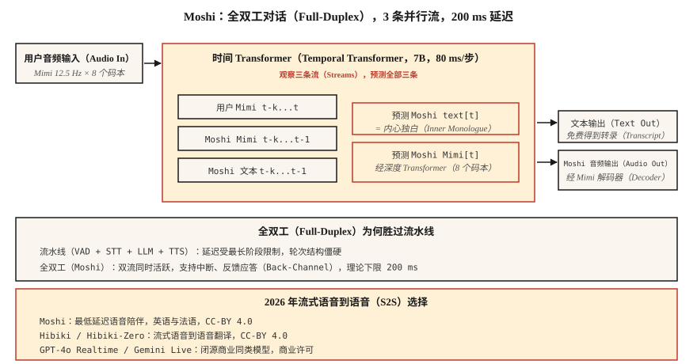

# 流式语音到语音：Moshi、Hibiki 与全双工对话（Streaming Speech-to-Speech — Moshi, Hibiki, and Full-Duplex Dialogue）

> 2024–2026 年重新定义了语音 AI。Moshi 用单模型以 200 ms 延迟同时听和说，Hibiki 逐块进行语音到语音翻译。两者都放弃 ASR → LLM → TTS 流水线，改用基于 Mimi 编解码词元的统一全双工架构。这是新的参考设计。

**Type:** Learn
**Languages:** Python
**Prerequisites:** 阶段 6 · 13（神经音频编解码器），阶段 6 · 11（实时音频），阶段 7 · 05（完整 Transformer）
**Time:** ~75 分钟

## 问题（The Problem）

按第 11、12 课构建的每个语音智能体，都有约 300–500 ms 的固有延迟下限：VAD 触发，STT 处理，LLM 推理，TTS 生成。各阶段都有最小延迟，可以调优和并行，但流水线结构限制了你。

Moshi（Kyutai，2024–2026）提出另一个问题：假如没有流水线呢？假如一个模型连续直接接收并输出音频，文本只作为中间“内心独白”，而非必经阶段呢？

答案是**全双工语音到语音（Full-Duplex Speech-to-Speech）**。理论延迟 160 ms（80 ms Mimi 帧加 80 ms 声学延迟），单张 L4 GPU 实际延迟 200 ms，仅为最优流水线语音智能体的一半。

## 概念（The Concept）



### Moshi 架构（The Moshi architecture）

**输入（Inputs）。** 两条 Mimi 编解码流，均为 12.5 Hz、8 个码本：

- 流 1：用户音频，经 Mimi 编码，持续到达。
- 流 2：Moshi 自身音频，由 Moshi 生成。

**Transformer。** 一个 70 亿参数的时间 Transformer（Temporal Transformer）处理两条流及一条文本“内心独白”流。每个 80 ms 步骤中，它：

1. 接收最新用户 Mimi 词元，8 个码本。
2. 接收最近生成的 Moshi Mimi 词元，8 个码本。
3. 生成下一个 Moshi 文本词元，即内心独白。
4. 经小型深度 Transformer 生成下一个 Moshi Mimi 词元组，8 个码本。

用户音频、Moshi 音频、Moshi 文本三条流并行运行。Moshi 说话时能听见用户，用户插话时可打断自己，还可用“嗯”进行反馈而不中断主要话语。

**深度 Transformer（Depth Transformer）。** 单帧内的 8 个码本并非并行预测，因为码本间存在依赖。小型两层深度 Transformer 在 80 ms 内顺序预测它们。这是自回归编解码语言模型的标准分解方式，VALL-E、VibeVoice 也使用。

### 内心独白文本为何有帮助（Why inner-monologue text helps）

没有显式文本，模型必须在声学流中隐式建模语言。Moshi 的洞见是强制音频旁同时输出文本词元。文本流实质上是 Moshi 所说内容的转录，可以改善语义连贯性，更便于替换语言模型头，也免费提供转录。

### Hibiki：流式语音到语音翻译（Hibiki: streaming speech-to-speech translation）

同一架构在翻译数据对上训练，连续接收源语言音频并输出目标语言音频。Hibiki-Zero（2026 年 2 月）不再需要词级对齐训练数据，改用句级数据和组相对策略优化（Group Relative Policy Optimization，GRPO）强化学习来优化延迟。

最初支持四个语言对，约 1000 小时数据即可适配新语言。

### 更完整的 Kyutai 技术栈，2026 年（The broader Kyutai stack (2026)）

- **Moshi**：全双工对话，法语优先，英语支持良好。
- **Hibiki / Hibiki-Zero**：同声语音翻译。
- **Kyutai STT**：流式自动语音识别，前瞻 500 ms 或 2.5 秒。
- **Kyutai Pocket TTS**：CPU 可运行的 1 亿参数文本转语音模型，2026 年 1 月发布。
- **Unmute**：在公共服务器上组合这些组件的完整流水线。

L40S GPU 吞吐量：64 个并发会话，速度为实时 3 倍。

### Sesame CSM：近亲方案（Sesame CSM — the cousin）

Sesame CSM（2025）采用类似思路：Llama-3 骨干加 Mimi 编解码头。但 CSM 是单向的，接收上下文与文本、生成语音，而非全双工。它是市场上“声音临场感”最好的 TTS，但不等同于 Moshi 的全双工能力。

### 2026 年性能数据（2026 performance numbers）

| 模型 | 延迟 | 用例 | 许可 |
|-------|---------|----------|---------|
| Moshi | 200 ms（L4） | 英语 / 法语全双工对话 | CC-BY 4.0 |
| Hibiki | 帧率 12.5 Hz | 法语 ↔ 英语流式翻译 | CC-BY 4.0 |
| Hibiki-Zero | 相同 | 5 个语言对，无需对齐数据 | CC-BY 4.0 |
| Sesame CSM-1B | 首音频时间 200 ms | 上下文条件 TTS | Apache-2.0 |
| GPT-4o Realtime | ~300 ms | 闭源，OpenAI API | 商业 |
| Gemini 2.5 Live | ~350 ms | 闭源，Google API | 商业 |

```figure
sp-fullduplex
```

## 动手实现（Build It）

### 第 1 步：接口（Step 1: the interface）

Moshi 暴露 WebSocket 服务器，持续接收和返回 80 ms 的 Mimi 编码音频块，双向同时进行。

```python
import asyncio
import websockets
from moshi.client_utils import encode_audio_mimi, decode_audio_mimi

async def moshi_chat():
    async with websockets.connect("ws://localhost:8998/api/chat") as ws:
        mic_task = asyncio.create_task(stream_mic_to(ws))
        spk_task = asyncio.create_task(stream_from_to_speaker(ws))
        await asyncio.gather(mic_task, spk_task)
```

### 第 2 步：全双工循环（Step 2: the full-duplex loop）

```python
async def stream_mic_to(ws):
    async for chunk_80ms in mic_stream_at_12_5_hz():
        mimi_tokens = encode_audio_mimi(chunk_80ms)
        await ws.send(serialize(mimi_tokens))

async def stream_from_to_speaker(ws):
    async for msg in ws:
        mimi_tokens, text_token = deserialize(msg)
        audio = decode_audio_mimi(mimi_tokens)
        await play(audio)
```

两个方向同时运行，Python asyncio 或 Rust futures 是标准传输实现方式。

### 第 3 步：训练目标，概念说明（Step 3: the training objective (conceptual)）

对于每个 80 ms 帧 `t`：

- 输入：`user_mimi[0..t]`、`moshi_mimi[0..t-1]`、`moshi_text[0..t-1]`
- 预测：`moshi_text[t]`，随后 `moshi_mimi[t, codebook_0..7]`

文本先于音频预测，即内心独白；音频在深度 Transformer 内按码本顺序预测。

### 第 4 步：Moshi 的优势与不足（Step 4: where Moshi wins and where it doesn't）

Moshi 的优势：

- 便宜硬件上端到端低于 250 ms。
- 自然的反馈应答和中断。
- 无需流水线胶水代码。

Moshi 不擅长：

- 工具调用，未针对它训练，需要独立 LLM 路径。
- 长推理，Moshi 是约 80 亿参数对话模型，不是 Claude/GPT-4。
- 小众主题的事实准确性。
- 多数企业生产用例，2026 年仍使用流水线。

## 实际应用（Use It）

| 情况 | 选择 |
|-----------|------|
| 最低延迟语音陪伴 | Moshi |
| 实时翻译通话 | Hibiki |
| 语音演示 / 研究 | Moshi、CSM |
| 带工具的企业智能体 | 第 12 课流水线，而非 Moshi |
| 上下文中的自定义声音 TTS | Sesame CSM |
| 任意语言语音到语音 | GPT-4o Realtime 或 Gemini 2.5 Live，商业 |

## 常见陷阱（Pitfalls）

- **工具调用受限。** Moshi 是对话模型，不是智能体框架，需要组合流水线处理工具。
- **特定声音条件。** Moshi 使用单一训练角色，克隆需要独立训练。
- **语言覆盖。** 法语和英语出色，其他有限。Hibiki-Zero 有帮助，但仍需要训练数据。
- **资源成本。** 完整 Moshi 会话占用 GPU 槽位，不是低成本共享租户部署模式。

## 交付成果（Ship It）

保存为 `outputs/skill-duplex-pipeline.md`。为语音智能体工作负载选择流水线或全双工架构，并说明理由。

## 练习（Exercises）

1. **简单。** 运行 `code/main.py`，用符号模拟双流加内心独白架构。
2. **中等。** 从 Hugging Face 拉取 Moshi，运行服务器，测试一次对话。测量用户说完到 Moshi 开始响应的实际墙钟延迟。
3. **困难。** 将第 12 课流水线智能体与 Moshi 在 20 条匹配测试语句上的 P50 延迟比较，写明哪些情况下流水线在架构上仍占优。

## 关键术语（Key Terms）

| 术语 | 常见说法 | 实际含义 |
|------|-----------------|-----------------------|
| 全双工（Full-Duplex） | 同时听和说 | 同一模型上两条音频流同时活跃。 |
| 内心独白（Inner Monologue） | 模型文本流 | Moshi 输出音频的同时输出文本词元。 |
| 深度 Transformer（Depth Transformer） | 码本间预测器 | 在一个 80 ms 帧内预测 8 个码本的小型 Transformer。 |
| Mimi | Kyutai 编解码器 | 12.5 Hz、8 个码本，语义加声学，支撑 Moshi。 |
| 流式语音到语音（Streaming Speech-to-Speech，S2S） | 实时音频 → 音频 | 逐块翻译或对话，没有流水线阶段。 |
| 反馈应答（Back-Channeling） | “嗯”式回应 | Moshi 可发出简短确认，不打断自身轮次。 |

## 延伸阅读（Further Reading）

- [Défossez 等（2024）：Moshi，语音–文本基础模型](https://arxiv.org/html/2410.00037v2)：原始论文。
- [Kyutai Labs（2026）：Hibiki-Zero 论文](https://arxiv.org/abs/2602.12345)：无需对齐数据的流式翻译。
- [Sesame（2025）：跨越声音的恐怖谷](https://www.sesame.com/research/crossing_the_uncanny_valley_of_voice)：CSM 规格。
- [Kyutai：Moshi 仓库](https://github.com/kyutai-labs/moshi)：安装与服务器。
- [OpenAI：Realtime API 文档](https://platform.openai.com/docs/guides/realtime)：封闭商业同类方案。
- [Kyutai：延迟流建模](https://github.com/kyutai-labs/delayed-streams-modeling)：底层 STT/TTS 框架。
