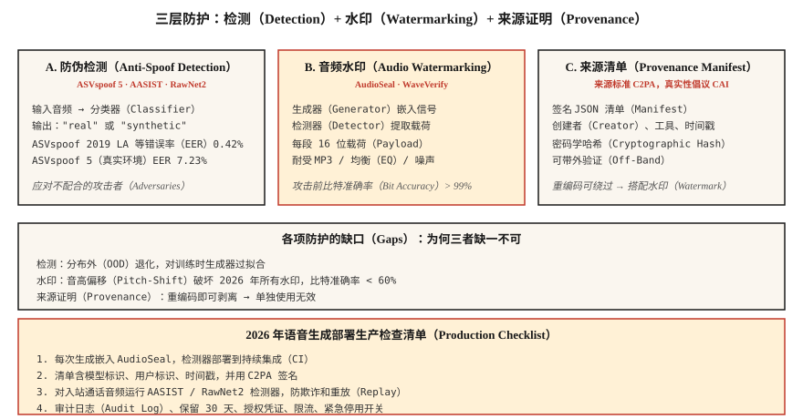

# 语音防伪与音频水印：ASVspoof 5、AudioSeal、WaveVerify（Voice Anti-Spoofing & Audio Watermarking — ASVspoof 5, AudioSeal, WaveVerify）

> 声音克隆的交付速度超过了防护。2026 年生产语音系统需要两样东西：区分真实与伪造语音的检测器（AASIST、RawNet2），以及经压缩和编辑仍保留的水印（AudioSeal）。两者都交付，否则不要交付声音克隆。

**Type:** Build
**Languages:** Python
**Prerequisites:** 阶段 6 · 06（说话人识别），阶段 6 · 08（声音克隆）
**Time:** ~75 分钟

## 问题（The Problem）

三种相关防护：

1. **防伪 / 深度伪造检测（Anti-Spoofing / Deepfake Detection）。** 给定音频，判断是合成还是真实。ASVspoof 基准（2019 → 2021 → 5）是黄金标准。
2. **音频水印（Audio Watermarking）。** 在生成音频中嵌入不可感知信号，供检测器之后提取。AudioSeal（Meta）与 WavMark 是开放选择。
3. **可信来源证明（Authenticated Provenance）。** 对音频文件与元数据做密码学签名，如 C2PA / 内容真实性倡议（Content Authenticity Initiative）。

检测应对不配合的攻击者，水印处理合规：AI 生成音频应能被识别为 AI 生成。2026 年两者都需要。

## 概念（The Concept）



### ASVspoof 5：2024–2025 年基准（ASVspoof 5 — the 2024-2025 benchmark）

相较此前版本的最大变化：

- **众包数据**，不再是录音室干净音频，更贴近真实条件。
- **约 2000 名说话人**，此前约 100 名。
- **32 种攻击算法。** 文本转语音、声音转换和对抗扰动。
- **两条赛道。** 对抗措施（Countermeasure，CM）独立检测，以及面向生物识别系统的抗伪造自动说话人验证（Spoofing-Robust ASV，SASV）。

ASVspoof 5 最先进等错误率约 7.23%；旧的 ASVspoof 2019 LA 为 0.42%。真实部署中，对自然环境音频应预期 5–10% 等错误率。

### AASIST 与 RawNet2：检测模型家族（AASIST and RawNet2 — detection model families）

**AASIST**（2021，持续更新至 2026）。对频谱特征做图注意力，是当前 ASVspoof 5 对抗措施任务的最先进方案。

**RawNet2。** 原始波形卷积前端加时延神经网络（TDNN）骨干。更简单的基线，微调后仍有竞争力。

**NeXt-TDNN 加自监督学习（SSL）特征。** 2025 年变体：ECAPA 风格、WavLM 特征和焦点损失，在 ASVspoof 2019 LA 上实现 0.42% 等错误率。

### AudioSeal：2024 年默认水印（AudioSeal — the 2024 watermark default）

Meta 的 **AudioSeal**（2024 年 1 月，v0.2 于 2024 年 12 月发布）。关键设计：

- **局部定位。** 在 16 kHz 采样分辨率（1/16000 秒）下逐帧检测水印。
- **生成器与检测器联合训练。** 生成器学习嵌入不可听信号，检测器学习在增强变换后找出它。
- **稳健。** 经 MP3 / AAC 压缩、均衡、±10% 变速、混入 +10 dB 信噪比噪声后仍能保留。
- **快速。** 检测器运行速度为实时 485 倍，比 WavMark 快 1000 倍。
- **容量。** 每条语句可嵌入 16 位载荷，编码模型标识、生成时间戳、用户标识。

### WavMark（WavMark）

AudioSeal 之前的开放基线，可逆神经网络，32 位/秒。问题包括：

- 同步暴力搜索很慢。
- 可被高斯噪声或 MP3 压缩移除。
- 不适合实时处理。

### WaveVerify，2025 年 7 月（WaveVerify (July 2025)）

针对 AudioSeal 的弱点，尤其是时间变换（反转、变速）。使用基于特征级线性调制（Feature-Wise Linear Modulation，FiLM）的生成器和混合专家（Mixture-of-Experts，MoE）检测器。在标准攻击上与 AudioSeal 相当，还能处理时间编辑。

### 攻击者利用的缺口（The gap adversaries exploit）

AudioMarkBench 指出：“音高偏移下，所有水印的比特恢复准确率低于 0.6，表明水印几乎完全被移除。”**音高偏移是通用攻击。** 2026 年没有水印能完全抵御强烈音高修改，因此水印之外还需要 AASIST 检测。

### C2PA 与内容真实性倡议（C2PA / Content Authenticity Initiative）

它不是机器学习技术，而是清单格式。音频文件携带有关创建工具、作者、日期的密码学签名元数据，Audobox / Seamless 使用它。适合来源证明，但恶意者重编码并剥离元数据时就无能为力。

```figure
v4-audio-watermark
```

## 动手实现（Build It）

### 第 1 步：简单频谱特征检测器，教学示例（Step 1: a simple spectral-feature detector (toy)）

```python
def spectral_rolloff(spec, percentile=0.85):
    cum = 0
    total = sum(spec)
    if total == 0:
        return 0
    threshold = total * percentile
    for k, v in enumerate(spec):
        cum += v
        if cum >= threshold:
            return k
    return len(spec) - 1

def is_suspicious(audio):
    spec = magnitude_spectrum(audio)
    rolloff = spectral_rolloff(spec)
    return rolloff / len(spec) > 0.92
```

合成语音常具有异常平坦的高频能量。生产检测用 AASIST，而不是这段代码，但直觉成立。

### 第 2 步：AudioSeal 嵌入与检测（Step 2: AudioSeal embed + detect）

```python
from audioseal import AudioSeal
import torch

generator = AudioSeal.load_generator("audioseal_wm_16bits")
detector = AudioSeal.load_detector("audioseal_detector_16bits")

audio = load_wav("generated.wav", sr=16000)[None, None, :]
payload = torch.tensor([[1, 0, 1, 1, 0, 1, 0, 0, 1, 1, 0, 1, 0, 1, 1, 0]])
watermark = generator.get_watermark(audio, sample_rate=16000, message=payload)
watermarked = audio + watermark

result, decoded_payload = detector.detect_watermark(watermarked, sample_rate=16000)
# result: float in [0, 1] — probability of watermark presence
# decoded_payload: 16 bits; match against embedded payload
```

### 第 3 步：等错误率评估（Step 3: evaluation — EER）

```python
def eer(real_scores, fake_scores):
    thresholds = sorted(set(real_scores + fake_scores))
    best = (1.0, 0.0)
    for t in thresholds:
        far = sum(1 for s in fake_scores if s >= t) / len(fake_scores)
        frr = sum(1 for s in real_scores if s < t) / len(real_scores)
        if abs(far - frr) < best[0]:
            best = (abs(far - frr), (far + frr) / 2)
    return best[1]
```

### 第 4 步：生产集成（Step 4: the production integration）

```python
def safe_tts(text, voice, clone_reference=None):
    if clone_reference is not None:
        verify_consent(user_id, clone_reference)
    audio = tts_model.synthesize(text, voice)
    audio_with_wm = audioseal_embed(audio, payload=build_payload(user_id, model_id))
    manifest = c2pa_sign(audio_with_wm, user_id, timestamp=now())
    return audio_with_wm, manifest
```

每次生成都附带：(1) 水印，(2) 签名清单，(3) 符合保留策略的审计日志。

## 实际应用（Use It）

| 用例 | 防护 |
|----------|---------|
| 交付 TTS / 声音克隆 | 每份输出嵌入 AudioSeal，不可省略 |
| 声纹解锁 | AASIST 与 ECAPA 集成，加活体挑战 |
| 呼叫中心欺诈检测 | 对 20% 来电样本运行 AASIST |
| 播客真实性 | 上传时 C2PA 签名；AI 生成时加 AudioSeal |
| 研究 / 训练检测器 | ASVspoof 5 训练、开发、评估集 |

## 常见陷阱（Pitfalls）

- **加水印却从不运行检测器。** 毫无意义。将检测器放入持续集成（CI）。
- **检测未经校准。** 在 ASVspoof LA 上训练的 AASIST 会过拟合，真实准确率下降，应在自己的领域校准。
- **音高偏移缺口。** 强烈变调移除多数水印，需要检测回退。
- **剥离元数据后重新托管。** 重编码很容易绕过 C2PA，始终同时加入密码学和感知层（水印）防护。
- **把活体挑战当检测。** 要求用户说随机短语可防重放，不能防实时克隆。

## 交付成果（Ship It）

保存为 `outputs/skill-spoof-defender.md`。为语音生成部署选择检测模型、水印、来源清单和运营操作手册。

## 练习（Exercises）

1. **简单。** 运行 `code/main.py`，在合成音频上使用教学检测器及教学水印嵌入、检测。
2. **中等。** 安装 `audioseal`，在 TTS 输出嵌入 16 位载荷并重新解码。用噪声破坏音频，测量比特恢复准确率。
3. **困难。** 在 ASVspoof 2019 LA 上微调 RawNet2 或 AASIST，测量等错误率。再测试留出的 F5-TTS 生成片段，观察分布外（Out-of-Distribution，OOD）检测如何退化。

## 关键术语（Key Terms）

| 术语 | 常见说法 | 实际含义 |
|------|-----------------|-----------------------|
| ASVspoof | 那个基准 | 两年一届挑战赛，2024 年为 ASVspoof 5。 |
| 对抗措施（Countermeasure，CM） | 检测器 | 区分真实语音与合成 / 转换语音的分类器。 |
| 抗伪造自动说话人验证（SASV） | 说话人验证加 CM | 集成生物识别与伪造检测。 |
| AudioSeal | Meta 水印 | 可局部定位、16 位载荷，比 WavMark 快 485 倍。 |
| 比特恢复准确率（Bit Recovery Accuracy） | 水印存活率 | 攻击后恢复的载荷比特比例。 |
| 内容来源与真实性联盟标准（C2PA） | 来源清单 | 关于创建与作者身份的密码学元数据。 |
| AASIST | 检测器家族 | 基于图注意力的最先进防伪方案。 |

## 延伸阅读（Further Reading）

- [Todisco 等（2024）：ASVspoof 5 论文](https://dl.acm.org/doi/10.1016/j.csl.2025.101825)：当前基准。
- [Defossez 等（2024）：AudioSeal 论文](https://arxiv.org/abs/2401.17264)：默认水印方案。
- [Chen 等（2025）：WaveVerify 论文](https://arxiv.org/abs/2507.21150)：应对时间攻击的混合专家检测器。
- [Jung 等（2022）：AASIST 论文](https://arxiv.org/abs/2110.01200)：最先进检测骨干。
- [AudioMarkBench 基准（2024）](https://proceedings.neurips.cc/paper_files/paper/2024/file/5d9b7775296a641a1913ab6b4425d5e8-Paper-Datasets_and_Benchmarks_Track.pdf)：稳健性评估。
- [C2PA 规范](https://spec.c2pa.org/specifications/specifications/2.4/index.html)：来源清单格式。
