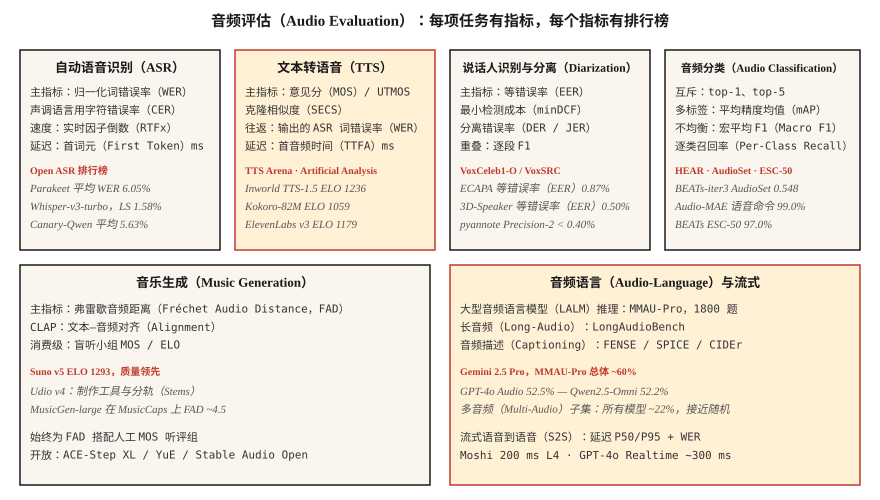

# 音频评估：WER、MOS、UTMOS、MMAU、FAD 与开放排行榜（Audio Evaluation — WER, MOS, UTMOS, MMAU, FAD, and the Open Leaderboards）

> 无法衡量，就无法交付。本课列出 2026 年各音频任务的指标：自动语音识别（WER、CER、RTFx）、文本转语音（MOS、UTMOS、SECS、ASR 往返词错误率）、音频语言（MMAU、LongAudioBench）、音乐（FAD、CLAP）、说话人（EER），以及可用于比较的排行榜。

**Type:** Learn
**Languages:** Python
**Prerequisites:** 阶段 6 · 04、06、07、09、10；阶段 2 · 09（模型评估）
**Time:** ~60 分钟

## 问题（The Problem）

每种音频任务都有多个指标，衡量不同维度。用错指标，就会交付在仪表板上出色、在生产中糟糕的模型。2026 年标准清单：

| 任务 | 主指标 | 次指标 |
|------|---------|-----------|
| 自动语音识别（ASR） | 词错误率 WER | 字符错误率 CER、实时因子倒数 RTFx、首词元延迟 |
| 文本转语音（TTS） | 平均意见分 MOS / UTMOS | 说话人嵌入余弦相似度 SECS、ASR 往返 WER、CER、首音频时间 TTFA |
| 声音克隆 | SECS（ECAPA 余弦） | MOS、CER |
| 说话人验证 | 等错误率 EER | 最小检测成本 minDCF、工作点的错误接受率 FAR / 错误拒绝率 FRR |
| 说话人分离 | 分离错误率 DER | Jaccard 错误率 JER、说话人混淆 |
| 音频分类 | top-1、平均精度均值 mAP | 宏平均 F1、逐类召回率 |
| 音乐生成 | 弗雷歇音频距离 FAD | CLAP、听评小组 MOS |
| 音频语言模型 | MMAU-Pro | LongAudioBench、AudioCaps FENSE |
| 流式语音到语音（S2S） | 延迟 P50/P95 | WER、MOS |

## 概念（The Concept）



### 自动语音识别指标（ASR metrics）

**词错误率（Word Error Rate，WER）。** `(S + D + I) / N`。评分前转小写、去标点、归一化数字。使用 `jiwer` 或 OpenAI 的 `whisper_normalizer`。&lt; 5% 表示朗读语音达到人类水平。

**字符错误率（Character Error Rate，CER）。** 相同公式，按字符计算。用于普通话、粤语等分词边界不明确的声调语言。

**实时因子倒数（Inverse Real-Time Factor，RTFx）。** 每秒实际时间处理的音频秒数，越高越好。Parakeet-TDT 达到 3380×，Whisper-large-v3 约 30×。

**首词元延迟（First-Token Latency）。** 从输入音频到首个转录词元的实际耗时，对流式至关重要。Deepgram Nova-3 约 150 ms。

### 文本转语音指标（TTS metrics）

**平均意见分（Mean Opinion Score，MOS）。** 人工 1–5 分评分，黄金标准但慢。每样本至少 20 名听者，每模型至少 100 个样本。

**UTMOS（2022–2026）。** 学得的 MOS 预测器，在标准基准上与人工 MOS 相关性约 0.9。F5-TTS 为 3.95，真实录音为 4.08。

**说话人编码器余弦相似度（Speaker Encoder Cosine Similarity，SECS）。** 用于声音克隆，计算参考与克隆输出的 ECAPA 嵌入余弦。&gt; 0.75 表示可辨识的克隆。

**ASR 往返词错误率（WER-on-ASR-Round-Trip）。** 用 Whisper 识别 TTS 输出，对照输入文本计算 WER，捕获可懂度退化。2026 年最先进水平为 CER &lt; 2%。

**首音频时间（Time-to-First-Audio，TTFA）。** 实际墙钟延迟，Kokoro-82M 约 100 ms，F5-TTS 约 1 秒。

### 声音克隆专用指标（Voice-cloning-specific）

使用 **SECS、MOS、CER** 三件套。SECS 高而 MOS 低意味着音色对但不自然；反之则声音自然但说话人不对。

### 说话人验证（Speaker verification）

**等错误率（Equal Error Rate，EER）。** 错误接受率等于错误拒绝率的阈值处的错误率。ECAPA 在 VoxCeleb1-O 上为 0.87%。

**最小检测成本（Minimum Detection Cost，minDCF）。** 所选工作点（常为 FAR=0.01）的加权成本，比 EER 更贴近生产。

### 说话人分离（Diarization）

**说话人分离错误率（Diarization Error Rate，DER）。** `(FA + Miss + Confusion) / total_speaker_time`。漏检语音、误报语音、说话人混淆分别按占比计算。AMI 会议现实范围约 10–20%。pyannote 3.1 加商业 Precision-2，在录音良好的音频上 DER &lt;10%。

**Jaccard 错误率（Jaccard Error Rate，JER）。** DER 的替代指标，对短片段偏差更稳健。

### 音频分类（Audio classification）

多标签使用所有类别的**平均精度均值（Mean Average Precision，mAP）**。BEATs-iter3 在 AudioSet 上为 0.548。

互斥多分类使用 **top-1、top-5 准确率**。Audio-MAE 在 Speech Commands v2 上 top-1 为 99.0%。

不均衡任务使用**宏平均 F1** 和**逐类召回率**。逐类报告，汇总准确率会掩盖失败类别。

### 音乐生成（Music generation）

**弗雷歇音频距离（Fréchet Audio Distance，FAD）。** 真实与生成音频的 VGGish 嵌入分布距离，越低越好。MusicGen-small 在 MusicCaps 上为 4.5，MusicLM 为 4.0。

**CLAP 分数（CLAP Score）。** 使用对比语言–音频预训练（CLAP）嵌入衡量文本–音频对齐，&gt; 0.3 表示合理对齐。

**听评小组 MOS（Listening Panel MOS）。** 仍是消费级音乐的最终判据。Suno v5 在 TTS Arena 上 ELO 1293，来自人工成对偏好。

### 音频语言基准（Audio-language benchmarks）

**大规模多音频理解（Massive Multi-Audio Understanding，MMAU）。** 1 万对音频问答。

**MMAU-Pro。** 1800 个难例，分语音、声音、音乐、多音频四类。四选一随机概率 25%。Gemini 2.5 Pro 总体约 60%，所有模型多音频约 22%。

**LongAudioBench。** 多分钟音频搭配语义查询。Audio Flamingo Next 超过 Gemini 2.5 Pro。

**AudioCaps / Clotho。** 音频描述基准，使用 SPICE、CIDEr、FENSE 指标。

### 流式语音到语音（Streaming speech-to-speech）

**延迟 P50 / P95 / P99。** 从用户说完到首次可听响应的实际时间。Moshi 为 200 ms，GPT-4o Realtime 为 300 ms。

输出上的 **WER / MOS**。

**插话响应性（Barge-In Responsiveness）。** 从用户打断到助手静音的时间，目标 &lt; 150 ms。

### 2026 年排行榜（The 2026 leaderboards）

| 排行榜 | 赛道 | URL |
|------------|--------|-----|
| Open ASR 排行榜（HF） | 英语、多语言、长音频 | `huggingface.co/spaces/hf-audio/open_asr_leaderboard` |
| TTS Arena（HF） | 英语 TTS | `huggingface.co/spaces/TTS-AGI/TTS-Arena` |
| Artificial Analysis Speech | TTS 与 STT，成对投票计算 ELO | `artificialanalysis.ai/speech` |
| MMAU-Pro | 大型音频语言模型推理 | `sonalkum.github.io/mmau-pro` |
| SpeakerBench / VoxSRC | 说话人识别 | `voxsrc.github.io` |
| MMAU 音乐子集 | 音乐音频语言模型 | MMAU 内部 |
| HEAR 基准 | 自监督音频 | `hearbenchmark.com` |

```figure
sp-wer-align
```

## 动手实现（Build It）

### 第 1 步：带归一化的 WER（Step 1: WER with normalization）

```python
from jiwer import wer, Compose, ToLowerCase, RemovePunctuation, Strip

transform = Compose([ToLowerCase(), RemovePunctuation(), Strip()])
score = wer(
    truth="Please turn on the lights.",
    hypothesis="please turn on the light",
    truth_transform=transform,
    hypothesis_transform=transform,
)
# ~0.17
```

### 第 2 步：TTS 往返 WER（Step 2: TTS round-trip WER）

```python
def ttr_wer(tts_model, asr_model, texts):
    errors = []
    for txt in texts:
        audio = tts_model.synthesize(txt)
        recog = asr_model.transcribe(audio)
        errors.append(wer(truth=txt, hypothesis=recog))
    return sum(errors) / len(errors)
```

### 第 3 步：声音克隆 SECS（Step 3: SECS for voice cloning）

```python
from speechbrain.inference.speaker import EncoderClassifier
sv = EncoderClassifier.from_hparams("speechbrain/spkrec-ecapa-voxceleb")

emb_ref = sv.encode_batch(load_wav("reference.wav"))
emb_clone = sv.encode_batch(load_wav("cloned.wav"))
secs = torch.nn.functional.cosine_similarity(emb_ref, emb_clone, dim=-1).item()
```

### 第 4 步：音乐生成 FAD（Step 4: FAD for music generation）

```python
from frechet_audio_distance import FrechetAudioDistance
fad = FrechetAudioDistance()
score = fad.get_fad_score("generated_folder/", "reference_folder/")
```

### 第 5 步：说话人验证 EER，与第 6 课相同代码（Step 5: EER for speaker verification (same code as Lesson 6)）

```python
def eer(same_scores, diff_scores):
    thresholds = sorted(set(same_scores + diff_scores))
    best = (1.0, 0.0)
    for t in thresholds:
        far = sum(1 for s in diff_scores if s >= t) / len(diff_scores)
        frr = sum(1 for s in same_scores if s < t) / len(same_scores)
        if abs(far - frr) < best[0]:
            best = (abs(far - frr), (far + frr) / 2)
    return best[1]
```

## 实际应用（Use It）

每个部署都配套固定评估工具，每次模型更新运行。三条基本规则：

1. **评分前归一化。** 转小写、去标点、展开数字，报告归一化规则。
2. **报告分布而非均值。** 延迟报告 P50/P95/P99，分类报告逐类召回率，MMAU 按类别报告。
3. **运行一个标准公共基准。** 即使生产数据不同，报告 Open ASR / TTS Arena / MMAU 结果，也能让评审者按相同条件比较。

## 常见陷阱（Pitfalls）

- **UTMOS 外推。** 在 VCTK 风格干净语音上训练，对噪声、克隆、情绪音频评分不佳。
- **MOS 听评偏差。** 20 名 Amazon Mechanical Turk 工人不等于 20 名目标用户。影响重大时付费组织领域听评组。
- **FAD 依赖参考集。** 不同模型应对照同一参考分布。
- **汇总 WER。** 总体 5% 可能掩盖带口音语音 30% 的 WER，按人口特征切片报告。
- **公共基准饱和。** 多数前沿模型在标准基准上接近上限，需要反映真实流量的内部留出集。

## 交付成果（Ship It）

保存为 `outputs/skill-audio-evaluator.md`。为任意音频模型发布选择指标、基准与报告格式。

## 练习（Exercises）

1. **简单。** 运行 `code/main.py`，在教学输入上计算 WER、CER、EER、SECS、近似 FAD 和近似 MMAU。
2. **中等。** 构建 TTS 往返 WER 评估工具，将 Kokoro 或 F5-TTS 输出送入 Whisper，对 50 条提示词计算 WER，标记 &gt; 10% 的提示词。
3. **困难。** 在 MMAU-Pro 语音与多音频子集（各 50 项）上评估第 10 课所选 LALM，报告逐类准确率，与公布数据比较。

## 关键术语（Key Terms）

| 术语 | 常见说法 | 实际含义 |
|------|-----------------|-----------------------|
| 词错误率（WER） | ASR 分数 | 归一化后词级 `(S+D+I)/N`。 |
| 字符错误率（CER） | 字符版 WER | 用于声调语言或字符级系统。 |
| 平均意见分（MOS） | 人的意见 | 1–5 分，至少 20 名听者 × 100 个样本。 |
| UTMOS | 机器学习 MOS 预测器 | 学得的模型，与人工 MOS 相关性约 0.9。 |
| 说话人编码器余弦相似度（SECS） | 声音克隆相似度 | 参考与克隆的 ECAPA 余弦。 |
| 等错误率（EER） | 说话人验证分数 | FAR = FRR 的阈值处错误率。 |
| 说话人分离错误率（DER） | 说话人分离分数 | (FA + Miss + Confusion) / total。 |
| 弗雷歇音频距离（FAD） | 音乐生成质量 | VGGish 嵌入上的弗雷歇距离。 |
| 实时因子倒数（RTFx） | 吞吐量 | 每秒实际时间处理的音频秒数。 |

## 延伸阅读（Further Reading）

- [jiwer 项目](https://github.com/jitsi/jiwer)：带归一化工具的 WER/CER 库。
- [UTMOS 论文，Saeki 等（2022）](https://arxiv.org/abs/2204.02152)：学得的 MOS 预测器。
- [弗雷歇音频距离论文，Kilgour 等（2019）](https://arxiv.org/abs/1812.08466)：音乐生成标准。
- [Open ASR 排行榜](https://huggingface.co/spaces/hf-audio/open_asr_leaderboard)：2026 年动态排名。
- [TTS Arena 排行榜](https://huggingface.co/spaces/TTS-AGI/TTS-Arena)：人工投票 TTS 排名。
- [MMAU-Pro 基准](https://sonalkum.github.io/mmau-pro/)：大型音频语言模型推理排行榜。
- [HEAR 基准](https://hearbenchmark.com/)：音频自监督学习基准。
