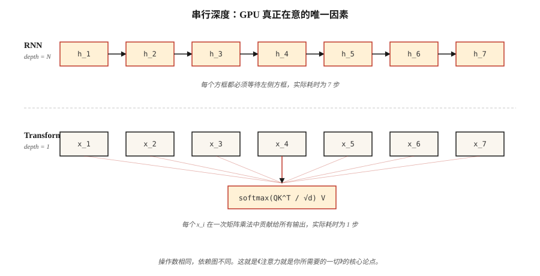

# 为什么选择 Transformer：RNN 的问题（Why Transformers — The Problems with RNNs）

> RNN 逐个处理词元（Token），Transformer 同时处理所有词元。这一个架构选择改变了 2017 年后深度学习（Deep Learning，DL）的所有扩展曲线。

**Type:** Learn
**Languages:** Python
**Prerequisites:** 阶段 3（深度学习核心），阶段 5 · 09（序列到序列），阶段 5 · 10（注意力机制）
**Time:** ~45 分钟

## 问题（The Problem）

2017 年以前，全球最先进的语言、翻译和语音序列模型都是循环神经网络（Recurrent Neural Network，RNN）。长短期记忆网络（Long Short-Term Memory，LSTM）和门控循环单元（Gated Recurrent Unit，GRU）连续五年称霸地位相当于 ImageNet 的翻译基准测试。它们是当时唯一可用的工具。

它们有三个致命弱点。串行计算意味着无法沿时间轴并行：词元 `t+1` 需要词元 `t` 的隐藏状态。长度为 1,024 的词元序列意味着要在每周期可完成 1,000,000 次浮点运算的 GPU 上执行 1,024 个串行步骤。硬件为并行而设计，训练实际耗时却随序列长度线性增长。

梯度消失（Vanishing Gradients）意味着 50 个词元之前的信息已经经过 50 次非线性变换压缩。门控循环结构（LSTM、GRU）缓解了压缩，但没有消除它。长距离依赖，例如“我去年夏天在飞往京都的飞机上读的那本书是……”，常常处理失败。

固定宽度的隐藏状态意味着，在解码器看到任何内容前，编码器必须把整个源序列压缩成一个向量。不管源序列是 5 个还是 500 个词元，瓶颈的形状都一样。

2017 年的论文《注意力就是你所需要的一切》（Attention Is All You Need）提出了激进方案：彻底去掉循环。让每个位置并行关注所有其他位置。用一次大型矩阵乘法训练，而不是 1,024 次串行运算。

到 2026 年，这个方案已主导各类模态：语言（GPT-5、Claude 4、Llama 4）、视觉（ViT、DINOv2、SAM 3）、音频（Whisper）、生物学（AlphaFold 3）、机器人（RT-2）。相同的模块，输入不同而已。

## 概念（The Concept）



**循环构成瓶颈。** RNN 计算 `h_t = f(h_{t-1}, x_t)`。每一步依赖前一步，不能在 `h_4` 前计算 `h_5`。现代 GPU 拥有超过 10,000 个并行核心，处理长序列时，这会浪费 99% 的芯片计算资源。

**注意力相当于广播。** 自注意力（Self-Attention）同时为每一对 `(i, j)` 计算 `output_i = sum_j(a_ij * v_j)`。整个 N×N 注意力矩阵通过一次批量矩阵乘法填满。各步互不依赖，很适合 GPU。

**加速并非固定倍数。** 区别在于 `O(N)` 与 `O(1)` 的串行深度。实际中，相同硬件、N=512 时，Transformer 每轮训练快 5–10 倍；差距随序列长度增大，直到撞上注意力的 `O(N²)` 内存墙（后来 Flash Attention 解决了这一问题，见第 12 课）。

**Transformer 的代价。** 注意力内存按 `O(N²)` 扩展。2K 上下文没有问题；128K 上下文则需要滑动窗口、旋转位置嵌入（Rotary Position Embedding，RoPE）外推、Flash Attention 分块或线性注意力变体。循环结构的时间和内存均为 `O(N)`；Transformer 权衡时间与内存，再通过并行收回时间成本。

**归纳偏置的变化。** RNN 假设局部性和近期信息更重要。Transformer 不作此类假设，每一对位置都可能参与注意力。因此 Transformer 需要更多数据才能训练好，但数据充足后能扩展得更远。Chinchilla（2022）对此进行了形式化：给定足够词元，Transformer 总能胜过参数量相同的 RNN。

```figure
rnn-vs-parallel
```

## 动手实现（Build It）

这里不构建神经网络，而是数值模拟核心瓶颈，让你在笔记本电脑上感受到差距。

### 第 1 步：测量串行深度（Step 1: measure serial depth）

参见 `code/main.py`。我们构建两个函数：一个将序列编码为加法链，像 RNN 一样串行；另一个将序列编码为并行归约，像注意力一样广播。数学相同，依赖图不同。

```python
def rnn_style(xs):
    h = 0.0
    for x in xs:
        h = 0.9 * h + x   # can't parallelize: h depends on previous h
    return h

def attention_style(xs):
    return sum(xs) / len(xs)  # every x is independent
```

我们对最多 100,000 个元素的序列测量两者耗时。RNN 版本为 O(N)，使用单条 CPU 流水线。即使在纯 Python 中，长度 ≥ 1,000 时注意力式归约也更快，因为 Python 的 `sum()` 用 C 实现，迭代时没有每步的解释器开销。

### 第 2 步：计算理论操作数（Step 2: count theoretical operations）

两个算法都执行 N 次加法。区别是*依赖深度*：下一步开始前必须串行执行多少次操作。RNN 深度 = N。注意力采用树形归约时深度 = log(N)，采用并行扫描时为 1。决定 GPU 时间的是深度，而非操作数。

### 第 3 步：实测长序列扩展情况（Step 3: empirical scaling on long sequences）

我们打印计时表，直观呈现 O(N) 差距。在 2026 年的 Mac 笔记本上，不足 1,000 个元素的序列快到难以测量；100,000 个元素则呈现清晰的线性扫描。将其扩展到 16,384 个词元的 Transformer，并与等效的 12 层 LSTM 比较，就能理解实际训练耗时为何在 2016 年成为障碍。

## 实际应用（Use It）

2026 年仍适合选择 RNN 的情形：

| 情形 | 选择 |
|-----------|------|
| 流式推理，每次一个词元，恒定内存 | RNN 或状态空间模型（State-Space Model，SSM），如 Mamba、RWKV |
| 极长序列（>1M 个词元），注意力内存爆炸 | 线性注意力、Mamba 2、Hyena |
| 没有矩阵乘法加速器的边缘设备 | 深度可分离 RNN 的每瓦浮点运算性能仍占优 |
| 其他情形（训练、批量推理、最大 128K 上下文） | Transformer |

Mamba 等状态空间模型（SSM）本质上是结构化参数化的 RNN，兼得两者优点：`O(N)` 扫描内存，以及通过选择性扫描实现的并行训练。它们达到 Transformer 90% 的质量，同时有更好的长上下文扩展性。2026 年，多数前沿实验室训练混合 SSM+Transformer 模型（如 Jamba、Samba）。循环没有消失，而是成为组件。

## 交付成果（Ship It）

参见 `outputs/skill-architecture-picker.md`。该技能根据长度、吞吐量和训练预算约束，为新序列问题选择架构。对于超过 1B 个词元的训练，若未说明权衡，它必须拒绝推荐纯 RNN。

## 练习（Exercises）

1. **简单。** 取 `code/main.py` 中的 `rnn_style`，把标量隐藏状态替换为长度 64 的隐藏状态向量，重新测量。串行开销随隐藏状态维度增长了多少？
2. **中等。** 用纯 Python 实现并行前缀和（Hillis-Steele 扫描）。验证长度为 1024 时它与串行扫描得到相同数值结果，并计算深度。
3. **困难。** 将注意力式归约移植到 GPU 上的 PyTorch。把序列长度从 64 扫描至 65,536，测量两者耗时，绘图并解释曲线形状。

## 关键术语（Key Terms）

| 术语 | 常见说法 | 实际含义 |
|------|-----------------|-----------------------|
| 循环（Recurrence） | “RNN 是串行的” | 步骤 `t` 依赖步骤 `t-1` 的计算，迫使时间轴上的执行串行化。 |
| 串行深度（Serial depth） | “计算图有多深” | 相互依赖操作的最长链；即使硬件无限，它也约束实际耗时。 |
| 注意力（Attention） | “让词元相互观察” | 加权和 `sum_j a_ij v_j`，其中 `a_ij` 来自位置 i 与 j 的相似度分数。 |
| 上下文窗口（Context window） | “模型能看到多少” | 注意力层可接收的输入位置数；二次内存成本随此值扩展。 |
| 归纳偏置（Inductive bias） | “架构内置的假设” | 对数据形态的先验；卷积神经网络（Convolutional Neural Network，CNN）假设平移不变性，RNN 假设近期信息更重要。 |
| 状态空间模型（State-space model） | “有代数支撑的 RNN” | 通过结构化状态空间矩阵参数化循环，以支持并行训练。 |
| 二次瓶颈（Quadratic bottleneck） | “上下文为何昂贵” | 注意力内存相对于序列长度为 `O(N²)`；Flash Attention 隐藏的是常数，而非扩展规律。 |

## 延伸阅读（Further Reading）

- [Vaswani 等（2017）：注意力就是你所需要的一切（Attention Is All You Need）](https://arxiv.org/abs/1706.03762)：让循环退出主流自然语言处理（Natural Language Processing，NLP）的论文。
- [Bahdanau、Cho、Bengio（2014）：联合学习对齐与翻译的神经机器翻译（Neural MT by Jointly Learning to Align and Translate）](https://arxiv.org/abs/1409.0473)：注意力的起点，当时附加在 RNN 上。
- [Hochreiter、Schmidhuber（1997）：长短期记忆（Long Short-Term Memory）](https://www.bioinf.jku.at/publications/older/2604.pdf)：原始 LSTM 论文，留作参考。
- [Gu、Dao（2023）：Mamba：选择性状态空间的线性时间序列建模（Mamba: Linear-Time Sequence Modeling with Selective State Spaces）](https://arxiv.org/abs/2312.00752)：循环模型对 Transformer 的现代回应。
