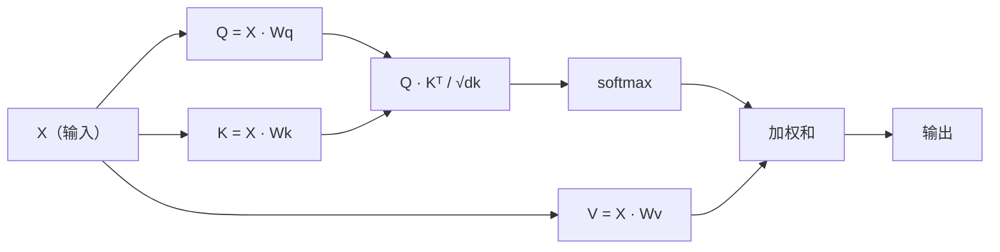

# 从零实现自注意力（Self-Attention from Scratch）

> 注意力（Attention）就像一张查找表，每个词语都在问“谁对我重要？”，并学习答案。

**Type:** Build
**Languages:** Python
**Prerequisites:** 阶段 3（深度学习核心），阶段 5 第 10 课（序列到序列）
**Time:** ~90 分钟

## 学习目标（Learning Objectives）

- 仅用 NumPy 从零实现缩放点积自注意力（Scaled Dot-Product Self-Attention），包括查询、键、值投影和 softmax 加权求和
- 构建多头注意力（Multi-Head Attention）层，拆分注意力头、并行计算注意力并拼接结果
- 追踪注意力矩阵如何捕捉词元关系，解释为何除以 sqrt(d_k) 能避免 softmax 饱和
- 应用因果掩码（Causal Masking），将双向注意力转变为自回归（解码器式）注意力

## 问题（The Problem）

循环神经网络（Recurrent Neural Network，RNN）逐个词元处理序列。到第 50 个词元时，第 1 个词元的信息已被压缩了 50 次。长距离依赖被挤进固定大小的隐藏状态，这一瓶颈无法通过增加 LSTM 门控彻底解决。

2014 年 Bahdanau 的注意力论文提出了补救办法：让解码器回看每个编码器位置，并决定哪些位置对当前步骤重要。但注意力仍附加在 RNN 上。2017 年《注意力就是你所需要的一切》（Attention Is All You Need）提出了更直接的问题：如果注意力是*唯一*机制呢？没有循环，没有卷积，只有注意力。

自注意力让序列中的每个位置在一次并行步骤中关注其他所有位置。这使 Transformer 具备速度、扩展性与主导地位。

## 概念（The Concept）

### 数据库查找类比（The Database Lookup Analogy）

把注意力想象成软数据库查找：

```text
传统数据库：
  查询："capital of France"  -->  精确匹配  -->  "Paris"

注意力：
  查询："capital of France"  -->  与所有键的相似度  -->  所有值的加权混合
```

每个词元生成三个向量：
- **查询（Query，Q）**：“我在找什么？”
- **键（Key，K）**：“我包含什么？”
- **值（Value，V）**：“被选中时，我提供什么信息？”

查询与所有键的点积产生注意力分数。分数高表示“这个键匹配我的查询”。这些分数给值分配权重，输出是值的加权和。

### Q、K、V 计算（Q, K, V Computation）

每个词元嵌入（Embedding）都通过三个学习得到的权重矩阵进行投影：

```text
输入嵌入（n 个词元的序列，每个词元为 d 维）：

  X = [x1, x2, x3, ..., xn]       形状： (n, d)

三个权重矩阵：

  Wq  形状： (d, dk)
  Wk  形状： (d, dk)
  Wv  形状： (d, dv)

投影：

  Q = X @ Wq    形状： (n, dk)      每个词元的查询
  K = X @ Wk    形状： (n, dk)      每个词元的键
  V = X @ Wv    形状： (n, dv)      每个词元的值
```

单个词元的示意如下：

```text
             Wq
  x_i ------[*]------> q_i    "我在找什么？"
       |
       |     Wk
       +----[*]------> k_i    "我包含什么？"
       |
       |     Wv
       +----[*]------> v_i    "我提供什么？"
```

### 注意力矩阵（The Attention Matrix）

得到所有词元的 Q、K、V 后，注意力分数组成一个矩阵：

```text
Scores = Q @ K^T    形状： (n, n)

              k1    k2    k3    k4    k5
        +-----+-----+-----+-----+-----+
   q1   | 2.1 | 0.3 | 0.1 | 0.8 | 0.2 |   <- q1 对各个键的关注程度
        +-----+-----+-----+-----+-----+
   q2   | 0.4 | 1.9 | 0.7 | 0.1 | 0.3 |
        +-----+-----+-----+-----+-----+
   q3   | 0.2 | 0.6 | 2.3 | 0.5 | 0.1 |
        +-----+-----+-----+-----+-----+
   q4   | 0.9 | 0.1 | 0.4 | 1.7 | 0.6 |
        +-----+-----+-----+-----+-----+
   q5   | 0.1 | 0.3 | 0.2 | 0.5 | 2.0 |
        +-----+-----+-----+-----+-----+

每一行：一个词元对整个序列的注意力
```

观察查询逐行扫描所有键：每一行给所有词元打分，softmax 将分数转为权重，上下文向量则是值的加权混合。

```figure
attention-matrix
```

### 为什么要缩放？（Why Scale?）

点积随维度 dk 增长。若 dk = 64，点积可能达到几十，把 softmax 推入梯度消失的区域。解决办法是除以 sqrt(dk)。

```text
Scaled scores = (Q @ K^T) / sqrt(dk)
```

这使数值保持在 softmax 能产生有效梯度的范围内。

### Softmax 将分数转为权重（Softmax Turns Scores into Weights）

Softmax 将原始分数转为每行的概率分布：

```text
q1 的原始分数：   [2.1, 0.3, 0.1, 0.8, 0.2]
                            |
                         softmax
                            |
注意力权重：   [0.52, 0.09, 0.07, 0.14, 0.08]   （总和约为 1.0）
```

现在每个词元都有一组权重，表示应该对其他每个词元投入多少注意力。

### 值的加权和（Weighted Sum of Values）

每个词元的最终输出是所有值向量的加权和：

```text
output_i = sum( attention_weight[i][j] * v_j  for all j )

对于词元 1：
  output_1 = 0.52 * v1 + 0.09 * v2 + 0.07 * v3 + 0.14 * v4 + 0.08 * v5
```

### 完整流程（Full Pipeline）



用一行公式表示：

```text
Attention(Q, K, V) = softmax( Q @ K^T / sqrt(dk) ) @ V
```

```figure
softmax-attention-scaling
```

## 动手实现（Build It）

### 第 1 步：从零实现 Softmax（Step 1: Softmax from scratch）

Softmax 将原始逻辑值（Logits）转为概率。减去最大值可保证数值稳定性。

```python
import numpy as np

def softmax(x):
    shifted = x - np.max(x, axis=-1, keepdims=True)
    exp_x = np.exp(shifted)
    return exp_x / np.sum(exp_x, axis=-1, keepdims=True)

logits = np.array([2.0, 1.0, 0.1])
print(f"logits:  {logits}")
print(f"softmax: {softmax(logits)}")
print(f"sum:     {softmax(logits).sum():.4f}")
```

### 第 2 步：缩放点积注意力（Step 2: Scaled dot-product attention）

核心函数接收 Q、K、V 矩阵，返回注意力输出和权重矩阵。

```python
def scaled_dot_product_attention(Q, K, V):
    dk = Q.shape[-1]
    scores = Q @ K.T / np.sqrt(dk)
    weights = softmax(scores)
    output = weights @ V
    return output, weights
```

### 第 3 步：带学习投影的自注意力类（Step 3: Self-attention class with learned projections）

构建完整自注意力模块，用类似 Xavier 的缩放初始化 Wq、Wk、Wv 权重矩阵。

```python
class SelfAttention:
    def __init__(self, d_model, dk, dv, seed=42):
        rng = np.random.default_rng(seed)
        scale = np.sqrt(2.0 / (d_model + dk))
        self.Wq = rng.normal(0, scale, (d_model, dk))
        self.Wk = rng.normal(0, scale, (d_model, dk))
        scale_v = np.sqrt(2.0 / (d_model + dv))
        self.Wv = rng.normal(0, scale_v, (d_model, dv))
        self.dk = dk

    def forward(self, X):
        Q = X @ self.Wq
        K = X @ self.Wk
        V = X @ self.Wv
        output, weights = scaled_dot_product_attention(Q, K, V)
        return output, weights
```

### 第 4 步：在句子上运行（Step 4: Run it on a sentence）

为一个句子创建模拟嵌入，观察注意力权重。

```python
sentence = ["The", "cat", "sat", "on", "the", "mat"]
n_tokens = len(sentence)
d_model = 8
dk = 4
dv = 4

rng = np.random.default_rng(42)
X = rng.normal(0, 1, (n_tokens, d_model))

attn = SelfAttention(d_model, dk, dv, seed=42)
output, weights = attn.forward(X)

print("Attention weights (each row: where that token looks):\n")
print(f"{'':>6}", end="")
for token in sentence:
    print(f"{token:>6}", end="")
print()

for i, token in enumerate(sentence):
    print(f"{token:>6}", end="")
    for j in range(n_tokens):
        w = weights[i][j]
        print(f"{w:6.3f}", end="")
    print()
```

### 第 5 步：用 ASCII 热力图可视化注意力（Step 5: Visualize attention with ASCII heatmap）

将注意力权重映射为字符，快速查看分布。

```python
def ascii_heatmap(weights, tokens, chars=" ░▒▓█"):
    n = len(tokens)
    print(f"\n{'':>6}", end="")
    for t in tokens:
        print(f"{t:>6}", end="")
    print()

    for i in range(n):
        print(f"{tokens[i]:>6}", end="")
        for j in range(n):
            level = int(weights[i][j] * (len(chars) - 1) / weights.max())
            level = min(level, len(chars) - 1)
            print(f"{'  ' + chars[level] + '   '}", end="")
        print()

ascii_heatmap(weights, sentence)
```

## 实际应用（Use It）

PyTorch 的 `nn.MultiheadAttention` 完成我们构建的功能，还增加了多头拆分和输出投影：

```python
import torch
import torch.nn as nn

d_model = 8
n_heads = 2
seq_len = 6

mha = nn.MultiheadAttention(embed_dim=d_model, num_heads=n_heads, batch_first=True)

X_torch = torch.randn(1, seq_len, d_model)

output, attn_weights = mha(X_torch, X_torch, X_torch)

print(f"Input shape:            {X_torch.shape}")
print(f"Output shape:           {output.shape}")
print(f"Attention weight shape: {attn_weights.shape}")
print(f"\nAttn weights (averaged over heads):")
print(attn_weights[0].detach().numpy().round(3))
```

关键区别在于：多头注意力并行运行多个注意力函数，每个函数使用自身大小为 dk = d_model / n_heads 的 Q、K、V 投影，随后拼接结果。这让模型同时关注不同类型的关系。

## 交付成果（Ship It）

本课产出：
- `outputs/prompt-attention-explainer.md`：通过数据库查找类比解释注意力的提示词（Prompt）

## 练习（Exercises）

1. 修改 `scaled_dot_product_attention`，接收可选的掩码矩阵，在 softmax 前将指定位置设为负无穷（这就是因果/解码器掩码的工作方式）
2. 从零实现多头注意力：将 Q、K、V 拆为 `n_heads` 块，分别计算注意力，拼接后通过最终权重矩阵 Wo 投影
3. 将两个长度相同的不同句子输入同一个 SelfAttention 实例，比较注意力模式。哪些发生变化？哪些保持不变？

## 关键术语（Key Terms）

| 术语 | 常见说法 | 实际含义 |
|------|----------------|----------------------|
| 查询（Query，Q） | “问题向量” | 输入的学习投影，表示该词元正在寻找什么信息 |
| 键（Key，K） | “标签向量” | 表示该词元包含什么信息的学习投影，用于与查询匹配 |
| 值（Value，V） | “内容向量” | 携带实际信息的学习投影，依据注意力分数聚合 |
| 缩放点积注意力（Scaled dot-product attention） | “注意力公式” | softmax(QK^T / sqrt(dk)) @ V；缩放防止高维下 softmax 饱和 |
| 自注意力（Self-attention） | “词元观察自己和其他词元” | Q、K、V 来自同一序列的注意力，让每个位置关注其他所有位置 |
| 注意力权重（Attention weights） | “关注程度” | 对缩放点积应用 softmax 得到的位置概率分布 |
| 多头注意力（Multi-head attention） | “并行注意力” | 以不同投影运行多个注意力函数，再拼接结果，形成更丰富的表示 |

## 延伸阅读（Further Reading）

- [注意力就是你所需要的一切（Attention Is All You Need，Vaswani 等，2017）](https://arxiv.org/abs/1706.03762)：原始 Transformer 论文
- [图解 Transformer（The Illustrated Transformer，Jay Alammar）](https://jalammar.github.io/illustrated-transformer/)：完整架构的优秀可视化讲解
- [带注释的 Transformer（The Annotated Transformer，Harvard NLP）](https://nlp.seas.harvard.edu/annotated-transformer/)：附有解释的逐行 PyTorch 实现
