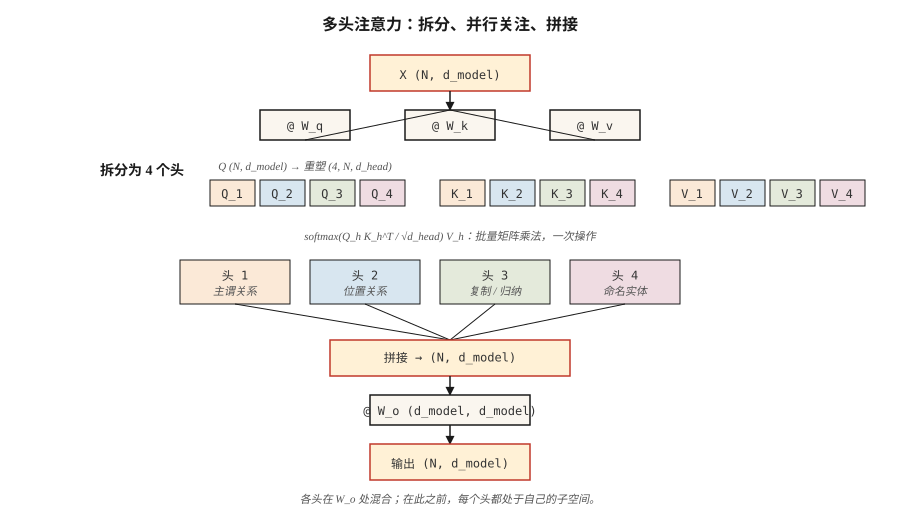

# 多头注意力（Multi-Head Attention）

> 一个注意力头一次学习一种关系，八个头学习八种。增加头没有额外成本，那就多用几个。

**Type:** Build
**Languages:** Python
**Prerequisites:** 阶段 7 · 02（从零实现自注意力）
**Time:** ~75 分钟

## 问题（The Problem）

单个自注意力头计算一个注意力矩阵。这个矩阵捕捉一种关系，通常是在当前训练信号下最能降低损失的关系。如果数据中的主谓一致、共指、长距离篇章关系与句法分块交织在一起，单个头会把它们混成一个 softmax 分布，丢掉一半信号。

2017 年 Vaswani 论文的解决办法是：并行运行多个注意力函数，每个函数使用独立的 Q、K、V 投影，再拼接输出。每个头在维度为 `d_model / n_heads` 的较小子空间中工作。总参数量不变，表达能力增强。

多头注意力是 2026 年所有 Transformer 的默认配置。争论只在于用*多少*个头，以及键和值是否共享投影，例如分组查询注意力（Grouped-Query Attention，GQA）、多查询注意力（Multi-Query Attention，MQA）和多头潜在注意力（Multi-head Latent Attention，MLA）。

## 概念（The Concept）



**拆分。** 取形状为 `(N, d_model)` 的 `X`，投影为形状均为 `(N, d_model)` 的 Q、K、V。重塑为 `(N, n_heads, d_head)`，其中 `d_head = d_model / n_heads`，再转置为 `(n_heads, N, d_head)`。

**并行计算注意力。** 在每个头内运行缩放点积注意力。每个头产生 `(N, d_head)`。这些头处理嵌入的不同子空间，在注意力计算期间彼此不通信。

**拼接并投影。** 将各头重新堆叠为 `(N, d_model)`，乘以形状为 `(d_model, d_model)` 的可学习输出矩阵 `W_o`。各头通过 `W_o` 混合。

**为什么有效。** 各头可分别专门化，不必争夺表示容量。2019–2024 年的探测研究发现了不同角色：位置头、关注前一个词元的头、复制头、命名实体头，以及支撑上下文学习（In-Context Learning）的归纳头（Induction Heads）。

**截至 2026 年的变体谱系：**

| 变体 | Q 头数 | K/V 头数 | 使用模型 |
|---------|---------|-----------|---------|
| 多头注意力（MHA） | N | N | GPT-2, BERT, T5 |
| 多查询注意力（MQA） | N | 1 | PaLM, Falcon |
| 分组查询注意力（GQA） | N | G（如 N/8） | Llama 2 70B, Llama 3+, Qwen 2+, Mistral |
| 多头潜在注意力（MLA） | N | 压缩为低秩 | DeepSeek-V2, V3 |

GQA 是现代默认方案，因为它将键值缓存（Key-Value Cache，KV Cache）内存缩小 `N/G` 倍，质量几乎不变。MLA 更进一步，将 K/V 压缩到潜在空间，计算时再投影回来，以浮点运算量换取更多内存节省。

```figure
multihead-split
```

## 动手实现（Build It）

### 第 1 步：从已有的单头注意力拆分出多头（Step 1: split heads from the single-head attention we already have）

取第 02 课的 `SelfAttention`，在外面包装一对拆分/拼接操作。NumPy 实现见 `code/main.py`；逻辑如下：

```python
def split_heads(X, n_heads):
    n, d = X.shape
    d_head = d // n_heads
    return X.reshape(n, n_heads, d_head).transpose(1, 0, 2)  # (heads, n, d_head)

def combine_heads(H):
    h, n, d_head = H.shape
    return H.transpose(1, 0, 2).reshape(n, h * d_head)
```

一次重塑，一次转置，没有循环。PyTorch 的 `nn.MultiheadAttention` 内部正是这样做的。

### 第 2 步：逐头运行缩放点积注意力（Step 2: run scaled-dot-product attention per head）

每个头获得自己的 Q、K、V 切片。注意力成为批量矩阵乘法：

```python
def mha_forward(X, W_q, W_k, W_v, W_o, n_heads):
    Q = X @ W_q
    K = X @ W_k
    V = X @ W_v
    Qh = split_heads(Q, n_heads)         # (heads, n, d_head)
    Kh = split_heads(K, n_heads)
    Vh = split_heads(V, n_heads)
    scores = Qh @ Kh.transpose(0, 2, 1) / np.sqrt(Qh.shape[-1])
    weights = softmax(scores, axis=-1)
    out = weights @ Vh                    # (heads, n, d_head)
    concat = combine_heads(out)
    return concat @ W_o, weights
```

在真实硬件上，`Qh @ Kh.transpose(...)` 是一次 `bmm`。GPU 看到的是形状为 `(heads, N, d_head) × (heads, d_head, N) -> (heads, N, N)` 的单次批量矩阵乘法。增加头没有额外成本。

### 第 3 步：分组查询注意力变体（Step 3: Grouped-Query Attention variant）

只改变键和值的投影。Q 分为 `n_heads` 组；K、V 分为 `n_kv_heads < n_heads` 组，再重复以匹配：

```python
def gqa_project(X, W, n_kv_heads, n_heads):
    kv = split_heads(X @ W, n_kv_heads)       # (kv_heads, n, d_head)
    repeat = n_heads // n_kv_heads
    return np.repeat(kv, repeat, axis=0)      # (n_heads, n, d_head)
```

推理时，这能节省内存，因为 KV 缓存仅保存 `n_kv_heads` 份，而非 `n_heads` 份。Llama 3 70B 使用 64 个查询头和 8 个 KV 头，缓存缩小 8 倍。

### 第 4 步：探测各头学到的内容（Step 4: probe what each head learned）

对一个短句运行 4 头 MHA，打印每个头的 `(N, N)` 注意力矩阵。即便随机初始化，不同头也会选出不同结构；这部分来自信号，部分来自子空间的旋转对称性。

## 实际应用（Use It）

PyTorch 中的一行版本：

```python
import torch.nn as nn

mha = nn.MultiheadAttention(embed_dim=512, num_heads=8, batch_first=True)
```

PyTorch 2.5+ 中的 GQA：

```python
from torch.nn.functional import scaled_dot_product_attention

# scaled_dot_product_attention auto-dispatches Flash Attention on CUDA.
# For GQA, pass Q of shape (B, n_heads, N, d_head) and K,V of shape
# (B, n_kv_heads, N, d_head). PyTorch handles the repeat.
out = scaled_dot_product_attention(q, k, v, is_causal=True, enable_gqa=True)
```

**用多少个头？** 2026 年生产模型的经验规则：

| 模型规模 | d_model | n_heads | d_head |
|------------|---------|---------|--------|
| 小型（~125M） | 768 | 12 | 64 |
| 基础型（~350M） | 1024 | 16 | 64 |
| 大型（~1B） | 2048 | 16 | 128 |
| 前沿型（~70B） | 8192 | 64 | 128 |

`d_head` 几乎总是 64 或 128，它衡量一个头能“看到”多少。低于 32，各头开始受到缩放因子 `sqrt(d_head)` 的影响；高于 256，则失去“多个小专家”的优势。

## 交付成果（Ship It）

参见 `outputs/skill-mha-configurator.md`。该技能根据参数预算、序列长度与部署目标，为新 Transformer 推荐头数、KV 头数和投影策略。

## 练习（Exercises）

1. **简单。** 取 `code/main.py` 中的 MHA，固定 `d_model=64`，将 `n_heads` 从 1 改到 16。绘制微型单层模型在合成复制任务上的损失。更多头会改善效果、进入平台期，还是带来损害？
2. **中等。** 实现 MQA（所有查询头共享一个 KV 头）。测量参数量相较完整 MHA 减少多少，并计算 N=2048 时推理 KV 缓存缩小多少。
3. **困难。** 实现微型多头潜在注意力：将 K、V 压缩为秩为 `r` 的潜变量，缓存该潜变量，在注意力计算时解压。当质量与验证集困惑度（Perplexity，ppl）的差距保持在 1 比特以内时，`r` 为多少才能使缓存内存低于完整 MHA 的 1/8？

## 关键术语（Key Terms）

| 术语 | 常见说法 | 实际含义 |
|------|-----------------|-----------------------|
| 头（Head） | “单个注意力回路” | 维度为 `d_head = d_model / n_heads` 的一组 Q/K/V 投影，拥有独立注意力矩阵。 |
| d_head | “头维度” | 每头隐藏宽度；生产环境中几乎总是 64 或 128。 |
| 拆分/合并（Split / combine） | “重塑技巧” | 注意力前后的 `(N, d_model) ↔ (n_heads, N, d_head)` 重塑与转置。 |
| W_o | “输出投影” | 拼接各头后应用的 `(d_model, d_model)` 矩阵，各头在此混合。 |
| 多查询注意力（MQA） | “一个 KV 头” | 单个共享 K/V 投影，KV 缓存最小，但有一定质量损失。 |
| 分组查询注意力（GQA） | “Llama 2 以来的默认方案” | 使用 `n_kv_heads < n_heads`，通过重复来匹配 Q。 |
| 多头潜在注意力（MLA） | “DeepSeek 的技巧” | K、V 压缩为低秩潜变量，在计算注意力时解压。 |
| 归纳头（Induction head） | “上下文学习背后的回路” | 检测先前出现的内容并复制其后续内容的一对头。 |

## 延伸阅读（Further Reading）

- [Vaswani 等（2017）：注意力就是你所需要的一切（Attention Is All You Need）§3.2.2](https://arxiv.org/abs/1706.03762)：原始多头规范。
- [Shazeer（2019）：快速 Transformer 解码：一个写入头就够了（Fast Transformer Decoding: One Write-Head is All You Need）](https://arxiv.org/abs/1911.02150)：MQA 论文。
- [Ainslie 等（2023）：GQA：从多头检查点训练广义多查询 Transformer 模型（GQA: Training Generalized Multi-Query Transformer Models from Multi-Head Checkpoints）](https://arxiv.org/abs/2305.13245)：训练后如何把 MHA 转成 GQA。
- [DeepSeek-AI（2024）：DeepSeek-V2 技术报告（DeepSeek-V2 Technical Report）](https://arxiv.org/abs/2405.04434)：MLA，以及它的缓存内存为何优于 MHA/GQA。
- [Olsson 等（2022）：上下文学习与归纳头（In-context Learning and Induction Heads）](https://transformer-circuits.pub/2022/in-context-learning-and-induction-heads/index.html)：从机制角度观察注意力头实际做了什么。
