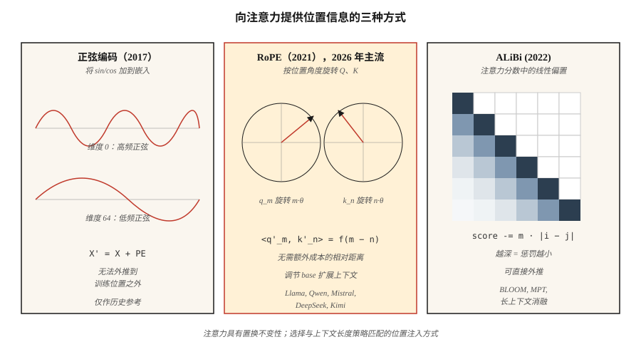

# 位置编码：正弦、RoPE、ALiBi（Positional Encoding — Sinusoidal, RoPE, ALiBi）

> 注意力具有置换不变性。没有位置信号时，"The cat sat on the mat" 与 "mat the on sat cat the" 产生相同输出。三种算法解决这一问题，各自对“位置”的含义作出不同选择。

**Type:** Build
**Languages:** Python
**Prerequisites:** 阶段 7 · 02（自注意力），阶段 7 · 03（多头注意力）
**Time:** ~45 分钟

## 问题（The Problem）

缩放点积注意力无法感知顺序。注意力矩阵 `softmax(Q K^T / √d) V` 由两两相似度计算。打乱 `X` 的行，输出的行也以同样方式打乱。注意力内部没有机制关心位置。

对词袋模型而言这不是缺陷，但对语言、代码、音频、视频等顺序承载意义的内容，这是致命问题。

解决办法是以某种方式向嵌入注入位置。三个时代的答案如下：

1. **绝对正弦编码（Absolute sinusoidal）**（Vaswani，2017）。将位置的 `sin/cos` 加到嵌入中。简单、无需学习，但超出训练长度后外推效果差。
2. **旋转位置嵌入（Rotary Position Embeddings，RoPE）**（Su，2021）。按与位置成比例的角度旋转 Q、K 向量，直接在点积中编码*相对*位置。2026 年的主流方案。
3. **线性偏置注意力（Attention with Linear Biases，ALiBi）**（Press，2022）。完全跳过嵌入操作，按距离向各头注意力分数添加线性惩罚。长度外推表现出色。

截至 2026 年，几乎所有前沿开放模型都使用 RoPE：Llama 2/3/4、Qwen 2/3、Mistral、Mixtral、DeepSeek-V3、Kimi。少数长上下文模型使用 ALiBi 或其现代变体。绝对正弦编码已成为历史方案。

## 概念（The Concept）



### 绝对正弦编码（Absolute sinusoidal）

预计算形状为 `(max_len, d_model)` 的固定矩阵 `PE`：

```
PE[pos, 2i]   = sin(pos / 10000^(2i / d_model))
PE[pos, 2i+1] = cos(pos / 10000^(2i / d_model))
```

然后在注意力前计算 `X' = X + PE[:N]`。每个维度是不同频率的正弦波，模型从相位模式学习读取位置。超过 `max_len` 就失效：模型只见过 0–2047 的位置，没有信息告诉它位置 2048 会怎样。

### 旋转位置嵌入（RoPE）

旋转 Q、K 向量，而非嵌入。对于一对维度 `(2i, 2i+1)`：

```
[q'_2i    ]   [ cos(pos·θ_i)  -sin(pos·θ_i) ] [q_2i   ]
[q'_2i+1  ] = [ sin(pos·θ_i)   cos(pos·θ_i) ] [q_2i+1 ]

θ_i = base^(-2i / d_head),  base = 10000（默认值）
```

对位置为 `pos_k` 的键应用相同旋转。点积 `q'_m · k'_n` 变成仅关于 `(m - n)` 的函数。即使旋转由绝对位置决定，**注意力分数也只取决于相对距离**。这是巧妙之处。

扩展 RoPE：可以缩放 `base`（NTK 感知方法、YaRN、LongRoPE），无需重新训练即可外推至更长上下文。Llama 3 用这种方式从 8K 扩展到 128K 上下文。

### 线性偏置注意力（ALiBi）

跳过嵌入技巧，直接对注意力分数加偏置：

```
attn_score[i, j] = (q_i · k_j) / √d  -  m_h · |i - j|
```

其中 `m_h` 是各头独有的斜率，例如 `1 / 2^(8·h/H)`。近词元得到提升，远词元受到惩罚。没有训练时间成本。论文显示，其长度外推优于正弦编码，在原训练长度上与 RoPE 相当。

### 2026 年如何选择（What to pick in 2026）

| 变体 | 外推 | 训练成本 | 使用模型 |
|---------|---------------|---------------|---------|
| 绝对正弦编码 | 差 | 无额外成本 | 原始 Transformer、早期 BERT |
| 可学习绝对位置 | 无 | 极小 | GPT-2, GPT-3 |
| RoPE | 配合缩放时良好 | 无额外成本 | Llama 2/3/4, Qwen 2/3, Mistral, DeepSeek-V3, Kimi |
| RoPE + YaRN | 出色 | 微调阶段 | Qwen2-1M, Llama 3.1 128K |
| ALiBi | 出色 | 无额外成本 | BLOOM, MPT, Baichuan |

RoPE 胜出是因为它无需改变架构即可嵌入注意力，能编码相对位置，而且 `base` 超参数为长上下文微调提供了明确的调节手段。

```figure
rope-explorer
```

## 动手实现（Build It）

### 第 1 步：正弦编码（Step 1: sinusoidal encoding）

参见 `code/main.py`。核心是 4 行计算：

```python
def sinusoidal(N, d):
    pe = [[0.0] * d for _ in range(N)]
    for pos in range(N):
        for i in range(d // 2):
            theta = pos / (10000 ** (2 * i / d))
            pe[pos][2 * i]     = math.sin(theta)
            pe[pos][2 * i + 1] = math.cos(theta)
    return pe
```

在第一个注意力层之前，将它加到嵌入矩阵。

### 第 2 步：将 RoPE 应用于 Q、K（Step 2: RoPE applied to Q, K）

RoPE 在 Q、K 上就地操作。对每对维度：

```python
def apply_rope(x, pos, base=10000):
    d = len(x)
    out = list(x)
    for i in range(d // 2):
        theta = pos / (base ** (2 * i / d))
        c, s = math.cos(theta), math.sin(theta)
        a, b = x[2 * i], x[2 * i + 1]
        out[2 * i]     = a * c - b * s
        out[2 * i + 1] = a * s + b * c
    return out
```

关键是对位置 `m` 的 Q 与位置 `n` 的 K 应用同一个函数。它们的点积在每对坐标上获得 `cos((m-n)·θ_i)` 因子。注意力无需额外成本即可学习相对位置。

### 第 3 步：ALiBi 斜率与偏置（Step 3: ALiBi slopes and bias）

```python
def alibi_bias(n_heads, seq_len):
    # slope_h = 2 ** (-8 * h / n_heads) for h = 1..n_heads
    slopes = [2 ** (-8 * (h + 1) / n_heads) for h in range(n_heads)]
    bias = []
    for m in slopes:
        row = [[-m * abs(i - j) for j in range(seq_len)] for i in range(seq_len)]
        bias.append(row)
    return bias  # add to attention scores before softmax
```

将 `bias[h]` 加到头 `h` 的 `(seq_len, seq_len)` 注意力分数矩阵上，再应用 softmax。

### 第 4 步：验证 RoPE 的相对距离性质（Step 4: verify relative-distance property of RoPE）

取两个随机向量 `a, b`，先按 `(pos_a, pos_b)` 旋转，再按 `(pos_a + k, pos_b + k)` 旋转。两次点积在浮点误差内必须一致。这正是 RoPE 的意义：它对绝对偏移不变，仅相对间距重要。

## 实际应用（Use It）

PyTorch 2.5+ 在 `torch.nn.functional` 中提供 RoPE 工具。多数生产代码使用 `flash_attn` 或 `xformers`，在注意力内核中应用 RoPE。

```python
from transformers import AutoModel
model = AutoModel.from_pretrained("meta-llama/Llama-3.2-3B")
# model.config.rope_scaling → {"type": "yarn", "factor": 32.0, "original_max_position_embeddings": 8192}
```

**2026 年的长上下文技巧：**

- **神经正切核感知插值（NTK-aware interpolation）。** 从 4K 扩展至 16K+ 时，将 `base` 重新缩放为 `base * (scale_factor)^(d/(d-2))`。
- **YaRN。** 更智能的插值，保留长上下文中的注意力熵。Llama 3.1 128K 使用它。
- **LongRoPE。** Microsoft 于 2024 年提出，用进化搜索选择各维度缩放因子。Phi-3-Long 使用它。
- **位置插值与微调（Position interpolation + fine-tuning）。** 按扩展因子缩小位置，再用 1–5B 个词元微调，效果出乎意料地好。

## 交付成果（Ship It）

参见 `outputs/skill-positional-encoding-picker.md`。该技能根据目标上下文长度、外推需求与训练预算，为新模型选择编码策略。

## 练习（Exercises）

1. **简单。** 在 `max_len=512, d=128` 下将正弦 `PE` 矩阵绘制为热力图。确认“维度索引越大，条纹越宽”的模式。
2. **中等。** 实现 NTK 感知 RoPE 缩放。用长度 256 的序列训练微型语言模型，在长度 1024 下分别启用与禁用缩放进行测试，测量困惑度。
3. **困难。** 在同一注意力模块中实现 ALiBi 和 RoPE。用长度 512 的序列在复制任务上训练 4 层 Transformer，测试时外推到 2048，比较退化程度。

## 关键术语（Key Terms）

| 术语 | 常见说法 | 实际含义 |
|------|-----------------|-----------------------|
| 位置编码（Positional encoding） | “告诉注意力顺序” | 添加到嵌入或注意力中、用于编码位置的任何信号。 |
| 正弦编码（Sinusoidal） | “最初的方案” | 将几何频率上的 `sin/cos` 加入嵌入；不能外推。 |
| 旋转位置嵌入（RoPE） | “旋转嵌入” | 按位置相关角度旋转 Q、K；点积编码相对距离。 |
| 线性偏置注意力（ALiBi） | “线性偏置技巧” | 向注意力分数添加 `-m·\|i-j\|`；无需嵌入，外推出色。 |
| base | “RoPE 的调节参数” | RoPE 中的频率缩放量；增大它可在推理时扩展上下文。 |
| NTK 感知（NTK-aware） | “RoPE 缩放技巧” | 重缩放 `base`，避免上下文扩展时高频维度被挤压。 |
| YaRN | “更精巧的方案” | 逐维度插值与外推，保留注意力熵。 |
| 外推（Extrapolation） | “超出训练长度仍有效” | 位置方案能否在超出训练所见 `max_len` 后继续提供正确输出？ |

## 延伸阅读（Further Reading）

- [Vaswani 等（2017）：注意力就是你所需要的一切（Attention Is All You Need）§3.5](https://arxiv.org/abs/1706.03762)：原始正弦编码。
- [Su 等（2021）：RoFormer：利用旋转位置嵌入增强 Transformer（RoFormer: Enhanced Transformer with Rotary Position Embedding）](https://arxiv.org/abs/2104.09864)：RoPE 论文。
- [Press、Smith、Lewis（2021）：短训练、长测试：线性偏置注意力支持输入长度外推（Train Short, Test Long: Attention with Linear Biases Enables Input Length Extrapolation）](https://arxiv.org/abs/2108.12409)：ALiBi。
- [Peng 等（2023）：YaRN：高效扩展大语言模型上下文窗口（YaRN: Efficient Context Window Extension of Large Language Models）](https://arxiv.org/abs/2309.00071)：前沿 RoPE 缩放方法。
- [Chen 等（2023）：通过位置插值扩展大语言模型上下文窗口（Extending Context Window of Large Language Models via Positional Interpolation）](https://arxiv.org/abs/2306.15595)：Meta 的 Llama 2 长上下文论文。
- [Ding 等（2024）：LongRoPE：将大语言模型上下文窗口扩展至超过 200 万词元（LongRoPE: Extending LLM Context Window Beyond 2 Million Tokens）](https://arxiv.org/abs/2402.13753)：Phi-3-Long 使用的 Microsoft 方法，也在实际应用部分引用。
- [HuggingFace Transformers：`modeling_rope_utils.py`](https://github.com/huggingface/transformers/blob/main/src/transformers/modeling_rope_utils.py)：各类 RoPE 缩放方案（默认、线性、动态、YaRN、LongRoPE、Llama-3）的生产级实现。
