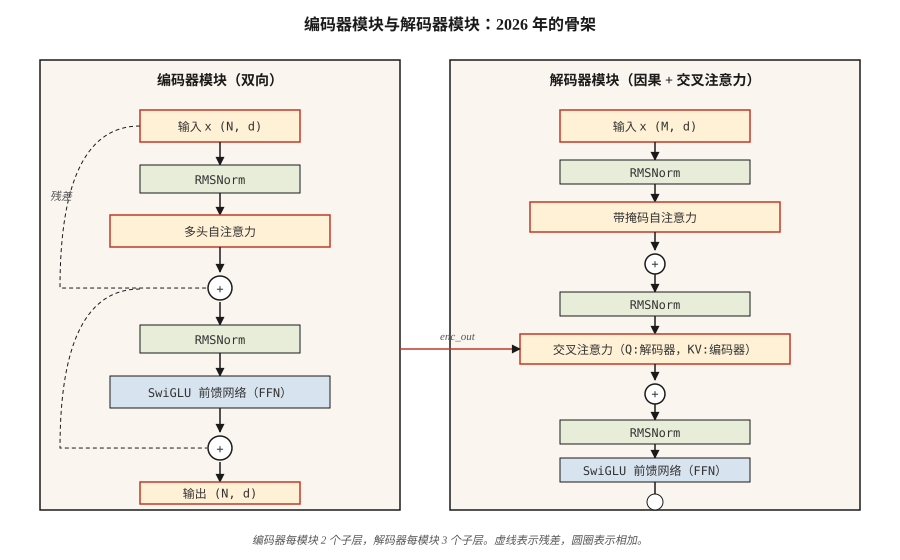

# 完整 Transformer：编码器与解码器（The Full Transformer — Encoder + Decoder）

> 注意力是主角。残差、归一化、前馈网络和交叉注意力等其他部分，是让它能够深度堆叠的支撑结构。

**Type:** Build
**Languages:** Python
**Prerequisites:** 阶段 7 · 02（自注意力），阶段 7 · 03（多头注意力），阶段 7 · 04（位置编码）
**Time:** ~75 分钟

## 问题（The Problem）

单个注意力层是特征提取器，而不是模型。每层一次矩阵乘法不足以提供语言任务所需的容量。你需要深度，而没有正确连接，深度就会造成问题。

2017 年 Vaswani 的论文整合了六项设计决策，将一个注意力层变成可堆叠的模块。此后所有 Transformer，无论仅编码器（BERT）、仅解码器（GPT）还是编码器—解码器（T5），都继承同一骨架。2026 年的模块已有改进（RMSNorm、SwiGLU、前置归一化、RoPE），但骨架完全相同。

本课讲解这副骨架。后续课程分别细化：第 06 课讲编码器，第 07 课讲解码器，第 08 课讲编码器—解码器。

## 概念（The Concept）



### 六个组成部分（The six pieces）

1. **嵌入与位置信号。** 词元转为向量。通过 RoPE（现代）或正弦编码（经典）注入位置。
2. **自注意力（Self-Attention）。** 每个位置关注其他所有位置。解码器中使用掩码。
3. **前馈网络（Feed-Forward Network，FFN）。** 逐位置的两层多层感知机（Multi-Layer Perceptron，MLP）：`W_2 · activation(W_1 · x)`。默认扩展比例为 4×。
4. **残差连接（Residual Connection）。** `x + sublayer(x)`。没有它，超过约 6 层后梯度就会消失。
5. **层归一化（Layer Normalization）。** `LayerNorm` 或现代的 `RMSNorm`，稳定残差流。
6. **交叉注意力（Cross-Attention，仅解码器）。** 查询来自解码器，键和值来自编码器输出。

观察向量流经一个模块：注意力跨位置混合信息，残差将其向前传递，FFN 执行变换，归一化保持流的稳定。

```figure
transformer-block
```

### 编码器模块，供 BERT、T5 编码器使用（Encoder block (used by BERT, T5 encoder)）

```
x → LN → MHA(自注意力) → + → LN → FFN → + → 输出
                     ^              ^
                     |              |
                     └── 残差连接 ──┘
```

编码器是双向的，没有掩码，所有位置都能看到所有位置。

### 解码器模块，供 GPT、T5 解码器使用（Decoder block (used by GPT, T5 decoder)）

```
x → LN → MHA(带掩码自注意力) → + → LN → MHA(与编码器交叉注意力) → + → LN → FFN → + → 输出
```

解码器每个模块有三个子层。中间的交叉注意力是信息从编码器流向解码器的唯一位置。在纯解码器架构（GPT）中，交叉注意力被省略，只保留带掩码自注意力与 FFN。

### 前置与后置归一化（Pre-norm vs post-norm）

原始论文涉及的比较是 `x + sublayer(LN(x))` 与 `LN(x + sublayer(x))`。后置归一化在 2019 年前后失去青睐，因为没有精细预热就难以训练深层网络。前置归一化（子层*之前*应用 `LN`）是 2026 年默认方案：Llama、Qwen、GPT-3+、Mistral 都使用它。

### 2026 年的现代化模块（The 2026 modernized block）

Vaswani 2017 使用 LayerNorm 与 ReLU。现代技术栈将两者都替换了。生产模块的实际配置如下：

| 组件 | 2017 | 2026 |
|-----------|------|------|
| 归一化 | LayerNorm | RMSNorm |
| FFN 激活 | ReLU | SwiGLU |
| FFN 扩展比例 | 4× | 2.6×（SwiGLU 使用三个矩阵，总参数量相同） |
| 位置 | 正弦绝对位置 | RoPE |
| 注意力 | 完整 MHA | GQA（或 MLA） |
| 偏置项 | 有 | 无 |

均方根归一化（Root Mean Square Normalization，RMSNorm）去掉 LayerNorm 的均值中心化，少一次减法，节省计算，且实测至少同样稳定。在 Llama、PaLM 和 Qwen 论文中，SwiGLU（`Swish(W1 x) ⊙ W3 x`）相较 ReLU/GELU FFN，困惑度稳定改善约 0.5 点。

### 参数量（Parameter count）

对于 `d_model = d`、FFN 扩展比例为 `r` 的一个模块：

- MHA：`4 · d²`（Q、K、V、O 投影）
- FFN（SwiGLU）：`3 · d · (r · d)` ≈ `3rd²`
- 归一化：可忽略

在 `d = 4096, r = 2.6, layers = 32`（大致为 Llama 3 8B）时，总量为：`32 · (4·4096² + 3·2.6·4096²) ≈ 32 · (16 + 32) M = ~1.5B parameters per layer × 32 ≈ 7B`（再加嵌入和输出头）。这与公布数量一致。

## 动手实现（Build It）

### 第 1 步：基础模块（Step 1: the building blocks）

使用第 03 课的微型 `Matrix` 类（为保持独立，复制到本文件）：

- `layer_norm(x, eps=1e-5)`：减均值、除标准差。
- `rms_norm(x, eps=1e-6)`：除以均方根，不减均值。
- `gelu(x)` 与 `silu(x) * W3 x`（SwiGLU）。
- `ffn_swiglu(x, W1, W2, W3)`。
- `encoder_block(x, params)` 与 `decoder_block(x, enc_out, params)`。

完整连接见 `code/main.py`。

### 第 2 步：连接两层编码器与两层解码器（Step 2: wire a 2-layer encoder and a 2-layer decoder）

将模块堆叠，把编码器输出传入解码器的每个交叉注意力层。在输出投影前添加最终层归一化。

```python
def encode(tokens, params):
    x = embed(tokens, params.emb) + sinusoidal(len(tokens), params.d)
    for block in params.encoder_blocks:
        x = encoder_block(x, block)
    return x

def decode(target_tokens, encoder_out, params):
    x = embed(target_tokens, params.emb) + sinusoidal(len(target_tokens), params.d)
    for block in params.decoder_blocks:
        x = decoder_block(x, encoder_out, block)
    return x
```

### 第 3 步：在玩具示例上执行前向传播（Step 3: run forward on a toy example）

输入 6 个词元的源序列与 5 个词元的目标序列。验证输出形状为 `(5, vocab)`。不进行训练，本课关注架构而非损失。

### 第 4 步：换入 RMSNorm 与 SwiGLU（Step 4: swap in RMSNorm + SwiGLU）

将 LayerNorm 和 ReLU-FFN 替换为 RMSNorm 和 SwiGLU，确认形状仍匹配。一次函数替换即可完成 2026 年式现代化。

## 实际应用（Use It）

PyTorch/TF 的参考实现是 `nn.TransformerEncoderLayer`、`nn.TransformerDecoderLayer`。但多数 2026 年生产代码自行实现模块，因为：

- Flash Attention 在注意力内部调用，而非通过 `nn.MultiheadAttention`。
- 标准库参考实现没有 GQA / MLA。
- RoPE、RMSNorm、SwiGLU 不是 PyTorch 的默认配置。

HuggingFace 的 `transformers` 有值得阅读的清晰参考模块：`modeling_llama.py` 是 2026 年典型的仅解码器模块，约 500 行，值得完整读一次。

**编码器、解码器与编码器—解码器如何选择：**

| 需求 | 选择 | 示例 |
|------|------|---------|
| 分类、嵌入、文本问答 | 仅编码器 | BERT, DeBERTa, ModernBERT |
| 文本生成、聊天、代码、推理过程 | 仅解码器 | GPT, Llama, Claude, Qwen |
| 结构化输入 → 结构化输出（翻译、摘要） | 编码器—解码器 | T5, BART, Whisper |

仅解码器在语言领域胜出，因为它扩展最直接，兼顾理解与生成。当输入具有明确“源序列”身份时，例如翻译、语音识别、结构化任务，编码器—解码器仍最合适。

## 交付成果（Ship It）

参见 `outputs/skill-transformer-block-reviewer.md`。该技能对照 2026 年默认配置审查新 Transformer 模块实现，标出缺失部分（前置归一化、RoPE、RMSNorm、GQA、FFN 扩展比例）。

## 练习（Exercises）

1. **简单。** 在 `d_model=512, n_heads=8, ffn_expansion=4, swiglu=True` 下计算 encoder_block 的参数量。实现模块，并用 `sum(p.numel() for p in block.parameters())` 验证。
2. **中等。** 从后置归一化切换到前置归一化。初始化两者，在随机输入下测量堆叠 12 层后的激活范数。后置归一化的激活应爆炸，前置归一化的激活应保持有界。
3. **困难。** 在玩具复制任务上实现 4 层编码器—解码器（逆序复制 `x`）。训练 100 步并报告损失。换入 RMSNorm、SwiGLU、RoPE 后，损失是否下降？

## 关键术语（Key Terms）

| 术语 | 常见说法 | 实际含义 |
|------|-----------------|-----------------------|
| 模块（Block） | “一个 Transformer 层” | 归一化、注意力、归一化、FFN 的堆叠，外包残差连接。 |
| 残差（Residual） | “跳跃连接” | 输出 `x + f(x)`，使梯度能流过深层堆叠。 |
| 前置归一化（Pre-norm） | “先归一化，而非后归一化” | 现代方案 `x + sublayer(LN(x))`，无需复杂预热即可训练更深网络。 |
| 均方根归一化（RMSNorm） | “不减均值的 LayerNorm” | 除以均方根，少一次操作，实测稳定性相同。 |
| SwiGLU | “大家都换用的 FFN” | `Swish(W1 x) ⊙ W3 x → W2`，语言模型困惑度优于 ReLU/GELU。 |
| 交叉注意力（Cross-attention） | “解码器如何看到编码器” | Q 来自解码器、K/V 来自编码器输出的 MHA。 |
| FFN 扩展比例（FFN expansion） | “中间 MLP 有多宽” | 隐藏大小与 d_model 之比，通常为 4（LayerNorm）或 2.6（SwiGLU）。 |
| 无偏置（Bias-free） | “去掉 +b 项” | 现代技术栈在线性层省略偏置；困惑度略有改善，模型更小。 |

## 延伸阅读（Further Reading）

- [Vaswani 等（2017）：注意力就是你所需要的一切（Attention Is All You Need）](https://arxiv.org/abs/1706.03762)：原始模块规范。
- [Xiong 等（2020）：论 Transformer 架构中的层归一化（On Layer Normalization in the Transformer Architecture）](https://arxiv.org/abs/2002.04745)：深层网络中前置归一化为何优于后置归一化。
- [Zhang、Sennrich（2019）：均方根层归一化（Root Mean Square Layer Normalization）](https://arxiv.org/abs/1910.07467)：RMSNorm。
- [Shazeer（2020）：GLU 变体改进 Transformer（GLU Variants Improve Transformer）](https://arxiv.org/abs/2002.05202)：SwiGLU 论文。
- [HuggingFace 的 `modeling_llama.py`](https://github.com/huggingface/transformers/blob/main/src/transformers/models/llama/modeling_llama.py)：2026 年典型仅解码器模块。
