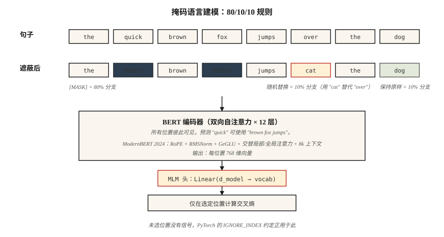

# BERT：掩码语言建模（BERT — Masked Language Modeling）

> GPT 预测下一个词，BERT 预测缺失的词。一句话的差异，支撑了此后五年各种嵌入相关应用。

**Type:** Build
**Languages:** Python
**Prerequisites:** 阶段 7 · 05（完整 Transformer），阶段 5 · 02（文本表示）
**Time:** ~45 分钟

## 问题（The Problem）

2018 年，每个自然语言处理（Natural Language Processing，NLP）任务，包括情感分析、命名实体识别（Named Entity Recognition，NER）、问答和蕴含，都用自己的标注数据从零训练模型。没有可供微调的预训练“英语理解”检查点。ELMo（2018）表明可以用双向 LSTM 预训练上下文嵌入，有帮助但缺乏泛化。

BERT（Devlin 等，2018）提出：如果拿 Transformer 编码器，在互联网所有句子上训练，强迫它利用两侧上下文预测缺失的词，会怎样？随后只需为下游任务微调一个头。其参数效率令人耳目一新。

结果是，18 个月内 BERT 及其变体（RoBERTa、ALBERT、ELECTRA）主导了所有 NLP 排行榜。到 2020 年，全球搜索引擎、内容审核流水线与语义搜索系统内部都有 BERT。

2026 年，仅编码器模型仍适合分类、检索和结构化抽取：它们每词元运行速度比解码器快 5–10 倍，其嵌入支撑着现代检索技术栈。ModernBERT（2024 年 12 月）通过 Flash Attention、RoPE 与 GeGLU 将架构扩展到 8K 上下文。

## 概念（The Concept）



### 训练信号（The training signal）

取一个句子：`the quick brown fox jumps over the lazy dog`。

随机遮蔽 15% 的词元：

```
输入：  the [MASK] brown fox jumps [MASK] the lazy dog
目标：  the  quick brown fox jumps  over  the lazy dog
```

训练模型预测被遮蔽位置的原词元。编码器是双向的，因此预测位置 1 的 `[MASK]` 时能使用位置 2 及之后的 `brown fox jumps`。这是 GPT 做不到的。

### BERT 的掩码规则（The BERT mask rules）

在被选中用于预测的 15% 词元中：

- 80% 替换为 `[MASK]`。
- 10% 替换为随机词元。
- 10% 保持不变。

为什么不总用 `[MASK]`？因为推理时从不出现 `[MASK]`。如果训练让模型预期所有被遮蔽位置都是 `[MASK]`，预训练与微调间就会产生分布偏移。10% 随机替换与 10% 保持原样使模型不依赖这一捷径。

### 下一句预测及其被移除的原因（Next Sentence Prediction (NSP) — and why it was dropped）

原始 BERT 还训练下一句预测（Next Sentence Prediction，NSP）：给定句子 A、B，预测 B 是否跟在 A 后面。RoBERTa（2019）通过消融表明 NSP 不仅无益，反而有害。现代编码器不再使用它。

### 2026 年的变化：ModernBERT（What changed in 2026: ModernBERT）

2024 年 ModernBERT 论文用 2026 年的基础组件重建模块：

| 组件 | 原始 BERT（2018） | ModernBERT（2024） |
|-----------|----------------------|-------------------|
| 位置编码 | 可学习绝对位置 | RoPE |
| 激活函数 | GELU | GeGLU |
| 归一化 | LayerNorm | 前置 RMSNorm |
| 注意力 | 全稠密 | 局部（128）与全局交替 |
| 上下文长度 | 512 | 8192 |
| 分词器 | WordPiece | BPE |

不同于 2018 年技术栈，它原生支持 Flash Attention。序列长度 8K 时，推理比 DeBERTa-v3 快 2–3 倍，GLUE 分数也更高。

### 2026 年仍适合编码器的用途（Use cases that still pick an encoder in 2026）

| 任务 | 编码器优于解码器的原因 |
|------|---------------------------|
| 检索/语义搜索嵌入 | 双向上下文带来更高的每词元嵌入质量 |
| 分类（情感、意图、有害内容） | 一次前向传播，没有生成开销 |
| NER / 词元标注 | 逐位置输出，原生双向 |
| 零样本蕴含（自然语言推断，Natural Language Inference，NLI） | 编码器顶部的分类头 |
| 检索增强生成（Retrieval-Augmented Generation，RAG）的重排序器 | 交叉编码器打分，比大语言模型重排序器快 10 倍 |

```figure
transformer-residual
```

## 动手实现（Build It）

### 第 1 步：掩码逻辑（Step 1: masking logic）

参见 `code/main.py`。函数 `create_mlm_batch` 接收词元 ID 列表、词表大小和掩码概率，返回应用掩码后的输入 ID 与标签（仅被遮蔽位置有标签，其余为 -100，这是 PyTorch 的忽略索引约定）。

```python
def create_mlm_batch(tokens, vocab_size, mask_prob=0.15, rng=None):
    input_ids = list(tokens)
    labels = [-100] * len(tokens)
    for i, t in enumerate(tokens):
        if rng.random() < mask_prob:
            labels[i] = t
            r = rng.random()
            if r < 0.8:
                input_ids[i] = MASK_ID
            elif r < 0.9:
                input_ids[i] = rng.randrange(vocab_size)
            # else: keep original
    return input_ids, labels
```

### 第 2 步：在微型语料上运行 MLM 预测（Step 2: run MLM prediction on a tiny corpus）

在包含 20 个词、200 个句子的语料上训练两层编码器与掩码语言建模（Masked Language Modeling，MLM）头。这里不计算梯度，只做前向传播合理性检查；完整训练需要 PyTorch。

### 第 3 步：比较掩码类型（Step 3: compare mask types）

展示三路规则如何使模型在没有 `[MASK]` 时仍可用。分别对未遮蔽句子和被遮蔽句子预测。两者都应产生合理的词元分布，因为模型训练时见过这两类模式。

### 第 4 步：微调输出头（Step 4: fine-tune head）

在玩具情感数据集上，将 MLM 头替换为分类头。只训练头，冻结编码器。这是所有 BERT 应用遵循的模式。

## 实际应用（Use It）

```python
from transformers import AutoModel, AutoTokenizer

tok = AutoTokenizer.from_pretrained("answerdotai/ModernBERT-base")
model = AutoModel.from_pretrained("answerdotai/ModernBERT-base")

text = "Attention is all you need."
inputs = tok(text, return_tensors="pt")
out = model(**inputs).last_hidden_state   # (1, N, 768)
```

**嵌入模型是微调后的 BERT。** `sentence-transformers` 中的 `all-MiniLM-L6-v2` 等模型，是用对比损失训练的 BERT。编码器相同，只是损失变了。

**交叉编码器重排序器也是微调后的 BERT。** 它们对 `[CLS] query [SEP] doc [SEP]` 进行配对分类。查询与文档之间的双向注意力，正是交叉编码器质量优于双编码器的原因。

**2026 年何时不选 BERT。** 任何生成任务。编码器没有合理的自回归词元生成方式。另外，在不足 1B 参数、而小型解码器能以更高灵活性达到同等质量的场景，也不应选择它（Phi-3-Mini、Qwen2-1.5B）。

## 交付成果（Ship It）

参见 `outputs/skill-bert-finetuner.md`。该技能为新分类或抽取任务界定 BERT 微调方案，包括骨干选择、头规格、数据、评估与停止条件。

## 练习（Exercises）

1. **简单。** 运行 `code/main.py`，打印 10,000 个词元的掩码分布。确认约 15% 被选中，其中约 80% 变成 `[MASK]`。
2. **中等。** 实现全词遮蔽（Whole-Word Masking）：一个词被分成子词时，全部子词一起遮蔽或全部不遮蔽。测量它是否改善 500 句语料上的 MLM 准确率。
3. **困难。** 用公共数据集中的 10,000 个句子训练微型 BERT（两层，d=64），为 SST-2 情感任务微调 `[CLS]` 词元。与参数量相同的仅解码器基线比较，谁更好？

## 关键术语（Key Terms）

| 术语 | 常见说法 | 实际含义 |
|------|-----------------|-----------------------|
| 掩码语言建模（MLM） | “遮蔽后预测语言” | 训练信号：随机把 15% 的词元替换为 `[MASK]`，预测原词元。 |
| 双向（Bidirectional） | “两边都看” | 编码器注意力没有因果掩码，每个位置都能看到其他所有位置。 |
| `[CLS]` | “池化词元” | 加在每个序列前的特殊词元，其最终嵌入用作句子级表示。 |
| `[SEP]` | “片段分隔符” | 分隔成对序列，例如查询/文档、句子 A/B。 |
| 下一句预测（NSP） | “预测下一句” | BERT 的第二项预训练任务；RoBERTa 表明它无用，2019 年后被移除。 |
| 微调（Fine-tuning） | “适配任务” | 编码器大部分保持冻结，在顶部训练小型输出头完成下游任务。 |
| 交叉编码器（Cross-encoder） | “重排序器” | 同时接收查询与文档，输出相关性分数的 BERT。 |
| ModernBERT | “2024 年更新版” | 用 RoPE、RMSNorm、GeGLU、交替局部/全局注意力和 8K 上下文重建的编码器。 |

## 延伸阅读（Further Reading）

- [Devlin 等（2018）：BERT：面向语言理解的深度双向 Transformer 预训练（BERT: Pre-training of Deep Bidirectional Transformers for Language Understanding）](https://arxiv.org/abs/1810.04805)：原始论文。
- [Liu 等（2019）：RoBERTa：稳健优化的 BERT 预训练方法（RoBERTa: A Robustly Optimized BERT Pretraining Approach）](https://arxiv.org/abs/1907.11692)：如何正确训练 BERT，并去掉 NSP。
- [Clark 等（2020）：ELECTRA：将文本编码器预训练为判别器而非生成器（ELECTRA: Pre-training Text Encoders as Discriminators Rather Than Generators）](https://arxiv.org/abs/2003.10555)：相同计算量下，替换词元检测优于 MLM。
- [Warner 等（2024）：更智能、更好、更快、更长：现代双向编码器（Smarter, Better, Faster, Longer: A Modern Bidirectional Encoder）](https://arxiv.org/abs/2412.13663)：ModernBERT 论文。
- [HuggingFace 的 `modeling_bert.py`](https://github.com/huggingface/transformers/blob/main/src/transformers/models/bert/modeling_bert.py)：典型编码器参考实现。
