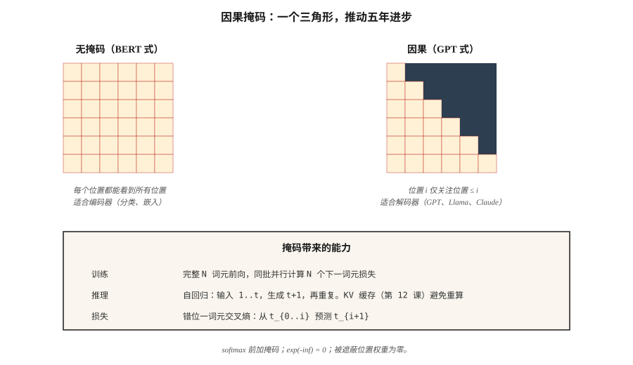

# GPT：因果语言建模（GPT — Causal Language Modeling）

> BERT 看两侧，GPT 只看过去。三角掩码是现代 AI 中影响最深远的一行代码。

**Type:** Build
**Languages:** Python
**Prerequisites:** 阶段 7 · 02（自注意力），阶段 7 · 05（完整 Transformer），阶段 7 · 06（BERT）
**Time:** ~75 分钟

## 问题（The Problem）

语言模型回答一个问题：给定前 `t-1` 个词元，第 `t` 个词元的概率分布是什么？以这个信号，也就是下一词元预测训练模型，就能得到逐词元生成任意文本的模型。

要在整个序列上并行进行端到端训练，每个位置的预测必须只依赖更早的位置。否则模型只需偷看答案就能作弊。

因果掩码（Causal Mask）实现了这一点：在 softmax 前，将一个上三角元素为 `-inf` 的矩阵加到注意力分数上。softmax 后，这些位置变为 0。每个位置只能关注自身及之前的位置。由于对整个序列一次应用，一次前向传播就得到 N 个并行的下一词元预测。

GPT-1（2018）、GPT-2（2019）、GPT-3（2020）、GPT-4（2023）、GPT-5（2025）、Claude、Llama、Qwen、Mistral、DeepSeek、Kimi，都是具有同一核心循环的仅解码器因果 Transformer。区别在于数据质量、规模、架构改进和后训练，包括监督微调（Supervised Fine-Tuning，SFT）、基于人类反馈的强化学习（Reinforcement Learning from Human Feedback，RLHF）、直接偏好优化（Direct Preference Optimization，DPO）及其后续方法。

## 概念（The Concept）



### 掩码（The mask）

给定长度为 `N` 的序列，构建 `N × N` 矩阵：

```
M[i, j] = 0       if j <= i
M[i, j] = -inf    if j > i
```

在 softmax 前把 `M` 加到原始注意力分数。由于 `exp(-inf) = 0`，被遮蔽位置的权重为零。注意力矩阵每行都是仅覆盖先前位置的概率分布。

实现成本：一次 `torch.tril()` 调用。计算耗时：纳秒。对整个领域的影响：无处不在。

### 三角形从何而来（Where the triangle comes from）

掩码常被讲成附加在注意力上的补丁。反向推导就不神秘了：注意力是前缀平均的第三次改进，而三角形只是把该平均的循环边界写成矩阵。

**阶段 1：前缀平均。** 最简单的因果序列摘要：位置 `i` 变成位置 `0…i` 的均值。循环写法是 `out[i] = X[:i+1].mean(0)`。同一计算可用一次矩阵乘法完成：取下三角全为 1 的矩阵，每行除以该行的计数，再相乘：

```python
import numpy as np

A = np.tril(np.ones((n, n)))
A = A / A.sum(axis=1, keepdims=True)
out = A @ X
```

`A` 的第 `i` 行为 `[1/(i+1), …, 1/(i+1), 0, …, 0]`。对角线上方的零就是因果性。并没有遮蔽未来，未来从未进入求和。

**阶段 2：学习权重。** 均匀平均认为每个过去词元同样相关。用学习到的分数矩阵 `S` 替换 1。此时行和不再天然为 1，因此用 softmax 归一化每行，而非除以计数。Softmax 从不输出精确的零，会破坏因果性；除非未来分数以 `-inf` 输入，因为 `exp(-inf) = 0`：

```python
def softmax(x, axis):
    e = np.exp(x - np.max(x, axis=axis, keepdims=True))
    return e / e.sum(axis=axis, keepdims=True)

S = S + np.triu(np.full((n, n), -np.inf), k=1)
A = softmax(S, axis=1)
out = A @ X
```

相同的三角形、相同的行随机矩阵、相同的一次矩阵乘法。`-inf` 掩码不是新机制，只是将阶段 1 的零元素转换到 softmax 输入域。

**阶段 3：内容相关权重。** 阶段 2 中，`S` 在训练后固定：不管词元内容如何，位置 7 对位置 3 的权重都相同。让分数依赖词元本身：`S = Q @ K.T / sqrt(d_k)`。其他部分不变，掩码、softmax、矩阵乘法完全相同。

三个阶段，一个不变量：下三角行随机矩阵乘以序列。依次为均匀平均、学习静态权重、内容相关权重。掩码从来不是加到注意力上的，而是从平均运算中保留下来的。

```figure
mask-derivation
```

### 并行训练、串行推理（Parallel training, serial inference）

训练时，对整个 `(N, d_model)` 序列做一次前向传播，计算 N 个交叉熵损失（每位置一个），求和并反向传播。沿序列并行，因此 GPT 训练能够扩展：一次 GPU 计算可处理单批 1M 个词元。

推理时逐词元生成。输入 `[t1, t2, t3]` 得到 `t4`，输入 `[t1, t2, t3, t4]` 得到 `t5`，输入 `[t1, t2, t3, t4, t5]` 得到 `t6`。键值缓存（KV Cache，第 12 课）保存 `t1…tn` 的隐藏状态，避免每步重算。但推理串行深度等于输出长度，这就是自回归的代价，也是解码成为所有大语言模型延迟瓶颈的原因。

### 损失：错位一个词元（The loss — shift-by-one）

给定词元 `[t1, t2, t3, t4]`：

- 输入：`[t1, t2, t3]`
- 目标：`[t2, t3, t4]`

对每个位置 `i` 计算 `-log P(target_i | inputs[:i+1])`，再求和，即得到整个序列的交叉熵。

你听过的每个 Transformer 语言模型都以此损失训练。预训练、微调、SFT，损失相同，数据不同。

### 解码策略（Decoding strategies）

训练后，采样选择比人们想象的更重要。

| 方法 | 作用 | 使用时机 |
|--------|--------------|-------------|
| 贪心（Greedy） | 每步取最大值位置 | 确定性任务、代码补全 |
| 温度（Temperature） | 逻辑值除以 T 后采样 | 创作任务；T 越高，多样性越强 |
| Top-k | 仅从概率最高的 k 个词元采样 | 去掉低概率尾部 |
| Top-p（核采样，Nucleus Sampling） | 从累计概率 ≥ p 的最小集合采样 | 2020 年后的默认方案，适应分布形状 |
| Min-p | 保留满足 `p > min_p * max_p` 的词元 | 2024 年后使用；比 top-p 更擅长排除长尾 |
| 推测解码（Speculative decoding） | 草稿模型提出 N 个词元，大模型验证 | 相同质量下延迟降低 2–3 倍 |

2026 年，min-p 配合温度 0.7 是开放权重模型的合理默认值。推测解码已是生产推理技术栈的基本配置。

### “GPT 配方”为何有效（What made the "GPT recipe" work）

1. **仅解码器。** 没有编码器开销，每层一次注意力与 FFN。
2. **扩展。** 124M → 1.5B → 175B → 万亿。Chinchilla 扩展定律（第 13 课）告诉你如何花计算预算。
3. **上下文学习（In-Context Learning）。** 在约 6B–13B 时涌现，模型无需微调即可遵循少样本示例。
4. **RLHF。** 基于人类偏好的后训练，将原始预训练文本模型变成聊天助手。
5. **前置归一化、RoPE 与 SwiGLU。** 让大规模训练保持稳定。

自 GPT-2 以来，核心架构变化不大。有趣的进展都发生在数据、规模和后训练中。

```figure
causal-mask
```

## 动手实现（Build It）

### 第 1 步：因果掩码（Step 1: the causal mask）

参见 `code/main.py`，只需一行：

```python
def causal_mask(n):
    return [[0.0 if j <= i else float("-inf") for j in range(n)] for i in range(n)]
```

在 softmax 前把它加到注意力分数上，这就是整个机制。

### 第 2 步：两层类 GPT 模型（Step 2: a 2-layer GPT-ish model）

堆叠两个解码器模块（带掩码自注意力与 FFN，没有交叉注意力）。添加词元嵌入、位置编码和反嵌入（Unembedding），后者与词元嵌入矩阵共享权重，这是 GPT-2 以来的标准技巧。

### 第 3 步：端到端下一词元预测（Step 3: next-token prediction, end-to-end）

在 20 词元玩具词表上，为每个位置生成逻辑值。对错位一个词元的目标计算交叉熵损失。不计算梯度，只做前向传播合理性检查。

### 第 4 步：采样（Step 4: sampling）

实现贪心、温度、top-k、top-p、min-p。对固定提示词分别运行并比较输出。一个采样函数约 10 行。

## 实际应用（Use It）

2026 年的 PyTorch 惯用写法：

```python
from transformers import AutoModelForCausalLM, AutoTokenizer
model = AutoModelForCausalLM.from_pretrained("meta-llama/Llama-3.2-3B-Instruct")
tok = AutoTokenizer.from_pretrained("meta-llama/Llama-3.2-3B-Instruct")

prompt = "Attention is all you need because"
inputs = tok(prompt, return_tensors="pt")
out = model.generate(
    **inputs,
    max_new_tokens=64,
    temperature=0.7,
    top_p=0.9,
    do_sample=True,
)
print(tok.decode(out[0]))
```

内部的 `generate()` 执行前向传播，取最终位置逻辑值，采样下一词元并追加，然后重复。所有生产大语言模型推理技术栈（vLLM、TensorRT-LLM、llama.cpp、Ollama、MLX）都实现相同循环，并进行了大量优化：批量预填充、连续批处理、KV 缓存分页、推测解码。

**GPT 与 BERT，各用一行解释：** GPT 预测 `P(x_t | x_{<t})`，BERT 预测 `P(x_masked | x_unmasked)`。损失决定模型能否生成。

## 交付成果（Ship It）

参见 `outputs/skill-sampling-tuner.md`。该技能为新的生成任务选择采样参数，并标明何时必须确定性解码。

## 练习（Exercises）

1. **简单。** 运行 `code/main.py`，验证 softmax 后因果注意力矩阵为下三角。抽查第 3 行，它应只在第 0–3 列有权重。
2. **中等。** 实现宽度为 4 的束搜索（Beam Search）。在 10 个短提示词上比较 beam-4 与贪心的困惑度。束搜索总能胜出吗？（提示：翻译通常如此，开放式聊天并非如此。）
3. **困难。** 实现推测解码：用微型两层模型生成草稿，六层模型验证。对 100 次长度 64 的补全测量实际耗时加速比，确认输出与验证模型的贪心输出一致。

## 关键术语（Key Terms）

| 术语 | 常见说法 | 实际含义 |
|------|-----------------|-----------------------|
| 因果掩码（Causal mask） | “三角形” | 向注意力分数添加上三角 `-inf` 矩阵，使位置 `i` 只看到位置 `≤ i`。 |
| 下一词元预测（Next-token prediction） | “损失” | 每个位置上，模型分布相对于真实下一词元的交叉熵。 |
| 自回归（Autoregressive） | “每次生成一个” | 将输出反馈为输入；只有训练时并行，生成时不并行。 |
| 逻辑值（Logits） | “softmax 前的分数” | 语言模型头在 softmax 前的原始输出，采样基于这些值。 |
| 温度（Temperature） | “创造力旋钮” | 逻辑值除以 T；T→0 为贪心，T→∞ 为均匀分布。 |
| Top-p | “核采样” | 将分布截断为概率和 ≥p 的最小集合，再从剩余部分采样。 |
| Min-p | “比 top-p 更好” | 保留满足 `p ≥ min_p × max_p` 的词元；截断阈值随分布尖锐程度适应。 |
| 推测解码（Speculative decoding） | “草稿与验证” | 低成本模型提出 N 个词元，大模型并行验证。 |
| 教师强制（Teacher forcing） | “训练技巧” | 训练时输入真实的前一词元，而非模型预测，是序列到序列语言模型的标准做法。 |

## 延伸阅读（Further Reading）

- [Radford 等（2018）：通过生成式预训练改进语言理解（Improving Language Understanding by Generative Pre-Training）](https://cdn.openai.com/research-covers/language-unsupervised/language_understanding_paper.pdf)：GPT-1。
- [Radford 等（2019）：语言模型是无监督多任务学习者（Language Models are Unsupervised Multitask Learners）](https://cdn.openai.com/better-language-models/language_models_are_unsupervised_multitask_learners.pdf)：GPT-2。
- [Brown 等（2020）：语言模型是少样本学习者（Language Models are Few-Shot Learners）](https://arxiv.org/abs/2005.14165)：GPT-3 与上下文学习。
- [Leviathan、Kalman、Matias（2023）：通过推测解码实现 Transformer 快速推理（Fast Inference from Transformers via Speculative Decoding）](https://arxiv.org/abs/2211.17192)：推测解码论文。
- [HuggingFace 的 `modeling_llama.py`](https://github.com/huggingface/transformers/blob/main/src/transformers/models/llama/modeling_llama.py)：典型因果语言模型参考代码。
