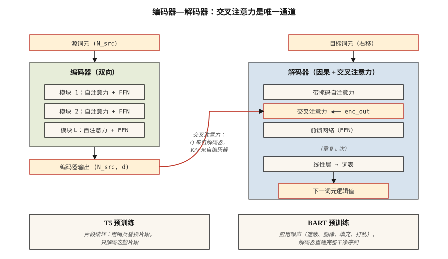

# T5、BART：编码器—解码器模型（T5, BART — Encoder-Decoder Models）

> 编码器负责理解，解码器负责生成。把它们重新组合，就得到专为输入 → 输出任务设计的模型：翻译、摘要、改写、转录。

**Type:** Learn
**Languages:** Python
**Prerequisites:** 阶段 7 · 05（完整 Transformer），阶段 7 · 06（BERT），阶段 7 · 07（GPT）
**Time:** ~45 分钟

## 问题（The Problem）

仅解码器 GPT 与仅编码器 BERT 为不同目标分别精简了 2017 年架构。但许多任务天然具有输入—输出结构：

- 翻译：英语 → 法语。
- 摘要：5,000 词元文章 → 200 词元摘要。
- 语音识别：音频词元 → 文本词元。
- 结构化抽取：散文 → JSON。

对这些任务，编码器—解码器最契合。编码器生成源内容的稠密表示，解码器生成输出，每步都通过交叉注意力关注该表示。训练时在输出侧错位一个词元，与 GPT 的损失相同，只是以编码器输出为条件。

两篇论文定义了现代做法：

1. **T5**（Raffel 等，2019）。“文本到文本迁移 Transformer”（Text-to-Text Transfer Transformer）。将所有 NLP 任务重新表述为文本输入、文本输出。统一架构、词表和损失。通过遮蔽片段预测预训练：破坏输入中的片段，再在输出中解码它们。
2. **BART**（Lewis 等，2019）。“双向与自回归 Transformer”（Bidirectional and Auto-Regressive Transformer）。去噪自编码器：以多种方式破坏输入（打乱、遮蔽、删除、旋转），让解码器重建原文。

2026 年，编码器—解码器仍用于输入结构重要的场景：

- Whisper（语音 → 文本）。
- Google 的翻译技术栈。
- 某些具有明确上下文与编辑结构的代码补全/修复模型。
- 用于结构化推理任务的 Flan-T5 及其变体。

仅解码器获得了聚光灯，但编码器—解码器从未消失。

## 概念（The Concept）



### 前向循环（The forward loop）

```
源词元 ─▶ 编码器 ─▶ (N_src, d_model)  ──┐
                                                 │
目标词元 ─▶ 解码器模块                            │
                 ├─▶ 带掩码自注意力              │
                 ├─▶ 交叉注意力 ◀───────────────┘
                 └─▶ FFN
                ↓
              下一词元逻辑值
```

关键是编码器对每个输入只运行一次。解码器自回归运行，但每一步交叉关注的都是*同一份*编码器输出。对长输入，缓存编码器输出是无需额外代价的加速。

### T5 预训练：片段破坏（T5 pretraining — span corruption）

随机选择输入片段，平均长度 3 个词元、总量 15%。每段替换为唯一哨兵：`<extra_id_0>`、`<extra_id_1>` 等。解码器只输出被破坏的片段及其哨兵前缀：

```
源：The quick <extra_id_0> fox jumps <extra_id_1> dog
目标：<extra_id_0> brown <extra_id_1> over the lazy
```

这种训练信号比预测整个序列更便宜。在 T5 论文的消融中，它与 MLM（BERT）和前缀语言模型（Prefix-LM，UniLM）有竞争力。

### BART 预训练：多噪声去噪（BART pretraining — multi-noise denoising）

BART 尝试五种加噪函数：

1. 词元遮蔽。
2. 词元删除。
3. 文本填充（遮蔽片段，让解码器插入正确长度的内容）。
4. 句子置换。
5. 文档旋转。

文本填充与句子置换组合得到最好的下游结果。解码器始终重建原文。BART 输出完整序列，而非仅被破坏片段，因此预训练计算量高于 T5。

### 推理（Inference）

与 GPT 相同的自回归生成，适用贪心、束搜索、top-p 采样。翻译和摘要通常使用宽度 4–5 的束搜索，因为输出分布比聊天更窄。

### 2026 年如何选择变体（When to pick each variant in 2026）

| 任务 | 是否选编码器—解码器 | 原因 |
|------|------------------|-----|
| 翻译 | 通常是 | 源序列明确，输出分布固定，束搜索有效 |
| 语音转文本 | 是（Whisper） | 输入与输出模态不同，编码器塑造音频特征 |
| 聊天/推理过程 | 否，选仅解码器 | 没有持续固定的“输入”，对话本身就是序列 |
| 代码补全 | 通常否 | 长上下文仅解码器胜出；Qwen 2.5 Coder 等代码模型均为仅解码器 |
| 摘要 | 两者皆可 | BART、PEGASUS 优于早期仅解码器基线，现代仅解码器大语言模型可与之匹敌 |
| 结构化抽取 | 两者皆可 | T5 的“文本 → 文本”能容纳任意输出格式，形式直接 |

约 2022 年以来，仅解码器接管了原属编码器—解码器的任务，因为：(a) 指令微调的仅解码器大语言模型可通过提示词泛化至各种任务；(b) 一种架构比两种更容易扩展；(c) RLHF 假设使用解码器。输入模态不同（语音、图像）或束搜索质量重要时，编码器—解码器仍占据位置。

```figure
encoder-decoder
```

## 动手实现（Build It）

参见 `code/main.py`。我们为玩具语料实现 T5 式片段破坏。这是本课最实用的单一组件，因为此后的编码器—解码器预训练配方中都能见到它。

### 第 1 步：片段破坏（Step 1: span corruption）

```python
def corrupt_spans(tokens, mask_rate=0.15, mean_span=3.0, rng=None):
    """Pick spans summing to ~mask_rate of tokens. Return (corrupted_input, target)."""
    n = len(tokens)
    n_mask = max(1, int(n * mask_rate))
    n_spans = max(1, int(round(n_mask / mean_span)))
    ...
```

目标格式遵循 T5 约定：`<sent0> span0 <sent1> span1 ...`。被破坏的输入在未变词元之间，于片段位置插入哨兵词元。

### 第 2 步：验证往返重建（Step 2: verify round-trip）

根据被破坏输入和目标重建原句。若破坏可逆，前向过程就定义明确。这只是合理性检查，真实训练不会如此操作，但测试便宜，能捕捉片段记录中的差一错误。

### 第 3 步：BART 加噪（Step 3: BART noising）

五个函数：`token_mask`、`token_delete`、`text_infill`、`sentence_permute`、`document_rotate`。组合其中两个并展示结果。

## 实际应用（Use It）

HuggingFace 参考实现：

```python
from transformers import T5ForConditionalGeneration, T5Tokenizer
tok = T5Tokenizer.from_pretrained("google/flan-t5-base")
model = T5ForConditionalGeneration.from_pretrained("google/flan-t5-base")

inputs = tok("translate English to French: Attention is all you need.", return_tensors="pt")
out = model.generate(**inputs, max_new_tokens=32)
print(tok.decode(out[0], skip_special_tokens=True))
```

T5 的技巧是把任务名称写进输入文本。同一模型能处理数十种任务，因为每项任务都是文本输入、文本输出。2026 年，指令微调的仅解码器模型已将此模式推广，但最先将其规范化的是 T5。

## 交付成果（Ship It）

参见 `outputs/skill-seq2seq-picker.md`。该技能根据输入—输出结构、延迟与质量目标，为新任务选择编码器—解码器或仅解码器。

## 练习（Exercises）

1. **简单。** 运行 `code/main.py`，对 30 词元句子应用片段破坏，验证将非哨兵源词元与解码后的目标片段拼接能重现原文。
2. **中等。** 实现 BART 的 `text_infill` 噪声：将随机片段替换为单个 `<mask>` 词元，解码器必须推断正确的片段长度及内容。展示一个示例。
3. **困难。** 在微型英语 → 猪拉丁语语料（200 对）上微调 `flan-t5-small`。在留出的 50 对上测量双语评估替补（Bilingual Evaluation Understudy，BLEU）。与相同数据、相同计算量下微调 `Llama-3.2-1B` 比较。

## 关键术语（Key Terms）

| 术语 | 常见说法 | 实际含义 |
|------|-----------------|-----------------------|
| 编码器—解码器（Encoder-decoder） | “序列到序列 Transformer” | 两套堆叠：输入用双向编码器，输出用带交叉注意力的因果解码器。 |
| 交叉注意力（Cross-attention） | “源与目标交流的位置” | 解码器 Q × 编码器 K/V，是编码器信息进入解码器的唯一位置。 |
| 片段破坏（Span corruption） | “T5 的预训练技巧” | 用哨兵词元替换随机片段，由解码器输出这些片段。 |
| 去噪目标（Denoising objective） | “BART 的游戏” | 对输入应用噪声函数，训练解码器重建干净序列。 |
| 哨兵词元（Sentinel token） | “`<extra_id_N>` 占位符” | 在源中标记被破坏片段，并在目标中再次标记它们的特殊词元。 |
| Flan | “指令微调的 T5” | 在 >1,800 个任务上微调 T5，使编码器—解码器在指令遵循方面具有竞争力。 |
| 束搜索（Beam search） | “解码策略” | 每步保留最优 k 个部分序列，是翻译/摘要的标准方法。 |
| 教师强制（Teacher forcing） | “训练时输入” | 训练时向解码器输入真实的前一输出词元，而非采样词元。 |

## 延伸阅读（Further Reading）

- [Raffel 等（2019）：用统一文本到文本 Transformer 探索迁移学习极限（Exploring the Limits of Transfer Learning with a Unified Text-to-Text Transformer）](https://arxiv.org/abs/1910.10683)：T5。
- [Lewis 等（2019）：BART：面向自然语言生成、翻译与理解的去噪序列到序列预训练（BART: Denoising Sequence-to-Sequence Pre-training for Natural Language Generation, Translation, and Comprehension）](https://arxiv.org/abs/1910.13461)：BART。
- [Chung 等（2022）：扩展指令微调语言模型（Scaling Instruction-Finetuned Language Models）](https://arxiv.org/abs/2210.11416)：Flan-T5。
- [Radford 等（2022）：通过大规模弱监督实现稳健语音识别（Robust Speech Recognition via Large-Scale Weak Supervision）](https://arxiv.org/abs/2212.04356)：Whisper，2026 年典型编码器—解码器。
- [HuggingFace 的 `modeling_t5.py`](https://github.com/huggingface/transformers/blob/main/src/transformers/models/t5/modeling_t5.py)：参考实现。
